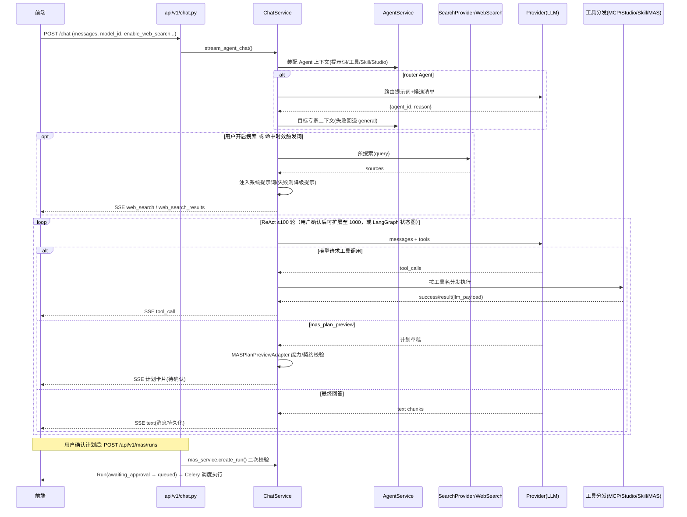

# CygnusX Agent 架构审核与升级方案：检索增强的计划生成

> **时点说明**：本文件为 2026-07-28 时点的快照/评审稿，记录当时的设计与实现状态。此后代码已持续演进，部分细节（行号、清单、状态）可能已过期；当前实现以代码及本目录中更新的基线文档（如 database_architecture.md）为准。

> **审核日期**：2026-07-28
> **依据**：本文全部内容均对照仓库当前代码核实，引用位置使用 `path:line` 格式。
> **定位**：Part 1 供架构审核使用，描述"现状"（与 `agent_framework_baseline.md` 术语一致——原 `agent_architecture_and_extension_guide.md` 已于 2026-09-18 并入其中——不重复其内容而是补充分层与数据流视角）；§1.6 为 2026-07-28 新增的会话上下文治理与鲁棒性机制；Part 2 为待评审的升级方案，尚未实施。

---

# Part 1 现阶段 Agent 架构详细梳理

## 1.1 整体分层

```text
前端（SSE）
   │  /api/v1/chat、/api/v1/mas、/api/v1/studio ...
   ▼
API 层                src/cygnusx/api/v1/（chat.py、mas.py、studio.py、agents.py 等路由）
   │
   ▼
应用服务层            src/cygnusx/application/services/
   │  ├─ chat_service.py        聊天调度总入口：路由、预搜索、工具循环（轮次治理/上下文压缩）、SSE、Studio 分流
   │  ├─ agent_service.py       内置 Agent 同步、运行时上下文装配（模型/工具/Skill/Studio）
   │  ├─ studio_tools.py        Studio 内置工具集（schema + dispatcher）
   │  ├─ mas_plan_adapter.py    mas_plan_preview 工具 schema 与预览校验适配器
   │  ├─ mas_plan_validator.py  计划能力/产物契约校验
   │  ├─ mas_service.py         MAS Run / 审批 / Artifact / 进度 API 服务
   │  └─ tool_bridge_service.py 内置 ToolBridge 工具分发执行
   ▼
基础设施层            src/cygnusx/infrastructure/
   │  ├─ config/prompt_loader.py  Prompt Registry（registry.yaml 加载、热重载、变量渲染）
   │  ├─ execution/               LangGraph ReAct 状态图与节点
   │  ├─ mas/                     MAS 执行器（rnaflow、volcano、ebi、scanpy…）、能力清单加载
   │  ├─ web_search/service.py    多服务商联网搜索归一化
   │  ├─ mcp/                     平台 MCP presets 与 MCPClient
   │  └─ studio/                  会话沙盒管理器
   ▼
独立 MCP Server       mcp-server/（独立进程，FastMCP 式工具服务，tools/*.py 按域划分）
```

边界要点：

- API 层只做请求解析与会话/权限校验，业务全部下沉到应用服务层。
- `chat_service.py` 是当前 agent 运行链路的"编排中枢"：路由、时效预搜索、工具执行分发（MCP / Studio / Skill / Handoff / MAS Plan）都汇聚在 `stream_agent_chat()` 一条链路里。
- `mcp-server/` 是独立部署的工具服务进程（`mcp-server/main.py`、`mcp-server/tools/analysis.py|downloads.py|files.py|flows.py|pipelines.py|platform.py|reports.py|sandbox.py|tasks.py`），通过 MCP 协议被主应用以 `MCPClient` 接入，属于外部工具来源而非主应用内部模块。

## 1.2 三种 Agent 形态

### 1.2.1 Chat 专家模式

- 内置专家定义在 `data/ai/<name>.yaml`，提示词在 `data/ai/prompts/`（`general.md`、`rnaseq.md`、`scrna.md` 等），经 `data/CygnusX.yaml` 的 `agents.enabled` 启用，由 `infrastructure/config/agent_loader.py` 加载并幂等写入 `agent_templates` 表；运行时以数据库记录为准（详见基线文档 §2.1，本文不重复）。
- `chat_service.py:108` 定义 `DEFAULT_SYSTEM_PROMPT = get_prompt("agents.general")` 作为兜底；`chat_service.py:154-180` 的 `BUILTIN_ASSISTANTS` 为 legacy 助手清单，每个助手通过 `get_prompt("agents.xxx")` 取提示词。`chat_service.py:721-728` 按"请求参数 > 助手配置 > 默认"三级确定最终系统提示词。
- 专家切换有两条路径：用户直接选择专家；或经 `agent-router`（`chat_service.py:111-121` 的路由提示词 + `chat_service.py:124-138` 的容错 JSON 提取）单次分派，失败回退通用专家。路由是单次分派，不是多专家并行。

### 1.2.2 Studio 模式

Studio 会话在 MCP/web_search 之外追加内置工具集（`studio_tools.py:50-68` 的 `STUDIO_TOOL_NAMES`）：

| 工具 | 职责 |
| --- | --- |
| `sandbox_execute` | 会话专属沙盒执行 python/r/bash，流式返回 stdout/stderr 与产物清单 |
| `workspace_write` / `workspace_edit` / `workspace_read` / `workspace_list` | 会话工作区 `/workspace` 文件操作（read 默认前 200 行） |
| `datahub_import` / `platform_result_import` | 平台数据软链进 `input/`，数据不搬家 |
| `artifact_register` | 产物登记回结果报告中心（版本树） |
| `update_plan` | 3-8 步待办计划；正常路径由 chat_service 拦截产出 plan 事件，`studio_tools.py:758-765` 为兜底回显 |
| `pipeline_query` | 平台流程/工具只读目录（`studio_tools.py:827` 起） |
| `knowledge_search` | 知识库检索，详见 §1.3.3 |
| `ask_user` | 结构化澄清提问 |

执行方式：dispatcher 统一返回 `{"success", "result": {"llm_payload", "ui_payload"}}` 双通道（`studio_tools.py` 文件头注释）；`llm_payload` 截尾回灌模型防上下文爆炸，`ui_payload` 供前端渲染。所有异常收敛为 `success=False`，不上抛。

### 1.2.3 MAS 多 Agent 编排（默认灰度关闭）

完整链路：

1. **工具挂载**：`MAS_ENABLED=true` 且（Studio 模式或 Agent `features.mas_orchestrator`）时，`chat_service.py:1233-1248` 的 `_attach_mas_plan_tool()` 把 `MAS_PLAN_PREVIEW_TOOL_SCHEMA` 追加进运行时工具，并把 `MAS_PLAN_PREVIEW_PROMPT_SUFFIX`（`mas_plan_adapter.py:55`）拼到系统提示词末尾。
2. **计划预览**：模型调用 `mas_plan_preview`（schema 见 `mas_plan_adapter.py:18-54`，节点含 `key/agent_id/intent/depends_on/input_contract/output_contract` 等），`chat_service.py:1576-1623` 命中后由 `MASPlanPreviewAdapter().adapt(args)` 处理。
3. **能力校验**：适配器内 `MASPlanValidator` 用 `load_agent_capabilities()`（`infrastructure/mas/agent_capabilities.py:10-23`，来源 `data/ai/mas/agent_capabilities.yaml`）校验节点 Agent 能力，用 `load_artifact_schemas()` 校验产物契约；校验失败返回 `success=False` 的错误信封，绝不创建 Run。
4. **前端确认**：预览结果以 `ui_payload.mas_plan` 渲染为计划卡片，提示"用户确认前不会创建或执行 Run"（`mas_plan_adapter.py:79-91`）。
5. **Run 创建**：用户确认后前端调用 MAS API，`mas_service.py:51-62` 的 `create_run()` 再次经 `MASPlanValidator` 校验后落库并初始化 Run 工作区；`mas_service.py:136-142` 的审批把状态从 `awaiting_approval` 推进到 `queued`，之后由 Celery/outbox 调度链执行（`infrastructure/mas/` 下 rnaflow、volcano、ebi、scanpy 等执行器）。
6. **编排器提示词**：`data/ai/prompts/orchestrator.md` 约束"只输出 schema 约束的 DAG、不猜测输入、产物契约待校验时标注、未经确认不推进"。

注意现状：计划生成**完全依赖模型内部知识 + 能力清单校验**；`orchestrator.md` 和 `MAS_PLAN_PREVIEW_PROMPT_SUFFIX` 中均没有检索知识库或网页的要求。这正是 Part 2 的出发点。

## 1.3 工具体系

### 1.3.1 注册与分发

一个 Agent 可见的工具来自四个来源（内置 ToolBridge、平台 MCP presets、外部 MCP、Skill，详见扩展指南 §4）；Studio 会话再叠加 `STUDIO_TOOL_SCHEMAS`。运行时由 `chat_service.py` 的 ReAct 循环按工具名分发：`chat_service.py:1571-1609` 依次判定 capability 工具、mas-plan 工具、handoff 工具、skill 工具、studio 工具，否则在已激活 MCP server 中按工具名匹配。每个工具调用通过 `ToolInvocationContext` 携带用户/会话/Agent 上下文做权限与审计。

### 1.3.2 MCP 工具接入

平台内置 MCP handler 在 `infrastructure/mcp/presets.py`；外部/自建 MCP（含 `mcp-server/`）经管理端注册为数据库记录，Agent 通过 `mcp_ids` + 可选 `mcp_tools` 白名单绑定；`tool_packs` YAML 只做声明式授权，不直接执行代码。平台 preset 的工作区文件工具集包括 `list_workspace_files` / `search_workspace_files` / `workspace_read_file` / `workspace_get_file_info` 与按会话检索上传文件的 `find_session_uploads`（`presets.py:431` 实现、`:686` schema、`:728` 注册）。

### 1.3.3 web_search

- 适配层 `infrastructure/web_search/service.py` 把 tavily / exa / bocha / zhipu / searxng 归一化为 `WebSearchResult`；本地免费源（google/bing/baidu）显式抛错（`service.py:46-47`）。
- 两条触发路径：
  1. **用户开关**：`enable_web_search=true` 时走"预搜索注入"——`chat_service.py:753-772` 在调用 LLM 前先搜索，把结果以 `[编号] 标题/摘要/来源` 格式拼进系统提示词（截断 4000 字符），并通过 SSE 发 `web_search` / `web_search_results` 事件；**检索失败或为空时降级**为普通对话并提示模型不得把记忆表述为已核验事实。
  2. **时效触发词**：Agent YAML `features.web_search.triggers` 命中文献/最新类问题时强制预搜索（机制同上）。
- 模型也可在 ReAct 循环中自行调用 `web_search` 工具（schema 见 `chat_service.py:183-197`）。

### 1.3.4 knowledge_search

- Schema：`studio_tools.py:271-294`，入参 `query` + `limit`（1-8，缺省 5）；只检索**已发布**知识库，返回标题/分类/短摘录与 `/knowledge/{doc_id}` 链接，不返回待审核文档或整篇正文。
- 实现：`studio_tools.py:768-824` 的 `_knowledge_search()`——join `kb_documents.current_rev → doc_revisions`，限 `status == 1`，拉最近 100 条在内存做**全文子串匹配**（`query.lower() in f"{title} {category} {body}".lower()`，见 `studio_tools.py:802-803`），命中后截取命中点前后约 600 字符作摘录。
- 存储：知识库双写——数据库 `kb_documents` / `doc_revisions` 表 + `docs/` 目录文件（`knowledge_audit_service.py:101` 维护 `docs/knowledge/meta.yaml`）。
- 现状局限：纯子串匹配，无分词/向量/排序打分；与同义改写、术语变体（如"差异表达" vs "DEG"）基本无缘；"无结果"既可能是真的无内容，也可能是措辞不匹配，模型无法区分。

## 1.4 提示词体系

- 注册表：`data/ai/prompts/registry.yaml` 声明每个 key 的 `file/kind/owners/variables`（如 `agents.general → general.md`、`studio.system → studio/system.md`、`agents.orchestrator → orchestrator.md`）。
- 加载器：`infrastructure/config/prompt_loader.py` 的 `PromptRegistry` 按 mtime 热重载注册表与文件内容（`prompt_loader.py:37-95`），路径越界拒绝（`prompt_loader.py:71-76`）；`render()` 支持 `{{var}}` 变量并校验未声明/缺失变量（`prompt_loader.py:108-124`）。
- 消费方：`chat_service.py:108` 的默认提示词、`BUILTIN_ASSISTANTS`、Studio 系统提示词等都经 `get_prompt()` 获取；但已落库内置 Agent 的运行时提示词以 `agent_templates.system_prompt` 为准（发布规则见基线 §2.1）。

## 1.5 数据流：一次用户提问的完整时序



---

## 1.6 会话上下文治理与鲁棒性（2026-07-28 新增）

针对"后续对话找不到前面上传的文件、工具轮次触顶被静默截断、长会话超窗"等实际问题，`stream_agent_chat()` 链路新增了四层机制，前端配套弹窗/提示交互。

### 1.6.1 工具轮次治理

- 默认上限 `max_rounds = 100`（`chat_service.py:1556`，由 8 轮上调）；请求携带 `extend_max_rounds=true` 时扩展为 1000 轮（`application/schemas/chat.py:49`，`api/v1/chat.py` 透传）。
- 轮次触顶时在 `done` 之前追加 SSE `round_limit` 事件（`chat_service.py:2225`，携带 `max_rounds` 与 `can_extend`）；前端 `useAgentChatStream.ts` 解析后由 `agentHub.ts:1073` 置位 `roundLimitPrompt`，`AgentSandbox.vue:37` 弹窗询问"是否以扩展上限（1000 轮）继续"，确认后自动发送"请继续完成刚才未完成的任务"并带 `extendMaxRounds: true`（`agentHub.ts:993`）。
- 注意语义：继续是开启新一轮 LLM 循环，模型可见聊天历史与上一轮的部分回复，但上一轮循环内的中间工具调用不重放。

### 1.6.2 历史附件上下文继承

- 前端送后端的 messages 只含 `role/content` 且按 `contextLength`（默认 20 条）截断（`frontend/src/stores/agentHub.ts`），附件元数据不落回上下文——这是"下一轮对话找不到上一轮上传文件"的根因。
- 后端在步骤 4.1（`chat_service.py:1296`）调用 `_collect_session_file_context()`（`chat_service.py:654`）：从本会话历史消息的 `metadata_json.attachments` 汇总文件引用（`upload://{file_id}`），以"[本会话中用户历史上传过的文件]"区块追加到最后一条用户消息（`_append_context_to_last_user_message`，`chat_service.py:691`），只影响送 LLM 的视图，不落库。

### 1.6.3 上下文压缩（256K 窗口保护）

- 步骤 4.2（`chat_service.py:1309`）调 `_compress_context_if_needed()`（`chat_service.py:739`）：对 messages 做 token 估算（中英混合按 2 字符 ≈ 1 token），超过 `_CONTEXT_COMPRESS_THRESHOLD_TOKENS = 200_000`（`chat_service.py:721`，为 256K 窗口预留系统词/工具/输出空间）时触发。
- 压缩策略：保留最近 `_CONTEXT_KEEP_RECENT_MESSAGES = 10` 条原文（`chat_service.py:723`），更早的消息用当前模型生成结构化摘要（保留分析目标、file_id/文件引用、已完成步骤与结论、产物、待办），以一条 system 消息注入；摘要调用失败降级为"首条用户消息 + 最近 10 条"硬截断。
- 触发时推 SSE `context_compressed` 事件（携带压缩前估算 token），前端 toast 提示；压缩只作用于送 LLM 的视图，数据库完整历史不动。

### 1.6.4 会话文件治理与数据缺失协议

- **上传文件带会话标记**：`/files/chat-upload` 接受可选 `session_id` 表单字段（`api/v1/files.py:348`），落盘文件名为 `{file_id}.s{session_id前8位}{suffix}`（`files.py:373-378`）；前端 `KimiChatInput.vue` 上传时自动带上当前会话 ID。file_id 前缀 glob 解析（`presets.py` 的 `_resolve_workspace_file`）不受影响。
- **按会话检索**：平台 MCP 新工具 `find_session_uploads(session_id?)`（见 §1.3.2），`session_id` 留空取 `ToolInvocationContext` 中的当前会话，返回 `upload://` 引用清单。
- **数据缺失协议**：`WORKSPACE_FILES_SYSTEM_PROMPT_SUFFIX`（`presets.py:47`，运行时追加到所有绑定平台 MCP 的 Agent）新增条款——绘图/分析请求无附件、无 file_id、未指明工作区文件时禁止全局搜索，直接以"📤 需要您提供数据："开头回复；前端 `agentHub.ts:1201` 检测该前缀置位 `dataRequestNotice`，`AgentSandbox.vue:23` 弹窗提醒上传。
- **绘图规范**：可视化助手提示词（`data/ai/prompts/visualization.md`，已同步发布到 `agent_templates.system_prompt`）新增 11 组内置调色板（7 组离散 + 2 组长离散 + 连续 bluepinkyellow 等）与挑选原则；聊天页 Plotly 图表下载默认 600 DPI（`KimiMessageItem.vue:139-140`、`ChartPreviewModal.vue:36-37`，`scale = 600/96`）。

---

# Part 2 升级方案：检索增强的计划生成（Retrieval-Augmented Planning）

## 2.1 背景与问题

当前 `mas_plan_preview` 生成的计划质量完全取决于模型内部知识：

- `orchestrator.md` 要求"意图解析映射到已注册流程模板"，但模型对平台知识库（实验室 SOP、历史流程、参数经验）没有任何感知手段被强制使用；
- `knowledge_search` 与 `web_search` 是平行工具，是否调用、以什么顺序调用全凭模型自觉；
- `MAS_PLAN_PREVIEW_PROMPT_SUFFIX`（`mas_plan_adapter.py:55`）只说"信息不足时先提问"，没有"先检索、再提问"的策略。

结果：计划可能重复造轮子（知识库已有标准流程）、参数凭印象给出、或本可由知识库补齐的信息被不必要地抛回给用户追问。

升级目标：让 plan 生成的输入**必然包含知识库证据**，网页检索作为兜底，检索结果结构化进入计划上下文。分三层实施，前两层独立可上线，第三层为质量增强。

## 2.2 第一层：提示词策略层（低成本，先做）

**改动文件**：

- `data/ai/prompts/studio/system.md`：在工具使用规则中补充检索顺序条款——"分析类任务在制定计划前先 `knowledge_search` 检索实验室知识库；无相关结果或需时效信息时再 `web_search`；综合检索结果后再调用 `mas_plan_preview` / `update_plan`"。
- `data/ai/prompts/orchestrator.md`：在"计划生成流程"的意图解析前插入"知识核查"步骤——先检索知识库中是否已有对应流程模板/参数经验，命中则以其为骨架，未命中且涉及最新方法/数据库版本时兜底 web_search。
- `mas_plan_adapter.py:55` 的 `MAS_PLAN_PREVIEW_PROMPT_SUFFIX`：追加一句硬约束，例如"调用本工具前必须先完成知识库检索（无结果时需说明），计划中的关键参数应注明来自知识库还是模型经验"。

**预期收益**：零代码路径风险，模型行为即可向"知识库优先、网页兜底"收敛；计划卡片可携带来源说明，提升可解释性。

**风险点**：

- 提示词约束是软约束，模型仍可能跳过检索直接出计划（尤其 ReAct 轮数受限时）；这正是第二层存在的理由。
- 已落库内置 Agent 的运行时提示词以数据库为准（基线 §2.1），改 Markdown 后必须经管理端/API 发布，否则不生效；`MAS_PLAN_PREVIEW_PROMPT_SUFFIX` 是代码常量，改后重启即生效，无此问题。
- 提示词变长，注意与工具循环的上下文预算平衡（轮次上限见 §1.6.1，另已有 §1.6.3 的上下文压缩兜底）。

## 2.3 第二层：代码强制层（核心，保证必然性）

**思路**：复用 web_search 已验证的"预搜索注入"模式（`chat_service.py:753-772`），在进入 plan 阶段前由框架强制执行知识库检索，把结构化结果注入上下文，使 plan 输入**必然**包含知识库内容。

**改动文件**：

- `src/cygnusx/application/services/chat_service.py`：
  - 在判定 `mas_plan_tool_enabled` 且本轮为计划类请求时（或更稳妥地：在 `_attach_mas_plan_tool` 挂载计划工具的同一时机），自动调用知识库检索（复用/抽取 `studio_tools.py:768-824` 的 `_knowledge_search` 逻辑为可共享的服务函数，避免直接 import Studio 工具模块），将结果注入系统提示词；
  - 注入内容**结构化标注**为三个区块：`【背景知识】`（命中的 SOP/方法文档摘录）、`【推荐流程】`（知识库中匹配到的流程类文档，可作为计划骨架）、`【来源】`（doc_id + 标题 + `/knowledge/{doc_id}` 链接）；无命中时显式注入"知识库无相关结果"标记，让模型可以据此转向 web_search 或 ask_user，而不是静默缺席；
  - 检索失败按 web_search 同款降级路径处理：注入降级说明并通过 SSE 通知前端，不阻断对话。
- `src/cygnusx/application/services/studio_tools.py`：把 `_knowledge_search` 的核心查询逻辑抽取为独立函数（如 `search_published_kb(db, query, limit)`），供工具执行器与 chat_service 预检索共用，保持工具行为不变。
- （可选）`chat_service.py` 的 SSE 事件：新增 `kb_search` / `kb_search_results` 事件类型，与 `web_search` 事件对称，前端可展示"计划已参考 N 篇知识库文档"。

**预期收益**：

- 必然性：plan 上下文必然含知识库证据（或明确的"无结果"标记），不再依赖模型自觉；
- 与 web_search 降级路径同构，前端与审计已有成熟模式可复用；
- 结构化的【推荐流程】区块直接约束计划骨架，减少臆造参数。

**风险点**：

- 触发时机判定：对所有挂计划工具的请求都预检索会浪费一次查询并占用上下文；建议以"用户消息命中分析/流程类意图"或"模型上一轮已表达组织多步分析意图"为触发条件，初版可以保守地全量预检索、观察 token 开销后再加门控。
- 子串匹配的"无结果"噪音大（见 §1.3.4）：强制注入会把检索质量问题放大到每条 plan 链路，这也是第三层必须跟进的原因。
- 注入长度需封顶（参考 web_search 的 4000 字符截断），避免挤占 ReAct 轮次预算。

## 2.4 第三层：检索质量层（后置增强）

**改动文件**：

- `src/cygnusx/application/services/studio_tools.py`（`_knowledge_search` 及抽取后的共享函数）：从子串匹配升级为向量检索——文档写入/发布时异步生成 embedding（可复用 P4 语义记忆已引入的 Embedding 配置与 JSONB 向量持久化模式，见扩展指南 §0），查询时向量召回 + 子串匹配混合排序。
- 知识库写入链路（`knowledge_audit_service.py` 等）：发布文档时触发 embedding 生成任务；存量文档一次性回填。
- "无结果"判定阈值设计：
  - 向量相似度低于阈值（如 cosine < 0.55，需按实际 embedding 模型标定）且子串匹配也无命中时，判定为"真无结果"，注入"知识库无相关内容"并引导 web_search；
  - 相似度处于灰区（如 0.55–0.65）时返回结果但标注"相关度低，仅供参考"，由模型决定是否追问用户；
  - 阈值做成配置项（settings 或 `data/ai/` YAML），便于灰度调优。

**预期收益**：同义改写/术语变体可召回，"无结果"从措辞巧合变成可信信号，第二层的强制注入质量随之提升。

**风险点**：

- 引入 embedding 模型依赖与异步生成链路，运维复杂度上升；需处理发布即检索可见的时序（embedding 未就绪时回退子串匹配）。
- 向量检索可能召回应删除/待审核文档，必须保持现有 `status == 1` 过滤在召回之后兜底。
- 阈值误标会双向伤害：过低会注入噪音、过高会把有价值文档误判为"无结果"；上线前需用历史查询样本标定。

## 2.5 实施顺序建议

1. **第一层（提示词策略）**：当天可上，零风险，先让模型行为转向；同时积累"检索是否真的改善了 plan"的观察样本。注意按基线 §2.1 完成数据库发布。
2. **第二层（代码强制）**：第一层稳定后实施，是方案的核心保证；先做全量预检索 + 长度封顶，再加意图门控。验收标准：任意 plan 卡片的上下文中可审计到知识库注入区块（或"无结果"标记）。
3. **第三层（向量检索）**：独立排期，不阻塞前两层；它提升的是第二层的输入质量而非正确性。上线前完成阈值标定与 `status` 过滤回归。

依赖关系：第二层不依赖第三层（子串匹配下强制注入依然成立，只是噪音偏多）；第三层上线后第二层的注入代码无需改动（共享同一检索函数）。

## 2.6 验收清单（实施后）

- [ ] 三处提示词改动已发布到运行时（数据库 / 重启生效）；
- [ ] plan 链路中知识库检索必然执行，失败有降级且 SSE 可见；
- [ ] 注入内容含【背景知识】【推荐流程】【来源】三区块并截断封顶；
- [ ] `knowledge_search` 工具行为不变（schema、status 过滤、摘录长度）；
- [ ] 向量检索上线后，待审核/已删除文档不会被召回；
- [ ] "无结果"判定阈值可配置，灰区标注生效。
