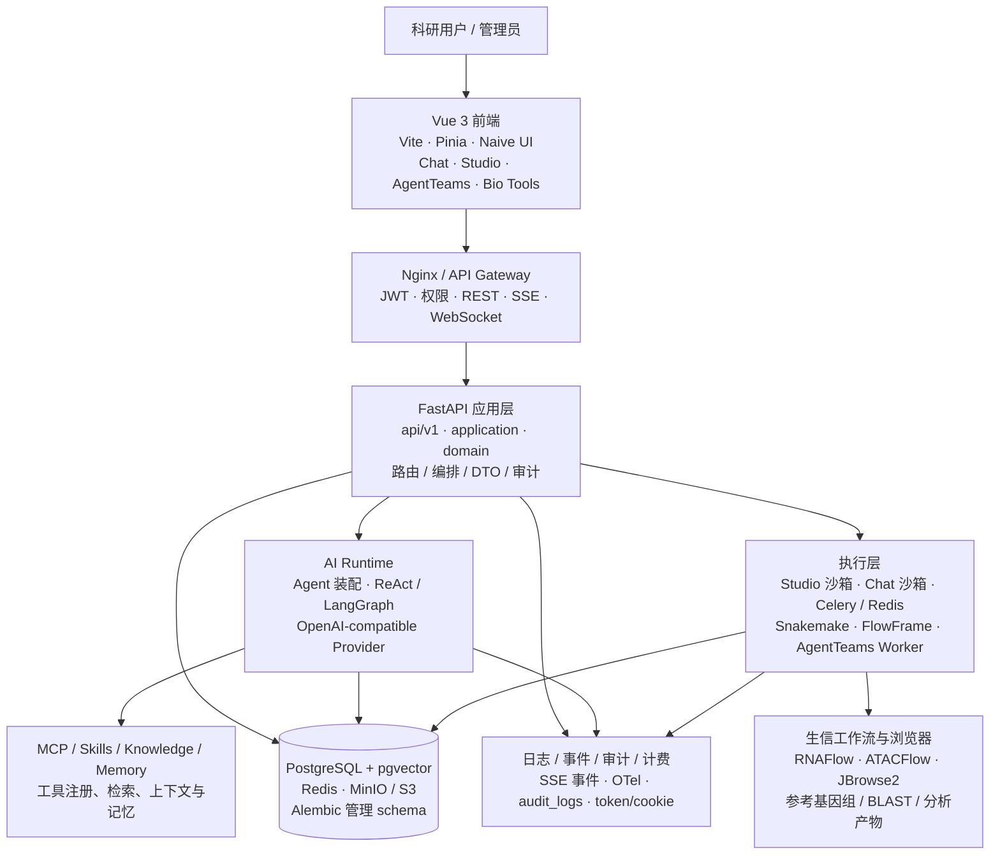
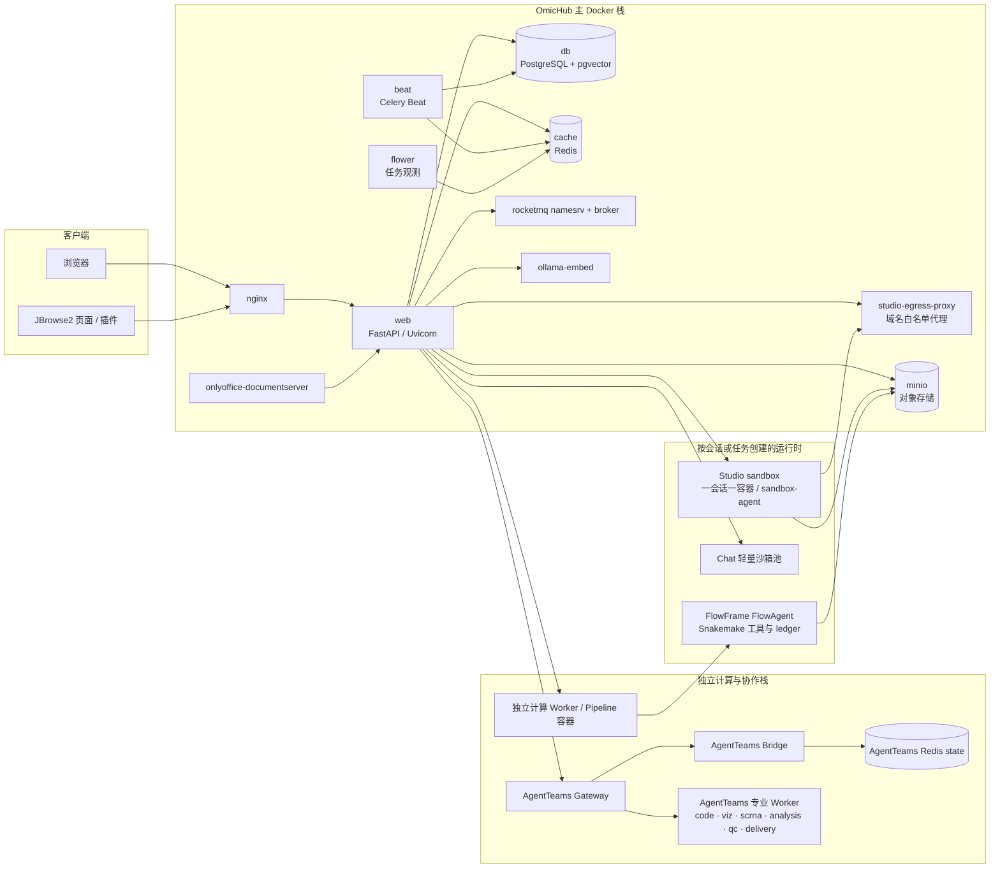
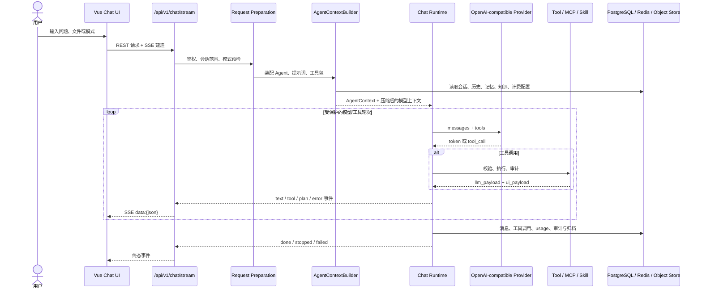
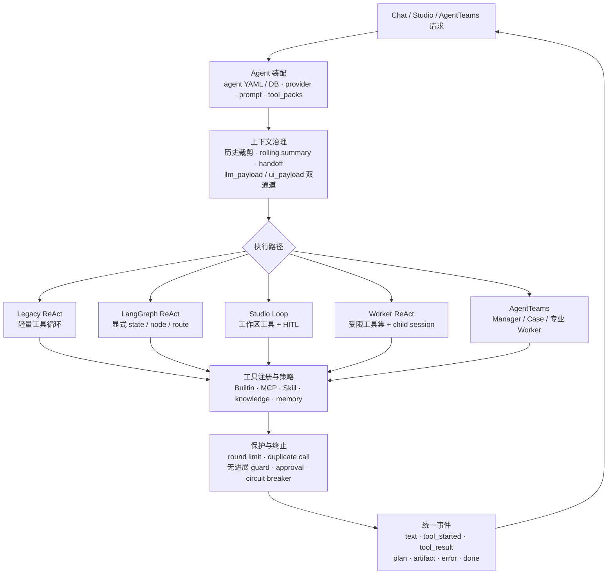
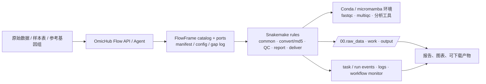
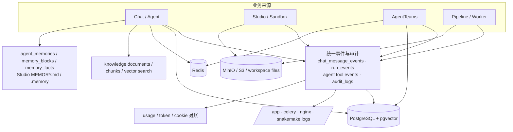

# OmicHub 平台架构图汇总

**版本**：v1.0（仓库现状汇总）  
**日期**：2026-09-26  
**范围**：当前仓库已落地的前端、FastAPI 后端、Agent/Chat、Studio 沙箱、AgentTeams、异步任务、FlowFrame 工作流和基础设施。  
**图例**：图中实线表示当前代码或部署配置中存在的链路；`待验收/规划` 只表示设计文档提到但不能由当前代码直接证明的能力。

> 这份文档是“看图入口”。详细契约仍以 `ARCHITECTURE_DESIN/` 下对应的 as-built 文档和代码为准；愿景、提案和历史快照不作为当前实现证据。

## 1. 简练版：平台一页图



### 一句话理解

用户从 Vue 前端进入 FastAPI；应用层按会话和 Agent 配置装配模型、工具、Skill、MCP、知识和记忆；短交互走流式 Agent，代码和文件分析走隔离沙箱，长任务走 Celery/Worker/FlowFrame；结果、事件、审计和产物回到数据库、对象存储及前端工作台。

## 2. 详细版：部署与进程拓扑



**部署依据**：`deploy/docker/docker-compose.yml`、`deploy/docker/docker-compose.prod.yml`、`deploy/docker/docker-compose.worker.yml`、`deploy/agentteams/docker-compose.agentteams.yml`。生产部署不暴露 DB/Redis 端口；Studio 出站代理与应用、数据库网络隔离。

## 3. 详细版：一次 Chat 请求



**代码入口**：`src/cygnusx/main.py`、`src/cygnusx/api`、`src/cygnusx/application/services/agent_context_builder.py`、`src/cygnusx/domain/execution`、`frontend/src/stores/chat.ts` 及 `frontend/src/components/chat`。

## 4. 详细版：Agent、工具与上下文边界



工具结果分为模型所需的紧凑 `llm_payload` 和前端所需的完整 `ui_payload`；文件、代码、产物、报告和执行日志不应全部塞进模型上下文。

## 5. 详细版：Studio、沙箱与科研工作区

```mermaid
flowchart LR
    UI[Studio UI\n代码 · 文件 · 终端 · 计划 · 产物]
    Session[ChatSession / Workspace\nsandbox_meta · research_mode]
    Manager[StudioSandboxManager\n镜像选择 · 生命周期 · 租约]
    Sandbox[Studio sandbox container\nuid 10001 · read-only rootfs\ncap_drop · pids/cpu/memory 配额]
    Agent[sandbox-agent\nUnix socket /exec NDJSON]
    Workspace[/workspace\ninput · work · output\nREADME · environment · manifest]
    Proxy[egress proxy\n域名白名单]
    Archive[Workspace archive\n休眠打包 / 恢复 / 到期清理]
    Artifact[Artifact registry\nsha256 · report version tree]
    LongJob[>600s 长任务\nCelery job · reconcile-only]

    UI --> Session --> Manager --> Sandbox --> Agent
    Agent --> Workspace
    Sandbox --> Proxy
    Workspace --> Artifact
    Workspace --> Archive
    Workspace --> LongJob
    LongJob --> Artifact
```

当前沙箱能力由 `code`、`browser`、`document` 等 capability 控制；普通 Chat 轻量沙箱与 Studio 一会话一容器是两条不同路径。隔离、挂载和出站边界以 `cygnusx_sandbox_architecture_2026-08-22.md` 与 `network_architecture_2026-09.md` 为准。

## 6. 详细版：AgentTeams 协作与异步 Worker

```mermaid
flowchart TB
    User[用户 / 协作室]
    Room[Room Gateway\n意图路由 · 消息 · 权限]
    Case[Case / Plan\n目标 · 节点 · 状态 · 证据]
    Manager[Manager Agent\n拆解、派单、验收、交付]
    Fanout[并行协作\n会诊 / parallel_subagents / A2A outbox]
    Domain[领域 Agent\nanalysis · qc · delivery 等]
    Worker[受限 Worker\n隔离 child_session · 专业镜像]
    Queue[(Redis / Celery / RocketMQ)]
    Shared[/Run workspace\n输入、日志、产物、manifest]
    Registry[(Run / Node / Artifact / Event DB)]
    Evidence[Evidence / Decision\n报告、血缘、审计、可见性裁剪]

    User --> Room --> Case --> Manager
    Manager --> Fanout
    Fanout --> Domain --> Worker
    Manager --> Queue
    Queue --> Worker
    Worker --> Shared
    Worker --> Registry
    Shared --> Evidence
    Registry --> Evidence
    Evidence --> Room
```

AgentTeams 的房间、Case、Turn、Worker 证据和报告权限分开管理；分钟级 DAG/Worker 编排与请求内秒级 fan-out 是两种不同并行机制。

## 7. 详细版：FlowFrame 与生信分析链



仓库中的 `flows/rna_seq.yaml`、`flows/atac_seq.yaml`、`Protocol/FlowFrame/flow-framework` 和 `Protocol/FlowFrame/FlowAgent` 是该链路的主要实现/协议依据；具体分析工具和流程结果应通过 manifest、日志、产物清单和状态事件交付。

## 8. 数据、事件与横切能力



关键原则：数据库中的原始消息/事件和对象存储中的产物是事实来源；压缩上下文、UI 投影和模型 payload 只是派生视图。迁移由 Alembic 管理，日志与审计要能关联 `trace_id`、`session_id`、`run_id`、`tool_call_id` 和产物 hash。

## 9. 现状边界

### 当前可以从仓库确认

- 前端是 Vue 3 + TypeScript + Vite，状态主要由 Pinia 管理。
- 后端采用 `api / application / domain / infrastructure` 分层，入口为 `src/cygnusx/main.py`。
- 主栈包含 Nginx、Web、Celery Beat、Flower、PostgreSQL/pgvector、Redis、MinIO、RocketMQ、嵌入服务和 Studio 出站代理。
- Chat、Studio、AgentTeams、FlowFrame/Worker 是四种主要执行形态；MCP、Skill、Knowledge、Memory、审计和计费横切这些形态。

### 仍需单独部署或环境验收

- 生产环境的真实 Docker 沙箱、外部 Worker、AgentTeams Matrix/Bridge、SearXNG、RocketMQ 和对象存储连通性。
- gVisor/Kata 等更强隔离层；它们属于升级触发条件，不是当前默认运行时。
- `ARCHITECTURE_DESIN` 中标为 proposal、plan、vision、deprecated 或历史快照的内容，不能直接画成已上线能力。

## 10. 相关文档索引

- 总体与执行：`cygnusx_architecture.md`、`agent_architecture.md`、`agent_execution_framework.md`
- Chat 与 OpenAI4S：`chat_openai4s_integration_architecture.md`、`chat_execution_layers_2026-08.md`
- Studio 与网络：`cygnusx_sandbox_architecture_2026-08-22.md`、`network_architecture_2026-09.md`、`research_loop_architecture_2026-09.md`
- MCP、Skill、记忆、知识：`mcp_architecture.md`、`skill_architecture.md`、`memory_architecture.md`、`knowledge_architecture.md`
- 数据、日志、计费：`database_architecture.md`、`log_architecture.md`、`token_billing_architecture.md`
- 多 Agent 与流程：`mas_a2a_plan_2026-07.md`、`multi_agent_fanout_2026-07.md`、`Protocol/FlowFrame/README.md`
