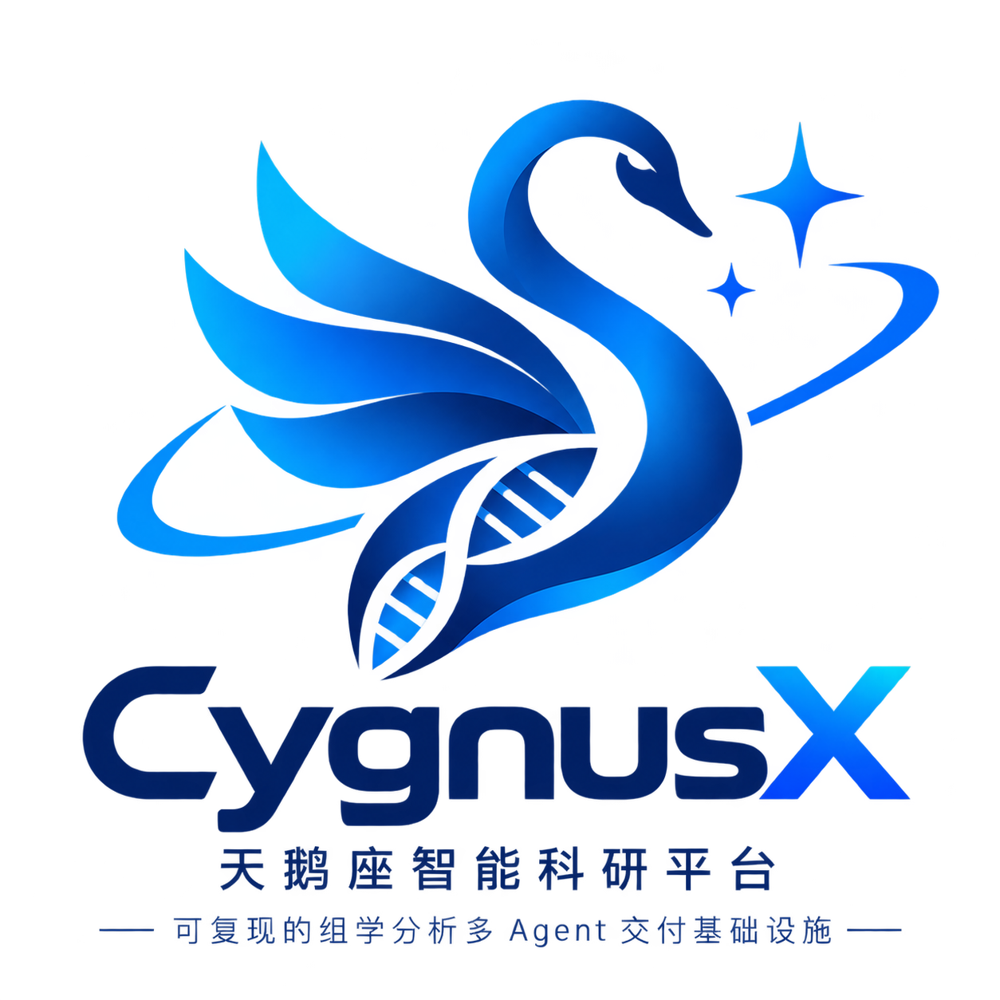

<p align="center">
  
</p>

<h1 align="center">CygnusX · 天鹅座智能科研平台</h1>

<p align="center">
  <a href="https://www.python.org/"></a>
  <a href="./LICENSE"></a>
</p>

<p align="center"><strong>可复现的组学分析多 Agent 交付基础设施 —— 华中农业大学园艺林学学院</strong></p>

让每一次组学交付都**可审计、可验证、可复用**：以多 Agent 协同（AgentTeams）为组织层，以版本锁定的 Flow Framework 为执行层，以 Skills 沉淀领域经验，交付物附带 Case / Artifact / Evidence / Manifest 溯源证据包。

> 📜 **Licensed under Apache-2.0 + Commons Clause — non-commercial use only.**
> See [LICENSE](./LICENSE) for details. Commercial use requires a separate agreement.

## 要解决的问题

组学数据分析是药物研发、种业育种和科研服务中的高频长链路任务。传统工作方式需要在聊天工具、表格和命令行之间反复配置，结果产生后的增量需求要排队等待专业人员，人员变动后项目常陷入从脚本和聊天记录中"考古"的困境。具体表现为四类核心问题：

1. **提交成本高且易出错**：标准分析需人工准备配置文件、样本表和对比组，字段遗漏往往到计算后期才暴露；
2. **增量需求响应慢**：换对比、补富集、调整阈值等高频需求需生信人员重新理解和设计；
3. **流程资产难复用**：更换比对器或增加 QC 步骤，往往意味着重写并重新审核整条管线；
4. **交付缺乏可核验证据**：结果压缩包缺少当时的参数、环境、软件版本和重跑记录；大模型直接生成的流程虽灵活，却无法成为受控场景的可信执行依据。

本项目要解决的工程问题是：**如何保留大模型处理自然语言需求的灵活性，同时让执行、质量判断和交付证据始终由可版本化、可审计的流程与规则决定。**

## 核心机制：AI 只调度、不生成

平台把经过专家搭建和审核的分析管线固化为声明式、版本化流程资产；Skill 用触发条件、输入契约、版本号、失败语义和权限边界描述稳定业务动作。AI 只完成需求解析、计划拆解、角色路由和结果解释，**不直接编写或改写执行流程**。

能力边界由系统强制：Agent 无 shell、流程 YAML 与数据库写权限；高风险操作需短期审批令牌；提交采用幂等键避免重复计算；质量规则缺失或风险超阈值时任务自动转人工审批，而不由模型自行放行。每次执行自动关联流程版本、参数、环境快照、软件清单、产物指纹、随机种子和重跑命令，生成可核验的证据包与交付 README——**把可复现性变成分析任务的默认产物**，而非对用户的额外要求。

参考 RNA-seq 场景的工程估算（**均为工程估算，不含计算运行时间，须以试点实测校准**）：

| 指标 | 传统参考方式 | 平台目标 |
|---|---|---|
| 标准分析提交配置 | 约 20 分钟 | 约 5 分钟 |
| 已沉淀 Skill 范围内的增量分析响应 | 约 480 分钟 | 30 分钟以内 |
| 流程定制改造 | 约 5 人天 | 约 1 天 |
| 人员交接后的项目核验 | 以周计且常失败 | 约 10 分钟照单核验 |

> **适用边界**：平台面向 RNA-seq、单细胞、ATAC-seq 等科研/研发组学分析，适用于私有化或混合部署；不输出临床诊断报告，不把尚未完成的合规适配（GxP / 21 CFR Part 11）表述为已实现能力。

## 平台概览

CygnusX 提供从轻量探索到受控交付的四级入口（L1–L4），共享同一份用户工作区数据底座（下载入库、零搬运、`omic://` 逻辑引用，按用户与 Case 严格隔离）：

| 产品形态 | 定位 | 特点 |
|---|---|---|
| 生信工具箱 | 简单、重复、确定性计算（序列分析 / 可视化 / 表达分析等 17+ 工具） | 零 token 消耗，部分纯浏览器本地运算 |
| 星尘 AI 助手 | 轻量、探索性需求，对话式调用工具与知识库 | MCP + Skill + 轻量沙箱，内置高频组学快捷场景 |
| AI 工作台（OmicStudio） | 交互式深度分析，面向专业生信工作者 | 沙箱终端 + 代码编辑 + 人工审核，沙箱隔离、用完即毁 |
| 多 Agent 协作室 | 以"虚拟生物信息部门"组织多 Agent 协同：通用任务由部门经理直接调度，正式分析走 Case 受控交付 | 部门经理调度 / 计划 → 审批 → 执行 → 质控 → 交付，全程受控可审计 |

核心原则：**不让 LLM 为确定性计算花 token，不让探索性分析污染交付链路** —— 越靠近探索越自由，越接近交付约束越强。L1–L4 同时是一套成本模型：L4 协作室是 token 最贵的层，升级规则本身即成本闸门（≥3 个专业步骤、需正式交付或用户显式要求时才刻意进入）。

竞赛方案与产品叙事见 `docs/info/26.8.21/CygnusXBioOps_初赛_v1.pdf`。

## 平台愿景与核心理念

### 平台定位

**从科研现象出发，组织可验证、可复现、可追溯的计算实验。**

CygnusX 面向生命科学研究，致力于建设连接**科学问题、计算实验与实验验证**的科研计算基础设施。传统平台通常以“上传数据、运行 Pipeline、获得结果”为入口；CygnusX 则希望逐步把入口提升到科研问题本身：研究者提出观察到的现象或待解决的问题，系统协助组织数据、流程、计算资源、质量控制和证据。

例如，面对“候选分子 X 对非小细胞肺癌细胞具有抑制作用，可能的分子机制是什么？”这类问题，平台的长期方向不是直接生成一个看似确定的答案，而是协助建立一条可检查的研究链路：

```text
实验现象 → 科学问题 → 研究假设 → 实验/测序方案
    → 计算实验 → 结果与证据 → 实验验证 → 新的研究问题
```

最终形成的是**人机协同的科研计算闭环**，而不是无人审核的自动化科研。

### 核心理念

> **人提出科学问题，系统逐步组织计算实验；人判断科学证据，系统持续沉淀与执行。**

CygnusX 的愿景是演进方向，不代表当前能力承诺。当前平台首先保证标准化计算任务能够可靠交付，再逐步增加 Agent 的理解、规划、编排和反馈能力。系统可以在明确边界内扩大自动化范围，但其行动始终受到以下约束：

- 可用数据、分析流程与工具权限
- 计算资源与成本策略
- 质量规则、产物规范与合规要求
- 计划审批、人工复核与交付门禁

因此，自动化不是无限授权，而是**在可审计、可回退的边界内逐步扩大系统可以自主完成的工作范围**。Agent 可以辅助提出方案、调用工具、执行计算和整理证据，但模型生成的假设不能直接视为科学结论，关键判断仍由科研人员负责。

### 从分析任务走向科研问题

平台能力将从稳定交付明确任务开始，逐步向更高层次的科研问题组织能力演进：

```text
当前：数据 → 分析任务 → Pipeline → 计算结果

演进：科研现象 → 科学问题 → 研究假设 → 实验设计
      → 计算实验 → 证据整理 → 人工审核 → 实验验证
```

现有 L1–L4 入口对应这条演进路径的不同自动化和约束层级：工具箱负责确定性计算，星尘 AI 助手支持轻量探索，OmicStudio 支持交互式深度分析，多 Agent 协作室负责正式任务的计划、审批、执行、质控和交付。越靠近正式交付，权限、质量门和审计要求越严格。

### 能力演进路线

| 阶段 | 平台形态 | 重点能力 | 角色边界 |
|---|---|---|---|
| **Phase 1** | **Reliable Workflow** | YAML、版本化 Pipeline、容器、Snakemake、数据预检、QC、日志和标准化交付 | 系统可靠执行；研究者定义问题和参数 |
| **Phase 2** | **AI-assisted Computing** | 自然语言交互、参数生成、工具调用、任务监控、异常诊断和报告整理 | Agent 辅助明确任务，不替代科研判断 |
| **Phase 3** | **Controlled Agentic Execution** | 任务契约、允许的 Workflow/工具、计算策略、质量规则、Artifact 策略和审计轨迹 | Agent 在授权边界内自主编排，关键节点可审批、可回退 |
| **Phase 4** | **Goal-oriented Computational Experiment** | 科研目标理解、实验计划建议、计算实验组织和多来源证据整合 | 系统协助组织研究过程，科研人员负责假设与结论 |
| **Future Exploration** | **Closed-loop Scientific Discovery** | 计算结果 → 实验验证 → 新数据 → 下一轮研究任务 | 探索方向，不作为当前产品承诺 |

### 从结果文件走向证据链

CygnusX 不把 `DEG.csv`、火山图或富集表视为交付终点，而是将结果放回科研问题的上下文中，形成可追溯的证据链：

```text
Research Question
        ↓
Experimental Data → Computational Analysis → Quality Control
        ↓                         ↓
 Literature Evidence       Analysis Artifacts
        └──────────────┬──────────────┘
                       ↓
              Evidence Report
                       ↓
                Human Review
```

正式交付通过 Case 受控流程组织，并附带 `Case / Artifact / Evidence / Manifest` 溯源证据包；结论明确区分**本平台计算、外部文献证据和综合推断**。这样交付的不只是“分析结果”，而是围绕科研问题组织起来、能够复核和复现的证据。

### 长期愿景

CygnusX 不试图在今天定义未来科研 Agent 的终点，而是建设一套能够随技术进步持续扩展的基础设施：

```text
可靠 Workflow
    ↓
AI-assisted Workflow
    ↓
Agentic Workflow
    ↓
受控计算实验
    ↓
面向科研目标的计算实验
    ↓
未来的科学发现协作
```

每一步都建立在前一步的可靠性、可审计性和可复现性之上。平台的长期目标可以概括为：**从可靠的科研计算工作流出发，逐步让系统具备理解任务、组织工具、执行计算、验证结果和协助实验设计的能力。**

## 技术栈与总体架构

- **后端**：FastAPI + SQLAlchemy 2.0 + PostgreSQL 14+（pgvector）+ Redis 7 + MinIO/S3（证据与过程记录持久层）+ Celery / RocketMQ
- **前端**：Vue 3 + TypeScript + Vite + Naive UI + Pinia
- **流程引擎**：Snakemake 8+，Flow Framework 版本化 + Conda 环境锁定 + 容器执行
- **AI / 多 Agent**：统一 Agent 装配（`data/ai/*.yaml` 声明，19 个内置 Agent，mtime 热重载）；双执行引擎（手写 ReAct + LangGraph 状态图）同语义；6 条执行路径共享统一生命周期事件契约；MCP 三层工具接入；分层记忆系统（pgvector + HNSW）；AgentTeams Bridge/Gateway 协同层
- **部署**：Docker Compose 多栈编排（主栈 + 独立 Worker 计算栈 + AgentTeams 栈），支持单机、跨机器与（规划中）Slurm/Kubernetes

```text
Browser → Nginx → Web/API ──→ PostgreSQL / Redis / MinIO
                     │
                     ├──→ Celery/RocketMQ Worker 栈 → Snakemake → /data/cygnusx（共享存储）
                     └──→ AgentTeams Bridge/Gateway → 专家 Worker 池（按角色令牌最小权限）
```

多 Agent 协作室以**"虚拟生物信息部门"**为组织模型：**Manager 扮演生信部门经理**，只编排不执行（接单 / 派单 / 验收 / 交付 / 例外处理五职责，失败显式化、禁止静默兜底），将任务分派给各领域专家 Agent；**领域执行者不判定质量**（专家能力遵循 `capabilities / not_suitable_for / handoff_when / preferred_inputs` 四段契约，含负向边界）；**Quality Auditor 独立核验**；**Delivery Reporter 只交付已过质量门的产物**。

协作室按任务严肃程度分**两种工作模式**：

- **部门经理调度模式（通用任务）**：Manager 理解需求后直接分派专家 Agent 并行分析、汇总答复，轻量快速，不建 Case；
- **Case 受控交付模式（正式分析）**：创建 Case 后走受控流水线——计划生成与审批 → 任务执行 → 质量审核 → 交付，交付物附带 Case / Artifact / Evidence / Manifest 完整溯源证据链，须过完成门三件套（产物结构 + 证据 + 质量指标），结论强制三层 provenance 标注（本平台计算 / 文献证据 / 综合推断）。

详细设计见 `ARCHITECTURE_DESIN/`（索引：`ARCHITECTURE_DESIN/README.md`）。

## 快速开始

### 环境要求

- Python >= 3.11、Node.js >= 18、Docker >= 24.0、uv

### 本地开发

```bash
uv sync                          # 后端依赖
cd frontend && npm install       # 前端依赖
make docker-up                   # PostgreSQL + Redis 等基础设施
make migrate                     # 数据库迁移
make init-admin                  # 初始化管理员（或访问 /setup 网页注册）
make dev                         # 后端 :8000
make frontend-dev                # 前端 :5173（另一个终端）
```

访问 http://localhost:5173（前端）或 http://localhost:8000/docs（API 文档）。

### Docker 部署（推荐）

```bash
cp .env.example .env && chmod 600 .env   # 替换所有默认密码与密钥
make frontend-build
make docker-up-all                       # 主栈 + Worker 一键全启
```

访问 `http://<服务器地址>:8888`。首次无管理员时访问 `/setup` 创建首位管理员（创建后该入口永久关闭，后端强制校验）。

> 📖 **部署与运维细节已收口到 `wiki/`**：Make 命令速查、deploy/ 部署拓扑、单机/跨机/生产、镜像构建、
> Multi-Agent 与 AgentTeams 开启步骤，分别见
> `wiki/operations/common-commands.md`、`wiki/deployment/index.md`、
> `wiki/deployment/docker-deployment.md`、`wiki/deployment/agentteams-enablement.md`。
> 完整说明另见 `docs/update_info/26.6/Makefile_命令说明.md` 与 `deploy/docker/README.md`。

## 项目结构

```
src/cygnusx/          后端 Python 包（DDD 分层）
  api/v1/             FastAPI 路由（含 admin/）
  application/        应用层（services/ 用例编排 + schemas/ DTO）
  domain/             领域层（user/flow/task/file/ai/mcp/skill/cookie）
  infrastructure/     基础设施（ai_provider / database / celery_app / mcp / execution / ...）
  core/               配置、安全、日志、遥测
  middleware/         auth / rbac / cookie / rate_limit / trace_context
frontend/             Vue 3 前端（components / composables / stores / views）
deploy/               部署编排（见上节）
integrations/agentteams/  AgentTeams Bridge / Gateway / Worker 工程（独立测试工程）
flows/                Snakemake 流程 YAML 声明（rna_seq / atac_seq）
pipelines/            流程实现（RNAFlow / ATACFlow / scrna / EBIDownload / jbrowse2 / ...）
tool_configs/         生信工具箱配置（tools_schema.yaml / terminal / jbrowse / enrichments / deg / ...）
data/                 运行时配置（CygnusX.yaml / ai/*.yaml / ai/domains/*.yaml / worker_config.yaml）
wiki/                 面向用户/管理员/开发者的稳定说明文档（变更功能时同步，正文自动入知识库）
alembic/              数据库迁移
docs/                 文档（knowledge/ 知识库源、info/ 竞赛与评审材料、modules/ 模块设计）
ARCHITECTURE_DESIN/   项目级架构与设计文档（索引见其 README.md）
report/               架构审查、安全审查、K8s/存储/调度方案报告
scripts/              运维脚本（worker-compose.sh、迁移检查、知识库同步等）
tests/                后端测试（unit / integration / e2e / performance，260+ 测试文件）
```

## 核心扩展机制

### Agent 执行框架：双引擎、多路径、统一事件

Agent 的身份 / 提示词 / 工具白名单 / 模型全部由 `data/ai/*.yaml` 声明，DB 发布 + mtime 热重载。执行层有**双引擎同语义**（手写 ReAct 与 LangGraph 状态图共享 ask_user 中断、handoff、工具回灌语义）与 **6 条登记执行路径**（`chat_legacy` / `chat_langgraph` / `studio_chat_loop` / `agentteams_manager_consultation` / `agentteams_worker_react` / `agentteams_tool_execution`），全部共享统一生命周期事件契约（`agent_turn_started` / `agent_final_result` / `agent_loop_guard_triggered` 等，按 `run_id / round / execution_path / tool_call_id` 关联，SSE 投影到前端调试时间线）。运行保护内建：轮次上限与可确认扩轮、StudioLoopGuard（工具总数 / 连续失败 / auto→supervised 降级）、Worker duplicate_tool_call 与无进展 Guard、`asyncio.timeout`、Worker 失败隔离。详见 `ARCHITECTURE_DESIN/agent_execution_framework.md`。

### Flow（流程）扩展：YAML 声明式接入

新增分析流程通常只需在 `flows/` 添加 YAML，无需改后端代码：`meta`（全局唯一 id）+ `parameters`（动态表单）+ `execution`（Snakefile 路径与资源）+ `sample_sheet` + `pipeline_mapping`（参数 → 流程输入文件映射，由 `GenericFlowBuilder` 动态生成 config/samples/contrasts）。改后 `POST /api/v1/flows/reload` 热重载。参考 `flows/rna_seq.yaml`、`flows/atac_seq.yaml`。

### 领域包与超频模式（Overdrive）

LLM 规划治理分两层：`data/ai/domains/*.yaml` 领域包（现有 general / omics / phylo 三包）以 **authoritative 锚点硬约束** + `validate_plan` 防止错派 Agent；未命中领域包的长尾需求走**通用四阶段骨架**（输入核验 → 核心分析 → 可视化 → 汇总交付）+ `validate_capability_match` 能力匹配软校验 + 修复回路（repair prompt），违例经 `plan_violations` 指标观测。领域包热加载，"同一类需求复现 2–3 次即沉淀为领域包"。

### 工具箱 ↔ AI 助手联动

工具在 `tool_configs/tools_schema.yaml` 注册为 LLM function（当前 43 个，mtime 热重载），经内置 MCP `cygnusx-tools` 由 `ToolBridgeService` 校验分发（`backend_shim` / `backend_sync` / `backend_async` / `open_page` 四种调用模式），返回双通道结果：`llm_payload`（≤3KB 摘要回灌 LLM）+ `ui_payload`（前端渲染 `plotly_figure` / `table_data` / `confirm_card` / 任务进度卡）。大文本参数用 `upload://file_id` 引用已上传文件。新增工具步骤与规范见 `tool_configs/tools_design.md`。

### MCP 子系统与 MCP Builder

MCP 分三层：内置 preset（`cygnusx-platform` 11 工具、`cygnusx-pipelines` 10 工具、`cygnusx-tools` 动态工具桥）、外部 MCP（STDIO / SSE / HTTP，30s 超时 + 三层安全校验）、管线专属 MCP。**MCP Builder**（`agent-mcp-builder`）是 LLM 生成工具的安全生产线：六阶段流水线（规划 / 搜索 / 编码 / 测试 / 文档 / 注册）+ 约 12 类 AST 静态检查 + 沙箱 STDIO 执行测试 + 人工审核转正，配额 5 个/用户、TTL 24h 过期自动下线——生成代码永不直进生产工具池。详见 `ARCHITECTURE_DESIN/mcp_architecture.md`（§5 为 MCP 构建师 as-built 章节，原 `mcp_builder_agent.md` 已并入其中）。

### Skill 工程体系

平台内置技能市场、多通道导入与版本回滚；`skills/bio_skills/` 沉淀 75+ 领域 Skill（覆盖单细胞、空间组学、宏基因组等方向）；Bridge/MAS 契约层（`integrations/agentteams/skills/contracts.yaml`）经 allowlist 映射到可执行 Skill，均定义调用条件与失败语义；`mcp-builder` / `skill-builder` Agent 可将规范与代码沉淀为新的复用资产。

### 记忆系统

自研 PostgreSQL + pgvector 薄层（不依赖 mem0）：`memory_blocks` 命名块（profile / preferences / current_focus，version 乐观锁）+ `memory_facts`（vector(1024) + HNSW，时间衰减排序 `similarity × exp(-λ·age)`，`content_hash` 幂等，superseded 修正链，来源溯源）。分区语义：profile/preference 进共享分区（跨 Agent），project/summary 进 Agent 隔离分区，召回两路合并、共享优先去重；异步 settle 采用游标增量 + 区间幂等 + LLM 事实抽取。Studio 另有 `MEMORY.md` 文件记忆（200 条 / 8000 字符上限）+ Git checkpoint 保护。L4 接入纪律：Manager 注入共享 + Manager 分区，专家零注入防污染。详见 `ARCHITECTURE_DESIN/memory_architecture.md`。

### 数据下载与聚合

「数据下载」（`/downloads`）统一承载公共数据库（EBIDownload → EBI/NCBI FASTQ）与云存储直拉（OSS/TOS/OBS 官方 CLI），复用通用 Task 聚合与实时日志链路，产物自动入库「数据管理」。默认关闭，通过 `ENABLE_EBI_DOWNLOAD` / `ENABLE_CLOUD_STORAGE_DOWNLOAD` 及 `/data/cygnusx/bin/` 下对应二进制启用。

### 知识库

`docs/knowledge/`（`meta.yaml` 导航 + Markdown 正文）与 `wiki/` 为源，直接读盘热更新，管理员可在线编辑（路径遍历防护 + 原子写）；运行时经 `make sync-knowledge` 同步数据库并向量化供 AI 检索。架构见 `ARCHITECTURE_DESIN/knowledge_architecture.md`。

### 云端沙盒终端

即用即毁隔离容器终端（xterm.js → FastAPI WS 代理 → 容器 ttyd）：根文件系统只读、`cap_drop ALL`、非 root、资源硬限制、仅挂载本人 workspace、退出自动销毁。参数集中在 `tool_configs/terminal/terminal_config.yaml`（热重载）。详见 `tool_configs/terminal/README.md`。

### Studio 沙箱安全基线

OmicStudio 分析沙箱按 **capability 路由**（`code` / `browser` / `document`，Agent 的 `features.studio.sandbox_capabilities` 是唯一授权源，按"覆盖请求且能力最小"选镜像），容器安全基线 10+ 项：硬 CPU（nano_cpus）、mem_limit、pids_limit=512、`cap_drop ALL`、no-new-privileges、显式 seccomp、uid 10001、只读 rootfs、/tmp tmpfs（512MiB nosuid,nodev,noexec）、默认 network none + 可选 egress 白名单代理、10GiB 工作区配额兜底（agent watcher + HTTP 413）。容器复用时重校验基线，不合规旧容器自动停删重建；`sandbox.create / rebuild / capability_denied / reuse / reclaim / quota_exceeded` 六类结构化审计事件。详见 `ARCHITECTURE_DESIN/cygnusx_sandbox_architecture_2026-08-22.md`。

## 数据、日志与安全

- **数据目录**：运行时数据统一收口宿主机 `/data/cygnusx`（bind mount，`docker-purge` 不删），按用户与 Case 严格隔离；目录结构与备份迁移见 `wiki/architecture/data-directory.md`。
- **日志与可观测性**：日志统一收口 `/data/cygnusx/logs/`，loguru 轮转 + 宿主机 logrotate 兜底；OpenTelemetry 产出 Trace / Log / Metrics 三信号，`/metrics` 暴露 Prometheus 指标，管理端提供「AI 指标仪表盘」与「会话日志排查」（`/admin/session-logs`），未配置 OTLP 端点时自动降级、遥测异常绝不中断业务。详见 `wiki/architecture/logging.md` 与 `wiki/operations/troubleshooting.md`。
- **安全**：24 项安全加固已落地（路径穿越防护、生产默认密钥启动失败、Redis 认证、AI key Fernet 加密、MCP RCE/SSRF 防护、JWT 吊销、沙盒网络隔离等），叠加 Studio 沙箱容器安全基线（`cap_drop ALL`、只读 rootfs、资源硬限制、默认 network none）。完整清单见 `wiki/security/hardening-checklist.md`、`docs/SECURITY_AUDIT.md` 与 `report/05_安全审查报告.md`。
- **首次部署 `.env` 必填强随机值**：`JWT_SECRET_KEY`、`APP_SECRET_KEY`、`REDIS_PASSWORD`、`AI_PROVIDER_KEY_ENCRYPTION_KEY`（Fernet key，**设置后不可更改**）、`FLOWER_BASIC_AUTH`；生产检查项见 `wiki/deployment/production-checklist.md`。不要在 `.env`、`bridge.env`、README 或日志中保存真实密钥与令牌，泄露后立即撤销轮换。

## 文档索引

- **使用与运维手册（wiki，权威层）**：`wiki/`（Home.md 门户；getting-started / architecture / features / development / deployment / operations / security 八个分区，部署拓扑、命令速查、AgentTeams 开启、日志排障与安全清单均以 wiki 为准，正文自动同步平台知识库）
- **架构与设计**：`ARCHITECTURE_DESIN/README.md`（总索引）——Agent 执行框架与最终基线、协作室（AgentTeams）as-built 架构、记忆系统、MCP 子系统、沙箱安全基线、日志架构、Worker 镜像计划、平台愿景定义等
- **竞赛/评审材料**：`docs/info/26.8.21/`（BioOps 初赛方案 PDF、协作室 L4 审查报告与实施手册）
- **模块设计**：`docs/modules/`；**命令详表**：`docs/update_info/26.6/Makefile_命令说明.md`
- **部署细节**：`deploy/docker/README.md`、`deploy/agentteams/README.md`、`deploy/docker/POLARDB_POSTGRES.md`
- **审查与规划报告**：`report/`（架构梳理、安全审查、任务调度、K8s、存储迁移等）

## TODO · 桌面客户端（规划中）

除网页端外，将推出**桌面客户端**：用户在本地服务器或云端服务器部署分析服务（Docker Compose 一键全启），安装客户端后填入服务器地址即可使用全部分析能力——客户端只做展示与交互，分析仍在服务端执行，数据不出用户自己的服务器。

- [ ] 技术选型：Tauri 2.0（Rust 壳，包体小）内嵌 Vue 3 前端 dist
- [ ] 壳工程搭建：`desktop/` Tauri 骨架，webview 加载本地 dist 或远程 URL
- [ ] 登录页支持"服务器地址"配置（连接自建/云端部署的分析服务）
- [ ] 壳内 webview 行为验证：JBrowse iframe/blob URL、文件下载、SSE/WS（终端、AI 流式输出）
- [ ] 打包分发：Windows / macOS / Linux 三平台安装包（按 git SHA tag，禁 `latest` 裸推）
- [ ] 自动更新与版本兼容提示（客户端版本 ↔ 服务端 API 版本）
