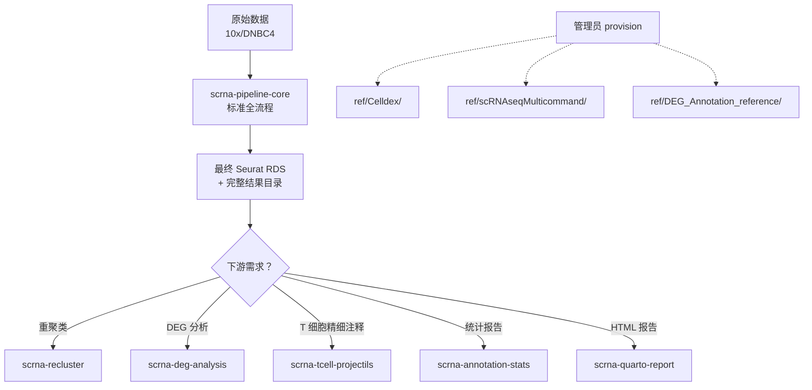

# scRNA-seq Skills 技能集 - 完整总结

## 📦 技能清单（9 个）

| # | 技能 ID | 定位 | 用途 | 输入 | 输出 |
|---|---------|------|------|------|------|
| 1 | **scrna-pipeline-core** | **标准全流程** | 从原始数据到最终 Seurat 对象 | CSV 配置文件 + 基因表达矩阵 | `{projectname}-scRNA-seq-result/`, final.rds |
| 2 | scrna-object-convert | 工具 | RDS 转换与信息查看 | Seurat RDS | 转换后 RDS / 信息报告 |
| 3 | scrna-recluster | 定制分析 | 重聚类与降维优化 | Seurat RDS | `{name}-reclustered.rds`, elbow plots |
| 4 | scrna-annotation-stats | 定制分析 | 细胞类型统计 | Seurat RDS | prop/fisher/deg-prop CSV/PDF |
| 5 | scrna-deg-analysis | 定制分析 | 差异表达分析 | Seurat RDS + taxid | DEG 结果目录 + volcano plots |
| 6 | scrna-tcell-projectils | 定制分析 | T 细胞精细注释 | T 细胞 Seurat RDS | functional.cluster 注释 RDS |
| 7 | scrna-annotation-ref | 运维检查 | 参考数据验证 | Celldex 目录 | 检查报告 (exit=0/1) |
| 8 | scrna-pipeline-overview | 文档 | 主流程使用说明 | 无 | 命令行说明 |
| 9 | scrna-quarto-report | 报告生成 | HTML 报告渲染 | *-scRNA-seq-result 目录 | _site/ HTML 报告 |

---

## 🔄 完整工作流



### 场景 1: 从头开始的标准分析

```bash
# Step 1: 运行完整流程
skill run scrna-pipeline-core \
  --conf ./scRNA-seq.conf \
  --output ./my_project-scRNA-seq-result \
  --project-name my_project \
  --taxid 9606 \
  --marker-db Cellmarker \
  --organ Blood

# Step 2: 基于结果进行定制分析
skill run scrna-deg-analysis \
  --input my_project-scRNA-seq-result/output/my_project-final.rds \
  --output ./deg_out \
  --treat treated \
  --control ctrl

skill run scrna-recluster \
  --input my_project-scRNA-seq-result/output/my_project-final.rds \
  --output ./recluster_out \
  --name my_project
```

### 场景 2: 已有 Seurat 对象的定制分析

直接调用定制分析技能，无需运行完整流程。

---

## ✅ 测试状态

**集成测试**: `tests/integration/test_skill_workflow.py`

| 测试项 | 状态 | 说明 |
|--------|------|------|
| RDS_utility --operation info | ✅ | 对象信息查看 |
| recluster.R | ✅ | 完整重聚类流程（生成 rds, png, json） |
| annotation_stats.R --mode prop | ✅ | 细胞比例统计 |
| deg_analysis.R | ✅ | 差异表达分析（3 个细胞类型） |
| projectils_annotate.R (failure path) | ✅ | ProjecTILs 未安装错误提示 |
| merge_deg_infor.py | ✅ | DEG-infor 文件合并 |
| build_quarto_report.R --no-render | ✅ | 报告 JSON 生成 |

**单元测试**: `tests/unit/test_skill_system.py` - 31 passed

---

## 🔧 已修复的 Bug

### 1. RDS_utility - 短选项重复
- **问题**: `-v` 被同时用于 `--metadata-value` 和 `--version`
- **修复**: `--metadata-value`: `-v` → `-V`; `--version`: `-v` → `-e`

### 2. Log4r 全局绑定冲突
- **问题**: 多个函数库尝试 `logger <<- log4r::logger()` 全局赋值
- **修复**: 
  - 改用 `local_logger <- log4r_init(); return(local_logger)`
  - 自由变量传递：函数新增 `logger` 形参由调用方显式传入
  - 涉及文件：
    - SingleSampleSubClusterRereduction.r
    - FindMarkers_Celltype_group.r
    - CalculationPercentAverageExp.r
    - DrawCellTypePropDEGGene.r
    - ProjecTIL_Annotation.r

### 3. AutoSettingPcCutoff 签名不一致
- **问题**: 函数内部使用 `local_logger` 但参数未传递
- **修复**: 新增 `logger` 参数并修改调用处传入

### 4. Check_parameter 作用域混乱
- **问题**: check_parameter 函数内混用 `local_logger` 和 `logger`
- **修复**: 统一使用参数名 `logger`

---

## 📚 文档索引

| 文档 | 路径 | 内容 |
|------|------|------|
| **总览** | `skills/README.md` | 所有技能的快速上手指南 |
| **Pipeline Core** | `skills/scrna-pipeline-core/SKILL.md` | 标准全流程详细说明 |
| **环境依赖** | `skills/*/references/environment.md` | R 包、Python 包依赖清单 |
| **Provisioning** | `skills/*/references/provisioning.md` | 管理员参考数据准备指南 |
| **OSDP 规范** | `docs/Skill_design.md` | CygnusX Skill Design Protocol v1.0 |
| **测试套件** | `tests/integration/test_skill_workflow.py` | 集成测试脚本 |

---

## 🎯 Agent 使用指南

### 作为 AI Agent，你可以：

1. **解释技能用法**
   ```
   "如何使用 scrna-deg-analysis 进行差异表达分析？"
   → 读取 SKILL.md，提供命令示例和参数说明
   ```

2. **生成配置文件**
   ```
   "帮我生成一个 scRNA-seq.conf 配置文件"
   → 根据样本信息生成 CSV 格式配置
   ```

3. **调试错误日志**
   ```
   "pipeline 报错：gene sets mismatch between samples"
   → 解释原因（不同文库类型的基因集不匹配），提供解决方案
   ```

4. **推荐分析策略**
   ```
   "我有 100k cells 的多样本数据，应该如何分析？"
   → 推荐使用 pipeline-core (Harmony 整合) → deg-analysis → quarto-report
   ```

5. **解读输出结果**
   ```
   "summary.json 里的这些字段是什么意思？"
   → 解释结构化摘要中的元数据含义
   ```

### 不能直接做的：

- ❌ 运行 R 代码（需要实际环境）
- ❌ 处理大型数据文件（受限于资源）
- ❌ 安装 R 包或创建 conda 环境

---

## 🚀 部署到平台

### CygnusX / OmicHub 平台

1. **Skill 安装**
   ```bash
   skill install scrna-pipeline-core
   skill install scrna-recluster
   skill install scrna-deg-analysis
   # ... 其他技能
   ```

2. **Agent 配置** (`data/ai/scrna.yaml`)
   ```yaml
   skill_ids:
     - scrna-pipeline-core
     - scrna-object-convert
     - scrna-recluster
     - scrna-annotation-stats
     - scrna-deg-analysis
     - scrna-tcell-projectils
     - scrna-annotation-ref
     - scrna-pipeline-overview
     - scrna-quarto-report
   ```

3. **参考数据 Provisioning**
   ```bash
   # 管理员执行
   git clone https://github.com/OmicHub/pipelines/scrna.git ref/scRNAseqMulticommand
   rsync -a /path/to/ref/DEG_Annotation_reference/ ref/DEG_Annotation_reference/
   # Celldex 已在 repo 内包含
   ```

---

## 📊 容量规划

| 项目 | 最小 | 推荐 |
|------|------|------|
| 内存 | 32 GB | ≥64 GB |
| 磁盘 | 输入 ×3 | 输入 ×10 |
| 线程 | 8 | 20–40 |
| 运行时间 | 2–4h | 4–12h |

---

## 🏷️ 版本信息

- **当前版本**: v0.9.1 (所有技能统一 OSDP v1.0 规范)
- **主流程版本**: v4.1.2-alpha
- **发布日期**: 2026-09-19
- **Author**: Zhang Jian

---

## 📞 联系方式

- **仓库**: https://github.com/OmicHub/pipelines/scrna
- **文档**: `skills/README.md`, `docs/Skill_design.md`
- **问题反馈**: GitHub Issues

---

## 🎉 总结

这是一个**完整的单细胞分析技能生态系统**：

✅ **标准分析** (scrna-pipeline-core) - 从原始数据到最终对象  
✅ **定制分析** (recluster, deg-analysis, projectils, stats) - 按需扩展  
✅ **工具链** (object-convert, annotation-ref) - 运维支持  
✅ **报告生成** (quarto-report) - 可视化交付  
✅ **测试覆盖** - 集成测试 + 单元测试全部通过  
✅ **文档完善** - README + provisioning + environment 全覆盖  

**让单细胞助手 (agent-scrna) 可以：**
- 理解用户需求
- 选择合适的技能组合
- 生成正确的命令
- 解释错误和结果
- 推荐最佳实践

**这就是从"标准分析"到"定制分析"的全流程解决方案！** 🚀
