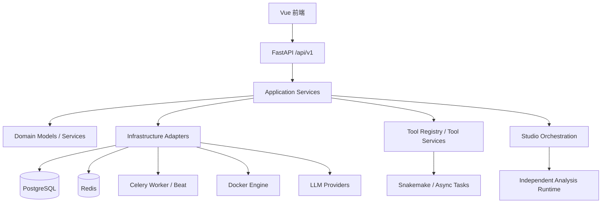
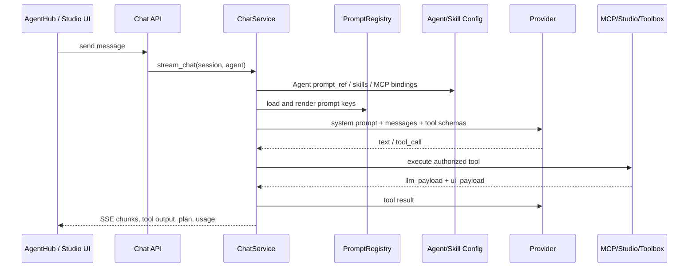
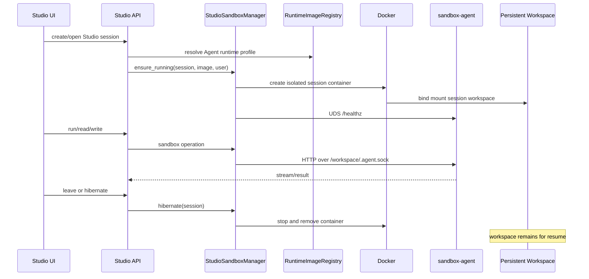

# CygnusX 当前架构、提示词外置与任务镜像设计

> 文档状态：当前实现基线 + 后续演进规范  
> 更新日期：2026-07-17  
> 权威配置：`data/ai/prompts/registry.yaml`、`data/ai/runtime_images.yaml`、`data/ai/*.yaml`、`data/ai/studio.yaml`

## 1. 目标与结论

本设计解决四个问题：

1. CygnusX 中提交给模型的提示词统一外置到 `data/`，代码只保存 key、变量和编排逻辑。
2. OmicStudio 使用独立的任务分析镜像族，以 micromamba + Python + R 为基础，不再与旧通用 sandbox/交互终端镜像混用。
3. 提供单细胞、科研绘图等可演进的专用镜像。
4. Studio 和工具箱可以共享同一个“镜像定义与镜像层”，但不能共享容器、容器池、挂载、会话或生命周期。

这里的“共享”必须严格理解为：两个执行器都可以引用 `cygnusx-analysis:plot-2026.07` 这个不可变镜像；Studio 仍创建会话级容器，工具箱仍创建任务级容器。

## 2. 当前系统总览

### 2.1 技术栈

| 层级 | 当前实现 |
| --- | --- |
| 前端 | Vue 3、TypeScript、Vite、Pinia、Naive UI、Monaco Editor |
| API | FastAPI，统一挂载在 `/api/v1` |
| 应用服务 | Chat、Agent、Studio、Report、Task、Tools 等 service |
| 领域层 | Agent、Skill、Task、Report、AI Conversation 等实体与领域服务 |
| 基础设施 | SQLAlchemy/PostgreSQL、Redis、Celery、Docker SDK、对象/本地存储 |
| AI Provider | OpenAI-compatible 与 LiteLLM provider 适配 |
| 工作流 | Snakemake、Celery 长任务、工具箱同步/异步执行器 |
| Studio | 每会话一个 Docker 容器、Unix Socket sandbox-agent、持久工作区、空闲回收 |

### 2.2 分层架构



后端遵循 API -> 应用服务 -> 领域 -> 基础设施的主要依赖方向。部分旧模块仍直接使用配置或数据库模型，属于兼容层，应逐步收敛而不是继续扩张。

### 2.3 AI 对话调用链



关键文件：

- `src/cygnusx/application/services/chat_service.py`
- `src/cygnusx/application/services/agent_service.py`
- `src/cygnusx/infrastructure/ai_provider/openai_compatible.py`
- `frontend/src/stores/agentHub.ts`
- `frontend/src/composables/useAgentChatStream.ts`

### 2.4 OmicStudio 调用链



Studio 的核心安全边界：

- 容器按会话隔离；
- `/workspace` 是唯一业务可写挂载；
- `/data/platform` 按用户只读挂载；
- 控制面通过 Unix Socket，不发布容器端口；
- 默认无网络，需要联网时走白名单代理；
- 忙碌租约避免长任务被空闲回收；
- 离开页面或超过 TTL 后删除容器，工作区继续保留。

## 3. 提示词外置设计

### 3.1 目录结构

```text
data/ai/prompts/
├── registry.yaml
├── agents/
│   ├── general.md
│   ├── rnaseq.md
│   ├── scrna.md
│   ├── code.md
│   ├── visualization.md
│   └── shania.md
├── studio/
│   ├── system.md
│   └── capability_catalog.md
├── tools/
│   └── cygnusx_system_hint.md
├── skills/
│   ├── wrapper.md
│   └── extracted_skill.md
├── welcome/
├── copilot/
├── chat/
└── user_templates/
```

`registry.yaml` 是提示词索引，正文文件是内容源。代码只能通过 key 访问，例如：

```python
get_prompt("studio.system")
render_prompt("skills.extracted_skill", name=..., source=...)
```

### 3.2 Prompt 类型

| kind | 用途 | 示例 |
| --- | --- | --- |
| system | 模型系统提示词 | `agents.rnaseq`、`studio.system` |
| user | 固定用户消息 | `welcome.admin_user` |
| instructions | 附加规则 | `copilot.tool_use` |
| template | 带声明变量的模板 | `skills.extracted_skill` |
| mapping | YAML 结构化提示词集合 | `user_templates.bio` |

### 3.3 变量与安全

模板仅支持 `{{variable}}` 替换：

- 不支持 Jinja 表达式、过滤器、include 或代码执行；
- registry 必须声明允许的变量；
- 未声明变量和缺失变量都会报错；
- 文件路径必须位于 `data/ai/prompts/` 内，拒绝 `../` 路径逃逸；
- Prompt 内容按文件 mtime 热重载。

### 3.4 Agent 配置

Agent YAML 不再存完整 `system_prompt`，而是引用：

```yaml
agent_id: agent-rnaseq
prompt_ref: agents.rnaseq
studio:
  enabled: true
  runtime_profile: analysis-core
  required_capabilities: [python, r, statistics]
```

加载时 `agent_loader`：

1. 读取 `prompt_ref`；
2. 从 Prompt Registry 获取正文；
3. 验证运行时 profile 与能力；
4. 将解析后的 system prompt 和 Docker image 交给现有 AgentService；
5. 数据库仍保存运行时快照，便于会话稳定和审计。

### 3.5 什么不属于 Prompt

以下内容不应混入 Prompt Registry：

- 普通按钮、Toast、错误消息和页面介绍；
- Docker、资源、网络与挂载配置；
- 数据库中的用户自定义 Skill 实例；
- OpenAPI/Pydantic schema 本身；
- 日志中历史回显的提示词；
- 仅供开发者阅读的设计文档。

模型可见的工具 `description` 属于提示面，但仍建议保留在结构化工具 registry 中，以便 schema 与描述同版本校验。

## 4. 独立任务镜像体系

### 4.1 为什么选择 micromamba + Python + R

这是适合组学分析的基础：

- Python 与 R 同时存在，覆盖 Scanpy、pandas、Seurat、DESeq2、ggplot2；
- conda-forge/bioconda 提供大量可复现的生信二进制与 R/Bioconductor 包；
- micromamba 启动快、镜像层更轻，适合 Docker 构建；
- 可以按 profile 固定版本，避免每个任务现场安装依赖；
- 能让 Studio 与工具箱引用相同镜像资产。

但不能把“镜像可共享”误解成“沙盒可以混用”。

### 4.2 必须隔离的三类执行环境

| 类型 | 容器粒度 | 主要用途 | 是否可共享容器 |
| --- | --- | --- | --- |
| Studio 分析运行时 | 每会话 | AI 交互式分析、编辑、反复运行 | 否 |
| 工具箱任务运行时 | 每任务/工具 | 确定参数的工具执行 | 否 |
| 交互终端/旧 sandbox | 每终端会话或旧池 | 用户 Shell、历史代码执行功能 | 否 |

允许共享：Dockerfile 基础层、镜像 tag、软件清单、漏洞扫描结果。  
禁止共享：运行中的容器、容器池、Docker network、工作区、用户挂载、Unix Socket、状态和 TTL。

### 4.3 Runtime Image Registry

`data/ai/runtime_images.yaml` 对每个 profile 描述：

- 镜像名与 Dockerfile；
- 镜像家族和隔离等级；
- 兼容执行器；
- capabilities 与 task_tags；
- Python/R 和软件版本；
- CPU、内存、PID 默认值；
- 网络策略；
- 父 profile。

当前 profile：

| Profile | 基础 | 主要能力 | 建议任务 |
| --- | --- | --- | --- |
| `analysis-core` | micromamba + Python 3.12 + R 4.4 | 表格、统计、机器学习、RNA-seq 基础包 | 通用分析、代码、DEG |
| `analysis-plot` | core | matplotlib、seaborn、plotly、ggplot2、字体 | 火山图、热图、富集图、报告图 |
| `analysis-scrna` | plot | Scanpy、AnnData、Seurat、HDF5、Leiden | 单细胞质控、聚类、注释、轨迹 |

### 4.4 选择算法

任务提交时需要构造 `required_capabilities`：

```text
用户任务 + Agent 默认能力 + 工具明确能力
        ↓
required_capabilities
        ↓
过滤 executor_compatibility
        ↓
过滤 capabilities 超集
        ↓
选择满足条件且能力集合最小的 profile
```

显式指定 `runtime_profile` 时仍必须验证：

- profile 存在；
- 执行器兼容；
- 所需能力全部满足；
- 禁止回退到能力不足的镜像。

这比直接让 LLM 输出 Docker image 名更安全。LLM 只能提出任务能力，控制面决定镜像。

### 4.5 工具箱共用方式

工具 schema 可以声明：

```yaml
runtime_profile: analysis-plot
required_capabilities: [python, plotting, tabular]
```

`ToolSchema.resolve_runtime_image()` 使用同一 Runtime Image Registry 得到镜像。后续工具箱容器执行器应读取该结果创建任务级容器。当前 `backend_shim` 仍可保持进程内执行；迁移到容器时无需改变工具对 LLM 的函数 schema。

### 4.6 镜像版本治理

建议 tag 采用不可变版本，例如 `cygnusx-analysis:plot-2026.07`，不要在生产使用 `latest`。

每次升级必须同步：

1. Dockerfile 的精确包版本；
2. `data/ai/runtime_images.yaml` 软件清单；
3. 镜像 digest；
4. SBOM 与漏洞扫描结果；
5. 最小功能测试；
6. 旧会话的升级策略。

会话创建时应把 `runtime_profile`、image tag 和 image digest 保存进 `sandbox_meta`。运行中的会话不应因为 registry 热更新而静默换镜像；重新创建会话或显式升级后再使用新版本。

## 5. 新增镜像流程

以空间转录组镜像为例：

1. 新建 `deploy/runtime-images/spatial.Dockerfile`，FROM 最接近的父镜像；
2. 固定 Python/R/软件版本；
3. 在 `data/ai/runtime_images.yaml` 注册 `analysis-spatial`；
4. 声明 capabilities，例如 `spatial-transcriptomics`、`single-cell`、`plotting`；
5. 声明 Studio/toolbox 兼容性；
6. 增加契约测试，验证 Dockerfile 存在和能力继承；
7. 增加 Docker 集成测试，验证 import、CLI 版本、非 root、工作区写权限；
8. 给对应 Agent 或工具声明 profile/capabilities；
9. 构建、扫描、记录 digest 后部署。

## 6. 提示词新增与修改流程

1. 在 `data/ai/prompts/<domain>/` 创建 Markdown/YAML；
2. 在 registry 注册唯一 key、kind、owners、variables；
3. 代码只引用 key；
4. 为模板添加缺失变量、未知变量和路径越界测试；
5. 变更 Prompt 时记录版本说明和评测用例；
6. 对高风险 Prompt 做离线回归：工具选择、路径规则、隐私、拒绝伪造结果；
7. 不在 Python/Vue 中复制 Prompt 正文。

## 7. 当前已落地与后续工作

### 已落地

- Prompt Registry 与安全加载器；
- Agent、Studio、欢迎词、Skill、Copilot、工具提示规则外置；
- 前端生信提示词模板通过 API 从 `data/` 加载；
- Runtime Image Registry 与能力选择器；
- core/plot/scrna 三个独立 micromamba Dockerfile；
- Agent `runtime_profile` 和 `required_capabilities`；
- 工具 schema 的运行时声明字段；
- 单细胞 Agent；
- 配置契约测试。

### 后续建议

- 将 Studio tool function descriptions 也迁到结构化 YAML；
- 将 BioReport/RNAFlow/ATACFlow 中重复 Prompt 统一到 `data/ai/prompts/report/`；
- 为工具箱实现真正的 Docker task executor，消费 `resolve_runtime_image()`；
- 保存和校验镜像 digest，而不只保存 tag；
- 增加镜像 SBOM、签名、CVE 阈值和 CI 构建；
- 为任务分类增加确定性规则，不把镜像选择完全交给模型；
- 修复生产 Compose 仍继承开发源码挂载和 Docker Socket 的问题；
- 删除旧 `deploy/studio/base.Dockerfile` / `bio.Dockerfile` 前先完成存量会话迁移。

## 8. 验证命令

```bash
uv run pytest \
  tests/unit/test_prompt_loader.py \
  tests/unit/test_prompt_config_contract.py \
  tests/unit/test_runtime_image_loader.py \
  tests/unit/test_agent_loader_studio.py \
  tests/unit/test_studio_loader.py -q

python3 -m py_compile \
  src/cygnusx/infrastructure/config/prompt_loader.py \
  src/cygnusx/infrastructure/config/runtime_image_loader.py

npm --prefix frontend run type-check
npm --prefix frontend run build

make runtime-images-build
```

镜像构建耗时长且需要网络，建议在 CI 或专用构建机执行；日常配置测试不应隐式触发 Docker build。
