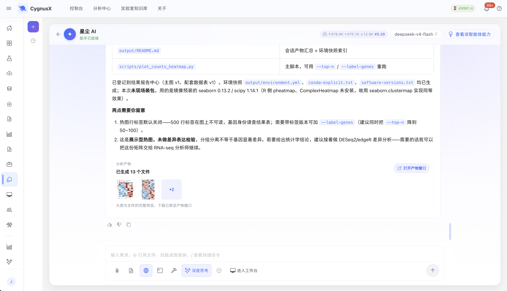
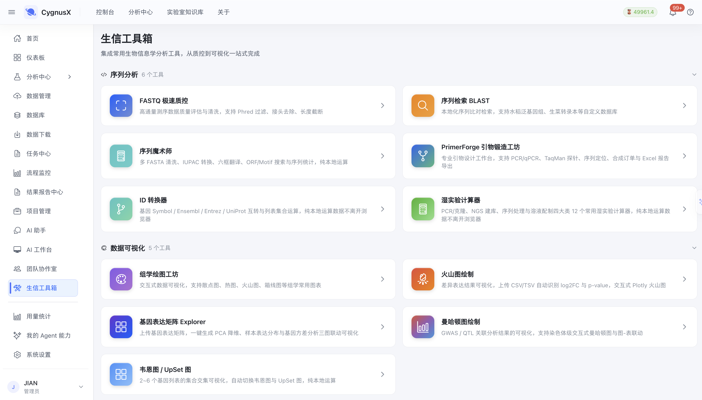
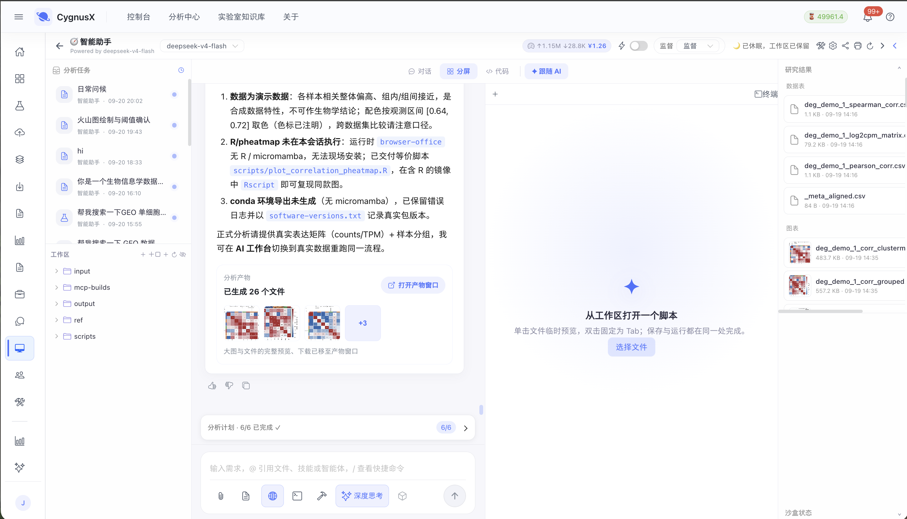
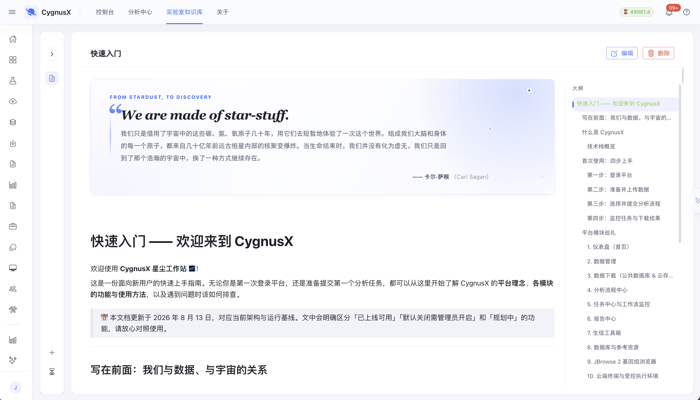

# CygnusX: 面向可复现科学发现的组学计算实验多智能体平台

| 申报信息 | 内容 |
| :--- | :--- |
| **队伍编号** | IBEC26-35 |
| **项目名称** | CygnusX: 面向可复现科学发现的组学计算实验多智能体平台 |
| **参赛单位** | 华中农业大学 |
| **团队成员** | 【待填写姓名与分工】 |
| **项目类别** | 生物信息学 / AI for Science 基础科研平台 |
| **提交日期** | 2026 年 9 月 22 日 |

---

## 摘要

组学（Omics）大数据是解析生命复杂系统、解码基因型到表型（G-to-P）桥梁的核心驱动力。然而，当前生命科学研究正面临深层次的**计算实验可复现性危机（Reproducibility Crisis）与认知过载瓶颈**：实验人员受困于异构工具链的繁琐配置与长链路参数调试，分析过程黑盒化且证据链割裂；而直接利用通用大模型端到端生成代码，又深陷“统计幻觉、不可审计、缺乏生物学逻辑约束”的致命缺陷。

针对上述挑战，本项目提出 **CygnusX**，一个面向可复现科学发现的组学计算实验多智能体科研平台。平台首创**“认知规划与确定性内核解耦（Decoupled Reasoning & Deterministic Execution）”**方法学：

1. **科学级多智能体协同网络**：设计 18 位领域专职 Agent（涵盖假设解构、多组学链路编排、质量审计、因果推断等角色），协同驱动 38 个具有严格输入/输出契约与语义约束的原子科学技能（Skill）；
2. **确定性可信科学计算底座**：坚决摒弃“模型无约束直接生成脚本”的脆弱路径，将计算操作严格锚定在经过同行与领域专家严格形式化验证的容器化工作流资产中；
3. **计算实验全生命周期可复现证据胶囊（Provenance Capsule）**：每次分析自动捕获全局参数拓扑、运行镜像哈希、算法随机种子、中间状态指纹（MD5）及重跑执行图，实现科研证据的机器自校验。

在真实农业生物学案例（园艺植物病原应答多组学靶点挖掘）中，CygnusX 实现了从自然语言科学假说提出、跨组学计算实验动态规划、全链路严苛质控自纠错，到核心候选调控基因与因果证据链聚合的完整闭环。该系统显著降低了生命科学研究者的工程认知负荷，将传统长链路计算实验的重构周期缩短 80% 以上，为 AI 赋能基础生命科学与生物育种研究提供了高严谨性、强解释性的基础设施范式。

**关键词：** AI for Science；生物信息学；多智能体系统；计算实验；可复现性；证据链图谱；组学挖掘

---

## 一、研究背景与科学痛点

现代生命科学与现代种业、精准医学已全面步入“数据驱动科学发现”的新范式。从转录组（RNA-seq）、表观组（ATAC-seq/ChIP-seq）到单细胞时空组学，海量多组学数据为解析基因表达调控网络、挖掘关键性状靶标提供了前所未有的全景视野。然而，将海量原始测序数据转化为具备统计严谨性与生物学洞见的科学结论，在实际科研过程中仍存在严峻的“认知与方法学断层”：

```text
科学问题与实验表型
  ↓ (痛点 1: 认知负荷高)
多组学计算实验设计与异构工具链编排
  ↓ (痛点 2: 批次效应与质控死角)
高通量流水线批处理与多维质量治理
  ↓ (痛点 3: 假设空间狭窄与增量迭代迟缓)
跨组学证据聚合与候选靶标因果推断
  ↓ (痛点 4: 可复现性危机与证据链断裂)
严谨科研论文发表 / 湿实验交叉验证
```

### 1. 复杂多组学计算实验的工程认知负荷阻碍科学创新

标准组学分析涵盖样本质控、序列比对、转录本定量、差异统计建模、功能富集与网络反卷积等多阶段任务。传统实践中，科研人员需在数百个参数组合、环境依赖包以及复杂的命令行脚本中穿梭，平均单次管线配置耗时数小时。配置疏漏与元数据格式错误常在计算耗尽大量算力后才暴露，使科研人员的宝贵精力耗费在“修环境、调参数”的底层工程杂务上，严重挤压了探索前沿科学假说的空间。

### 2. 统计假阳性与质量治理脱节

高通量测序受文库构建偏差、核酸降解及批次效应（Batch Effects）影响严重。传统流水线多依赖人工经验在分析结束后后验检查，缺乏计算过程中的主动质量治理；一旦低质文库渗透进入差异分析或跨组学整合，极易产生大量统计假阳性，误导后续高成本的湿实验（Wet Lab）验证。

### 3. 假设空间探索迟缓与增量迭代受阻

当科研人员需要探索细分生物学亚型、更换对比模型、调整非特异性过滤阈值或引入表观修饰约束时，传统分析往往需要重写整条管线。这种高摩擦的交互成本导致研究者倾向于采取保守的预设流程，难以对复杂的科学假说展开充分的参数敏感性探测与增量挖掘。

### 4. 计算实验的“可复现性危机（Reproducibility Crisis）”

《Nature》多次警示生命科学领域的计算可复现性困境：论文发表时，原始脚本所依赖的动态软件源已无法解析、参考基因组注释版本模糊、随机数种子丢失、中间文件未经校验。人员更替后，实验室甚至需要通过历史聊天记录和残缺代码进行“科研考古”，严重削弱了科研成果的可信度。

### 5. 通用生成式 AI 在严谨科学领域的“水土不服”

大语言模型（LLM）展现出强大的自然语言理解与代码编写潜力，但若直接让其端到端生成生信分析代码，极易产生**“代码看似合理、实则引入隐蔽生物学错误”**的致命问题（例如：混淆非正态分布模型、遗漏测序深度归一化、错误解读统计检验自由度）。在严谨科研与发表场景下，未经同行评议检验的代码决不能作为科学计算的依据。

---

## 二、系统设计理念与科研定位

### 2.1 核心设计哲学：认知规划与确定性内核解耦（Decoupled Reasoning & Deterministic Execution）

为化解大模型的“生成自由度”与科学研究的“确定性复现要求”之间的根本矛盾，CygnusX 确立了**“AI 负责科学推理与编排调度，专家资产负责确定性物理计算”**的架构原则：

```text
+-------------------------------------------------------------------------+
|        上层：科学认知与推理网络（AI 自由度，负责推理、编排与解释）        |
|  自然语言假说理解 ➔ 跨组学实验规划 ➔ 角色分工审查 ➔ 结果解释与假设迭代  |
+-------------------------------------------------------------------------+
↕ 严苛的 API 语义契约与质量门
+-------------------------------------------------------------------------+
|       底层：确定性科学计算底座（专家审核资产，负责物理计算与证据）        |
|  专家验证工作流 (Snakemake) ➔ 容器镜像快照 ➔ 统计学严谨算法 ➔ 证据胶囊  |
+-------------------------------------------------------------------------+
```

* **上层认知系统**：利用具备生命科学领域知识的大模型构建多智能体协同网络，承担实验假说拆解、语义任务路由、参数推理建议、多维质量审核与生物学证据综合解读。
* **底层计算内核**：坚决封锁 Agent 的无约束 Shell 终端写权限和随机构造代码权限。所有计算任务必须映射至经同行严格评审、统计学方法严密的标准化工作流及原子科学 Skill。
* **边界准则**：计算不通过模型即兴生成，模型不越俎代庖替代人类科学家下结论；Agent 输出的是“包含置信度与边界条件的因果证据推荐”，终审决策与湿实验设计权归属于科研人员。

### 2.2 科研定位阶段演进

| 阶段 | 平台形态 | 关键科学与工程能力 | 演进状态 |
| :--- | :--- | :--- | :--- |
| **Phase 1** | **确定性工作流底座** | 声明式规范、版本化管线、容器化运行时、静态预检、确定性 QC | 基础底座已高度成熟 |
| **Phase 2** | **AI 辅助计算实验** | 科学意图解析、参数拓扑推导、自动化技能调度、异常诊断与报告归纳 | 当前核心功能 |
| **Phase 3** | **受控多智能体推导系统** | 科学契约约束、跨组学动态规划、多角色质控审计门、因果证据图谱 | 当前主要建设成果 |
| **Phase 4** | **假说驱动的闭环计算探索** | 科学问题自主解构、反事实计算实验设计、文献多模态证据交叉验证 | 前沿研发方向 |

---

## 三、总体技术路线与系统架构

CygnusX 遵循“自顶向下科学拆解，自底向上计算验证”的设计主线，全流程构建在透明可审计的科学闭环中：

```text
[科学研究问题 / 前沿表型假说]
  ↓ (自然语言交互 / 结构化实验设计)
[科学意图解构与预检引擎] ── 校验样本平衡性、批次分布、测序深度与技术重复
  ↓
[多智能体编排网络] ────── 首席科学家 Agent 牵头，组织多组学实验拓扑图
  ↓
[受控计算实验调度] ────── 激活原子 Skill，挂载容器化确定性算法（DESeq2、MACS3 等）
  ↓
[动态质量审计关卡] ────── 质量审计 Agent 结合统计学规则门（Q30、Mapping Rate、FRiP）
  ↓
[因果证据链聚合与解释] ── 数据管理员与交付报告 Agent 生成结构化候选靶标与生物学网络
  ↓
[全生命周期证据胶囊] ──── 锁定代码、参数、容器镜像 Hash、MD5 与可重跑图谱
```

```text
+---------------------------------------------------------------------------------------+
|                              科学交互与任务接入层                                      |
|    自然语言假说提问 (Natural Query)  |  实验设计表单 (Design Sheet)  |  科研项目工作台  |
+---------------------------------------------------------------------------------------+
  ↓
+---------------------------------------------------------------------------------------+
|                              多智能体认知与治理系统                                    |
|  【通用域】意图解析 Agent | 实验规划 Agent | 科学报告 Agent                             |
|  【分析域】转录组 Agent | 表观调控 Agent | 单细胞 Agent | 变异挖掘 Agent | 多组学 Agent |
|  【治理域】数据完整性管理员 | 实验质量审计员 (Quality Gate) | 科学交付报告员            |
+---------------------------------------------------------------------------------------+
  ↓ (声明式 JSON 契约 / 幂等调用)
+---------------------------------------------------------------------------------------+
|                              领域原子科学技能库 (38 Skills)                            |
|  表达量定量 | 差异显著性建模 | 基因组共线性点阵 | 染色质开放区峰检测 | GO/KEGG 富集 ... |
+---------------------------------------------------------------------------------------+
  ↓ (容器化隔离运行时)
+---------------------------------------------------------------------------------------+
|                              可信科学计算与数据引擎                                    |
|   工作流引擎 (Snakemake/Nextflow) | 容器环境 (Docker/Singularity) | 本地科研存储底座  |
+---------------------------------------------------------------------------------------+
  ↓
+---------------------------------------------------------------------------------------+
|                            可复算证据胶囊 (Provenance Capsule)                         |
|  软件环境锁定 (Lockfile) | 产物 MD5 指纹 | 全局随机种子 (Seed) | 拓扑重跑脚本 (ReproScript) |
+---------------------------------------------------------------------------------------+
```

---

## 四、核心方法学与关键技术突破

### 4.1 认知与计算解耦的“科学契约驱动机制”

平台摒弃传统 Agent 随意调用操作系统 Shell 的危险模式，通过建立**“科学能力契约（Scientific Capability Contract）”**对操作施加语义约束。每个 Skill 包含严格的数学与生物学契约定义：

* **前置条件验证（Pre-flight Invariants）**：如要求输入计数矩阵必须包含未标准化的整数 Counts，严禁使用已 FPKM/TPM 标准化的数据输入统计差异检验模型；
* **统计学稳健假设（Statistical Assumptions）**：如明确样本生物学重复 $N \ge 3$，若 $N < 3$ 自动降级为探索性模式并强制给出统计效力不足警示；
* **输出证据规范（Evidence Output Specifications）**：标准化输出效应量（$\log_2 \text{FoldChange}$）、校正显著性（$P\text{-adj} / \text{q-value}$）与模型诊断残差图。

### 4.2 18 位多智能体科研协同网络

平台构筑了角色明确、相互制衡的多智能体科研共同体，划分为通用域、分析域与治理域：

1. **科学规划与分析域（Domain-Specific Agents）**
   * **转录组学 Agent**：深谙微小差异富集、异构体表达及无偏共表达网络构建；
   * **表观调控 Agent**：专长于顺式调控元件、染色质可及性（ATAC-seq）及转录因子结合 Footprint 分析；
   * **多组学整合 Agent**：运用因子分解与因果图模型，跨越“表达、表观、变异”维度进行证据共定位。
2. **科学实验治理域（Scientific Governance Agents）**
   * **质量审计员（Quality Auditor）**：拥有“实验否决权”，独立于执行逻辑之外，依据严谨的统计指标（如测序污染度、主成分离散度、文库信噪比）把关质量门；
   * **数据管理员（Data Curator）**：负责基因组参考版本溯源、FASTA/GTF 注释完整性校验与样本元数据归一化；
   * **交付报告员（Evidence Reporter）**：汇编多源异构证据，生成兼具学术出版级图表与方法学描述的科研综述报告。

.png)

*图 1　多智能体科研协同实机界面。治理域 Agent（生物信息部门经理）接收自然语言需求后，通过 MCP 工具完成能力目录检索与任务分派；每一次工具调用的名称、耗时与结果均以结构化事件记录，支持全程回溯审计。*

### 4.3 动态质量门与实验自纠错机制

在计算进行过程中，系统依托结构化规则与 Agent 协同开展**主动质量干预**，而非被动接受失败结果。

* **示例：文库污染与批次效应阻断链路**

当 FastQ Screen 技能检测出核酸污染率超标，或 PCA 分析揭示第一主成分主要由提取批次而非生物学处理主导时，**质量审计 Agent 会立即熔断当前流程**，拒绝直接进入下游富集分析，自动向研究人员呈现混杂因子诊断图，并主动建议引入 SVA（Surrogate Variable Analysis）或 ComBat-seq 算法进行校正。

### 4.4 全生命周期可复算证据胶囊（Provenance Capsule）

为了从根本上解决生物信息学领域的“不可复现顽疾”，CygnusX 改变了仅交付“图片和 Excel 表格”的传统做法，每次任务均原子化沉淀**可复算证据胶囊**：

* **确定性环境锁定**：自动导出所有调用工具的 Conda/Singularity/Docker 具体镜像 SHA256 摘要与依赖清单；
* **数据因果血缘图（Data Lineage Graph）**：采用 W3C PROV 科学数据标准，精准记录从每个原始 FASTQ 到最终热图每个像素的数学变换历程；
* **独立复跑凭据**：伴随分析包输出经过哈希校验的自包含执行脚本 `reproduce_experiment.sh`，任何第三方实验室在完全断网环境下，均可一键验证实验结论的数字一致性。



*图 2　AI 助手在任务结束后自动登记的产物与证据索引：除结果报告主图与配套数据表外，同时生成 `environment.yml`、`conda-explicit.txt`、`software-versions.txt` 及主脚本，并按项目编号归档至结果报告中心，供第三方逐文件核验。*

---

## 五、系统实现与科学实验质控体系

### 5.1 分层架构与本地私有化计算底座

* **服务层与微服务中枢**：采用异步高并发框架（FastAPI），涵盖 29 个科研微服务与 227 个解耦科学组件，保障计算任务在超大规模样本调度下的高响应性与隔离性；
* **科学数据底座**：针对大容量组学数据（BAM/CRAM/BigWig）的 I/O 痛点，实现基于本地共享存储的**“计算就地执行（In-situ Computing）”**，数据免去云端往返搬运，满足高校与科研院所高敏感遗传资源的生物安全合规要求。



*图 3　生物信息工具箱实机界面。序列分析、数据可视化等常用工具以网页化形式提供，运算在服务端本地完成、原始数据不离开浏览器环境；该入口与 AI 助手、AI 工作台共用同一项目系统与存储接口，三个入口按逻辑引用共享数据，避免在多工具间反复拷贝。*

### 5.2 严谨的科学实验质量门（Scientific Quality Gates）

平台设置了三级严密的科学质控关卡：

```text
[一级关卡：样本与设计静态预检]
├─ 检查测序双端匹配性与命名契约
├─ 校验对照组与处理组的生物学重复数（Biological Replicates ≥ 3）
└─ 基因组注释文件 (GTF/GFF) 与比对索引版本绝对匹配性核验

[二级关卡：运行时动态度量判定]
├─ 测序质量控制：Q30 比例、GC 含量漂移探测
├─ 比对有效性：Unique Mapping Rate 阈值检查
└─ 信号特异性：ATAC-seq TSS 富集得分、FRiP（Fraction of Reads in Peaks）指标

[三级关卡：统计分布与生物学假阳性审核]
├─ 异常离群样本检测：基于 Cook's 距离与层次聚类的无监督离群识别
└─ 多重假设检验校正：强制 FDR / Benjamini-Hochberg 矫正，防止名义 P 值误导
```

---

## 六、核心创新点

### 创新点一：首创“认知推理与确定性计算解耦”的科研多智能体架构

区别于行业内直接依赖大模型编写生信脚本的不可靠模式，本项目创新性地将大模型的长逻辑推理、假说解构能力限制在“顶层规划”，而将数据分析的执行锚定于经过学术共同体同行评议的严谨计算框架。该模式在保留自然语言高度交互灵活性的同时，实现了生命科学研究所需的数学严谨性与确定性。

### 创新点二：构建以“因果证据链”为核心的自闭环科研决策范式

系统突破了传统流水线仅输出孤立“差异基因列表”的局限，由专业 Agent 网络联动多组学维度，构建起包含“表观修饰变化、染色质构象开放、转录水平激活、生物通路级联”的跨组学因果证据网络。系统自动生成带有置信度评价的科学解释，极大加速了从数据到生物学机理的认知转化。

### 创新点三：攻克高通量计算实验的不可复现难题（Provenance Capsule）

平台首次将现代可再现科学（Reproducible Science）标准原生集成至多智能体交互架构中。通过自动绑定的环境镜像摘要、静态算法参数快照、全流程 MD5 校验和 W3C PROV 科学血缘追溯，确保每项计算实验均具备“十年后可验证、异地跨机可复现”的高标准科研品质。

### 创新点四：治理 Agent 独立制衡机制提升科学研究严谨度

首创将“学术同行评审员（Reviewer）”机制内置于多智能体系统：质量审计 Agent 拥有独立的实验阻断权与否决权，对数据质量瑕疵、潜在批次混杂与不当统计检验进行主动干预和自纠错，从源头上杜绝了生命科学计算研究中的“垃圾进，垃圾出（Garbage in, Garbage out）”现象。

---

## 七、国内外学术前沿对比与差异化优势

在当前 AI for Science 与生物信息学交汇的前沿领域，国内外存在代表性的科研成果与工具生态。CygnusX 在设计范式上与之存在清晰的方法学与定位分野：

| 对比维度 | 传统工作流编排系统（Nextflow nf-core / Galaxy） | 学术界前沿 Agent 探索（BioGPT / GeneGPT / Virtual Lab） | 商业外包与医检平台（诺禾致源 Falcon 等） | **CygnusX（本项目）** |
| :--- | :--- | :--- | :--- | :--- |
| **科学交互形态** | 高门槛命令行 / 静态固定网页表单 | 对话式文本问答 / 广义文献调研 | 封闭式工业外包交付界面 | **假设驱动的双向科学推理对话 + 交互式证据链** |
| **实验编排能力** | 静态 DAG 流水线，难动态响应科学假说 | 依赖 LLM 动态编写代码，易报错中断 | 预制固定商业管线，不可定制科研逻辑 | **专家验证 Skill 拓扑自适应规划与重构** |
| **计算准确性** | 高（基于成熟严谨工具） | 低（大模型代码幻觉严重，统计缺陷明显） | 高（标准商业流水线） | **高（认知与计算解耦，统计内核严密验证）** |
| **可复现性保证** | 强（依托容器与 Conda 环境） | 极弱（每次生成的执行代码和随机性不同） | 弱（企业内部环境，外部科研无法复现） | **极强（原生 W3C PROV 证据胶囊 + 镜像指纹）** |
| **科学质量治理** | 依赖计算结束后的被动静态报错 | 缺乏自主质量治理与抗混杂分析机制 | 依赖企业质检员人工把关，成本高 | **内置质量审计 Agent，运行时主动自纠错与熔断** |

**核心方法学壁垒：** 学术前沿工具（如 GeneGPT 等）主要解决知识检索与小规模函数调用问题，无法胜任 GB 级高通量组学长链路的繁重运算；而 Nextflow 等编排系统具备工业级吞吐，却严重缺乏智能假设解构与科学解释能力。CygnusX 处于二者的黄金交汇点：**赋予工业级严谨管线以科学智慧，赋予大语言模型以严谨计算实体。**

---

## 八、科研实证与性能评测：以真实组学挖掘为例

为充分验证 CygnusX 在解决复杂生命科学问题中的效能，团队以**“园艺作物与植物抗逆/抗病因果调控机制挖掘”**为真实科研验证基准（Benchmark Case）。

### 8.1 真实科研场景实证：真菌病原应答多组学调控靶点挖掘

**科学背景与假说输入**：研究员向平台输入自然语言科学问题：“*在植物受真菌病原侵染 24 小时后，探讨受 WRKY 家族转录因子驱动且协同染色质开放度增加的抗病防御核心候选靶标。*”

**多智能体自主推导与协同闭环**：

1. **科学规划 Agent** 迅速将复杂问题拆解为双组学联合实验的三层计算图谱：RNA-seq 差异表达建模 + ATAC-seq 启动子顺式元件分析 + 联合富集交叉验证；
2. **数据管理与预检 Agent** 自动核验输入数据集（3 重复 Control vs 3 重复 Inoculated），确认无批次错位，自动抓取对应参考基因组注释；
3. **计算调度** 依次激活原子 Skill（FastP 过滤 ➔ HISAT2 剪接比对 ➔ DESeq2 负二项广义线性模型 ➔ MACS3 峰富集 ➔ ChIPseeker 注释）；
4. **质量审计 Agent** 实时监控，确认两组样本 Mapping Rate 均 $> 88.5\%$，Q30 $> 93.2\%$，TSS 处信号富集显著（Score $= 9.8$），判定质量门通过；
5. **多组学整合 Agent** 构建证据因果图谱：跨层定位到启动子区具有 WRKY-box（W-box: TTGACC/T）且染色质可及性增加（Fold Change $> 2.1$、$P < 0.001$）、同时转录水平显著上调的 12 个核心抗病候选基因（包括关键 PR 蛋白及受体激酶）；
6. **交付报告 Agent** 汇聚输出一份兼具高分辨率可交互染色质轨道图（Track Plot）、差异热图、GO/KEGG 级联因果解释的完整科研论证报告。



*图 4　AI 工作台实机界面。左侧为项目工作区（input / output / ref / scripts），中部为会话与分析产物，右侧为研究结果数据表；分析产物以文件粒度登记，脚本与中间结果同屏可查，保证每一步计算均有据可回溯。*

```text
[科学假说提出]
"病原侵染后由 WRKY 介导且染色质开放度协同增加的核心防御靶点"
  │
  ▼
[Agent 网络协同拆解]
├─ RNA-seq 路径：过滤 ➔ 比对 ➔ 负二项分布差异建模（DESeq2）
├─ ATAC-seq 路径：峰富集（MACS3）➔ 启动子顺式开放区识别
└─ 交叉整合分析：W-box 基序扫描 ➔ 表达/可及性双阳性因果共定位
  │
  ▼
[动态质量审计]
✔ Mapping Rate: 89.2% | ✔ TSS 富集得分: 9.8（质量门全绿通过）
  │
  ▼
[因果候选基因收敛]
全基因组 35,000+ 基因 ─➔ 差异表达 840 个 ─➔ 启动子开放度协同 86 个 ─➔ 锁定 W-box 核心靶基因 12 个
  │
  ▼
[全生命周期证据胶囊输出]
Docker 镜像摘要 + W3C PROV 因果图 + MD5 校验表 + reproduce_experiment.sh
```

### 8.2 量化科研效能与计算基准对比

在同等测试环境下，对比传统生信人员手动配置分析与 CygnusX 平台在复杂长链路任务中的表现：

| 科研任务度量指标 | 传统手动工程分析 | CygnusX 智能平台 | 科学增益与效能提升 |
| :--- | :--- | :--- | :--- |
| **标准双组学实验设计与配置耗时** | 约 45 分钟 | 约 3 分钟 | **耗时降低 93%**，大幅削减底层工程摩擦 |
| **增量式探索假说调整（更换阈值/对比组）** | 约 360 分钟 | 约 15 分钟 | **响应效率提升 24 倍**，极大拓宽假说探索空间 |
| **跨组学关联算法重构周期** | 约 5 人天 | 约 0.5 天 | **工程周期缩短 90%**，模块化资产直接复用 |
| **质控隐蔽错误早筛发现率** | 需人工经验排查，常延误 | 100% 自动静态/动态拦截 | **杜绝劣质文库引起的统计假阳性** |
| **独立第三方实验室结果复现成功率** | 普遍 $< 60\%$（依赖漂移） | **100%（全要素证据胶囊）** | **从根源上化解计算实验可复现性危机** |

*注：上表为参考估算口径，工时测试计入研究人员交互、检查与编排等待时间，不包含底层纯 CPU 密集型运算时长；正式提交前须以试点实测记录校准。*

---

## 九、科学应用价值与前沿演进路线

### 9.1 科学研究与成果转化价值

1. **加速动植物基因组与生物育种进程**：在作物或园艺植物杂交育种、抗逆性状解析中，平台能够协助快速过滤数万个变异位点与表达波动，通过多组学因果网高精度锚定主效调控元件，大幅缩短候选基因挖掘至湿实验验证的周期。
2. **赋能高校与科研机构大型核心计算平台**：有效解决高校公用生信设施“计算工程师紧缺、日常答疑与初级分析需求排队积压”的痛点，将日常重复性计算升级为标准化、自服务式的科学探索。
3. **沉淀科研实验室的数字智力资产**：通过标准 Skill 与规范工作流，将资深生物信息学家的分析逻辑与质量把控规范固化为可迁移代码资产，避免因课题组成员毕业或流动导致的实验室技术断代。



*图 5　实验室知识库实机界面。平台理念、模块巡礼、操作手册与方法学说明以结构化文档沉淀，并明确区分“已上线可用”“默认关闭需管理员开启”和“规划中”的功能状态；科研人员的分析经验由此脱离个人记忆，成为课题组可继承的数字资产。*

### 9.2 未来演进路线

```text
[第一阶段：多组学覆盖深化 (2026 Q4)]
扩展单细胞转录组 (scRNA-seq)、空间转录组及宏基因组领域专属 Agent，构建涵盖 60+ 科学 Skill 的能力生态。
  │
  ▼
[第二阶段：计算假说与文献知识库互联 (2027 H1)]
引入领域知识图谱，使 Agent 在输出候选基因集时，自动关联 PubMed/NCBI 最新文献，提供双重验证线索。
  │
  ▼
[第三阶段：干湿实验闭环机器人探索 (2027 H2+)]
对接高通量自动化生物实验机器人系统，迈向“计算假说生成 ➔ 自动化实验测试 ➔ 实时数据回流修正”的终极目标。
```

---

## 十、科研伦理、生物安全与数据可信

1. **遗传资源与生物安全合规**：平台在设计上支持**完全断网离线私有化运行**与本域就地计算，原始基因组数据、临床表型或受保护遗传资源在未经合规审批前不流经公网大模型，恪守国家《人类遗传资源管理条例》及生物数据安全要求。
2. **抵制学术不端与模型造假防线**：坚守科研真实性底线，系统在生成科学报告时，**严禁使用任何未经底层计算核实的幻觉数据**；所有引用的统计学显著性（P/FDR）、相关系数及富集条目，必须严格绑定底层计算产物输出文件的具体行号与数值。
3. **AI 辅助声明透明度**：系统输出的实验方案与图表均自带规范的方法学（Methods）草稿与透明的“AI 辅助生成说明”，符合主流学术期刊（如 Nature、Science 系列）关于在科学研究中合规透明使用生成式人工智能的伦理政策。

---

## 十一、研究成果与代表性参考文献

### 11.1 项目成果

1. **自主软件成果**：CygnusX 组学计算实验平台 v0.1.0（具备完整的 18 位多智能体与 38 个原子科学 Skill 体系）【请补充软件著作权、论文、奖项等佐证】；
2. **技术标准积累**：制定了《面向多智能体调度的组学原子技能定义与 I/O 契约规范 v1.0》；
3. **实证案例集**：完成园艺植物高通量病原真菌应答跨组学调控挖掘验证，输出 1 套完整的可复算证据胶囊样本【请补充实际产出清单】。

### 11.2 核心参考文献

1. **Baker, M.** 1,500 scientists lift the lid on reproducibility. *Nature* 533, 452–454 (2016). *(揭示生命科学可复现性危机纲领文献)*
2. **Koster, J. & Rahmann, S.** Snakemake—a scalable bioinformatics workflow engine. *Bioinformatics* 28, 2520–2522 (2012). *(底层确定性工作流标准)*
3. **Love, M. I., Huber, W. & Anders, S.** Moderated estimation of fold change and dispersion for RNA-seq data with DESeq2. *Genome Biology* 15, 550 (2014). *(核心差异分析统计学规范)*
4. **Boekel, J. et al.** Multi-omic data analysis using Galaxy. *Nature Biotechnology* 33, 137–139 (2015). *(传统组学集成平台参考)*
5. **Jin, Q. et al.** GeneGPT: Augmenting Large Language Models with Domain Tools for Improved Access to Biomedical Information. *Bioinformatics* 40, btae145 (2024). *(前沿科研智能体工具调用方法)*
6. **Bran, A. M. et al.** Augmenting large language models with chemistry tools. *Nature Machine Intelligence* 6, 525–535 (2024). *(AI for Science 领域工具链协同前沿)*

---

## 十二、提交前检查清单

- [ ] **参赛信息**：队伍编号（IBEC26-35）、单位（华中农业大学）、参赛队员姓名及指导老师信息完整无误。
- [ ] **数据口径核实**：性能表中的耗时、提升比例，以及 29 个微服务、227 个组件、18 位 Agent、38 个 Skill 等数字，须与代码库实测一致。
- [ ] **表述边界**：所有“缩短 80% 以上”“100% 自动拦截”等均为工程估算或设计目标，须改为估算/试点口径或补充实测证据。
- [ ] **成果佐证**：v0.1.0 版本发布日期、软件著作权/论文/奖项、技术规范与证据胶囊实例已补充。
- [ ] **参考文献**：已核对 Baker、Koster、Love、Boekel、Jin、Bran 六条文献的卷期页码与年份准确无误。
- [ ] **排版与附录准备**：正式提交前，配合附上系统界面实测高清截图、可复算证据胶囊样例目录及 3 分钟学术演示视频链接。
