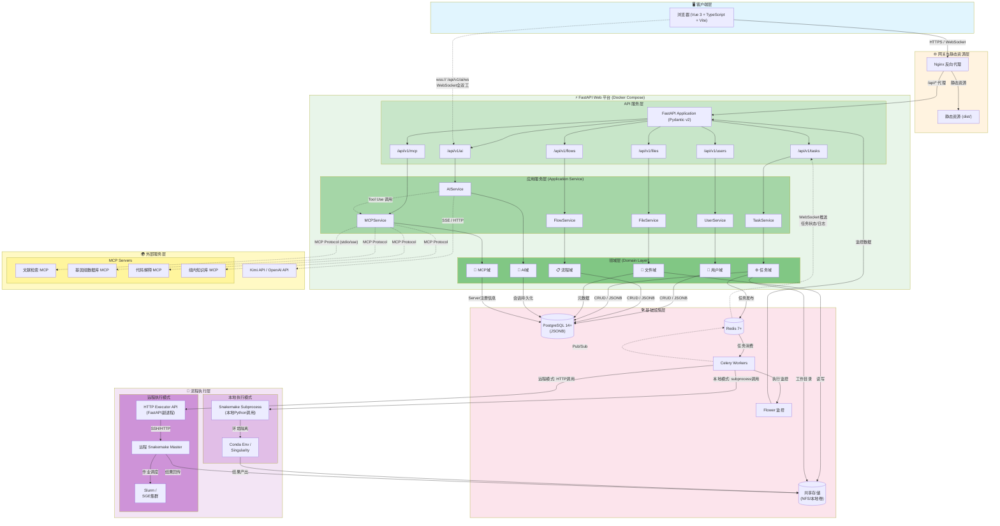
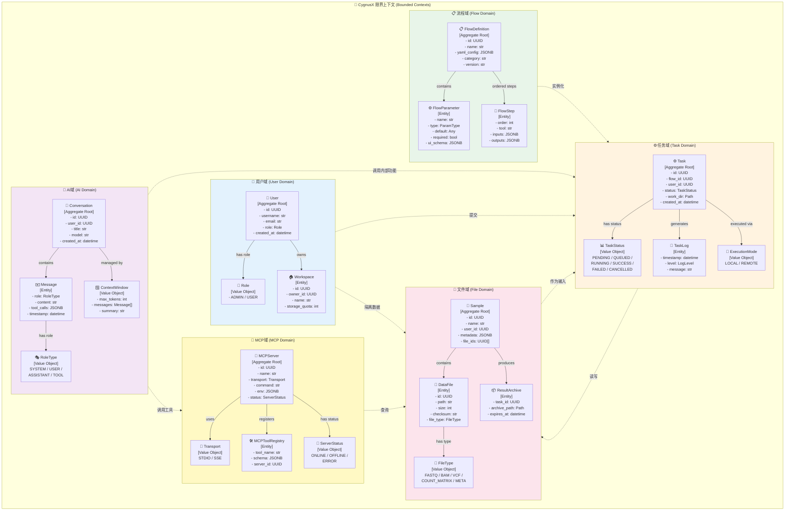
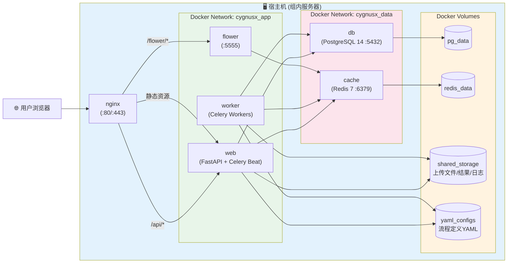

# CygnusX 系统架构总览与核心架构重点

> **文档版本**：v1.0  
> **项目**：CygnusX — 私有化多组学分析平台  
> **目标读者**：系统架构师、全栈开发工程师、生信维护人员  
> **技术约束**：Vue 3 + FastAPI + PostgreSQL 14+ + Redis 7+ + Celery + Snakemake + Docker Compose + MCP SDK

---

## 1. 系统全景架构图

以下架构图展示了 CygnusX 的完整数据流，覆盖从用户浏览器请求到后端各子系统、数据持久化、异步任务队列、AI对话通道、MCP服务连接及Snakemake流程执行的全链路。



### 1.1 数据流说明

| 数据流 | 路径 | 协议 | 说明 |
|--------|------|------|------|
| **用户请求流** | Browser → Nginx → FastAPI → Service → Domain → PostgreSQL | HTTP/HTTPS | 标准CRUD请求链路 |
| **异步任务流** | FastAPI → Redis → Celery → Snakemake → FileStorage | Redis Pub/Sub | 耗时分析任务异步执行 |
| **WebSocket AI流** | Browser ↔ FastAPI WebSocket ↔ AIService ↔ KimiAPI | WSS/SSE | 全双工AI对话，支持上下文记忆 |
| **MCP工具流** | AIService → MCPService → MCP Servers | MCP Protocol | Tool Use协议调用外部MCP服务 |
| **任务监控流** | Celery → Redis → WebSocket → Browser | Pub/Sub + WSS | 实时推送任务状态与日志 |
| **本地执行流** | Celery → LocalSnakemake(subprocess) → FileStorage | Local subprocess | 组内服务器本地执行 |
| **远程执行流** | Celery → HTTPExecutor → RemoteSnakemake → Slurm | HTTP/SSH | 远程集群执行，结果回传 |

---

## 2. DDD 模块划分

CygnusX 采用领域驱动设计（DDD）的模块化架构，将业务领域划分为六个核心域，每个域内含独立的聚合根、实体、值对象和领域服务。



### 2.1 各域职责与聚合根说明

| 域 | 聚合根 | 核心职责 | 关键实体 |
|----|--------|----------|----------|
| **用户域** | `User` | 账户注册/登录、角色权限、工作空间隔离 | User, Workspace, Role |
| **流程域** | `FlowDefinition` | YAML配置解析、流程定义管理、参数模式生成 | FlowParameter, FlowStep |
| **任务域** | `Task` | 任务生命周期管理、调度策略、执行监控、日志聚合 | TaskLog, ExecutionMode |
| **文件域** | `Sample` | 样本元数据管理、批量上传、结果归档与过期策略 | DataFile, ResultArchive |
| **AI域** | `Conversation` | 对话会话管理、上下文窗口、消息历史、Tool Use编排 | Message, ContextWindow |
| **MCP域** | `MCPServer` | MCP Server注册、工具发现、连接管理、错误隔离 | MCPToolRegistry, Transport |

---

## 3. 分层架构说明

CygnusX 严格遵循分层架构模式，自上而下划分为四层，每层具有明确的职责边界和依赖方向（上层依赖下层，禁止跨层调用）。

```mermaid
flowchart TB
    subgraph Presentation["🎨 表示层 (Presentation Layer)"]
        Vue3["Vue 3 + TypeScript"]
        Vite["Vite (构建工具)"]
        NaiveUI["Naive UI (组件库)"]
        Pinia["Pinia (状态管理)"]
        ECharts["ECharts / Plotly\n(图表可视化)"]
        AIChat["AIChat组件\n(常驻对话窗口)"]
        DynamicForm["DynamicForm组件\n(YAML驱动表单)"]
        Vue3 --> NaiveUI
        Vue3 --> Pinia
        Vue3 --> ECharts
        Vue3 --> AIChat
        Vue3 --> DynamicForm
    end

    subgraph Application["⚙️ 应用层 (Application Layer)"]
        subgraph RouterLayer["FastAPI Router 层"]
            RUser["UserRouter\n(/api/v1/users)"]
            RFlow["FlowRouter\n(/api/v1/flows)"]
            RTask["TaskRouter\n(/api/v1/tasks)"]
            RFile["FileRouter\n(/api/v1/files)"]
            RAI["AIRouter\n(/api/v1/ai)"]
            RMCP["MCPRouter\n(/api/v1/mcp)"]
        end

        subgraph ServiceLayer["Application Service 层"]
            SUser["UserAppService"]
            SFlow["FlowAppService"]
            STask["TaskAppService"]
            SFile["FileAppService"]
            SAI["AIAppService"]
            SMCP["MCPAppService"]
        end

        subgraph DTO["DTO / Schema (Pydantic v2)"]
            DUser["UserDTO / UserCreate / UserResponse"]
            DFlow["FlowDTO / FlowConfigDTO"]
            DTask["TaskDTO / TaskSubmitDTO / TaskStatusDTO"]
            DFile["FileDTO / SampleDTO / UploadDTO"]
            DAI["ChatDTO / MessageDTO / ContextDTO"]
            DMCP["MCPDTO / ToolCallDTO"]
        end

        RUser --> SUser
        RFlow --> SFlow
        RTask --> STask
        RFile --> SFile
        RAI --> SAI
        RMCP --> SMCP

        SUser --> DUser
        SFlow --> DFlow
        STask --> DTask
        SFile --> DFile
        SAI --> DAI
        SMCP --> DMCP
    end

    subgraph DomainLayer["🧠 领域层 (Domain Layer)"]
        subgraph Entities["实体 (Entity)"]
            EUser["User (聚合根)"]
            EFlow["FlowDefinition (聚合根)"]
            ETask["Task (聚合根)"]
            ESample["Sample (聚合根)"]
            EConv["Conversation (聚合根)"]
            EMCPS["MCPServer (聚合根)"]
        end

        subgraph ValueObjects["值对象 (Value Object)"]
            VRole["Role"]
            VStatus["TaskStatus"]
            VFileType["FileType"]
            VExecMode["ExecutionMode"]
            VCtxWindow["ContextWindow"]
            VTransport["Transport"]
        end

        subgraph DomainServices["领域服务 (Domain Service)"]
            DSAuth["AuthDomainService\n(JWT签发/验证)"]
            DSFlow["FlowDomainService\n(YAML解析/校验)"]
            DSTask["TaskDomainService\n(状态机/调度)"]
            DSAI["AIDomainService\n(上下文压缩/Token管理)"]
            DSMCP["MCPDomainService\n(工具路由/错误隔离)"]
        end

        subgraph Repositories["仓储接口 (Repository Interface)"]
            REUser["IUserRepository"]
            REFlow["IFlowRepository"]
            RETask["ITaskRepository"]
            RESample["ISampleRepository"]
            REConv["IConversationRepository"]
            REMCP["IMCPServerRepository"]
        end
    end

    subgraph Infrastructure["🛠️ 基础设施层 (Infrastructure Layer)"]
        subgraph RepositoriesImpl["仓储实现 (Repository Impl)"]
            RIUser["UserRepositoryImpl\n(SQLAlchemy)"]
            RIFlow["FlowRepositoryImpl"]
            RITask["TaskRepositoryImpl"]
            RISample["SampleRepositoryImpl"]
            RIConv["ConversationRepositoryImpl"]
            RIMCP["MCPServerRepositoryImpl"]
        end

        subgraph ExternalAdapters["外部适配器"]
            DBAdapter[("PostgreSQL Adapter\n(SQLAlchemy + asyncpg)")]
            CacheAdapter[("Redis Adapter\n(redis-py-async)")]
            CeleryAdapter["Celery Adapter\n(任务发布/监控)"]
            FileStorageAdapter[("文件存储适配器\n(aiofiles)")]
            AIAdapter["AI Provider Adapter\n(Kimi/OpenAI)")
            MCPClientAdapter["MCP Client Adapter\n(Python MCP SDK)")]
            SnakemakeAdapter["Snakemake Executor Adapter\n(subprocess / HTTP)"]
        end

        subgraph Security["安全与中间件"]
            JWT["JWT Middleware\n(py-jwt)"]
            RBAC["RBAC Middleware"]
            CORS["CORS Middleware"]
            RateLimit["Rate Limit\n(Redis-based)"]
        end

        RepositoriesImpl --> ExternalAdapters
    end

    %% === 依赖方向 ===
    Presentation -->|"HTTP / WebSocket"| Application
    Application -->|"调用"| DomainLayer
    DomainLayer -.->|"依赖抽象"| Infrastructure
    Infrastructure -->|"实现接口"| DomainLayer

    style Presentation fill:#e1f5fe
    style Application fill:#e8f5e9
    style DomainLayer fill:#fff3e0
    style Infrastructure fill:#fce4ec
```

### 3.1 各层职责详解

#### 🎨 表示层（Presentation Layer）

| 组件 | 技术选型 | 职责 |
|------|----------|------|
| UI框架 | Vue 3 + TypeScript | 声明式组件化UI开发 |
| 构建工具 | Vite | 快速HMR与生产构建 |
| 组件库 | Naive UI | 一致的UI设计与交互 |
| 状态管理 | Pinia | 跨组件状态共享与持久化 |
| 可视化 | ECharts / Plotly | 交互式科学图表渲染 |
| AI对话 | AIChat组件 | 常驻浮动对话窗口，支持Markdown渲染 |
| 动态表单 | DynamicForm组件 | 基于JSON Schema的YAML驱动表单自动渲染 |

表示层**不包含任何业务逻辑**，仅负责：
- 用户界面渲染与交互响应
- API请求的发起与响应处理
- WebSocket连接的建立与消息处理
- 表单校验（前端级，仅UX优化）
- 图表数据的可视化呈现

#### ⚙️ 应用层（Application Layer）

应用层是系统的"编排器"，负责协调领域对象完成用例：

| 职责 | 说明 |
|------|------|
| **请求路由** | FastAPI Router 接收HTTP/WebSocket请求，进行路径分发 |
| **参数校验** | Pydantic v2 DTO 进行请求/响应数据建模与校验 |
| **用例编排** | Application Service 调用领域对象完成业务用例 |
| **事务管理** | 通过 Unit of Work 模式管理数据库事务边界 |
| **权限检查** | 在Service层进行RBAC权限校验（装饰器模式） |
| **DTO转换** | 领域对象与DTO之间的映射转换 |

**关键原则**：应用层不包含业务规则，业务规则位于领域层。应用层只负责"怎么做"（编排），不负责"是什么"（业务定义）。

#### 🧠 领域层（Domain Layer）

领域层是系统的核心，包含所有业务规则和业务逻辑：

| 概念 | 说明 | 示例 |
|------|------|------|
| **聚合根 (Aggregate Root)** | 事务一致性边界内的入口实体 | `Task` 聚合根管理 TaskLog、ExecutionMode |
| **实体 (Entity)** | 有唯一标识且状态可变的对象 | `Message`、`FlowStep`、`DataFile` |
| **值对象 (Value Object)** | 无唯一标识，不可变，通过属性判等 | `TaskStatus`、`Role`、`ContextWindow` |
| **领域服务 (Domain Service)** | 跨实体的业务逻辑封装 | `TaskDomainService` 负责任务状态机转换 |
| **仓储接口 (Repository Interface)** | 领域对象持久化的抽象，定义在领域层 | `ITaskRepository` 接口 |

领域层的**关键原则**：
- 领域层不依赖任何其他层（依赖倒置原则）
- 领域层不依赖基础设施的具体实现
- 通过仓储接口抽象持久化操作
- 业务规则集中在领域服务中，确保单一事实来源

#### 🛠️ 基础设施层（Infrastructure Layer）

基础设施层提供领域层所需的技术能力实现：

| 组件 | 技术实现 | 职责 |
|------|----------|------|
| 数据库 | SQLAlchemy 2.0 + asyncpg | PostgreSQL异步ORM操作 |
| 缓存 | redis-py (async) | Redis连接与会话缓存 |
| 任务队列 | Celery + Redis Broker | 异步任务发布与结果存储 |
| 文件存储 | aiofiles | 异步文件读写操作 |
| AI适配器 | 自定义Adapter | 统一封装Kimi/OpenAI API调用 |
| MCP客户端 | Python MCP SDK | MCP协议实现，Server连接管理 |
| Snakemake执行器 | subprocess / httpx | 本地子进程或远程HTTP调用 |
| 安全中间件 | py-jwt / FastAPI中间件 | JWT签发验证、RBAC、限流 |

---

## 4. 核心架构重点总结

### 4.1 YAML配置中心与动态表单架构要点

CygnusX 的核心设计理念之一是**"配置即代码"**——所有生信分析流程通过外置YAML文件进行声明式定义，无需修改前端代码即可新增或调整分析流程。这一架构的要点包括：

**YAML配置结构规范**：每个流程由一个独立的YAML文件定义，包含四大核心区块：`metadata`（流程元信息，如名称、描述、类别、版本）、`parameters`（参数定义，每个参数声明名称、类型、默认值、是否必填、UI控件类型如select/slider/file等）、`steps`（分析步骤的Snakemake规则引用与输入输出映射）以及`ui_schema`（前端表单布局描述，支持分组、条件显示、级联依赖）。

**动态表单渲染引擎**：前端 `DynamicForm` 组件通过 `/api/v1/flows/{id}/schema` 接口获取流程的JSON Schema描述，利用Naive UI的表单组件库实现动态渲染。当用户选择不同流程时，前端自动拉取对应YAML解析后的参数定义，生成完整的表单界面。参数类型系统覆盖生信场景常见类型：文本输入、数值输入、下拉选择、文件上传（支持批量）、样本选择器（关联样本库）、布尔开关。

**后端YAML解析与缓存**：后端 `FlowDomainService` 在启动时扫描配置的YAML目录，解析所有流程定义并写入PostgreSQL（JSONB字段存储灵活参数结构），同时将解析后的JSON Schema缓存到Redis。当YAML文件变更时，提供管理接口触发热重载，无需重启服务。解析过程包含严格校验：参数类型校验、步骤依赖图校验（确保DAG无环）、Snakemake规则存在性校验。

**版本管理与兼容性**：每个流程定义支持版本号管理，历史版本保留在数据库中。任务提交时锁定当前流程版本，确保已提交任务使用稳定的参数定义，不受后续流程更新的影响。管理员可通过Web界面在线编辑YAML并预览表单效果，降低维护门槛——这对于仅1名生信维护人员的团队至关重要。

---

### 4.2 AI对话窗口与业务系统融合架构要点

AI对话助手是 CygnusX 的**常驻功能模块**，以浮动窗口形式嵌入所有页面，实现AI能力与平台业务功能的无缝融合：

**WebSocket全双工通信**：AI对话采用WebSocket协议（`/api/v1/ai/ws`）实现真正的全双工通信，相比SSE具有更低的延迟和更好的实时性。对话消息通过WebSocket双向传输：用户发送消息 → 后端组装上下文 → 调用AI API → 流式响应通过WebSocket实时推送至前端。连接管理采用心跳保活机制，断线后支持自动重连与消息补发。

**上下文记忆与窗口管理**：`Conversation` 聚合根管理完整的对话历史，每个会话独立存储于PostgreSQL。`ContextWindow` 值对象负责管理发送到LLM的上下文窗口——包括消息截断策略（保留最近N轮）、Token预估与限制、长对话自动摘要压缩。系统支持多会话并行，用户可在历史会话间切换。AI域服务内置平台知识注入：每次请求自动附加当前页面的上下文信息（如正在查看的任务ID、样本列表），使AI能够理解用户当前操作场景。

**Tool Use协议与平台功能调用**：AI助手不仅限于问答，更可以通过Tool Use协议**调用平台内部功能**。后端 `AIDomainService` 维护一组平台工具定义（如`submit_task`、`query_task_status`、`list_samples`、`search_knowledge_base`），这些工具以JSON Schema形式注册到LLM的function calling接口。当用户说"帮我提交一个RNA-seq分析任务，样本用昨天上传的"时，LLM识别意图并调用对应的平台工具，实现自然语言驱动操作。工具调用结果经校验后返回LLM，由LLM生成自然语言反馈给用户，形成完整的"理解-行动-反馈"闭环。

**前端组件设计**：`AIChat` 组件基于Naive UI的Drawer/Modal组件封装，支持全局快捷键呼出（如 `Ctrl+K`）、拖拽调整大小、Markdown消息渲染（含代码高亮）、流式打字机效果、工具调用过程可视化（折叠展开）。组件状态通过Pinia全局管理，确保切换页面时对话状态不丢失。

---

### 4.3 MCP集成架构要点

MCP（Model Context Protocol）集成使CygnusX的AI助手能够安全、标准化地连接多个外部智能服务，极大扩展了平台的数据访问和计算能力：

**MCP Client架构**：后端 `MCPAppService` 基于Python MCP SDK实现MCP Client，负责与多个MCP Server的Lifecycle管理（启动、连接、心跳检测、异常重启）、工具发现（动态拉取各Server的工具列表与Schema）、调用路由（根据工具名路由到对应Server）以及错误隔离（单个Server故障不影响其他Server和主系统）。MCP Client支持两种传输模式：stdio（本地子进程模式，适用于部署在同一服务器的MCP服务）和SSE（Server-Sent Events模式，适用于远程MCP服务）。

**MCP Server注册管理**：通过 `/api/v1/mcp/servers` 管理接口，管理员可以动态注册、配置、启用/禁用MCP Server。每个Server的配置包括：名称、传输类型、启动命令/URL、环境变量、超时设置。注册信息持久化到PostgreSQL，系统启动时自动初始化所有标记为启用的Server连接。`MCPServer` 聚合根管理Server的全生命周期状态：`ONLINE`（正常）、`OFFLINE`（未启动）、`ERROR`（故障）。

**四大预设MCP服务**：

| MCP服务 | 职责 | 数据源 |
|---------|------|--------|
| **文献检索MCP** | PubMed/arXiv文献语义检索、摘要生成 | NCBI E-utilities / Europe PMC |
| **基因组数据库MCP** | 基因注释查询、通路分析、GO/KEGG富集 | Ensembl / KEGG / NCBI |
| **代码解释MCP** | 生信代码生成与解释（R/Python） | 内置代码执行环境 |
| **组内知识库MCP** | 组内实验方案、SOP、历史项目经验检索 | 私有化向量数据库 |

**错误隔离与降级策略**：每个MCP Server运行在独立的进程中，通过 `MCPDomainService` 的错误隔离机制确保：单个MCP Server崩溃不会导致AI对话功能整体不可用；MCP调用超时时自动降级（返回预设的错误提示而非阻塞）；AI助手在工具不可用时自动切换为纯文本问答模式。所有MCP调用记录审计日志，便于排查问题。

---

### 4.4 工作流执行引擎（WMS）混合模式要点

CygnusX的工作流执行引擎支持**本地/远程混合模式**，灵活适配不同计算场景——从单台服务器的小规模分析到高性能计算集群的大规模任务：

**统一任务模型**：`Task` 聚合根抽象了统一的任务模型，与执行位置解耦。每个Task记录：关联的流程定义ID、参数快照（JSONB，锁定提交时的参数值）、执行模式（`LOCAL` 或 `REMOTE`）、工作目录路径、目标状态机。任务状态采用严格的状态机设计：`PENDING` → `QUEUED` → `RUNNING` → (`SUCCESS` | `FAILED` | `CANCELLED`)，状态转换由 `TaskDomainService` 统一管理，确保一致性。

**Celery异步队列**：所有分析任务通过Celery异步执行，避免阻塞Web请求。任务提交后进入Redis队列，由Celery Worker消费执行。系统设计两种队列：`analysis.local`（本地执行队列）和 `analysis.remote`（远程执行队列），根据流程配置和用户选择自动路由。Flower提供Web界面实时监控队列深度、Worker状态、任务执行历史。Celery Beat用于定时任务：清理过期结果归档、扫描YAML配置变更、生成系统用量报告。

**本地执行模式（Local Mode）**：适用于组内服务器直接运行。Celery Worker通过 `subprocess` 模块调用Snakemake CLI命令，直接在Worker所在服务器执行分析流程。本地模式配置简单，无需额外基础设施，适合快速验证和小规模分析。Snakemake运行在独立的Conda环境中，通过 `--use-conda` 或 `--use-singularity` 实现环境隔离。执行日志通过Redis Pub/Sub实时推送到前端WebSocket。

**远程执行模式（Remote Mode）**：适用于高性能计算集群（Slurm/SGE）。Celery Worker通过HTTP调用远程的Snakemake Executor服务（一个轻量级的FastAPI副进程），该服务部署在集群头节点上，负责将Snakemake作业翻译为集群调度命令（`sbatch`/`qsub`）并监控执行状态。远程模式的优势在于：充分利用集群的并行计算能力；CygnusX主服务与计算集群解耦；支持大规模样本的并行处理。执行完成后，结果文件通过rsync/HTTP回传到CygnusX的共享存储中。

**实时监控与日志流**：无论本地或远程模式，任务执行过程中的状态变更和日志输出均通过 **Redis Pub/Sub → WebSocket → 前端** 的链路实时推送。用户在任务详情页可以：查看实时更新的执行日志（WebSocket流式推送）、监控Snakemake的DAG可视化进度、下载中间结果和最终报告、在任务失败时获取错误诊断与AI辅助排查建议。

---

### 4.5 安全与数据隔离要点

安全设计贯穿CygnusX的所有层次，特别针对**私有化部署**和**课题组数据敏感性**的需求：

**身份认证与授权**：系统采用JWT（JSON Web Token）认证机制。用户注册/登录后获得Access Token（短有效期，默认30分钟）和Refresh Token（长有效期，默认7天），通过HttpOnly Cookie存储增强安全性。角色系统分为 `ADMIN`（管理员，可管理用户、配置流程、管理系统设置）和 `USER`（普通用户，仅能操作自己的数据和任务）。RBAC中间件在应用层进行细粒度权限控制，每个API端点通过装饰器声明所需角色。工作空间（Workspace）机制实现数据硬隔离——每个用户的数据（样本、任务、结果）完全隔离，数据库查询自动附加 `user_id` / `workspace_id` 过滤条件。

**数据安全与隐私**：所有数据库连接使用SSL/TLS加密。敏感配置（数据库密码、API Key、JWT Secret）通过Docker Secrets或环境变量注入，绝不硬编码在代码中。PostgreSQL中用户密码使用 `bcrypt` 算法哈希存储。文件上传支持完整性校验（MD5/SHA256），防止传输损坏。结果归档支持设置过期时间，自动清理策略防止存储无限膨胀。AI对话内容中的敏感信息（如样本名称可能涉及品种名）在传输至外部AI API前进行脱敏处理。

**网络安全**：Nginx作为反向代理提供：SSL/TLS终端加密、静态资源缓存、请求速率限制（防止暴力破解）、请求体大小限制（防止超大文件攻击）。FastAPI内置的CORS中间件限制允许的源域名。WebSocket连接同样经过Nginx反向代理，支持WSS加密。API端点全局启用Rate Limiting（基于Redis的滑动窗口算法），防止API滥用。

**Docker Compose安全**：所有服务运行在非root用户容器中。PostgreSQL和Redis数据卷通过Docker Volume挂载，设置适当的文件权限。容器间网络通过Docker Compose的自定义网络隔离，仅暴露必要的端口到宿主机。Celery Worker容器与Web应用容器分离，限制Worker容器的网络访问（仅允许访问Redis和共享存储）。定期更新基础镜像和依赖包，修复已知安全漏洞。

**审计与可观测性**：系统记录完整的操作审计日志（用户登录、任务提交、文件下载、配置变更），存储于PostgreSQL审计表中，保留180天。管理员可通过管理面板查看系统用量统计、活跃用户、任务成功率等指标。所有API请求记录访问日志（IP、用户ID、端点、响应时间），便于安全事件追溯。

---

## 5. 部署拓扑（Docker Compose）



### 5.1 Docker Compose 服务定义概览

| 服务名 | 镜像/构建 | 端口 | 职责 |
|--------|-----------|------|------|
| `nginx` | `nginx:alpine` | 80, 443 | 反向代理、SSL终端、静态资源 |
| `web` | 构建 `Dockerfile` | 8000 | FastAPI主应用 + Celery Beat定时器 |
| `worker` | 构建 `Dockerfile` | — | Celery Worker进程（可水平扩展） |
| `flower` | `mher/flower` | 5555 | Celery监控Web界面 |
| `db` | `postgres:14-alpine` | 5432 | PostgreSQL主数据库 |
| `cache` | `redis:7-alpine` | 6379 | Redis缓存 + 消息代理 |

---

## 6. 技术选型汇总

| 层次 | 组件 | 技术选型 | 版本约束 |
|------|------|----------|----------|
| 前端框架 | Vue 3 + TypeScript | `vue@^3.4` + `typescript@^5.3` | LTS |
| 构建工具 | Vite | `vite@^5.0` | LTS |
| UI组件库 | Naive UI | `naive-ui@^2.35` | LTS |
| 状态管理 | Pinia | `pinia@^2.1` | LTS |
| 后端框架 | FastAPI | `fastapi@^0.110` | LTS |
| 数据校验 | Pydantic v2 | `pydantic@^2.5` | v2必需 |
| ORM | SQLAlchemy 2.0 | `sqlalchemy@^2.0` | 2.0+支持async |
| 数据库 | PostgreSQL | `postgres:14-alpine` | 14+ |
| 缓存 | Redis | `redis:7-alpine` | 7+ |
| 任务队列 | Celery + Flower | `celery@^5.3` | LTS |
| 流程引擎 | Snakemake | `snakemake@^8.0` | 8.0+ |
| AI对话 | Kimi API / OpenAI API | HTTP SSE/Stream | 预留接口 |
| MCP协议 | Python MCP SDK | `mcp@latest` | 跟随官方 |
| 容器化 | Docker Compose | `docker compose v2` | v2+ |
| 反向代理 | Nginx | `nginx:alpine` | stable |
| 图表库 | ECharts / Plotly.js | `echarts@^5.4` | LTS |

---

> **文档结束**  
> 本文档为CygnusX系统架构的顶层设计蓝图，后续模块文档将基于本架构展开各子系统的详细设计。
