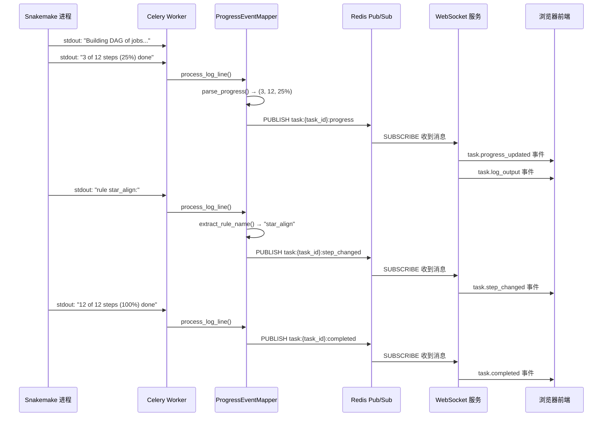

# 6.3 OmicsHub 完整 API 接口设计（REST + WebSocket）

> **文档版本**: v1.0  
> **项目**: OmicsHub — 私有化多组学分析平台  
> **目标读者**: 全栈开发工程师、前端开发工程师  
> **技术约束**: FastAPI + Pydantic v2 + Python 3.10+ + WebSocket  

---

## 目录

- [1. 全局设计约定](#1-全局设计约定)
- [2. 枚举类型定义](#2-枚举类型定义)
- [3. REST API 路由设计](#3-rest-api-路由设计)
- [4. Pydantic v2 DTO 模型定义](#4-pydantic-v2-dto-模型定义)
- [5. WebSocket 事件协议设计](#5-websocket-事件协议设计)
- [6. Snakemake 进度解析说明](#6-snakemake-进度解析说明)

---

## 1. 全局设计约定

### 1.1 统一响应包装器 `ResponseModel[T]`

所有 REST API 响应统一包装为以下结构，确保前端处理逻辑的一致性：

```python
from typing import TypeVar, Generic, Optional
from datetime import datetime, timezone
from pydantic import BaseModel, Field, ConfigDict

T = TypeVar("T")


class ResponseModel(BaseModel, Generic[T]):
    """统一响应包装器，所有 API 响应均以此结构返回"""
    model_config = ConfigDict(
        json_schema_extra={
            "example": {
                "code": 200,
                "message": "success",
                "data": None,
                "timestamp": "2025-01-01T12:00:00Z"
            }
        }
    )

    code: int = Field(default=200, description="业务状态码：200成功，4xx客户端错误，5xx服务端错误")
    message: str = Field(default="success", description="人类可读的状态说明")
    data: Optional[T] = Field(default=None, description="业务数据载荷")
    timestamp: str = Field(
        default_factory=lambda: datetime.now(timezone.utc).strftime("%Y-%m-%dT%H:%M:%SZ"),
        description="UTC 时间戳（ISO 8601 格式）"
    )


# ============ 快捷构造函数 ============

def success(data: T, message: str = "success") -> ResponseModel[T]:
    """构造成功响应"""
    return ResponseModel(code=200, message=message, data=data)


def created(data: T, message: str = "created") -> ResponseModel[T]:
    """构造创建成功响应（HTTP 201）"""
    return ResponseModel(code=201, message=message, data=data)


def error(message: str, code: int = 400) -> ResponseModel[None]:
    """构造错误响应"""
    return ResponseModel(code=code, message=message, data=None)


def paginated(
    items: list[T],
    total: int,
    page: int,
    page_size: int,
    message: str = "success"
) -> ResponseModel["PageModel[T]"]:
    """构造分页响应"""
    pages = (total + page_size - 1) // page_size
    page_model = PageModel(
        items=items,
        total=total,
        page=page,
        page_size=page_size,
        pages=pages
    )
    return ResponseModel(code=200, message=message, data=page_model)
```

**响应示例**：

```json
// 成功响应（单对象）
{
  "code": 200,
  "message": "success",
  "data": {
    "id": "550e8400-e29b-41d4-a716-446655440000",
    "username": "zhangsan",
    "role": "user"
  },
  "timestamp": "2025-01-01T12:00:00Z"
}

// 成功响应（列表）
{
  "code": 200,
  "message": "success",
  "data": [
    {"id": "xxx", "name": "RNA-Seq分析"},
    {"id": "yyy", "name": "差异表达分析"}
  ],
  "timestamp": "2025-01-01T12:00:00Z"
}

// 错误响应
{
  "code": 422,
  "message": "参数校验失败：field 'email' is not a valid email address",
  "data": null,
  "timestamp": "2025-01-01T12:00:00Z"
}
```

---

### 1.2 统一分页模型 `PageModel[T]`

```python
from typing import TypeVar, Generic, List
from pydantic import BaseModel, Field, ConfigDict

T = TypeVar("T")


class PageModel(BaseModel, Generic[T]):
    """统一分页模型，所有列表查询接口的 data 字段使用此结构"""
    model_config = ConfigDict(
        json_schema_extra={
            "example": {
                "items": [],
                "total": 100,
                "page": 1,
                "page_size": 20,
                "pages": 5
            }
        }
    )

    items: List[T] = Field(default_factory=list, description="当前页数据列表")
    total: int = Field(ge=0, description="总记录数")
    page: int = Field(ge=1, description="当前页码（从1开始）")
    page_size: int = Field(ge=1, le=200, description="每页条数（上限200）")
    pages: int = Field(ge=0, description="总页数")
```

**分页请求约定**：

所有支持分页的列表接口，通过 **Query 参数** 接收分页信息：

| 参数 | 类型 | 必填 | 默认值 | 说明 |
|------|------|------|--------|------|
| `page` | int | 否 | 1 | 页码，从1开始 |
| `page_size` | int | 否 | 20 | 每页条数，最大200 |
| `sort_by` | str | 否 | `created_at` | 排序字段 |
| `sort_order` | str | 否 | `desc` | 排序方向：`asc` / `desc` |

---

### 1.3 全局异常处理

```python
from fastapi import Request, HTTPException
from fastapi.responses import JSONResponse
from fastapi.exceptions import RequestValidationError
from starlette.exceptions import HTTPException as StarletteHTTPException
import logging

logger = logging.getLogger(__name__)


class OmicsHubException(Exception):
    """业务异常基类"""
    def __init__(self, message: str, code: int = 400, details: dict | None = None):
        self.message = message
        self.code = code
        self.details = details or {}
        super().__init__(message)


class NotFoundException(OmicsHubException):
    """资源不存在异常"""
    def __init__(self, resource: str, identifier: str):
        super().__init__(
            message=f"{resource} not found: {identifier}",
            code=404
        )


class PermissionDeniedException(OmicsHubException):
    """权限不足异常"""
    def __init__(self, message: str = "Permission denied"):
        super().__init__(message=message, code=403)


class ConflictException(OmicsHubException):
    """资源冲突异常（如重复注册）"""
    def __init__(self, message: str):
        super().__init__(message=message, code=409)


# ============ FastAPI 全局异常处理器 ============

async def omicshub_exception_handler(request: Request, exc: OmicsHubException) -> JSONResponse:
    """捕获所有 OmicsHubException 及其子类"""
    logger.warning(f"Business exception [{exc.code}]: {exc.message} | path={request.url.path}")
    return JSONResponse(
        status_code=200,  # HTTP 状态码始终 200，业务状态码在 body 中
        content=ResponseModel(
            code=exc.code,
            message=exc.message,
            data=exc.details if exc.details else None
        ).model_dump(mode="json")
    )


async def http_exception_handler(request: Request, exc: StarletteHTTPException) -> JSONResponse:
    """捕获 FastAPI HTTPException（如 401 未认证）"""
    return JSONResponse(
        status_code=200,
        content=ResponseModel(
            code=exc.status_code,
            message=exc.detail,
            data=None
        ).model_dump(mode="json")
    )


async def validation_exception_handler(request: Request, exc: RequestValidationError) -> JSONResponse:
    """捕获请求参数校验失败（Pydantic ValidationError）"""
    errors = []
    for err in exc.errors():
        errors.append({
            "field": ".".join(str(loc) for loc in err["loc"]),
            "message": err["msg"],
            "type": err["type"]
        })
    return JSONResponse(
        status_code=200,
        content=ResponseModel(
            code=422,
            message=f"参数校验失败: {errors[0]['message']}" if errors else "参数校验失败",
            data={"errors": errors} if len(errors) > 1 else None
        ).model_dump(mode="json")
    )


async def unhandled_exception_handler(request: Request, exc: Exception) -> JSONResponse:
    """捕获未处理的异常（兜底）"""
    logger.error(f"Unhandled exception: {exc}", exc_info=True)
    return JSONResponse(
        status_code=200,
        content=ResponseModel(
            code=500,
            message="Internal server error",
            data=None
        ).model_dump(mode="json")
    )


# ============ 在 FastAPI 应用实例上注册 ============
# app = FastAPI()
# app.add_exception_handler(OmicsHubException, omicshub_exception_handler)
# app.add_exception_handler(StarletteHTTPException, http_exception_handler)
# app.add_exception_handler(RequestValidationError, validation_exception_handler)
# app.add_exception_handler(Exception, unhandled_exception_handler)
```

---

### 1.4 JWT 认证依赖

```python
from fastapi import Depends, HTTPException, status
from fastapi.security import OAuth2PasswordBearer
from jose import JWTError, jwt
from pydantic import BaseModel, Field
from datetime import datetime, timezone
from typing import Optional

# JWT 配置（从环境变量读取）
JWT_SECRET_KEY: str = "your-secret-key-change-in-production"
JWT_ALGORITHM: str = "HS256"
ACCESS_TOKEN_EXPIRE_MINUTES: int = 30
REFRESH_TOKEN_EXPIRE_DAYS: int = 7

# OAuth2 密码模式 Bearer Token
oauth2_scheme = OAuth2PasswordBearer(
    tokenUrl="/api/v1/auth/login",
    scheme_name="JWT"
)


class TokenPayload(BaseModel):
    """JWT Token 载荷"""
    sub: str = Field(description="用户 UUID")
    username: str = Field(description="用户名")
    role: str = Field(description="用户角色")
    exp: Optional[int] = Field(default=None, description="过期时间（Unix timestamp）")
    iat: Optional[int] = Field(default=None, description="签发时间（Unix timestamp）")
    type: str = Field(default="access", description="token 类型: access / refresh")


class CurrentUser(BaseModel):
    """注入到路由处理函数中的当前用户对象"""
    model_config = ConfigDict(from_attributes=True)

    id: str = Field(description="用户 UUID")
    username: str = Field(description="用户名")
    email: str = Field(description="邮箱")
    role: str = Field(description="角色: admin / user")
    is_active: bool = Field(description="账户是否激活")


async def get_current_user(token: str = Depends(oauth2_scheme)) -> CurrentUser:
    """
    从 JWT Token 解析当前用户。
    注入方式: `current_user: CurrentUser = Depends(get_current_user)`
    """
    credentials_exception = HTTPException(
        status_code=status.HTTP_401_UNAUTHORIZED,
        detail="Could not validate credentials",
        headers={"WWW-Authenticate": "Bearer"},
    )
    try:
        payload = jwt.decode(token, JWT_SECRET_KEY, algorithms=[JWT_ALGORITHM])
        user_id: str = payload.get("sub")
        username: str = payload.get("username")
        role: str = payload.get("role")
        if user_id is None or username is None:
            raise credentials_exception

        # 检查 token 是否过期
        exp = payload.get("exp")
        if exp and datetime.fromtimestamp(exp, tz=timezone.utc) < datetime.now(timezone.utc):
            raise HTTPException(
                status_code=status.HTTP_401_UNAUTHORIZED,
                detail="Token has expired",
                headers={"WWW-Authenticate": "Bearer"},
            )

        # 检查 token 类型
        token_type = payload.get("type", "access")
        if token_type != "access":
            raise HTTPException(
                status_code=status.HTTP_401_UNAUTHORIZED,
                detail="Invalid token type: expected access token",
                headers={"WWW-Authenticate": "Bearer"},
            )

    except JWTError:
        raise credentials_exception

    # 从数据库获取用户（实际实现中使用异步 ORM 查询）
    # user = await user_repository.get_by_uuid(user_id)
    # if user is None or not user.is_active:
    #     raise credentials_exception
    # return CurrentUser.model_validate(user)

    # 示例返回
    return CurrentUser(
        id=user_id,
        username=username,
        email=f"{username}@example.com",
        role=role,
        is_active=True
    )


async def get_current_admin(current_user: CurrentUser = Depends(get_current_user)) -> CurrentUser:
    """
    仅管理员可访问的依赖。
    注入方式: `current_user: CurrentUser = Depends(get_current_admin)`
    """
    if current_user.role != "admin":
        raise HTTPException(
            status_code=status.HTTP_403_FORBIDDEN,
            detail="Admin privilege required",
        )
    return current_user


class TokenResponse(BaseModel):
    """Token 响应体"""
    access_token: str = Field(description="访问令牌（短期有效，默认30分钟）")
    refresh_token: str = Field(description="刷新令牌（长期有效，默认7天）")
    token_type: str = Field(default="bearer", description="令牌类型")
    expires_in: int = Field(description="访问令牌过期时间（秒）")
    user: "UserResponse" = Field(description="用户信息")
```

---

### 1.5 API 路由注册规范

```python
from fastapi import FastAPI, APIRouter

app = FastAPI(
    title="OmicsHub API",
    description="OmicsHub 多组学分析平台 RESTful API",
    version="1.0.0",
    docs_url="/api/docs",           # Swagger UI
    redoc_url="/api/redoc",         # ReDoc
    openapi_url="/api/openapi.json"
)

# ============ 版本前缀与路由注册 ============
# 各域路由在独立模块中定义，此处展示注册方式：
#
# from app.api.v1.auth import router as auth_router
# from app.api.v1.users import router as users_router
# from app.api.v1.projects import router as projects_router
# from app.api.v1.flows import router as flows_router
# from app.api.v1.tasks import router as tasks_router
# from app.api.v1.chat import router as chat_router
# from app.api.v1.mcp import router as mcp_router
# from app.api.v1.internal import router as internal_router
# from app.api.ws import ws_router
#
# app.include_router(auth_router,       prefix="/api/v1")
# app.include_router(users_router,      prefix="/api/v1")
# app.include_router(projects_router,   prefix="/api/v1")
# app.include_router(flows_router,      prefix="/api/v1")
# app.include_router(tasks_router,      prefix="/api/v1")
# app.include_router(chat_router,       prefix="/api/v1")
# app.include_router(mcp_router,        prefix="/api/v1")
# app.include_router(internal_router,   prefix="")
# app.include_router(ws_router,         prefix="")
```

---

## 2. 枚举类型定义

所有枚举类型统一放置在 `app/core/enums.py` 中，供 DTO 模型和领域层共用。

```python
from enum import Enum


class RoleEnum(str, Enum):
    """用户角色枚举"""
    ADMIN = "admin"
    USER = "user"


class TaskStatusEnum(str, Enum):
    """任务状态枚举（严格状态机）"""
    PENDING = "pending"       # 待提交（参数已保存，未进入队列）
    QUEUED = "queued"         # 已入队（等待Worker消费）
    RUNNING = "running"       # 执行中
    SUCCESS = "success"       # 成功完成
    FAILED = "failed"         # 执行失败
    CANCELLED = "cancelled"   # 用户取消

    @classmethod
    def terminal_states(cls) -> set[str]:
        """终止状态集合（不可再变更）"""
        return {cls.SUCCESS.value, cls.FAILED.value, cls.CANCELLED.value}

    @classmethod
    def running_states(cls) -> set[str]:
        """可取消的状态集合"""
        return {cls.PENDING.value, cls.QUEUED.value, cls.RUNNING.value}


class ExecutionModeEnum(str, Enum):
    """任务执行模式枚举"""
    LOCAL = "local"    # 本地Snakemake子进程执行
    REMOTE = "remote"  # 远程集群执行（Slurm/SGE）


class FlowCategoryEnum(str, Enum):
    """流程分类枚举"""
    TRANSCRIPTOMICS = "transcriptomics"    # 转录组学
    GENOMICS = "genomics"                  # 基因组学
    EPIGENETICS = "epigenetics"            # 表观遗传学
    METABOLOMICS = "metabolomics"          # 代谢组学
    PROTEOMICS = "proteomics"              # 蛋白质组学
    INTEGRATIVE = "integrative"            # 整合分析
    CUSTOM = "custom"                      # 自定义流程


class FileTypeEnum(str, Enum):
    """文件类型枚举"""
    FASTQ = "fastq"
    BAM = "bam"
    VCF = "vcf"
    COUNT_MATRIX = "count_matrix"
    META = "meta"
    GFF = "gff"
    BED = "bed"
    CSV = "csv"
    TSV = "tsv"
    PDF = "pdf"
    PNG = "png"
    JPG = "jpg"
    ZIP = "zip"
    OTHER = "other"


class MessageRoleEnum(str, Enum):
    """AI 对话消息角色枚举"""
    SYSTEM = "system"
    USER = "user"
    ASSISTANT = "assistant"
    TOOL = "tool"


class TransportEnum(str, Enum):
    """MCP Server 传输协议枚举"""
    STDIO = "stdio"
    SSE = "sse"


class ServerStatusEnum(str, Enum):
    """MCP Server 健康状态枚举"""
    ONLINE = "online"
    OFFLINE = "offline"
    ERROR = "error"


class LogLevelEnum(str, Enum):
    """日志级别枚举"""
    DEBUG = "DEBUG"
    INFO = "INFO"
    WARNING = "WARNING"
    ERROR = "ERROR"
    CRITICAL = "CRITICAL"
```

---

## 3. REST API 路由设计

以下按域分组列出完整路由表，每个路由包含：方法、路径、认证要求、核心功能描述、请求/响应类型。

### 3.1 认证域（/api/v1/auth）

| 方法 | 路径 | 认证 | 功能 | 请求体 | 响应体 |
|------|------|------|------|--------|--------|
| POST | `/auth/login` | 公开 | OAuth2 密码登录，返回 JWT Token | `OAuth2PasswordRequestForm` | `ResponseModel[TokenResponse]` |
| POST | `/auth/register` | 公开 | 用户注册（默认 role=user） | `UserRegisterRequest` | `ResponseModel[UserResponse]` |
| POST | `/auth/refresh` | 公开 | 使用 Refresh Token 换取新 Access Token | `RefreshTokenRequest` | `ResponseModel[TokenResponse]` |
| GET | `/auth/me` | JWT | 获取当前登录用户信息 | - | `ResponseModel[UserResponse]` |

```python
# app/api/v1/auth.py
from fastapi import APIRouter, Depends, status
from fastapi.security import OAuth2PasswordRequestForm

router = APIRouter(prefix="/auth", tags=["Authentication"])


@router.post(
    "/login",
    response_model=ResponseModel[TokenResponse],
    summary="用户登录",
    description="OAuth2 Password Bearer 方式登录，成功后返回 Access Token 和 Refresh Token"
)
async def login(
    form_data: OAuth2PasswordRequestForm = Depends()
):
    """
    **请求示例**:
    ```bash
    curl -X POST "https://omicshub.hzau.edu.cn/api/v1/auth/login" \\
      -H "Content-Type: application/x-www-form-urlencoded" \\
      -d "username=zhangsan&password=secret123"
    ```

    **响应示例**:
    ```json
    {
      "code": 200,
      "message": "Login successful",
      "data": {
        "access_token": "eyJhbGciOiJIUzI1NiIs...",
        "refresh_token": "eyJhbGciOiJIUzI1NiIs...",
        "token_type": "bearer",
        "expires_in": 1800,
        "user": {
          "id": "550e8400-e29b-41d4-a716-446655440000",
          "username": "zhangsan",
          "email": "zhangsan@hzau.edu.cn",
          "role": "user",
          "is_active": true,
          "created_at": "2025-01-01T12:00:00Z"
        }
      },
      "timestamp": "2025-01-01T12:00:00Z"
    }
    ```
    """
    ...


@router.post(
    "/register",
    response_model=ResponseModel[UserResponse],
    status_code=status.HTTP_201_CREATED,
    summary="用户注册"
)
async def register(req: UserRegisterRequest):
    ...


@router.post(
    "/refresh",
    response_model=ResponseModel[TokenResponse],
    summary="刷新 Token"
)
async def refresh(req: RefreshTokenRequest):
    ...


@router.get(
    "/me",
    response_model=ResponseModel[UserResponse],
    summary="获取当前用户信息"
)
async def get_me(current_user: CurrentUser = Depends(get_current_user)):
    ...
```

---

### 3.2 用户域（/api/v1/users）

| 方法 | 路径 | 认证 | 功能 | 请求体 | 响应体 |
|------|------|------|------|--------|--------|
| GET | `/users/` | Admin | 用户列表（分页+搜索） | Query: `page`, `page_size`, `q`, `role`, `is_active` | `ResponseModel[PageModel[UserResponse]]` |
| GET | `/users/{user_id}` | JWT | 用户详情 | - | `ResponseModel[UserResponse]` |
| PUT | `/users/{user_id}` | JWT | 更新用户信息 | `UserUpdateRequest` | `ResponseModel[UserResponse]` |
| DELETE | `/users/{user_id}` | Admin | 禁用用户（软删除） | - | `ResponseModel[None]` |

```python
# app/api/v1/users.py
from fastapi import APIRouter, Depends, Query
from typing import Optional

router = APIRouter(prefix="/users", tags=["Users"])


@router.get(
    "/",
    response_model=ResponseModel[PageModel[UserResponse]],
    summary="用户列表（管理员）",
    dependencies=[Depends(get_current_admin)]
)
async def list_users(
    page: int = Query(1, ge=1),
    page_size: int = Query(20, ge=1, le=200),
    q: Optional[str] = Query(None, description="搜索关键词（用户名/邮箱）"),
    role: Optional[RoleEnum] = Query(None),
    is_active: Optional[bool] = Query(None)
):
    ...


@router.get(
    "/{user_id}",
    response_model=ResponseModel[UserResponse],
    summary="用户详情"
)
async def get_user(
    user_id: str,
    current_user: CurrentUser = Depends(get_current_user)
):
    # 普通用户只能查看自己，管理员可查看所有
    ...


@router.put(
    "/{user_id}",
    response_model=ResponseModel[UserResponse],
    summary="更新用户信息"
)
async def update_user(
    user_id: str,
    req: UserUpdateRequest,
    current_user: CurrentUser = Depends(get_current_user)
):
    ...


@router.delete(
    "/{user_id}",
    response_model=ResponseModel[None],
    summary="禁用用户",
    dependencies=[Depends(get_current_admin)]
)
async def deactivate_user(user_id: str):
    ...
```

---

### 3.3 项目域（/api/v1/projects）

| 方法 | 路径 | 认证 | 功能 | 请求/Query | 响应体 |
|------|------|------|------|------------|--------|
| GET | `/projects/` | JWT | 当前用户的项目列表 | `page`, `page_size`, `q`, `workspace_id` | `ResponseModel[PageModel[ProjectResponse]]` |
| POST | `/projects/` | JWT | 创建项目 | `ProjectCreateRequest` | `ResponseModel[ProjectResponse]` |
| GET | `/projects/{project_id}` | JWT | 项目详情 | - | `ResponseModel[ProjectDetailResponse]` |
| PUT | `/projects/{project_id}` | JWT | 更新项目 | `ProjectUpdateRequest` | `ResponseModel[ProjectResponse]` |
| DELETE | `/projects/{project_id}` | JWT | 删除项目 | - | `ResponseModel[None]` |
| GET | `/projects/{project_id}/samples` | JWT | 项目下样本列表 | `page`, `page_size` | `ResponseModel[PageModel[SampleResponse]]` |
| POST | `/projects/{project_id}/upload` | JWT | 批量上传文件 | `multipart/form-data` | `ResponseModel[FileUploadResponse]` |

```python
# app/api/v1/projects.py
from fastapi import APIRouter, Depends, Query, UploadFile, File
from typing import Optional, List

router = APIRouter(prefix="/projects", tags=["Projects"])


@router.get("/", response_model=ResponseModel[PageModel[ProjectResponse]], summary="项目列表")
async def list_projects(
    page: int = Query(1, ge=1),
    page_size: int = Query(20, ge=1, le=200),
    q: Optional[str] = Query(None, description="项目名称搜索"),
    workspace_id: Optional[str] = Query(None),
    current_user: CurrentUser = Depends(get_current_user)
):
    ...


@router.post(
    "/",
    response_model=ResponseModel[ProjectResponse],
    status_code=201,
    summary="创建项目"
)
async def create_project(
    req: ProjectCreateRequest,
    current_user: CurrentUser = Depends(get_current_user)
):
    ...


@router.get("/{project_id}", response_model=ResponseModel[ProjectDetailResponse], summary="项目详情")
async def get_project(project_id: str, current_user: CurrentUser = Depends(get_current_user)):
    ...


@router.put("/{project_id}", response_model=ResponseModel[ProjectResponse], summary="更新项目")
async def update_project(
    project_id: str,
    req: ProjectUpdateRequest,
    current_user: CurrentUser = Depends(get_current_user)
):
    ...


@router.delete("/{project_id}", response_model=ResponseModel[None], summary="删除项目")
async def delete_project(project_id: str, current_user: CurrentUser = Depends(get_current_user)):
    ...


@router.get(
    "/{project_id}/samples",
    response_model=ResponseModel[PageModel[SampleResponse]],
    summary="项目下样本列表"
)
async def list_project_samples(
    project_id: str,
    page: int = Query(1, ge=1),
    page_size: int = Query(20, ge=1, le=200),
    current_user: CurrentUser = Depends(get_current_user)
):
    ...


@router.post(
    "/{project_id}/upload",
    response_model=ResponseModel[FileUploadResponse],
    summary="批量上传文件"
)
async def upload_files(
    project_id: str,
    files: List[UploadFile] = File(..., description="要上传的文件列表"),
    sample_name: Optional[str] = Query(None, description="关联的样本名称"),
    file_type: Optional[FileTypeEnum] = Query(None),
    current_user: CurrentUser = Depends(get_current_user)
):
    ...
```

---

### 3.4 流程域（/api/v1/flows）

| 方法 | 路径 | 认证 | 功能 | 请求/Query | 响应体 |
|------|------|------|------|------------|--------|
| GET | `/flows/` | JWT | 流程列表（分类筛选、搜索） | `category`, `q`, `page`, `page_size` | `ResponseModel[PageModel[FlowListItem]]` |
| GET | `/flows/{flow_id}` | JWT | 流程详情（含参数定义） | - | `ResponseModel[FlowDetailResponse]` |
| GET | `/flows/{flow_id}/schema` | JWT | 获取 JSON Schema（前端表单渲染） | - | `ResponseModel[dict]` |
| GET | `/flows/{flow_id}/validate` | JWT | 参数预校验 | `Query: parameters` (JSON字符串) | `ResponseModel[ValidationResult]` |
| POST | `/flows/` | Admin | 创建流程（上传YAML） | `FlowCreateRequest` | `ResponseModel[FlowDetailResponse]` |
| PUT | `/flows/{flow_id}` | Admin | 更新流程 | `FlowUpdateRequest` | `ResponseModel[FlowDetailResponse]` |
| DELETE | `/flows/{flow_id}` | Admin | 禁用流程 | - | `ResponseModel[None]` |

```python
# app/api/v1/flows.py
from fastapi import APIRouter, Depends, Query
from typing import Optional

router = APIRouter(prefix="/flows", tags=["Flows"])


@router.get("/", response_model=ResponseModel[PageModel[FlowListItem]], summary="流程列表")
async def list_flows(
    category: Optional[FlowCategoryEnum] = Query(None),
    q: Optional[str] = Query(None, description="流程名称搜索"),
    page: int = Query(1, ge=1),
    page_size: int = Query(20, ge=1, le=200),
    current_user: CurrentUser = Depends(get_current_user)
):
    ...


@router.get("/{flow_id}", response_model=ResponseModel[FlowDetailResponse], summary="流程详情")
async def get_flow(flow_id: str, current_user: CurrentUser = Depends(get_current_user)):
    ...


@router.get(
    "/{flow_id}/schema",
    response_model=ResponseModel[dict],
    summary="获取流程参数的 JSON Schema"
)
async def get_flow_schema(flow_id: str, current_user: CurrentUser = Depends(get_current_user)):
    """
    返回 JSON Schema 用于前端 DynamicForm 组件渲染表单。
    Schema 包含每个参数的类型、默认值、校验规则、UI控件类型。
    """
    ...


@router.get(
    "/{flow_id}/validate",
    response_model=ResponseModel[ValidationResult],
    summary="预校验用户参数"
)
async def validate_parameters(
    flow_id: str,
    parameters: str = Query(..., description="用户填写的参数字典（JSON字符串）"),
    current_user: CurrentUser = Depends(get_current_user)
):
    """
    在正式提交任务前，对用户填写的参数进行校验，
    返回详细的校验结果（哪些参数合法、哪些有问题）。
    """
    ...


@router.post(
    "/",
    response_model=ResponseModel[FlowDetailResponse],
    status_code=201,
    summary="创建流程（管理员）",
    dependencies=[Depends(get_current_admin)]
)
async def create_flow(req: FlowCreateRequest):
    ...


@router.put(
    "/{flow_id}",
    response_model=ResponseModel[FlowDetailResponse],
    summary="更新流程（管理员）",
    dependencies=[Depends(get_current_admin)]
)
async def update_flow(flow_id: str, req: FlowUpdateRequest):
    ...


@router.delete(
    "/{flow_id}",
    response_model=ResponseModel[None],
    summary="禁用流程（管理员）",
    dependencies=[Depends(get_current_admin)]
)
async def deactivate_flow(flow_id: str):
    ...
```

---

### 3.5 任务域（/api/v1/tasks）

任务域是 OmicsHub 的核心业务域，涵盖任务提交、状态查询、日志获取、结果下载与预览。

| 方法 | 路径 | 认证 | 功能 | 请求/Query | 响应体 |
|------|------|------|------|------------|--------|
| POST | `/tasks/` | JWT | **提交任务** | `TaskCreateRequest` | `ResponseModel[TaskResponse]` |
| GET | `/tasks/` | JWT | 任务列表 | `status`, `flow_type`, `date_from`, `date_to`, `page` | `ResponseModel[PageModel[TaskListItem]]` |
| GET | `/tasks/{task_id}` | JWT | 任务详情 | - | `ResponseModel[TaskDetailResponse]` |
| DELETE | `/tasks/{task_id}/cancel` | JWT | 取消任务 | - | `ResponseModel[TaskResponse]` |
| GET | `/tasks/{task_id}/logs` | JWT | 获取日志 | `offset`, `limit`, `level` | `ResponseModel[TaskLogResponse]` |
| GET | `/tasks/{task_id}/results` | JWT | 获取结果文件列表 | - | `ResponseModel[ResultFileListResponse]` |
| GET | `/tasks/{task_id}/results/{file_path}` | JWT | 下载结果文件 | - | `FileResponse` (streaming) |
| GET | `/tasks/{task_id}/preview/{file_path}` | JWT | 预览结果 | `format` | `ResponseModel[PreviewResponse]` |

```python
# app/api/v1/tasks.py
from fastapi import APIRouter, Depends, Query
from fastapi.responses import FileResponse, StreamingResponse
from typing import Optional

router = APIRouter(prefix="/tasks", tags=["Tasks"])


@router.post(
    "/",
    response_model=ResponseModel[TaskResponse],
    status_code=201,
    summary="提交分析任务"
)
async def submit_task(
    req: TaskCreateRequest,
    current_user: CurrentUser = Depends(get_current_user)
):
    """
    **核心接口**：接收流程ID + 用户参数 + 项目ID，创建并提交分析任务。

    任务提交流程：
    1. 校验流程定义是否存在且启用
    2. 校验用户参数是否通过流程的 JSON Schema 校验
    3. 创建任务记录（状态: PENDING）
    4. 根据流程配置选择执行模式（LOCAL/REMOTE）
    5. 发布任务到 Celery 队列
    6. 返回任务信息（前端可立即连接 WebSocket 监控）

    **请求示例**:
    ```json
    {
      "flow_id": "f1a2b3c4-d5e6-7890-abcd-ef1234567890",
      "project_id": "p9a8b7c6-d5e4-3210-fedc-ba0987654321",
      "name": "RNA-Seq 差异表达分析 - 拟南芥盐胁迫",
      "parameters": {
        "genome": "Arabidopsis_thaliana.TAIR10",
        "samples": ["sample_001", "sample_002", "sample_003"],
        "treatment_group": ["sample_001"],
        "control_group": ["sample_002", "sample_003"],
        "fc_threshold": 2.0,
        "pvalue_threshold": 0.05,
        "run_go_enrichment": true
      },
      "execution_mode": "local",
      "description": "盐胁迫处理 vs 对照组差异表达分析"
    }
    ```
    """
    ...


@router.get("/", response_model=ResponseModel[PageModel[TaskListItem]], summary="任务列表")
async def list_tasks(
    status: Optional[TaskStatusEnum] = Query(None),
    flow_type: Optional[str] = Query(None, description="流程类型/分类筛选"),
    date_from: Optional[str] = Query(None, description="开始日期 (YYYY-MM-DD)"),
    date_to: Optional[str] = Query(None, description="结束日期 (YYYY-MM-DD)"),
    page: int = Query(1, ge=1),
    page_size: int = Query(20, ge=1, le=200),
    current_user: CurrentUser = Depends(get_current_user)
):
    ...


@router.get("/{task_id}", response_model=ResponseModel[TaskDetailResponse], summary="任务详情")
async def get_task(task_id: str, current_user: CurrentUser = Depends(get_current_user)):
    ...


@router.delete(
    "/{task_id}/cancel",
    response_model=ResponseModel[TaskResponse],
    summary="取消任务"
)
async def cancel_task(task_id: str, current_user: CurrentUser = Depends(get_current_user)):
    """
    取消处于 PENDING / QUEUED / RUNNING 状态的任务。
    已终止的任务（SUCCESS/FAILED/CANCELLED）不可取消。
    """
    ...


@router.get(
    "/{task_id}/logs",
    response_model=ResponseModel[TaskLogResponse],
    summary="获取任务日志"
)
async def get_task_logs(
    task_id: str,
    offset: int = Query(0, ge=0, description="日志起始偏移"),
    limit: int = Query(500, ge=1, le=5000, description="返回条数上限"),
    level: Optional[LogLevelEnum] = Query(None, description="日志级别筛选"),
    current_user: CurrentUser = Depends(get_current_user)
):
    ...


@router.get(
    "/{task_id}/results",
    response_model=ResponseModel[ResultFileListResponse],
    summary="获取结果文件列表"
)
async def list_result_files(task_id: str, current_user: CurrentUser = Depends(get_current_user)):
    ...


@router.get(
    "/{task_id}/results/{file_path:path}",
    summary="下载结果文件",
    response_class=StreamingResponse
)
async def download_result_file(
    task_id: str,
    file_path: str,
    current_user: CurrentUser = Depends(get_current_user)
):
    """
    file_path 为任务工作目录内的相对路径。
    使用 URL 编码处理路径分隔符（如 `%2F`）。
    返回 streaming 响应，支持大文件下载。
    """
    ...


@router.get(
    "/{task_id}/preview/{file_path:path}",
    response_model=ResponseModel[PreviewResponse],
    summary="预览结果文件"
)
async def preview_result_file(
    task_id: str,
    file_path: str,
    format: Optional[str] = Query(None, description="指定预览格式: auto/table/image/pdf"),
    max_rows: int = Query(100, ge=1, le=1000, description="表格最大行数"),
    current_user: CurrentUser = Depends(get_current_user)
):
    """
    智能预览结果文件：
    - `.csv/.tsv/.txt` → 表格预览（返回结构化数据）
    - `.png/.jpg/.jpeg` → 图片预览（返回图片 URL）
    - `.pdf` → PDF 预览（返回可嵌入 URL）
    - 其他 → 返回文件元信息
    """
    ...
```

---

### 3.6 AI 对话域（/api/v1/chat）

| 方法 | 路径 | 认证 | 功能 | 请求体 | 响应体 |
|------|------|------|------|--------|--------|
| GET | `/chat/sessions` | JWT | 会话列表 | Query: `page`, `page_size` | `ResponseModel[PageModel[ChatSessionListItem]]` |
| POST | `/chat/sessions` | JWT | 创建会话 | `ChatSessionCreateRequest` | `ResponseModel[ChatSessionResponse]` |
| GET | `/chat/sessions/{session_id}` | JWT | 会话详情（含消息） | - | `ResponseModel[ChatSessionDetailResponse]` |
| DELETE | `/chat/sessions/{session_id}` | JWT | 删除会话 | - | `ResponseModel[None]` |
| GET | `/chat/sessions/{session_id}/messages` | JWT | 获取消息历史 | `page`, `page_size` | `ResponseModel[PageModel[ChatMessageResponse]]` |
| POST | `/chat` | JWT | 发送消息（SSE 流式返回） | `ChatRequest` | `StreamingResponse (application/x-ndjson)` |
| POST | `/chat/tool-confirm` | JWT | 确认执行 AI 提议的工具调用 | `ToolConfirmRequest` | `ResponseModel[ChatMessageResponse]` |

```python
# app/api/v1/chat.py
from fastapi import APIRouter, Depends, Query
from fastapi.responses import StreamingResponse
from typing import Optional

router = APIRouter(prefix="/chat", tags=["AI Chat"])


@router.get(
    "/sessions",
    response_model=ResponseModel[PageModel[ChatSessionListItem]],
    summary="会话列表"
)
async def list_sessions(
    page: int = Query(1, ge=1),
    page_size: int = Query(20, ge=1, le=200),
    current_user: CurrentUser = Depends(get_current_user)
):
    ...


@router.post(
    "/sessions",
    response_model=ResponseModel[ChatSessionResponse],
    status_code=201,
    summary="创建会话"
)
async def create_session(
    req: ChatSessionCreateRequest,
    current_user: CurrentUser = Depends(get_current_user)
):
    ...


@router.get(
    "/sessions/{session_id}",
    response_model=ResponseModel[ChatSessionDetailResponse],
    summary="会话详情"
)
async def get_session(
    session_id: str,
    current_user: CurrentUser = Depends(get_current_user)
):
    ...


@router.delete(
    "/sessions/{session_id}",
    response_model=ResponseModel[None],
    summary="删除会话"
)
async def delete_session(
    session_id: str,
    current_user: CurrentUser = Depends(get_current_user)
):
    ...


@router.get(
    "/sessions/{session_id}/messages",
    response_model=ResponseModel[PageModel[ChatMessageResponse]],
    summary="获取消息历史"
)
async def get_messages(
    session_id: str,
    page: int = Query(1, ge=1),
    page_size: int = Query(50, ge=1, le=200),
    current_user: CurrentUser = Depends(get_current_user)
):
    ...


@router.post(
    "/chat",
    summary="发送消息（SSE 流式）",
    response_class=StreamingResponse
)
async def chat(
    req: ChatRequest,
    current_user: CurrentUser = Depends(get_current_user)
):
    """
    **SSE 流式接口**，返回 `application/x-ndjson` 格式。

    每行一个 JSON 对象（以 `\n` 分隔），流式推送 AI 的回复片段：

    ```ndjson
    {"type": "chunk", "content": "根据"}
    {"type": "chunk", "content": "你的样本"}
    {"type": "chunk", "content": "数据，"}
    {"type": "tool_call", "tool_call": {"call_id": "call_abc", "tool_name": "submit_task", "arguments": {"flow_id": "xxx", "parameters": {...}}}}
    {"type": "done", "message_id": "msg_xyz"}
    ```

    **事件类型说明**：
    | type | 说明 |
    |------|------|
    | `chunk` | 文本片段（delta） |
    | `tool_call` | AI 请求调用工具 |
    | `tool_result` | 工具执行结果 |
    | `mcp_result` | MCP 工具调用结果 |
    | `error` | 对话错误 |
    | `done` | 流结束 |
    """
    ...


@router.post(
    "/tool-confirm",
    response_model=ResponseModel[ChatMessageResponse],
    summary="确认执行 AI 提议的工具调用"
)
async def confirm_tool_call(
    req: ToolConfirmRequest,
    current_user: CurrentUser = Depends(get_current_user)
):
    """
    当 AI 通过 `tool_call` 事件请求调用工具时，前端展示工具调用意图，
    用户确认后调用此接口执行实际工具调用。
    """
    ...
```

---

### 3.7 MCP 域（/api/v1/mcp）

| 方法 | 路径 | 认证 | 功能 | 请求体 | 响应体 |
|------|------|------|------|--------|--------|
| GET | `/mcp/servers` | JWT | MCP Server 列表 | - | `ResponseModel[list[MCPServerListItem]]` |
| POST | `/mcp/servers` | Admin | 注册 MCP Server | `MCPServerCreateRequest` | `ResponseModel[MCPServerResponse]` |
| GET | `/mcp/servers/{server_id}` | JWT | Server 详情 | - | `ResponseModel[MCPServerDetailResponse]` |
| DELETE | `/mcp/servers/{server_id}` | Admin | 注销 Server | - | `ResponseModel[None]` |
| GET | `/mcp/servers/{server_id}/tools` | JWT | 获取工具列表 | - | `ResponseModel[list[MCPToolInfo]]` |
| POST | `/mcp/invoke` | JWT | 手动调用 MCP 工具 | `MCPInvokeRequest` | `ResponseModel[MCPInvokeResponse]` |
| GET | `/mcp/servers/{server_id}/health` | Admin | 健康检查 | - | `ResponseModel[HealthCheckResponse]` |

```python
# app/api/v1/mcp.py
from fastapi import APIRouter, Depends

router = APIRouter(prefix="/mcp", tags=["MCP"])


@router.get(
    "/servers",
    response_model=ResponseModel[list[MCPServerListItem]],
    summary="MCP Server 列表"
)
async def list_servers(current_user: CurrentUser = Depends(get_current_user)):
    ...


@router.post(
    "/servers",
    response_model=ResponseModel[MCPServerResponse],
    status_code=201,
    summary="注册 MCP Server（管理员）",
    dependencies=[Depends(get_current_admin)]
)
async def create_server(req: MCPServerCreateRequest):
    ...


@router.get(
    "/servers/{server_id}",
    response_model=ResponseModel[MCPServerDetailResponse],
    summary="Server 详情"
)
async def get_server(server_id: str, current_user: CurrentUser = Depends(get_current_user)):
    ...


@router.delete(
    "/servers/{server_id}",
    response_model=ResponseModel[None],
    summary="注销 Server（管理员）",
    dependencies=[Depends(get_current_admin)]
)
async def delete_server(server_id: str):
    ...


@router.get(
    "/servers/{server_id}/tools",
    response_model=ResponseModel[list[MCPToolInfo]],
    summary="获取 Server 的工具列表"
)
async def list_tools(server_id: str, current_user: CurrentUser = Depends(get_current_user)):
    ...


@router.post(
    "/invoke",
    response_model=ResponseModel[MCPInvokeResponse],
    summary="手动调用 MCP 工具"
)
async def invoke_tool(
    req: MCPInvokeRequest,
    current_user: CurrentUser = Depends(get_current_user)
):
    ...


@router.get(
    "/servers/{server_id}/health",
    response_model=ResponseModel[HealthCheckResponse],
    summary="MCP Server 健康检查",
    dependencies=[Depends(get_current_admin)]
)
async def health_check(server_id: str):
    ...
```

---

### 3.8 内部回调域（/internal）

**安全设计**：此域的路由 **不对外暴露**，仅允许来自 Master 节点的内部 IP 访问。

| 方法 | 路径 | 认证 | 功能 | 请求体 | 响应体 |
|------|------|------|------|--------|--------|
| POST | `/internal/callback/task-complete` | IP白名单 | Master 节点任务完成回调 | `TaskCompleteCallback` | `ResponseModel[None]` |
| POST | `/internal/callback/task-progress` | IP白名单 | Master 节点进度推送（备用） | `TaskProgressCallback` | `ResponseModel[None]` |

```python
# app/api/v1/internal.py
from fastapi import APIRouter, Request, Depends, HTTPException, status
from fastapi.security import HTTPBearer, HTTPAuthorizationCredentials
import ipaddress

router = APIRouter(prefix="/internal", tags=["Internal Callbacks"])

# Master 节点 IP 白名单（从配置读取）
MASTER_IP_WHITELIST = ["10.0.0.0/8", "172.16.0.0/12", "127.0.0.1/32"]


async def verify_internal_ip(request: Request):
    """IP 白名单校验依赖"""
    client_ip = request.client.host if request.client else ""
    for network in MASTER_IP_WHITELIST:
        if ipaddress.ip_address(client_ip) in ipaddress.ip_network(network):
            return
    raise HTTPException(
        status_code=status.HTTP_403_FORBIDDEN,
        detail="Access denied: IP not in whitelist"
    )


@router.post(
    "/callback/task-complete",
    response_model=ResponseModel[None],
    summary="任务完成回调（Master 节点）",
    dependencies=[Depends(verify_internal_ip)]
)
async def task_complete_callback(req: TaskCompleteCallback):
    """
    Snakemake Master 节点（本地或远程）在任务完成后调用此接口回传结果。

    回调信息包括：
    - 任务最终状态（SUCCESS / FAILED）
    - 结果文件路径列表
    - 执行摘要（耗时、资源使用等）
    - 错误信息（如失败）

    收到回调后，系统：
    1. 更新任务状态和元信息
    2. 扫描结果文件目录，构建结果索引
    3. 通过 WebSocket 推送 `task.completed` 事件
    4. 触发结果归档（异步）
    """
    ...


@router.post(
    "/callback/task-progress",
    response_model=ResponseModel[None],
    summary="任务进度回调（Master 节点，备用）",
    dependencies=[Depends(verify_internal_ip)]
)
async def task_progress_callback(req: TaskProgressCallback):
    """
    当 WebSocket 通道不可用时，Master 节点可通过此 REST 接口推送进度。
    收到后系统转发到 WebSocket 通道。
    """
    ...
```

---

## 4. Pydantic v2 DTO 模型定义

所有 DTO 模型放置在 `app/schemas/` 目录下，按域分文件组织。

### 4.1 基础模型与通用 DTO

```python
# app/schemas/base.py
from datetime import datetime
from pydantic import BaseModel, Field, ConfigDict
from typing import Optional


class OmicsHubBaseSchema(BaseModel):
    """所有 Schema 的基类"""
    model_config = ConfigDict(
        from_attributes=True,        # 支持从 ORM 对象自动转换
        populate_by_name=True,       # 允许通过字段名赋值
        str_strip_whitespace=True,   # 自动去除字符串首尾空格
        use_enum_values=True,        # 枚举序列化为值而非名称
    )


class TimestampMixin(BaseModel):
    """时间戳混入类"""
    created_at: datetime = Field(description="创建时间（UTC）")
    updated_at: datetime = Field(description="更新时间（UTC）")


class PaginationParams(OmicsHubBaseSchema):
    """分页参数基类"""
    page: int = Field(default=1, ge=1)
    page_size: int = Field(default=20, ge=1, le=200)
    sort_by: Optional[str] = Field(default="created_at")
    sort_order: str = Field(default="desc", pattern="^(asc|desc)$")
```

---

### 4.2 认证域 DTO

```python
# app/schemas/auth.py
from pydantic import BaseModel, Field, field_validator, ConfigDict
from typing import Optional
import re


class UserRegisterRequest(OmicsHubBaseSchema):
    """用户注册请求"""
    username: str = Field(
        ...,
        min_length=3,
        max_length=50,
        pattern=r"^[a-zA-Z0-9_]+$",
        description="用户名：字母/数字/下划线，3-50字符"
    )
    email: str = Field(
        ...,
        max_length=255,
        pattern=r"^[a-zA-Z0-9_.+-]+@[a-zA-Z0-9-]+\.[a-zA-Z0-9-.]+$",
        description="邮箱地址"
    )
    password: str = Field(
        ...,
        min_length=8,
        max_length=128,
        description="密码：至少8位字符"
    )

    @field_validator("password")
    @classmethod
    def validate_password_strength(cls, v: str) -> str:
        """密码强度校验"""
        if not re.search(r"[A-Za-z]", v):
            raise ValueError("Password must contain at least one letter")
        if not re.search(r"\d", v):
            raise ValueError("Password must contain at least one digit")
        return v


class RefreshTokenRequest(OmicsHubBaseSchema):
    """刷新 Token 请求"""
    refresh_token: str = Field(..., description="Refresh Token")


class UserResponse(OmicsHubBaseSchema):
    """用户响应（脱敏，不包含密码）"""
    model_config = ConfigDict(from_attributes=True)

    id: str = Field(description="用户 UUID")
    username: str = Field(description="用户名")
    email: str = Field(description="邮箱")
    role: RoleEnum = Field(description="角色")
    is_active: bool = Field(description="账户状态")
    avatar_url: Optional[str] = Field(default=None, description="头像 URL")
    preferences: dict = Field(default_factory=dict, description="用户偏好")
    last_login_at: Optional[datetime] = Field(default=None, description="最后登录时间")
    created_at: datetime = Field(description="创建时间")
```

---

### 4.3 用户域 DTO

```python
# app/schemas/user.py
from pydantic import Field, field_validator
from typing import Optional


class UserUpdateRequest(OmicsHubBaseSchema):
    """用户更新请求"""
    username: Optional[str] = Field(
        default=None,
        min_length=3,
        max_length=50,
        pattern=r"^[a-zA-Z0-9_]+$"
    )
    email: Optional[str] = Field(
        default=None,
        max_length=255,
        pattern=r"^[a-zA-Z0-9_.+-]+@[a-zA-Z0-9-]+\.[a-zA-Z0-9-.]+$"
    )
    avatar_url: Optional[str] = Field(default=None, max_length=500)
    preferences: Optional[dict] = Field(default=None, description="用户偏好设置")

    @field_validator("preferences")
    @classmethod
    def validate_preferences(cls, v: Optional[dict]) -> Optional[dict]:
        if v is not None and not isinstance(v, dict):
            raise ValueError("Preferences must be a JSON object")
        return v


class UserListItem(OmicsHubBaseSchema):
    """用户列表项（精简字段，减少传输量）"""
    id: str
    username: str
    email: str
    role: RoleEnum
    is_active: bool
    created_at: datetime


class UserListParams(PaginationParams):
    """用户列表查询参数"""
    q: Optional[str] = Field(default=None, description="搜索关键词")
    role: Optional[RoleEnum] = Field(default=None)
    is_active: Optional[bool] = Field(default=None)
```

---

### 4.4 项目域 DTO

```python
# app/schemas/project.py
from pydantic import Field, field_validator, model_validator
from typing import Optional, List
from datetime import datetime


class ProjectCreateRequest(OmicsHubBaseSchema):
    """创建项目请求"""
    name: str = Field(
        ...,
        min_length=1,
        max_length=200,
        description="项目名称"
    )
    description: Optional[str] = Field(default=None, max_length=2000)
    workspace_id: Optional[str] = Field(
        default=None,
        description="所属工作空间 UUID（为空则放入默认空间）"
    )
    metadata: Optional[dict] = Field(
        default_factory=dict,
        description="项目元信息（JSON）：物种、测序平台、参考文献等"
    )

    @field_validator("name")
    @classmethod
    def validate_name_not_empty(cls, v: str) -> str:
        if not v.strip():
            raise ValueError("Project name cannot be empty")
        return v.strip()


class ProjectUpdateRequest(OmicsHubBaseSchema):
    """更新项目请求"""
    name: Optional[str] = Field(default=None, min_length=1, max_length=200)
    description: Optional[str] = Field(default=None, max_length=2000)
    workspace_id: Optional[str] = Field(default=None)
    metadata: Optional[dict] = Field(default=None)
    is_active: Optional[bool] = Field(default=None)


class ProjectResponse(OmicsHubBaseSchema):
    """项目响应"""
    id: str
    name: str
    description: Optional[str]
    owner_id: str
    workspace_id: Optional[str]
    metadata: dict
    is_active: bool
    created_at: datetime
    updated_at: datetime


class ProjectDetailResponse(ProjectResponse):
    """项目详情（含关联统计）"""
    sample_count: int = Field(description="样本数量")
    task_count: int = Field(description="关联任务数量")
    recent_tasks: List["TaskListItem"] = Field(default_factory=list, description="最近任务")


class SampleCreateRequest(OmicsHubBaseSchema):
    """创建样本请求"""
    name: str = Field(..., min_length=1, max_length=200)
    description: Optional[str] = Field(default=None, max_length=2000)
    metadata: Optional[dict] = Field(
        default_factory=dict,
        description="样本元信息：物种、组织类型、处理方式等"
    )


class SampleResponse(OmicsHubBaseSchema):
    """样本响应"""
    id: str
    name: str
    description: Optional[str]
    project_id: str
    metadata: dict
    file_count: int = Field(description="关联文件数量")
    created_at: datetime
    updated_at: datetime


class FileUploadResponse(OmicsHubBaseSchema):
    """文件上传响应"""
    uploaded_files: List["FileInfo"] = Field(description="已上传文件列表")
    failed_files: List[dict] = Field(default_factory=list, description="上传失败的文件及原因")


class FileInfo(OmicsHubBaseSchema):
    """文件信息"""
    id: str
    filename: str
    file_type: FileTypeEnum
    size: int = Field(description="文件大小（字节）")
    path: str = Field(description="存储路径")
    checksum: Optional[str] = Field(default=None, description="SHA256 校验值")
    created_at: datetime
```

---

### 4.5 流程域 DTO

```python
# app/schemas/flow.py
from pydantic import Field, field_validator, model_validator
from typing import Optional, List, Dict, Any
from datetime import datetime


class FlowListItem(OmicsHubBaseSchema):
    """流程列表项"""
    id: str
    name: str
    description: Optional[str]
    category: FlowCategoryEnum
    version: str
    author: Optional[str]
    tags: List[str] = Field(default_factory=list)
    is_active: bool
    created_at: datetime


class FlowParameter(OmicsHubBaseSchema):
    """流程参数定义（用于流程详情）"""
    name: str = Field(description="参数名（英文标识符）")
    label: str = Field(description="参数显示名（中文）")
    param_type: str = Field(description="参数类型: string/number/integer/boolean/select/file/array")
    required: bool = Field(default=False, description="是否必填")
    default: Optional[Any] = Field(default=None, description="默认值")
    description: Optional[str] = Field(default=None, description="参数说明")
    enum_values: Optional[List[dict]] = Field(
        default=None,
        description="枚举选项（select类型）: [{label, value}]"
    )
    validation: Optional[dict] = Field(
        default=None,
        description="校验规则: {min, max, pattern, max_file_size, allowed_extensions}"
    )
    ui_config: Optional[dict] = Field(
        default=None,
        description="UI渲染配置: {component, placeholder, help_text, col_span}"
    )


class FlowStepInfo(OmicsHubBaseSchema):
    """流程步骤信息"""
    name: str
    order: int
    description: Optional[str]
    tool: str = Field(description="使用的 Snakemake 规则名")
    inputs: List[str] = Field(default_factory=list)
    outputs: List[str] = Field(default_factory=list)


class FlowDetailResponse(OmicsHubBaseSchema):
    """流程详情响应"""
    id: str
    name: str
    description: Optional[str]
    category: FlowCategoryEnum
    version: str
    author: Optional[str]
    tags: List[str] = Field(default_factory=list)
    parameters: List[FlowParameter] = Field(description="参数定义列表")
    steps: List[FlowStepInfo] = Field(description="分析步骤列表")
    ui_schema: dict = Field(description="前端表单布局 Schema")
    is_active: bool
    created_at: datetime
    updated_at: datetime


class FlowCreateRequest(OmicsHubBaseSchema):
    """创建流程请求（管理员上传YAML）"""
    name: str = Field(..., min_length=1, max_length=200)
    description: Optional[str] = Field(default=None, max_length=2000)
    category: FlowCategoryEnum
    yaml_content: str = Field(..., min_length=10, description="流程 YAML 内容")
    tags: List[str] = Field(default_factory=list)

    @field_validator("yaml_content")
    @classmethod
    def validate_yaml_syntax(cls, v: str) -> str:
        """校验 YAML 语法合法性"""
        try:
            import yaml
            yaml.safe_load(v)
        except yaml.YAMLError as e:
            raise ValueError(f"Invalid YAML syntax: {e}")
        return v


class FlowUpdateRequest(OmicsHubBaseSchema):
    """更新流程请求"""
    name: Optional[str] = Field(default=None, min_length=1, max_length=200)
    description: Optional[str] = Field(default=None, max_length=2000)
    category: Optional[FlowCategoryEnum] = Field(default=None)
    yaml_content: Optional[str] = Field(default=None)
    is_active: Optional[bool] = Field(default=None)
    tags: Optional[List[str]] = Field(default=None)

    @field_validator("yaml_content")
    @classmethod
    def validate_yaml_syntax(cls, v: Optional[str]) -> Optional[str]:
        if v is None:
            return v
        try:
            import yaml
            yaml.safe_load(v)
        except yaml.YAMLError as e:
            raise ValueError(f"Invalid YAML syntax: {e}")
        return v


class ValidationResult(OmicsHubBaseSchema):
    """参数校验结果"""
    valid: bool = Field(description="是否全部通过")
    errors: List[dict] = Field(default_factory=list, description="错误列表: [{field, message, type}]")
    warnings: List[dict] = Field(default_factory=list, description="警告列表")
```

---

### 4.6 任务域 DTO

```python
# app/schemas/task.py
from pydantic import Field, field_validator, model_validator
from typing import Optional, List, Dict, Any
from datetime import datetime


class TaskCreateRequest(OmicsHubBaseSchema):
    """提交任务请求（核心接口）"""
    flow_id: str = Field(..., description="流程定义 UUID")
    project_id: Optional[str] = Field(
        default=None,
        description="关联项目 UUID（可选）"
    )
    name: str = Field(
        ...,
        min_length=1,
        max_length=300,
        description="任务名称（用户自定义）"
    )
    parameters: Dict[str, Any] = Field(
        default_factory=dict,
        description="流程参数字典（键为参数名，值为用户输入）"
    )
    execution_mode: ExecutionModeEnum = Field(
        default=ExecutionModeEnum.LOCAL,
        description="执行模式"
    )
    description: Optional[str] = Field(default=None, max_length=2000)

    @model_validator(mode="after")
    def validate_task_name(self) -> "TaskCreateRequest":
        if not self.name or not self.name.strip():
            raise ValueError("Task name is required")
        self.name = self.name.strip()
        return self


class TaskResponse(OmicsHubBaseSchema):
    """任务响应（基本信息）"""
    id: str = Field(description="任务 UUID")
    name: str
    flow_id: str
    project_id: Optional[str]
    user_id: str
    status: TaskStatusEnum
    execution_mode: ExecutionModeEnum
    description: Optional[str]
    progress_percent: int = Field(default=0, ge=0, le=100, description="进度百分比")
    current_step: Optional[str] = Field(default=None, description="当前执行步骤")
    work_dir: Optional[str] = Field(default=None, description="工作目录路径")
    created_at: datetime
    started_at: Optional[datetime] = Field(default=None, description="开始执行时间")
    completed_at: Optional[datetime] = Field(default=None, description="完成时间")


class TaskListItem(TaskResponse):
    """任务列表项（精简）"""
    flow_name: str = Field(description="关联流程名称")
    duration_seconds: Optional[int] = Field(
        default=None,
        description="执行时长（秒）"
    )


class TaskDetailResponse(TaskResponse):
    """任务详情"""
    parameters_snapshot: dict = Field(description="提交时的参数快照（JSONB）")
    logs_summary: Optional[dict] = Field(
        default=None,
        description="日志摘要: {total_lines, error_count, warning_count}"
    )
    resource_usage: Optional[dict] = Field(
        default=None,
        description="资源使用: {cpu_hours, memory_gb, disk_gb}"
    )
    error_info: Optional[str] = Field(
        default=None,
        description="失败时的错误信息"
    )


class TaskLogEntry(OmicsHubBaseSchema):
    """单条日志条目"""
    timestamp: datetime
    level: LogLevelEnum
    step: Optional[str] = Field(default=None, description="产生日志的步骤")
    message: str


class TaskLogResponse(OmicsHubBaseSchema):
    """日志查询响应"""
    entries: List[TaskLogEntry]
    total: int = Field(description="日志总条数")
    offset: int
    limit: int


class ResultFileInfo(OmicsHubBaseSchema):
    """结果文件信息"""
    path: str = Field(description="相对于任务工作目录的路径")
    name: str
    size: int = Field(description="文件大小（字节）")
    file_type: str = Field(description="文件类型")
    modified_at: datetime


class ResultFileListResponse(OmicsHubBaseSchema):
    """结果文件列表响应"""
    files: List[ResultFileInfo]
    total_size: int = Field(description="总大小（字节）")


class PreviewResponse(OmicsHubBaseSchema):
    """文件预览响应"""
    file_type: str = Field(description="检测到的文件类型")
    file_size: int
    preview_type: str = Field(description="预览类型: table/image/pdf/text/unsupported")

    # 表格预览
    headers: Optional[List[str]] = Field(default=None)
    rows: Optional[List[List[Any]]] = Field(default=None)
    total_rows: Optional[int] = Field(default=None)

    # 图片预览
    image_url: Optional[str] = Field(default=None, description="图片访问 URL")

    # PDF 预览
    pdf_url: Optional[str] = Field(default=None, description="PDF 访问 URL")
    page_count: Optional[int] = Field(default=None)

    # 文本预览
    text_content: Optional[str] = Field(default=None, description="文本内容预览")


class TaskCancelResponse(OmicsHubBaseSchema):
    """任务取消响应"""
    id: str
    previous_status: TaskStatusEnum = Field(description="取消前的状态")
    current_status: TaskStatusEnum = Field(default=TaskStatusEnum.CANCELLED)
    cancelled_at: datetime


class TaskCompleteCallback(OmicsHubBaseSchema):
    """任务完成回调（内部接口，Master 节点调用）"""
    task_id: str = Field(..., description="任务 UUID")
    status: str = Field(..., pattern="^(success|failed)$", description="最终状态")
    result_files: List[str] = Field(default_factory=list, description="结果文件路径列表")
    summary: Optional[dict] = Field(
        default=None,
        description="执行摘要: {total_time, steps_completed, peak_memory_gb}"
    )
    error_message: Optional[str] = Field(default=None, description="失败时的错误信息")
    exit_code: Optional[int] = Field(default=None, description="Snakemake 进程退出码")


class TaskProgressCallback(OmicsHubBaseSchema):
    """任务进度回调（内部接口，备用）"""
    task_id: str
    percent: int = Field(ge=0, le=100)
    current_step: str
    step_index: int
    total_steps: int
    message: Optional[str] = Field(default=None, description="进度消息")
    timestamp: datetime = Field(default_factory=lambda: datetime.now(timezone.utc))
```

---

### 4.7 AI 对话域 DTO

```python
# app/schemas/chat.py
from pydantic import Field, field_validator, model_validator
from typing import Optional, List, Dict, Any, Literal
from datetime import datetime


class ChatSessionCreateRequest(OmicsHubBaseSchema):
    """创建会话请求"""
    title: Optional[str] = Field(
        default=None,
        max_length=200,
        description="会话标题（为空则自动生成）"
    )
    model: Optional[str] = Field(default="kimi-latest", description="使用的模型")
    context: Optional[dict] = Field(
        default=None,
        description="上下文信息: {current_page, task_id, project_id, selected_samples}"
    )


class ChatSessionResponse(OmicsHubBaseSchema):
    """会话响应"""
    id: str
    title: str
    model: str
    user_id: str
    context: dict
    message_count: int = Field(description="消息数量")
    created_at: datetime
    updated_at: datetime


class ChatSessionListItem(ChatSessionResponse):
    """会话列表项"""
    last_message_preview: Optional[str] = Field(
        default=None,
        description="最后一条消息预览"
    )


class ChatSessionDetailResponse(ChatSessionResponse):
    """会话详情（含最近消息）"""
    recent_messages: List["ChatMessageResponse"] = Field(default_factory=list)


class ChatMessageResponse(OmicsHubBaseSchema):
    """消息响应"""
    id: str
    session_id: str
    role: MessageRoleEnum
    content: str
    tool_calls: Optional[List[dict]] = Field(
        default=None,
        description="工具调用信息"
    )
    tool_results: Optional[List[dict]] = Field(
        default=None,
        description="工具执行结果"
    )
    metadata: Optional[dict] = Field(
        default=None,
        description="元信息: {token_usage, latency_ms, model}"
    )
    created_at: datetime


class ChatRequest(OmicsHubBaseSchema):
    """发送消息请求"""
    session_id: str = Field(..., description="会话 UUID")
    message: str = Field(..., min_length=1, max_length=20000, description="用户消息")
    context_override: Optional[dict] = Field(
        default=None,
        description="临时覆盖上下文"
    )
    stream: bool = Field(default=True, description="是否流式返回（SSE）")

    @field_validator("message")
    @classmethod
    def validate_message(cls, v: str) -> str:
        v = v.strip()
        if not v:
            raise ValueError("Message cannot be empty")
        return v


class ToolConfirmRequest(OmicsHubBaseSchema):
    """工具确认请求"""
    session_id: str
    call_id: str = Field(..., description="tool_call 的 call_id")
    confirmed: bool = Field(description="是否确认执行")
    argument_overrides: Optional[Dict[str, Any]] = Field(
        default=None,
        description="用户修改后的参数（可选）"
    )


# ============ SSE 流式事件 DTO ============

class ChatStreamEvent(OmicsHubBaseSchema):
    """SSE 流式事件基类"""
    type: str = Field(description="事件类型")


class ChatChunkEvent(ChatStreamEvent):
    """文本片段事件"""
    type: Literal["chunk"] = "chunk"
    content: str = Field(description="增量文本")


class ChatToolCallEvent(ChatStreamEvent):
    """工具调用请求事件"""
    type: Literal["tool_call"] = "tool_call"
    tool_call: dict = Field(description="{call_id, tool_name, arguments, description}")


class ChatToolResultEvent(ChatStreamEvent):
    """工具执行结果事件"""
    type: Literal["tool_result"] = "tool_result"
    call_id: str
    result: Any = Field(description="工具执行结果")
    success: bool


class ChatMCPResultEvent(ChatStreamEvent):
    """MCP 工具调用结果事件"""
    type: Literal["mcp_result"] = "mcp_result"
    server_name: str
    tool_name: str
    result: Any
    render_type: str = Field(
        default="text",
        description="渲染类型: text/table/image/error"
    )


class ChatErrorEvent(ChatStreamEvent):
    """对话错误事件"""
    type: Literal["error"] = "error"
    error_code: str
    message: str


class ChatDoneEvent(ChatStreamEvent):
    """流结束事件"""
    type: Literal["done"] = "done"
    message_id: str
    usage: Optional[dict] = Field(
        default=None,
        description="Token 用量: {prompt_tokens, completion_tokens, total_tokens}"
    )
```

---

### 4.8 MCP 域 DTO

```python
# app/schemas/mcp.py
from pydantic import Field, field_validator, model_validator
from typing import Optional, List, Dict, Any
from datetime import datetime


class MCPServerCreateRequest(OmicsHubBaseSchema):
    """注册 MCP Server 请求"""
    name: str = Field(..., min_length=1, max_length=100, description="Server 名称")
    description: Optional[str] = Field(default=None, max_length=1000)
    transport: TransportEnum = Field(description="传输协议")
    command: Optional[str] = Field(
        default=None,
        description="启动命令（stdio 模式）"
    )
    url: Optional[str] = Field(
        default=None,
        description="连接 URL（sse 模式）"
    )
    env: Dict[str, str] = Field(
        default_factory=dict,
        description="环境变量"
    )
    timeout_seconds: int = Field(default=60, ge=5, le=600)
    enabled: bool = Field(default=True)

    @model_validator(mode="after")
    def validate_transport_config(self) -> "MCPServerCreateRequest":
        if self.transport == TransportEnum.STDIO and not self.command:
            raise ValueError("'command' is required for stdio transport")
        if self.transport == TransportEnum.SSE and not self.url:
            raise ValueError("'url' is required for sse transport")
        return self


class MCPServerResponse(OmicsHubBaseSchema):
    """MCP Server 响应"""
    id: str
    name: str
    description: Optional[str]
    transport: TransportEnum
    status: ServerStatusEnum
    enabled: bool
    timeout_seconds: int
    last_heartbeat_at: Optional[datetime]
    created_at: datetime


class MCPServerListItem(MCPServerResponse):
    """MCP Server 列表项"""
    tool_count: int = Field(description="注册的工具数量")


class MCPServerDetailResponse(MCPServerResponse):
    """MCP Server 详情"""
    command: Optional[str]
    url: Optional[str]
    env: Dict[str, str]
    tools: List["MCPToolInfo"] = Field(default_factory=list)
    error_log: Optional[str] = Field(default=None)


class MCPToolInfo(OmicsHubBaseSchema):
    """MCP 工具信息"""
    name: str = Field(description="工具名")
    description: Optional[str]
    server_id: str
    server_name: str
    input_schema: dict = Field(description="工具输入参数的 JSON Schema")


class MCPInvokeRequest(OmicsHubBaseSchema):
    """调用 MCP 工具请求"""
    server_id: str
    tool_name: str = Field(..., min_length=1)
    arguments: Dict[str, Any] = Field(default_factory=dict, description="工具参数")
    timeout_seconds: Optional[int] = Field(default=None, ge=1, le=300)


class MCPInvokeResponse(OmicsHubBaseSchema):
    """MCP 工具调用响应"""
    server_id: str
    tool_name: str
    success: bool
    result: Any = Field(description="工具返回结果")
    execution_time_ms: int
    error_message: Optional[str] = Field(default=None)


class HealthCheckResponse(OmicsHubBaseSchema):
    """健康检查响应"""
    server_id: str
    status: ServerStatusEnum
    latency_ms: Optional[int]
    tool_count: int
    last_error: Optional[str]
    checked_at: datetime
```

---

## 5. WebSocket 事件协议设计

WebSocket 用于三个场景：任务实时监控、AI 对话、全局通知。所有消息采用统一的 JSON 格式。

### 5.1 统一消息格式

```json
{
  "type": "event_type",
  "timestamp": "2025-01-01T12:00:00.000Z",
  "payload": {}
}
```

| 字段 | 类型 | 说明 |
|------|------|------|
| `type` | string | 事件类型标识符（小写 + 点号分隔的命名空间） |
| `timestamp` | string | ISO 8601 UTC 时间戳 |
| `payload` | object | 事件载荷（根据事件类型不同而不同） |

---

### 5.2 WebSocket 连接端点

| 端点 | 认证 | 用途 | 连接限制 |
|------|------|------|----------|
| `/ws/v1/tasks/{task_id}` | JWT (Query Param) | 任务状态/日志/进度实时监控 | 每任务最多 5 个并发连接 |
| `/ws/v1/chat/{session_id}` | JWT (Query Param) | AI 对话实时消息 | 每会话最多 2 个并发连接 |
| `/ws/v1/notifications` | JWT (Query Param) | 全局通知推送 | 每用户最多 3 个并发连接 |

**JWT 传递方式**：WebSocket 连接时通过 Query 参数传递 Token：
```
wss://omicshub.hzau.edu.cn/ws/v1/tasks/{task_id}?token=eyJhbGciOiJIUzI1NiIs...
```

---

### 5.3 任务监控 WebSocket (`/ws/v1/tasks/{task_id}`)

#### 5.3.1 服务器 → 客户端事件

```python
# ============ task.status_changed ============
# 任务状态发生变更时推送

{
  "type": "task.status_changed",
  "timestamp": "2025-01-15T08:30:00.000Z",
  "payload": {
    "task_id": "task-uuid-123",
    "previous_status": "queued",
    "current_status": "running",
    "changed_at": "2025-01-15T08:30:00.000Z"
  }
}

# ============ task.progress_updated ============
# 执行进度更新（从 Snakemake stdout 解析）

{
  "type": "task.progress_updated",
  "timestamp": "2025-01-15T08:35:12.000Z",
  "payload": {
    "task_id": "task-uuid-123",
    "percent": 45,
    "current_step": "star_align",
    "step_index": 3,
    "total_steps": 8,
    "message": "3 of 8 steps (45%) done",
    "eta_seconds": 600
  }
}

# ============ task.log_output ============
# 实时日志输出（逐行或按块推送）

{
  "type": "task.log_output",
  "timestamp": "2025-01-15T08:35:12.500Z",
  "payload": {
    "task_id": "task-uuid-123",
    "chunk": "[2025-01-15T08:35:12] Rule star_align: input: samples/sample_001.fastq",
    "is_stderr": false,
    "level": "INFO",
    "step": "star_align"
  }
}

# ============ task.step_changed ============
# 分析步骤切换时推送

{
  "type": "task.step_changed",
  "timestamp": "2025-01-15T08:40:00.000Z",
  "payload": {
    "task_id": "task-uuid-123",
    "previous_step": "fastqc",
    "current_step": "star_align",
    "step_index": 3,
    "total_steps": 8,
    "step_description": "RNA-seq reads alignment using STAR"
  }
}

# ============ task.completed ============
# 任务完成（成功/失败/取消）时推送

{
  "type": "task.completed",
  "timestamp": "2025-01-15T09:15:00.000Z",
  "payload": {
    "task_id": "task-uuid-123",
    "status": "success",
    "results_summary": {
      "total_time_seconds": 2700,
      "steps_completed": 8,
      "result_files_count": 15,
      "peak_memory_gb": 32.5
    },
    "result_files": [
      {"path": "results/gene_counts.csv", "size": 1048576, "type": "csv"},
      {"path": "results/deg_volcano.png", "size": 524288, "type": "png"},
      {"path": "results/report.html", "size": 2097152, "type": "html"}
    ],
    "error_message": null
  }
}
```

#### 5.3.2 客户端 → 服务器消息

```python
# ============ task.subscribe ============
# 客户端连接后发送订阅消息（可选，也可自动订阅）

{
  "type": "task.subscribe",
  "payload": {
    "task_id": "task-uuid-123",
    "subscribe_logs": true,
    "subscribe_progress": true
  }
}

# ============ task.unsubscribe ============
# 取消订阅（不再接收推送，但连接保持）

{
  "type": "task.unsubscribe",
  "payload": {
    "task_id": "task-uuid-123"
  }
}

# ============ task.ping ============
# 心跳保活

{
  "type": "task.ping",
  "timestamp": "2025-01-15T08:30:00.000Z"
}
```

**服务器 pong 响应**：
```json
{
  "type": "task.pong",
  "timestamp": "2025-01-15T08:30:00.100Z"
}
```

---

### 5.4 AI 对话 WebSocket (`/ws/v1/chat/{session_id}`)

#### 5.4.1 服务器 → 客户端事件

```python
# ============ chat.message_chunk ============
# AI 回复的流式文本片段

{
  "type": "chat.message_chunk",
  "timestamp": "2025-01-15T10:20:05.200Z",
  "payload": {
    "session_id": "session-uuid-456",
    "message_id": "msg-uuid-789",
    "role": "assistant",
    "delta": "根据你的样本数据",
    "finish_reason": null
  }
}

# 最后一条 chunk，finish_reason 标记结束原因
{
  "type": "chat.message_chunk",
  "timestamp": "2025-01-15T10:20:08.000Z",
  "payload": {
    "session_id": "session-uuid-456",
    "message_id": "msg-uuid-789",
    "role": "assistant",
    "delta": "",
    "finish_reason": "stop"
  }
}

# ============ chat.tool_call_request ============
# AI 请求调用工具（需用户确认）

{
  "type": "chat.tool_call_request",
  "timestamp": "2025-01-15T10:22:00.000Z",
  "payload": {
    "session_id": "session-uuid-456",
    "message_id": "msg-uuid-790",
    "call_id": "call_abc123",
    "tool_name": "submit_task",
    "tool_display_name": "提交分析任务",
    "description": "AI 想要为你提交一个 RNA-Seq 差异表达分析任务",
    "arguments": {
      "flow_id": "f1a2b3c4-...",
      "name": "RNA-Seq DEG 分析",
      "parameters": {
        "genome": "Arabidopsis_thaliana.TAIR10",
        "samples": ["sample_001", "sample_002"]
      }
    },
    "editable_arguments": ["name"]
  }
}

# ============ chat.tool_result ============
# 工具（平台内部功能）执行结果

{
  "type": "chat.tool_result",
  "timestamp": "2025-01-15T10:22:15.000Z",
  "payload": {
    "session_id": "session-uuid-456",
    "call_id": "call_abc123",
    "tool_name": "submit_task",
    "success": true,
    "result": {
      "task_id": "task-uuid-999",
      "status": "queued",
      "message": "任务已成功提交，ID: task-uuid-999"
    }
  }
}

# ============ chat.mcp_result ============
# MCP 工具（外部服务）调用结果

{
  "type": "chat.mcp_result",
  "timestamp": "2025-01-15T10:25:00.000Z",
  "payload": {
    "session_id": "session-uuid-456",
    "call_id": "call_def456",
    "server_name": "文献检索 MCP",
    "tool_name": "search_pubmed",
    "success": true,
    "render_type": "table",
    "result": {
      "columns": ["title", "authors", "journal", "year", "pmid"],
      "rows": [
        ["Salt stress response in Arabidopsis...", "Zhang et al.", "Plant Cell", 2024, "38012345"]
      ]
    }
  }
}

# ============ chat.error ============
# 对话过程中的错误

{
  "type": "chat.error",
  "timestamp": "2025-01-15T10:30:00.000Z",
  "payload": {
    "session_id": "session-uuid-456",
    "error_code": "MODEL_TIMEOUT",
    "message": "AI 模型响应超时，请重试",
    "recoverable": true
  }
}
```

#### 5.4.2 客户端 → 服务器消息

```python
# ============ chat.send_message ============
# 用户发送消息（支持文本 + 上下文覆盖）

{
  "type": "chat.send_message",
  "payload": {
    "session_id": "session-uuid-456",
    "content": "帮我查看 task-uuid-123 的分析结果",
    "context_override": {
      "current_task_id": "task-uuid-123"
    }
  }
}

# ============ chat.confirm_tool ============
# 用户确认/拒绝工具调用

{
  "type": "chat.confirm_tool",
  "payload": {
    "session_id": "session-uuid-456",
    "call_id": "call_abc123",
    "confirmed": true,
    "argument_overrides": {
      "name": "用户修改后的任务名称"
    }
  }
}

# 拒绝示例
{
  "type": "chat.confirm_tool",
  "payload": {
    "session_id": "session-uuid-456",
    "call_id": "call_abc123",
    "confirmed": false,
    "reason": "我想修改样本选择"
  }
}

# ============ chat.ping ============
# 心跳保活

{
  "type": "chat.ping",
  "timestamp": "2025-01-15T10:20:00.000Z"
}
```

---

### 5.5 全局通知 WebSocket (`/ws/v1/notifications`)

#### 5.5.1 服务器 → 客户端事件

```python
# ============ notification.task_status ============
# 用户任务状态变更通知（跨所有任务聚合推送）

{
  "type": "notification.task_status",
  "timestamp": "2025-01-15T09:15:00.000Z",
  "payload": {
    "task_id": "task-uuid-123",
    "task_name": "RNA-Seq 差异表达分析",
    "status": "success",
    "message": "任务已完成，点击查看结果",
    "link": "/tasks/task-uuid-123"
  }
}

# ============ notification.system ============
# 系统级通知

{
  "type": "notification.system",
  "timestamp": "2025-01-15T12:00:00.000Z",
  "payload": {
    "level": "info",
    "title": "系统维护通知",
    "message": "系统将于今晚 22:00 进行例行维护，预计持续 30 分钟",
    "dismissible": true,
    "expires_at": "2025-01-15T22:30:00.000Z"
  }
}

# ============ notification.mcp_status ============
# MCP Server 状态变更通知

{
  "type": "notification.mcp_status",
  "timestamp": "2025-01-15T14:00:00.000Z",
  "payload": {
    "server_id": "mcp-server-uuid",
    "server_name": "文献检索 MCP",
    "previous_status": "online",
    "current_status": "offline",
    "message": "MCP Server 连接断开，AI 文献检索功能暂时不可用"
  }
}
```

---

### 5.6 WebSocket 连接管理规范

```python
# app/api/ws/task_ws.py
from fastapi import WebSocket, WebSocketDisconnect, Query, Depends
from typing import Optional
import asyncio
import json


class TaskWebSocketManager:
    """任务 WebSocket 连接管理器"""

    def __init__(self):
        # task_id -> set[WebSocket] 映射
        self._connections: dict[str, set[WebSocket]] = {}
        self._max_connections_per_task = 5

    async def connect(
        self,
        websocket: WebSocket,
        task_id: str,
        token: str
    ) -> bool:
        """
        建立 WebSocket 连接。
        返回 True 表示连接成功，False 表示被拒绝。
        """
        # 1. 验证 JWT Token
        try:
            user = await self._authenticate(token)
        except Exception:
            await websocket.close(code=4001, reason="Authentication failed")
            return False

        # 2. 校验任务存在且用户有权限
        task = await self._get_task(task_id)
        if not task or task.user_id != user.id:
            await websocket.close(code=4004, reason="Task not found or access denied")
            return False

        # 3. 检查连接数限制
        existing = self._connections.get(task_id, set())
        if len(existing) >= self._max_connections_per_task:
            await websocket.close(code=4008, reason="Too many connections for this task")
            return False

        # 4. 接受连接
        await websocket.accept()
        if task_id not in self._connections:
            self._connections[task_id] = set()
        self._connections[task_id].add(websocket)

        # 5. 发送初始状态
        await self._send_initial_state(websocket, task)

        return True

    async def disconnect(self, websocket: WebSocket, task_id: str):
        """断开连接清理"""
        if task_id in self._connections:
            self._connections[task_id].discard(websocket)
            if not self._connections[task_id]:
                del self._connections[task_id]

    async def broadcast(self, task_id: str, message: dict):
        """向任务的所有连接广播消息"""
        if task_id not in self._connections:
            return

        dead_connections = set()
        for ws in self._connections[task_id]:
            try:
                await ws.send_json(message)
            except Exception:
                dead_connections.add(ws)

        # 清理死亡连接
        for ws in dead_connections:
            await self.disconnect(ws, task_id)

    async def _send_initial_state(self, websocket: WebSocket, task: "Task"):
        """新连接时推送当前任务状态"""
        await websocket.send_json({
            "type": "task.status_changed",
            "timestamp": datetime.now(timezone.utc).isoformat(),
            "payload": {
                "task_id": str(task.id),
                "current_status": task.status,
                "progress_percent": task.progress_percent,
                "current_step": task.current_step
            }
        })


# 全局管理器实例
task_ws_manager = TaskWebSocketManager()


# ============ FastAPI WebSocket 路由 ============

from fastapi import APIRouter
ws_router = APIRouter()

@ws_router.websocket("ws/v1/tasks/{task_id}")
async def task_websocket(
    websocket: WebSocket,
    task_id: str,
    token: str = Query(..., description="JWT Token")
):
    """任务实时监控 WebSocket 端点"""
    connected = await task_ws_manager.connect(websocket, task_id, token)
    if not connected:
        return

    try:
        while True:
            # 接收客户端消息（心跳、订阅控制）
            raw = await websocket.receive_text()
            try:
                msg = json.loads(raw)
                msg_type = msg.get("type", "")

                if msg_type == "task.ping":
                    await websocket.send_json({
                        "type": "task.pong",
                        "timestamp": datetime.now(timezone.utc).isoformat()
                    })
                elif msg_type == "task.subscribe":
                    # 处理订阅配置变更
                    pass
                elif msg_type == "task.unsubscribe":
                    # 处理取消订阅
                    pass
                else:
                    await websocket.send_json({
                        "type": "error",
                        "payload": {"message": f"Unknown message type: {msg_type}"}
                    })
            except json.JSONDecodeError:
                await websocket.send_json({
                    "type": "error",
                    "payload": {"message": "Invalid JSON"}
                })

    except WebSocketDisconnect:
        await task_ws_manager.disconnect(websocket, task_id)
    except Exception as e:
        await task_ws_manager.disconnect(websocket, task_id)
```

---

## 6. Snakemake 进度解析说明

### 6.1 Snakemake 标准输出格式

Snakemake 在执行过程中向 stdout 输出进度信息，典型格式如下：

```
Building DAG of jobs...
Using shell: /usr/bin/bash
Provided cores: 8
Rules claiming more threads will be scaled down.
Job stats:
job                 count    min threads    max threads
----------------  -------  -------------  -------------
all                     1              1              1
fastqc                  3              1              1
star_align              3              1              1
feature_counts          3              1              1
deseq2_analysis         1              1              1
multiqc                 1              1              1
total                  12              1              1

Select jobs to execute...
Execute 3 jobs...

[Fri Jan 10 08:30:00 2025]
rule fastqc:
    input: data/sample_001.fastq
    output: results/fastqc/sample_001_fastqc.html
    jobid: 1
    reason: Missing output files
    wildcards: sample=sample_001
    resources: tmpdir=/tmp

3 of 12 steps (25%) done

[Fri Jan 10 08:32:15 2025]
rule star_align:
    input: data/sample_001.fastq, index/STAR
    output: results/align/sample_001.bam
    jobid: 4

6 of 12 steps (50%) done

[Fri Jan 10 08:45:30 2025]
Finished job 10.
12 of 12 steps (100%) done
Complete log: .snakemake/log/2025-01-10T083000.snakemake.log
```

### 6.2 进度正则表达式提取

```python
import re
from dataclasses import dataclass
from typing import Optional, Pattern


@dataclass
class SnakemakeProgress:
    """解析后的 Snakemake 进度信息"""
    current_step: int      # 当前完成的步数
    total_steps: int       # 总步数
    percent: int           # 完成百分比
    raw_message: str       # 原始日志行


class SnakemakeProgressParser:
    """Snakemake 进度解析器"""

    # 核心进度正则：匹配 "X of Y steps (Z%) done"
    PROGRESS_PATTERN: Pattern = re.compile(
        r"^(\d+)\s+of\s+(\d+)\s+steps\s+\((\d+)%\)\s+done",
        re.IGNORECASE
    )

    # 规则开始正则：匹配 "rule <rule_name>:"
    RULE_START_PATTERN: Pattern = re.compile(
        r"^rule\s+(\w+):",
        re.IGNORECASE
    )

    # 任务完成正则：匹配 "Finished job N."
    JOB_FINISHED_PATTERN: Pattern = re.compile(
        r"^Finished job\s+(\d+)\."
    )

    # DAG 构建完成正则
    DAG_READY_PATTERN: Pattern = re.compile(
        r"^Building DAG of jobs\.\.\.\s*done"
    )

    @classmethod
    def parse_progress(cls, log_line: str) -> Optional[SnakemakeProgress]:
        """
        从单行日志中解析进度信息。

        Args:
            log_line: Snakemake 输出的一行日志

        Returns:
            SnakemakeProgress 对象，如果不匹配则返回 None

        Example:
            >>> parser = SnakemakeProgressParser()
            >>> result = parser.parse_progress("3 of 12 steps (25%) done")
            >>> print(result)
            SnakemakeProgress(current_step=3, total_steps=12, percent=25, raw_message="3 of 12 steps (25%) done")
        """
        match = cls.PROGRESS_PATTERN.search(log_line.strip())
        if not match:
            return None

        current = int(match.group(1))
        total = int(match.group(2))
        percent = int(match.group(3))

        return SnakemakeProgress(
            current_step=current,
            total_steps=total,
            percent=percent,
            raw_message=log_line.strip()
        )

    @classmethod
    def extract_rule_name(cls, log_line: str) -> Optional[str]:
        """从日志行中提取正在执行的规则名"""
        match = cls.RULE_START_PATTERN.match(log_line.strip())
        return match.group(1) if match else None

    @classmethod
    def is_job_finished(cls, log_line: str) -> bool:
        """判断是否为任务完成行"""
        return bool(cls.JOB_FINISHED_PATTERN.match(log_line.strip()))

    @classmethod
    def is_dag_ready(cls, log_line: str) -> bool:
        """判断 DAG 是否构建完成"""
        return bool(cls.DAG_READY_PATTERN.match(log_line.strip()))
```

### 6.3 进度解析到 WebSocket 事件映射

```python
from datetime import datetime, timezone


class ProgressEventMapper:
    """将 Snakemake 日志解析结果映射为 WebSocket 事件"""

    def __init__(self, task_ws_manager: TaskWebSocketManager):
        self.ws_manager = task_ws_manager
        self._current_rule: Optional[str] = None

    async def process_log_line(self, task_id: str, log_line: str, is_stderr: bool = False):
        """
        处理单条日志行，解析进度并推送 WebSocket 事件。

        处理流程：
        1. 尝试解析进度信息
        2. 尝试提取规则名
        3. 构建对应的事件并广播
        """
        timestamp = datetime.now(timezone.utc).isoformat()

        # 1. 推送日志输出事件（原始日志始终推送）
        log_event = {
            "type": "task.log_output",
            "timestamp": timestamp,
            "payload": {
                "task_id": task_id,
                "chunk": log_line,
                "is_stderr": is_stderr,
                "level": "ERROR" if is_stderr else "INFO",
                "step": self._current_rule
            }
        }
        await self.ws_manager.broadcast(task_id, log_event)

        # 2. 解析进度信息
        progress = SnakemakeProgressParser.parse_progress(log_line)
        if progress:
            progress_event = {
                "type": "task.progress_updated",
                "timestamp": timestamp,
                "payload": {
                    "task_id": task_id,
                    "percent": progress.percent,
                    "current_step": self._current_rule or "unknown",
                    "step_index": progress.current_step,
                    "total_steps": progress.total_steps,
                    "message": progress.raw_message,
                    "eta_seconds": None  # 可由历史数据估算
                }
            }
            await self.ws_manager.broadcast(task_id, progress_event)

        # 3. 提取规则名（步骤变更）
        rule_name = SnakemakeProgressParser.extract_rule_name(log_line)
        if rule_name and rule_name != self._current_rule:
            previous_rule = self._current_rule
            self._current_rule = rule_name

            step_event = {
                "type": "task.step_changed",
                "timestamp": timestamp,
                "payload": {
                    "task_id": task_id,
                    "previous_step": previous_rule,
                    "current_step": rule_name,
                    "step_index": progress.current_step if progress else 0,
                    "total_steps": progress.total_steps if progress else 0,
                    "step_description": f"Executing rule: {rule_name}"
                }
            }
            await self.ws_manager.broadcast(task_id, step_event)

        # 4. 检测 DAG 就绪（任务从 PENDING 变为 RUNNING）
        if SnakemakeProgressParser.is_dag_ready(log_line):
            status_event = {
                "type": "task.status_changed",
                "timestamp": timestamp,
                "payload": {
                    "task_id": task_id,
                    "previous_status": "queued",
                    "current_status": "running",
                    "changed_at": timestamp
                }
            }
            await self.ws_manager.broadcast(task_id, status_event)
```

### 6.4 进度解析时序图



### 6.5 Celery Worker 集成代码

```python
# app/tasks/snakemake_runner.py
import asyncio
import subprocess
from celery import shared_task
from datetime import datetime, timezone


@shared_task(bind=True, max_retries=2)
def run_snakemake_task(self, task_id: str, work_dir: str, snakefile: str, config: dict):
    """
    Celery 任务：执行 Snakemake 流程。
    stdout/stderr 实时解析并推送进度。
    """
    from app.api.ws.task_ws import task_ws_manager
    from app.services.task_service import TaskService

    mapper = ProgressEventMapper(task_ws_manager)

    # 构建 Snakemake 命令
    cmd = [
        "snakemake",
        "--snakefile", snakefile,
        "--directory", work_dir,
        "--configfile", f"{work_dir}/config.yaml",
        "--cores", str(config.get("cores", 4)),
        "--use-conda",
        "--printshellcmds",
        "--reason",
        "--latency-wait", "60",
    ]

    # 启动子进程
    process = subprocess.Popen(
        cmd,
        stdout=subprocess.PIPE,
        stderr=subprocess.STDOUT,  # 合并 stderr 到 stdout
        text=True,
        bufsize=1,  # 行缓冲
        cwd=work_dir
    )

    # 逐行读取输出
    for line in process.stdout:
        line = line.rstrip('\n')

        # 异步推送进度事件
        asyncio.run(mapper.process_log_line(
            task_id=task_id,
            log_line=line,
            is_stderr=False
        ))

    # 等待进程结束
    exit_code = process.wait()

    # 根据退出码判断结果
    if exit_code == 0:
        # 任务成功：调用内部回调
        asyncio.run(TaskService.on_task_completed(
            task_id=task_id,
            status="success"
        ))
    else:
        # 任务失败
        asyncio.run(TaskService.on_task_completed(
            task_id=task_id,
            status="failed",
            error_message=f"Snakemake exited with code {exit_code}"
        ))
        raise self.retry(countdown=60)
```

---

## 附录：完整路由汇总表

### A.1 REST API 路由总览

| 域 | 前缀 | 路由数 | 核心接口 |
|------|------|--------|----------|
| Authentication | `/api/v1/auth` | 4 | `POST /login`, `POST /register` |
| Users | `/api/v1/users` | 4 | `GET /`, `GET /{id}`, `PUT /{id}` |
| Projects | `/api/v1/projects` | 7 | `POST /`, `GET /{id}/samples`, `POST /{id}/upload` |
| Flows | `/api/v1/flows` | 7 | `GET /`, `GET /{id}/schema`, `POST /` |
| Tasks | `/api/v1/tasks` | 8 | `POST /` (核心), `GET /{id}/logs`, `GET /{id}/preview` |
| AI Chat | `/api/v1/chat` | 7 | `POST /chat` (SSE), `POST /tool-confirm` |
| MCP | `/api/v1/mcp` | 7 | `POST /servers`, `POST /invoke` |
| Internal | `/internal` | 2 | `POST /callback/task-complete` |
| **合计** | | **46** | |

### A.2 WebSocket 端点总览

| 端点 | 路径模式 | 方向 | 主要事件 |
|------|----------|------|----------|
| 任务监控 | `/ws/v1/tasks/{task_id}` | 双向 | `task.*` 系列事件 |
| AI 对话 | `/ws/v1/chat/{session_id}` | 双向 | `chat.*` 系列事件 |
| 全局通知 | `/ws/v1/notifications` | 服务器→客户端 | `notification.*` 系列事件 |

### A.3 状态码约定

| HTTP 状态码 | 业务码 | 含义 |
|-------------|--------|------|
| 200 | 200 | 成功 |
| 200 | 201 | 创建成功 |
| 200 | 400 | 业务逻辑错误 |
| 200 | 401 | 未认证 / Token 过期 |
| 200 | 403 | 权限不足 |
| 200 | 404 | 资源不存在 |
| 200 | 409 | 资源冲突 |
| 200 | 422 | 参数校验失败 |
| 200 | 500 | 服务器内部错误 |

> **设计说明**：所有 HTTP 响应的状态码统一返回 200，实际的业务状态通过 ResponseModel 的 `code` 字段表达。这种设计简化了前端的错误处理逻辑——无需区分 HTTP 状态码和业务码，统一从响应体中读取即可。

---

> **文档结束**  
> 本文档定义了 OmicsHub 平台完整的 REST API 接口（46 个端点）和 WebSocket 实时通信协议（3 个端点、20+ 事件类型），所有 DTO 模型均使用 Pydantic v2 严格类型定义，配合 `field_validator` 和 `model_validator` 进行业务级校验。
