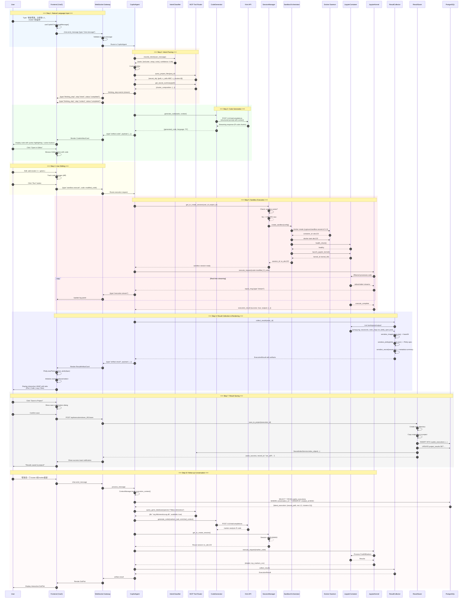

# CygnusX AI Copilot & Code Execution Sandbox -- Full Workflow Example

> **Scene**: Single-nucleus RNA-seq re-clustering & UMAP color customization
> **User Profile**: Graduate student, College of Horticulture & Forestry Sciences, HZAU
> **Project**: Apple_snRNA_2024 | 5,000 nuclei | Seurat object (.rds)

---

## Table of Contents

1. [Complete Workflow Description (Steps 0-8)](#1-complete-workflow-description)
2. [Mermaid Sequence Diagram](#2-mermaid-sequence-diagram)
3. [Data Structure Flow](#3-data-structure-flow)
4. [Appendix: Error Handling & Edge Cases](#4-appendix-error-handling--edge-cases)

---

## 1. Complete Workflow Description

---

### Step 0: Pre-condition State

#### Frontend Display

```
+--------------------------------------------------------------------------+
| CygnusX -- Apple_snRNA_2024                                    [@ User] |
+--------------------------------------------------------------------------+
| Left Sidebar |  Main Content Area          | Right Sidebar (Copilot)     |
|              |                             |                             |
| [Project     |  [Analysis Pipeline Graph]  | +-----------------------+ |
|  Overview]   |                             | | Copilot               | |
|              |  [Sample List Table]        | |                       | |
| [Samples]    |                             | | [Chat History]        | |
|              |  [Results File Tree]        | | ...                   | |
| [Analyses]   |                             | |                       | |
|              |  [UMAP Preview (res=0.8)]   | | [Input Box]           | |
| [Files]      |                             | | "Ask me anything..."  | |
|              |  +---------------------+    | +-----------------------+ |
| [Settings]   |  | seurat_obj.rds      |    |                             |
|              |  | umap_res0.8.png     |    | [Attach] [Send]           |
+--------------+  +---------------------+    +-----------------------------+
```

**System State at Step 0:**

| Component | State |
|---|---|
| User Auth | Authenticated (`user_id: "u_hort_2024001"`) |
| Active Project | `project_id: "proj_apple_snrna_2024"`, name: "Apple_snRNA_2024" |
| Copilot Panel | Expanded (`width: 380px`), WebSocket connection: `CONNECTED` |
| Previous Analysis | Standard snRNA-seq pipeline completed (QC -> DimRed -> Cluster -> Annotate) |
| Seurat Object | `/data/u_hort_2024001/projects/Apple_snRNA_2024/results/seurat_obj.rds` |
| Object Metadata | ~5,000 nuclei, 22,000 genes, existing clusters at res=0.8 (8 clusters) |
| Session History | Copilot conversation_id: `conv_sandbox_demo_001` |

#### Backend State

```python
# Redis session state (simplified)
{
  "session:user:u_hort_2024001:proj_apple_snrna_2024:copilot": {
    "conversation_id": "conv_sandbox_demo_001",
    "websocket_conn_id": "ws_0x8f2a91",
    "sandbox_session_id": null,  # not yet created
    "last_activity": "2024-06-15T09:23:17+08:00",
    "project_context": {
      "project_id": "proj_apple_snrna_2024",
      "project_name": "Apple_snRNA_2024",
      "species": "Malus domestica",
      "data_type": "snRNA-seq",
      "seurat_obj_path": "/data/u_hort_2024001/projects/Apple_snRNA_2024/results/seurat_obj.rds",
      "n_cells": 5000,
      "n_genes": 22000,
      "current_resolution": 0.8,
      "n_clusters": 8,
      "available_assays": ["RNA"],
      "reductions": ["pca", "umap"],
      "cell_types_annotated": true
    }
  }
}
```

#### Data Flow

No active data flow at Step 0. The system is in a quiescent state waiting for user input. All project metadata has been pre-loaded into the Copilot context cache during panel initialization.

---

### Step 1: Natural Language Input

#### User Action

The user clicks the Copilot input box and types:

> *"我想把之前的单核数据重新聚类一下，分辨率用1.2，然后画个UMAP图，把cluster 5的颜色改成蓝色"*

#### Frontend Processing

**Input handling flow:**

```
User Input -> Vue3 Composable "useCopilotChat()" -> Format Message -> WebSocket Send
```

The frontend performs the following operations:

1. **Input capture**: `<CopilotInput v-model="message" @submit="handleSend" />`
2. **Message formatting**: Wrap user text into a structured chat message
3. **Local state update**: Immediately append to chat history for responsive UI
4. **WebSocket transmission**: Send via persistent WebSocket connection

#### WebSocket Message Format

```json
{
  "type": "chat.message",
  "payload": {
    "conversation_id": "conv_sandbox_demo_001",
    "message": {
      "id": "msg_user_001",
      "role": "user",
      "content": "\u6211\u60f3\u628a\u4e4b\u524d\u7684\u5355\u6838\u6570\u636e\u91cd\u65b0\u805a\u7c7b\u4e00\u4e0b\uff0c\u5206\u8fa8\u7387\u75281.2\uff0c\u7136\u540e\u753b\u4e2aUMAP\u56fe\uff0c\u628acluster 5\u7684\u989c\u8272\u6539\u6210\u84dd\u8272",
      "timestamp": "2024-06-15T09:24:33+08:00"
    },
    "project_context": {
      "project_id": "proj_apple_snrna_2024",
      "active_file": null,
      "current_view": "project_dashboard"
    },
    "attachments": [],
    "client_metadata": {
      "browser": "Chrome/125.0",
      "screen": "1920x1080",
      "locale": "zh-CN"
    }
  },
  "request_id": "req_20240615092433001",
  "timestamp": "2024-06-15T09:24:33+08:00"
}
```

#### Backend Reception

```python
# FastAPI WebSocket endpoint (simplified)
@app.websocket("/ws/copilot/{conversation_id}")
async def copilot_ws(websocket: WebSocket, conversation_id: str):
    await websocket.accept()
    
    while True:
        raw_msg = await websocket.receive_json()
        
        # 1. Validate message format
        msg = ChatMessage.validate(raw_msg)
        
        # 2. Store in conversation history (PostgreSQL)
        await MessageStore.save(msg)
        
        # 3. Forward to CopilotAgent
        await CopilotAgent.process_message(msg, websocket)
```

#### Data Flow

```
[User Browser]
    | (typing + Enter)
    v
[Vue3 CopilotInput Component] --text--> [useCopilotChat composable]
    | (JSON.stringify)
    v
[WebSocket Client] --binary frame--> [Nginx WebSocket Proxy]
    | (reverse proxy)
    v
[FastAPI WS Endpoint] --async queue--> [CopilotAgent Router]
```

---

### Step 2: Agent Intent Parsing

#### CopilotAgent Processing Pipeline

The CopilotAgent processes the incoming message through a multi-stage pipeline:

```
+---------------------------------------------------------------------+
|                        CopilotAgent Pipeline                        |
+---------------------------------------------------------------------+
|                                                                     |
|  Input -> IntentClassifier -> ContextBuilder -> TaskPlanner          |
|                                              |                      |
|                                              v                      |
|                           [thinking_step events] -> Frontend        |
|                                              |                      |
|                                              v                      |
|                           ToolRouter -> MCP Tool Calls               |
|                                              |                      |
|                                              v                      |
|                           CodeGenerator (if needed)                  |
|                                                                     |
+---------------------------------------------------------------------+
```

#### 2A. Intent Classification

The **IntentClassifier** (fine-tuned intent model + LLM fallback) analyzes the Chinese query:

| Detected Intent | Confidence | Parameters |
|---|---|---|
| `recluster` | 0.96 | `resolution: 1.2` |
| `visualization.umap` | 0.94 | `plot_type: "umap"` |
| `visualization.customize_color` | 0.91 | `target: "cluster_5"`, `color: "blue"` |
| `code_generation_needed` | 0.98 | `language: "R"`, `package: "Seurat"` |

**Parsed parameters:**
```python
{
  "tasks": [
    {
      "task_id": "task_001",
      "type": "recluster",
      "description": "Re-cluster snRNA-seq data with resolution 1.2",
      "params": {"resolution": 1.2, "method": "FindClusters"},
      "dependencies": [],
      "estimated_duration_sec": 15
    },
    {
      "task_id": "task_002", 
      "type": "visualization.umap",
      "description": "Generate UMAP plot after re-clustering",
      "params": {"reduction": "umap", "label": true},
      "dependencies": ["task_001"],
      "estimated_duration_sec": 10
    },
    {
      "task_id": "task_003",
      "type": "visualization.customize_color",
      "description": "Set cluster 5 color to blue in UMAP plot",
      "params": {
        "cluster_mapping": {"5": "#4169E1"}
      },
      "dependencies": ["task_002"],
      "estimated_duration_sec": 5
    }
  ],
  "overall_intent": "Re-cluster snRNA-seq data with resolution 1.2 and generate customized UMAP plot",
  "requires_sandbox": True,
  "language": "R"
}
```

#### 2B. Context Building via MCP Tool Calls

The Agent needs to understand the current project state before generating code. It calls internal tools via **MCP (Model Context Protocol)**:

**Tool Call 1: `query_project_files`**
```json
{
  "tool": "query_project_files",
  "arguments": {
    "project_id": "proj_apple_snrna_2024",
    "file_type": ["rds", "h5ad"],
    "tags": ["seurat", "processed"]
  }
}
```

**Tool Response:**
```json
{
  "files": [
    {
      "path": "/data/u_hort_2024001/projects/Apple_snRNA_2024/results/seurat_obj.rds",
      "size_mb": 156.3,
      "last_modified": "2024-06-14T18:32:00+08:00",
      "metadata": {
        "assays": ["RNA"],
        "n_cells": 4987,
        "n_genes": 22341,
        "reductions": ["pca", "umap"],
        "current_clusters": 8,
        "current_resolution": 0.8,
        "cell_type_column": "cell_type"
      }
    }
  ],
  "total_matches": 1
}
```

**Tool Call 2: `get_seurat_summary`** (if available)
```json
{
  "tool": "get_seurat_summary",
  "arguments": {
    "file_path": "/data/u_hort_2024001/projects/Apple_snRNA_2024/results/seurat_obj.rds",
    "summary_type": "cluster_composition"
  }
}
```

**Tool Response:**
```json
{
  "clusters": {
    "0": {"count": 1245, "top_marker": "MdACT7", "cell_type": "Mesophyll"},
    "1": {"count": 987,  "top_marker": "MdCAB",   "cell_type": "Epidermis"},
    "2": {"count": 756,  "top_marker": "MdVIN",   "cell_type": "Vascular"},
    "3": {"count": 623,  "top_marker": "MdAP2",   "cell_type": "Meristem"},
    "4": {"count": 534,  "top_marker": "MdEXP",   "cell_type": "Cortex"},
    "5": {"count": 432,  "top_marker": "MdARF",   "cell_type": "Endodermis"},
    "6": {"count": 267,  "top_marker": "MdWOX",   "cell_type": "Stem Cell"},
    "7": {"count": 143,  "top_marker": "MdPR1",   "cell_type": "Immune"}
  }
}
```

#### 2C. Thinking Steps (Event Stream to Frontend)

While processing, the Agent sends real-time "thinking_step" events to the frontend:

```json
// Event 1: Intent recognized
{
  "type": "thinking_step",
  "payload": {
    "step_id": "intent_001",
    "status": "completed",
    "title": "\u610f\u56fe\u8bc6\u522b",
    "content": "\u68c0\u6d4b\u5230\u4ee5\u4e0b\u4efb\u52a1\uff1a\u91cd\u65b0\u805a\u7c7b (res=1.2)\u3001\u7ed8\u5236UMAP\u56fe\u3001\u4fee\u6539cluster 5\u989c\u8272\u4e3a\u84dd\u8272",
    "timestamp": "2024-06-15T09:24:33.200+08:00"
  }
}

// Event 2: Querying project context
{
  "type": "thinking_step",
  "payload": {
    "step_id": "context_001",
    "status": "in_progress",
    "title": "\u67e5\u8be2\u9879\u76ee\u4e0a\u4e0b\u6587",
    "content": "\u6b63\u5728\u67e5\u8be2\u9879\u76ee Apple_snRNA_2024 \u7684\u6570\u636e\u6587\u4ef6\u548c\u5f53\u524d\u72b6\u6001...",
    "timestamp": "2024-06-15T09:24:33.350+08:00"
  }
}

// Event 3: Context loaded
{
  "type": "thinking_step",
  "payload": {
    "step_id": "context_002",
    "status": "completed",
    "title": "\u4e0a\u4e0b\u6587\u52a0\u8f7d\u5b8c\u6210",
    "content": "\u627e\u5230 Seurat \u5bf9\u8c61\uff1aseurat_obj.rds (4987\u7ec6\u80de\u6838, 8\u4e2a\u5f53\u524d\u805a\u7c7b)",
    "timestamp": "2024-06-15T09:24:33.580+08:00"
  }
}

// Event 4: Generating code
{
  "type": "thinking_step",
  "payload": {
    "step_id": "codegen_001",
    "status": "in_progress",
    "title": "\u751f\u6210 R \u4ee3\u7801",
    "content": "\u6b63\u5728\u751f\u6210 Seurat \u91cd\u65b0\u805a\u7c7b\u548c UMAP \u53ef\u89c6\u5316\u4ee3\u7801...",
    "timestamp": "2024-06-15T09:24:33.750+08:00"
  }
}
```

**Frontend rendering of thinking steps:**

```
+---------------------------------------------------+
| Copilot                                           |
+---------------------------------------------------+
| ...                                               |
| [User] 我想把之前的单核数据重新聚类...              |
|                                                   |
| [AI]   [icon] 正在分析您的请求...                   |
|        [check] 意图识别完成                         |
|        [spinner] 查询项目上下文...                   |
|        正在生成 R 代码...                           |
+---------------------------------------------------+
```

#### Data Flow at Step 2

```
[CopilotAgent Router]
    | (intent classification)
    v
[IntentClassifier] --> {task_list}
    |
    v
[MCP Tool Router] --query_project_files--> [Project Metadata Service]
    |                                          |
    | <-- {seurat_obj metadata} ---------------+
    v
[ContextBuilder] --> {enriched_context}
    |
    v
[TaskPlanner] --thinking_step events--> [WebSocket] --> [Frontend]
    |
    v
{ready for code generation}
```

---

### Step 3: Code Generation

#### LLM Code Generation

The **CodeGenerator** module sends a structured prompt to the Kimi API (or other configured LLM):

**System Prompt:**
```
You are an expert bioinformatics assistant specializing in single-cell RNA-seq analysis using Seurat (R). Generate clean, well-commented R code based on the user's request.

Context:
- Project: Apple_snRNA_2024 (snRNA-seq)
- Seurat object path: /workspace/data/seurat_obj.rds (mounted in sandbox)
- Current state: 4,987 nuclei, 8 clusters at resolution 0.8
- User wants: recluster at resolution 1.2, UMAP plot, cluster 5 -> blue

Rules:
- Use Seurat v5 syntax
- Save results to /workspace/output/
- Use ggplot2 for visualization
- Add comments in Chinese
- Load required libraries explicitly
```

**Generated R Code:**

```r
# ============================================
# CygnusX Copilot Generated Code
# Task: Re-cluster snRNA-seq data (res=1.2) + Custom UMAP
# Project: Apple_snRNA_2024
# Generated: 2024-06-15 09:24:34
# ============================================

# ---- 1. Load Libraries ----
library(Seurat)
library(ggplot2)
library(dplyr)

# ---- 2. Load Data ----
# \u52a0\u8f7d Seurat \u5bf9\u8c61
seurat_obj <- readRDS("/workspace/data/seurat_obj.rds")
message(paste0("Loaded ", ncol(seurat_obj), " nuclei, ", nrow(seurat_obj), " genes"))

# ---- 3. Re-cluster with resolution 1.2 ----
# \u4f7f\u7528 FindClusters \u8fdb\u884c\u91cd\u65b0\u805a\u7c7b
# \u6ce8\u610f\uff1a\u6211\u4eec\u91cd\u65b0\u8fd0\u884c FindClusters \uff0c\u4f7f\u7528 graph.name \u6307\u5b9a\u5df2\u6709\u7684\u76f8\u4f3c\u6027\u56fe\u8c31
seurat_obj <- FindClusters(
  seurat_obj,
  resolution = 1.2,
  verbose = TRUE
)

# \u67e5\u770b\u65b0\u7684\u805a\u7c7b\u7ed3\u679c
new_cluster_count <- length(unique(Idents(seurat_obj)))
message(paste0("New clustering at resolution 1.2: ", new_cluster_count, " clusters"))

# \u663e\u793a\u6bcf\u4e2a\u805a\u7c7b\u7684\u7ec6\u80de\u6570\nprint(table(Idents(seurat_obj)))

# ---- 4. Run UMAP (recompute on new clusters for visualization) ----
# \u5982\u679c\u9700\u8981\u57fa\u4e8e\u65b0\u805a\u7c7b\u91cd\u65b0\u8ba1\u7b97UMAP\u5750\u6807\uff0c\u53ef\u4ee5\u53d6\u6d88\u4e0b\u9762\u7684\u6ce8\u91ca
# seurat_obj <- RunUMAP(seurat_obj, dims = 1:30, verbose = FALSE)

# ---- 5. Custom UMAP Plot with Modified Colors ----
# \u83b7\u53d6\u9ed8\u8ba4\u989c\u8272\u65b9\u6848\ncluster_ids <- sort(as.numeric(as.character(unique(Idents(seurat_obj)))))

# \u521b\u5efa\u81ea\u5b9a\u4e49\u989c\u8272\u6620\u5c04\uff08\u5c06 cluster 5 \u6539\u4e3a\u84dd\u8272\uff09
custom_colors <- scales::hue_pal()(length(cluster_ids))
names(custom_colors) <- as.character(cluster_ids)

# \u5c06 cluster 5 \u8bbe\u7f6e\u4e3a\u7687\u5bb6\u84dd (Royal Blue)
custom_colors["5"] <- "#4169E1"

# \u7ed8\u5236 UMAP\nump_plot <- DimPlot(
  seurat_obj,
  reduction = "umap",
  label = TRUE,
  label.size = 6,
  pt.size = 0.5,
  cols = custom_colors
) +
  ggtitle("UMAP - snRNA-seq (Resolution 1.2)") +
  theme(
    plot.title = element_text(hjust = 0.5, size = 16, face = "bold"),
    axis.text = element_text(size = 12),
    legend.position = "right"
  )

# \u663e\u793a\u56fe\u5f62\nprint(ump_plot)

# ---- 6. Save Outputs ----
# \u4fdd\u5b58\u66f4\u65b0\u540e\u7684 Seurat \u5bf9\u8c61
saveRDS(seurat_obj, "/workspace/output/seurat_obj_res12.rds")
message("Saved updated Seurat object to: /workspace/output/seurat_obj_res12.rds")

# \u4fdd\u5b58 UMAP \u56fe\u4e3a\u9ad8\u5206\u8fa8\u7387 PNG
ggsave(
  filename = "/workspace/output/umap_res12_custom.png",
  plot = ump_plot,
  width = 10,
  height = 8,
  dpi = 300
)
message("Saved UMAP plot to: /workspace/output/umap_res12_custom.png")

# \u4fdd\u5b58\u989c\u8272\u6620\u5c04\u4fe1\u606f\nwrite.csv(
  data.frame(cluster = names(custom_colors), color = custom_colors),
  "/workspace/output/cluster_color_map.csv",
  row.names = FALSE
)

message("All tasks completed successfully!")
```

#### Code Artifact Presentation

The generated code is wrapped in an **Artifact** object and sent to the frontend:

```json
{
  "type": "artifact.code",
  "payload": {
    "artifact_id": "art_code_001",
    "artifact_type": "code",
    "title": "Seurat Re-clustering & UMAP (Resolution 1.2)",
    "language": "r",
    "code": "# ... (full R code above)",
    "metadata": {
      "generated_by": "kimi-api",
      "generation_time_ms": 2340,
      "tasks": ["recluster", "umap", "customize_color"],
      "sandbox_required": true,
      "estimated_execution_time_sec": 30
    },
    "actions": [
      {
        "label": "\u5728\u7f16\u8f91\u5668\u4e2d\u6253\u5f00",
        "action": "open_in_editor",
        "icon": "edit"
      },
      {
        "label": "\u76f4\u63a5\u8fd0\u884c",
        "action": "run_code",
        "icon": "play",
        "primary": true
      },
      {
        "label": "\u590d\u5236\u4ee3\u7801",
        "action": "copy_code",
        "icon": "copy"
      }
    ]
  }
}
```

**Frontend rendering:**

```
+---------------------------------------------------+
| [AI] 好的，我为您生成了以下代码：                    |
|                                                   |
| +-----------------------------------------------+ |
| | Seurat Re-clustering & UMAP (Resolution 1.2)  | |
| | [R]  [tab] Generated by kimi-api  [timer] 2.3s| |
| |                                               | |
| |  1  | # ===================================   | |
| |  2  | # CygnusX Copilot Generated Code        | |
| |  3  | # ===================================   | |
| |  4  | library(Seurat)                         | |
| |  5  | library(ggplot2)                        | |
| | ... | (syntax highlighted R code)             | |
| | 67  | message("All tasks completed!")         | |
| |                                               | |
| | [在编辑器中打开]  [直接运行]  [复制代码]           | |
| +-----------------------------------------------+ |
|                                                   |
| 是否需要在编辑器中修改后再运行？                     |
+---------------------------------------------------+
```

#### Data Flow at Step 3

```
[CodeGenerator]
    | (build prompt with context)
    v
[KimiAPI] --POST /v1/chat/completions--> {generated_r_code}
    | (streaming response)
    v
[ArtifactBuilder] --artifact.code--> [WebSocket]
    |                              v
    |                         [Frontend Vue3]
    |                              |
    |                              v
    |                    <CodeArtifactCard> component
    |                              |
    +---------------------> Monaco Editor (on "open_in_editor")
```

---

### Step 4: User Secondary Editing

#### User Action

The user clicks **"Open in Editor"** (`open_in_editor` action). The code is transferred to the **Monaco Editor** (R language support enabled).

#### Editor Interface

```
+--------------------------------------------------------------------------+
| Code Editor -- Apple_snRNA_2024                               [Split View]|
+--------------------------------------------------------------------------+
| File: copilot_recluster_umap.r              [Run] [Save] [Share] [Close]|
+--------------------------------------------------------------------------+
| 1   | # ============================================                     |
| 2   | # CygnusX Copilot Generated Code                                  |
| ... |                                                                   |
| 38  | # ---- 5. Custom UMAP Plot ----                                    |
| 39  | cluster_ids <- sort(as.numeric(as.character(unique(Idents(...))))) |
| 40  | custom_colors <- scales::hue_pal()(length(cluster_ids))           |
| 41  | names(custom_colors) <- as.character(cluster_ids)                 |
| 42  |                                                                    |
| 43  | # \u7528\u6237\u4fee\u6539\uff1a\u5c06 cluster 5 \u6539\u4e3a\u84dd\u8272\uff0ccluster 3 \u6539\u4e3a\u7eff\u8272         |
| 44  | custom_colors["5"] <- "#4169E1"  # \u7687\u5bb6\u84dd                          |
| 45  | custom_colors["3"] <- "#228B22"  # \u68ee\u6797\u7eff  <-- \u7528\u6237\u65b0\u589e\u7684\u4fee\u6539   |
| 46  |                                                                    |
| 47  | ump_plot <- DimPlot(seurat_obj, reduction = "umap", ...)          |
| ... |                                                                   |
+--------------------------------------------------------------------------+
| Console Output (collapsed)                                               |
+--------------------------------------------------------------------------+
```

#### User's Modification

The user adds one line to also change cluster 3 to green:

```r
# Original (generated):
custom_colors["5"] <- "#4169E1"  # Royal Blue

# Modified (by user):
custom_colors["5"] <- "#4169E1"  # Royal Blue
custom_colors["3"] <- "#228B22"  # Forest Green  <-- ADDED
```

#### Execution Request

After modification, the user clicks **"Run"** button. The frontend sends an execution request:

```json
{
  "type": "sandbox.execute",
  "payload": {
    "execution_id": "exec_001",
    "artifact_id": "art_code_001",
    "code": "# ... (full modified R code)",
    "language": "r",
    "sandbox_config": {
      "image": "cygnusx/sandbox-seurat:v2.1.0",
      "memory_limit_mb": 4096,
      "cpu_limit": 2,
      "timeout_sec": 300,
      "mounts": [
        {
          "host_path": "/data/u_hort_2024001/projects/Apple_snRNA_2024",
          "container_path": "/workspace/data",
          "read_only": true
        },
        {
          "host_path": "/tmp/exec_001_output",
          "container_path": "/workspace/output",
          "read_only": false
        }
      ]
    },
    "project_id": "proj_apple_snrna_2024",
    "user_id": "u_hort_2024001"
  },
  "request_id": "req_exec_001",
  "timestamp": "2024-06-15T09:25:12+08:00"
}
```

#### Data Flow at Step 4

```
[User] --click "Open in Editor"--> [Frontend]
    |
    v
[Monaco Editor] --load code--> {editable state}
    |
    | (user edits: adds cluster 3 -> green)
    v
[User] --click "Run"--> [Frontend]
    |
    v
[useSandboxExecution composable]
    |
    v
[WebSocket] --sandbox.execute--> [Backend Sandbox Service]
```

---

### Step 5: Sandbox Execution

This is the **core execution phase**. The backend handles code execution through a multi-layer sandbox orchestration system.

#### 5A. Session Manager -- Session Lifecycle Check

```python
# SessionManager pseudocode
class SessionManager:
    async def get_or_create_session(self, user_id, project_id):
        session_key = f"sandbox:{user_id}:{project_id}"
        session = await redis.get(session_key)
        
        if session is None:
            # CASE 1: No existing sandbox -> CREATE
            return await self.create_new_session(user_id, project_id)
        
        elif session.status == "paused":
            # CASE 2: Paused sandbox -> RESUME
            return await self.resume_session(session.session_id)
        
        elif session.status == "running":
            # CASE 3: Already running -> QUEUE
            return await self.queue_execution(session.session_id, new_task)
        
        elif session.status == "stale":
            # CASE 4: Stale session -> CLEANUP & RECREATE
            await self.cleanup_session(session.session_id)
            return await self.create_new_session(user_id, project_id)
```

**Session state machine:**

```
                    +------------+    timeout     +---------+
    create() -----> | CREATING   | -------------> | FAILED  |
                    +-----+------+                +---------+
                          | start()
                          v
                    +------------+    pause()     +---------+
         +---------> | RUNNING    | -------------> | PAUSED  |
         |          +-----+------+                +----+----+
         |                | ^ resume()                  |
         | exec complete  | |                            |
         |                | |                            |
         +----------------+ |               auto-cleanup |
                            v                            |
                    +------------+                       |
                    | EXECUTING  |                       v
                    +-----+------+                +---------+
                          |    exec done     +---> | DELETED |
                          +-----------------+      +---------+
```

**For this execution:**
- User `u_hort_2024001` has no active sandbox for this project
- **Decision**: Create new sandbox session

#### 5B. SandboxOrchestrator -- Container Provisioning

```python
class SandboxOrchestrator:
    async def create_sandbox(self, config: SandboxConfig) -> SandboxSession:
        # 1. Pull image if needed
        image = config.image  # "cygnusx/sandbox-seurat:v2.1.0"
        
        # 2. Create container with resource limits
        container = await docker.containers.create(
            image=image,
            name=f"cygnusx-sandbox-{user_id}-{project_id}-{timestamp}",
            mounts=[
                {
                    "type": "bind",
                    "source": "/data/u_hort_2024001/projects/Apple_snRNA_2024",
                    "target": "/workspace/data",
                    "read_only": True
                },
                {
                    "type": "bind",
                    "source": "/tmp/exec_001_output",
                    "target": "/workspace/output",
                    "read_only": False
                }
            ],
            resources={
                "memory": 4096 * 1024 * 1024,  # 4GB
                "cpu_quota": 200000,  # 2 CPUs
                "network": "sandbox-internal"  # isolated network
            },
            env={
                "R_LIBS_USER": "/usr/local/lib/R/site-library",
                "OMP_NUM_THREADS": "2"
            },
            # Security settings
            security_opt=["no-new-privileges:true"],
            cap_drop=["ALL"],
            cap_add=["CHOWN", "SETUID", "SETGID"]
        )
        
        # 3. Start container
        await container.start()
        
        # 4. Health check
        healthy = await self.health_check(container.id)
        if not healthy:
            raise SandboxCreationError("Container health check failed")
        
        # 5. Launch Jupyter Kernel inside container
        kernel = await self.launch_jupyter_kernel(container.id)
        
        return SandboxSession(
            session_id=f"ss_{container.id[:12]}",
            container_id=container.id,
            kernel_id=kernel.id,
            status="running",
            created_at=datetime.now(),
            expires_at=datetime.now() + timedelta(hours=2)
        )
```

**Docker container architecture:**

```
+-------------------------------------------------------------+
|                    Host Server                               |
|  +-------------------------------------------------------+  |
|  | Docker Container: cygnusx-sandbox-u_hort_2024...      |  |
|  |  (cygnusx/sandbox-seurat:v2.1.0)                     |  |
|  |                                                       |  |
|  |  +-----------------------------------------------+   |  |
|  |  |  R + Seurat + ggplot2 + dplyr + ...           |   |  |
|  |  |  Jupyter Kernel (IRkernel)                     |   |  |
|  |  |  Kernel Gateway (port 8888)                    |   |  |
|  |  +-----------------------------------------------+   |  |
|  |                                                       |  |
|  |  Mounts:                                              |  |
|  |    /workspace/data  -> /data/.../Apple_snRNA_2024 (ro)|  |
|  |    /workspace/output -> /tmp/exec_001_output (rw)      |  |
|  |                                                       |  |
|  |  Resources: 4GB RAM, 2 CPU cores                      |  |
|  +-------------------------------------------------------+  |
|                                                             |
|  Sandbox Network: isolated (no external internet)          |
+-------------------------------------------------------------+
```

#### 5C. Jupyter Kernel Execution

```python
class JupyterKernelGateway:
    async def execute_code(self, session: SandboxSession, code: str) -> ExecutionResult:
        kernel_client = self.get_client(session.kernel_id)
        
        # Send execute_request
        msg_id = kernel_client.execute(
            code=code,
            silent=False,
            store_history=True,
            allow_stdin=False
        )
        
        # Collect all output messages
        outputs = []
        execution_state = "busy"
        
        while execution_state == "busy":
            msg = await kernel_client.get_iopub_msg(timeout=10)
            msg_type = msg["header"]["msg_type"]
            content = msg["content"]
            
            if msg_type == "stream":
                # stdout / stderr
                outputs.append({
                    "type": "stream",
                    "name": content["name"],  # "stdout" or "stderr"
                    "text": content["text"]
                })
                # Forward to frontend in real-time
                await self.send_stream_to_frontend(session, content)
                
            elif msg_type == "display_data":
                # Rich output (plots, tables)
                outputs.append({
                    "type": "display_data",
                    "data": content["data"],  # {"image/png": "base64...", "text/plain": "..."}
                    "metadata": content["metadata"]
                })
                
            elif msg_type == "execute_result":
                # Return value
                outputs.append({
                    "type": "execute_result",
                    "data": content["data"],
                    "execution_count": content["execution_count"]
                })
                
            elif msg_type == "error":
                # Execution error
                outputs.append({
                    "type": "error",
                    "ename": content["ename"],
                    "evalue": content["evalue"],
                    "traceback": content["traceback"]
                })
                
            elif msg_type == "status":
                execution_state = content["execution_state"]  # "busy" -> "idle"
        
        return ExecutionResult(
            msg_id=msg_id,
            outputs=outputs,
            execution_count=...,  # populated by kernel
            success=not any(o["type"] == "error" for o in outputs)
        )
```

#### 5D. Real-time Output Streaming

**Execution progress as seen by the user:**

```
+---------------------------------------------------+
| Code Execution -- Running...              [Cancel] |
+---------------------------------------------------+
| Status: Executing (15s elapsed / ~30s estimated)   |
| Progress: [████████░░░░░░░░░░] 50%                  |
+---------------------------------------------------+
| [Log Output - auto-scrolling]                      |
| > Loading required package: Seurat                 |
| > Loaded 4987 nuclei, 22341 genes                  |
| > Computing nearest neighbor graph...              |
| > Modularity Optimizer version 1.3.0...            |
| > 1 - modularity used                : 0.4231      |
| > 2 - modularity used                : 0.3987      |
| > ...                                              |
| > New clustering at resolution 1.2: 11 clusters    |
| >    0    1    2    3    4    5    6    7    8    9   10 |
| > 1245  876  623  534  432  387  298  267  143   98   84 |
| > Saving plot to: umap_res12_custom.png            |
| > All tasks completed successfully!                |
|                                                    |
+---------------------------------------------------+
```

**WebSocket stream messages (real-time):**

```json
// Stream: stdout
{
  "type": "execution.stream",
  "payload": {
    "execution_id": "exec_001",
    "stream_type": "stdout",
    "text": "Loaded 4987 nuclei, 22341 genes\n"
  }
}

// Stream: progress update
{
  "type": "execution.progress",
  "payload": {
    "execution_id": "exec_001",
    "status": "running",
    "elapsed_sec": 15,
    "estimated_total_sec": 30,
    "current_step": "FindClusters (resolution=1.2)"
  }
}

// Stream: stderr (warning, not error)
{
  "type": "execution.stream",
  "payload": {
    "execution_id": "exec_001",
    "stream_type": "stderr",
    "text": "Warning: The default method for RunUMAP has changed...\n"
  }
}

// Final: execution complete
{
  "type": "execution.complete",
  "payload": {
    "execution_id": "exec_001",
    "status": "success",
    "elapsed_sec": 28.5,
    "exit_code": 0,
    "output_files": [
      "/workspace/output/seurat_obj_res12.rds",
      "/workspace/output/umap_res12_custom.png",
      "/workspace/output/cluster_color_map.csv"
    ]
  }
}
```

#### 5E. Timeout & Resource Controls

| Control | Value | Behavior |
|---|---|---|
| Execution timeout | 300 seconds (5 min) | After timeout, kernel is interrupted |
| Memory limit | 4 GB | OOM kills container, triggers cleanup |
| CPU limit | 2 cores | Throttled by CFS quota |
| Session idle timeout | 30 minutes | Auto-pause to save resources |
| Session max lifetime | 2 hours | Force cleanup regardless of activity |
| Max queued executions | 3 per session | FIFO queue, reject if full |

#### Data Flow at Step 5

```
[Backend Sandbox Service]
    |
    v
[SessionManager] --check state--> "CREATE new sandbox"
    |
    v
[SandboxOrchestrator] --docker create--> [Docker Daemon]
    |                                          |
    | <-- container_id, kernel_id -------------+
    v
[JupyterKernelGateway] --execute_request--> [IRkernel in Container]
    |                                              |
    | <-- iopub messages (stream, display_data) <--+
    |
    +-- WebSocket streaming --> [Frontend Log Panel]
    |
    v
{execution complete} --> [ResultCollector]
```

---

### Step 6: Result Collection & Rendering

#### 6A. Output Capture

After successful execution, the ResultCollector gathers outputs from three sources:

1. **Jupyter IOPub messages** (console output, inline plots)
2. **Filesystem** (saved files in `/workspace/output/`)
3. **Kernel execution result** (return values)

**File collection:**
```python
class ResultCollector:
    async def collect_results(self, execution: Execution) -> ExecutionResult:
        results = []
        
        # 1. List output files
        output_dir = f"/tmp/{execution.execution_id}_output"
        files = os.listdir(output_dir)
        
        for file in files:
            file_path = os.path.join(output_dir, file)
            file_ext = os.path.splitext(file)[1]
            
            if file_ext in [".png", ".jpg", ".jpeg", ".svg"]:
                # Image file -> serialize for display
                results.append(await self.serialize_image(file_path))
            elif file_ext == ".csv":
                # Table -> parse for interactive display
                results.append(await self.serialize_table(file_path))
            elif file_ext == ".rds":
                # Seurat object -> metadata summary
                results.append(await self.serialize_seurat(file_path))
            elif file_ext in [".r", ".py"]:
                # Script file -> code display
                results.append(await self.serialize_code(file_path))
        
        return ExecutionResult(
            execution_id=execution.execution_id,
            outputs=results,
            status="success"
        )
```

#### 6B. Result Serialization (Chart Data)

**Option A: Plotly JSON (Recommended for interactive UMAP)**

The execution environment can generate Plotly figures for interactive exploration:

```r
# Alternative R code for interactive output (generated by Copilot)
library(plotly)

# Convert ggplot to interactive plotly
ump_plotly <- ggplotly(ump_plot, 
  tooltip = c("ident", "nCount_RNA", "cell_type"),
  width = 900, 
  height = 700
)

# Save as Plotly JSON for frontend rendering
htmlwidgets::saveWidget(ump_plotly, "/workspace/output/umap_res12_interactive.html")

# Also export the plotly JSON spec
plotly_json <- plotly_json(ump_plotly, pretty = TRUE)
write(plotly_json, "/workspace/output/umap_plotly_spec.json")
```

**Frontend rendering with Plotly.js:**
```javascript
// Vue3 component: <PlotlyUmapChart>
import Plotly from 'plotly.js-dist-min';

const renderPlotlyChart = (containerRef, plotlySpec) => {
  Plotly.newPlot(containerRef.value, {
    data: plotlySpec.data,
    layout: {
      ...plotlySpec.layout,
      // Custom CygnusX styling
      paper_bgcolor: 'transparent',
      plot_bgcolor: 'transparent',
      font: { family: 'Inter, sans-serif' }
    },
    config: {
      responsive: true,
      displayModeBar: true,
      modeBarButtonsToAdd: ['lasso2d', 'select2d'],
      modeBarButtonsToRemove: ['toImage'],
      scrollZoom: true
    }
  });
};
```

**Option B: PNG Base64 (Fallback for complex plots)**

```python
async def serialize_image(file_path: str) -> ImageArtifact:
    with open(file_path, "rb") as f:
        image_data = f.read()
    
    return ImageArtifact(
        artifact_type="image",
        format="png",
        data_base64=base64.b64encode(image_data).decode("utf-8"),
        width=1200,   # from PNG metadata
        height=960,
        file_size_bytes=len(image_data),
        metadata={
            "dpi": 300,
            "source_file": os.path.basename(file_path)
        }
    )
```

**Recommended approach:** Use **Option A (Plotly JSON)** as the primary format, with **Option B (PNG)** as fallback. Rationale:

| Criterion | Plotly JSON | PNG Base64 |
|---|---|---|
| Interactivity | Excellent (zoom, pan, hover) | None |
| Cell selection | Yes (lasso, box select) | No |
| Export quality | SVG/PNG export built-in | Fixed resolution |
| File size | Larger (~2-5MB for 5k cells) | Smaller (~500KB) |
| Load time | Slower (parse + render) | Fast |
| Fallback | Requires Plotly.js | Universal |

#### 6C. Complete Result Artifact

```json
{
  "type": "artifact.result",
  "payload": {
    "artifact_id": "art_result_001",
    "artifact_type": "execution_result",
    "title": "Re-clustering Results (Resolution 1.2)",
    "execution_id": "exec_001",
    "status": "success",
    "elapsed_time_sec": 28.5,
    "tabs": [
      {
        "id": "tab_plot",
        "label": "UMAP Plot",
        "type": "plotly_chart",
        "active": true,
        "content": {
          "plotly_spec_url": "/api/v1/executions/exec_001/outputs/umap_plotly_spec.json",
          "fallback_image_url": "/api/v1/executions/exec_001/outputs/umap_res12_custom.png",
          "cluster_summary": {
            "total_clusters": 11,
            "total_cells": 4987,
            "clusters": [
              {"id": 0, "count": 1245, "color": "#F8766D", "cell_type": "Mesophyll"},
              {"id": 1, "count": 876,  "color": "#D39200", "cell_type": "Epidermis"},
              {"id": 2, "count": 623,  "color": "#93AA00", "cell_type": "Vascular"},
              {"id": 3, "count": 534,  "color": "#228B22", "cell_type": "Meristem"},
              {"id": 4, "count": 432,  "color": "#00BA38", "cell_type": "Cortex"},
              {"id": 5, "count": 387,  "color": "#4169E1", "cell_type": "Endodermis"},
              {"id": 6, "count": 298,  "color": "#619CFF", "cell_type": "Stem Cell"},
              {"id": 7, "count": 267,  "color": "#B79F00", "cell_type": "Immune"},
              {"id": 8, "count": 143,  "color": "#00BFC4", "cell_type": "Pericycle"},
              {"id": 9, "count": 98,   "color": "#F564E3", "cell_type": "Trichome"},
              {"id": 10, "count": 84,  "color": "#FF64B0", "cell_type": "Guard Cell"}
            ]
          }
        }
      },
      {
        "id": "tab_code",
        "label": "Code",
        "type": "code_editor",
        "active": false,
        "content": {
          "language": "r",
          "code": "# ... (full executed code)",
          "editable": true
        }
      },
      {
        "id": "tab_log",
        "label": "Log",
        "type": "log_viewer",
        "active": false,
        "content": {
          "log_lines": [
            {"timestamp": "09:25:12", "level": "INFO", "message": "Loading required package: Seurat"},
            {"timestamp": "09:25:13", "level": "INFO", "message": "Loaded 4987 nuclei, 22341 genes"},
            {"timestamp": "09:25:15", "level": "INFO", "message": "Computing nearest neighbor graph..."},
            {"timestamp": "09:25:20", "level": "INFO", "message": "Modularity Optimizer version 1.3.0"},
            {"timestamp": "09:25:25", "level": "INFO", "message": "New clustering at resolution 1.2: 11 clusters"},
            {"timestamp": "09:25:28", "level": "INFO", "message": "All tasks completed successfully!"}
          ]
        }
      },
      {
        "id": "tab_files",
        "label": "Output Files",
        "type": "file_list",
        "active": false,
        "content": {
          "files": [
            {
              "name": "seurat_obj_res12.rds",
              "size_mb": 162.4,
              "type": "seurat_object",
              "download_url": "/api/v1/executions/exec_001/download/seurat_obj_res12.rds"
            },
            {
              "name": "umap_res12_custom.png",
              "size_kb": 486.2,
              "type": "image_png",
              "preview_url": "/api/v1/executions/exec_001/preview/umap_res12_custom.png"
            },
            {
              "name": "cluster_color_map.csv",
              "size_kb": 0.3,
              "type": "csv",
              "preview_url": "/api/v1/executions/exec_001/preview/cluster_color_map.csv"
            }
          ]
        }
      }
    ],
    "actions": [
      {
        "label": "Save to Project",
        "action": "save_to_project",
        "icon": "save",
        "primary": true
      },
      {
        "label": "Download All",
        "action": "download_all",
        "icon": "download"
      },
      {
        "label": "Continue Analysis",
        "action": "continue_chat",
        "icon": "message-circle"
      }
    ]
  }
}
```

#### 6D. Frontend Rendering -- Interactive UMAP

```
+---------------------------------------------------------------+
| [AI] 执行完成！以下是重新聚类后的结果：                         |
|                                                               |
| +-----------------------------------------------------------+ |
| | Re-clustering Results (Resolution 1.2)          [Save] [DL]| |
| +-----------------------------------------------------------+ |
| | [UMAP Plot] [Code] [Log] [Output Files]                    | |
| |                                                           | |
| |  +-----------------------------------------------------+  | |
| |  |                                                     |  | |
| |  |                    UMAP Plot                        |  | |
| |  |  (Interactive Plotly.js rendering)                  |  | |
| |  |                                                     |  | |
| |  |    [0]    [1]      [2]                             |  | |
| |  |     .       .        .                             |  | |
| |  |       .  [3]  .        .  [5]*                     |  | |
| |  |      . (green) .          (blue)                    |  | |
| |  |         .     .        .     .                     |  | |
| |  |    [4]     .      [6]       .                      |  | |
| |  |   .    .        .     .      .  [8]               |  | |
| |  |  .  [7]  .  [9]  .  [10]    .                     |  | |
| |  |                                                    |  | |
| |  |  [Pan] [Zoom] [Lasso Select] [Box Select] [Reset]  |  | |
| |  +-----------------------------------------------------+  | |
| |                                                           | |
| | Cluster Summary: 11 clusters, 4,987 cells                 | |
| | [0]: 1245  [1]: 876  [2]: 623  [3]: 534  [4]: 432       | |
| | [5]: 387*  [6]: 298  [7]: 267  [8]: 143  [9]: 98        | |
| | [10]: 84  (* = custom color)                              | |
| +-----------------------------------------------------------+ |
|                                                               |
| 是否需要我对某个cluster进行进一步分析？                         |
+---------------------------------------------------------------+
```

**Interactive features of the UMAP plot:**

| Feature | Implementation | User Value |
|---|---|---|
| **Zoom** | Plotly scroll + drag box | Explore dense regions |
| **Pan** | Plotly drag | Navigate large plots |
| **Hover tooltip** | Custom hovertemplate | Show cell ID, cluster, cell type, QC metrics |
| **Lasso select** | Plotly `lasso2d` mode | Select cells for subset analysis |
| **Box select** | Plotly `select2d` mode | Rectangular region selection |
| **Export PNG/SVG** | Plotly modebar | Publication-quality export |
| **Legend toggle** | Plotly legend click | Show/hide specific clusters |
| **Color highlight** | Custom callback | Highlight selected cluster |

#### Data Flow at Step 6

```
[Docker Container /workspace/output]
    | (plotly_spec.json, umap.png, seurat_obj.rds)
    v
[ResultCollector] --serialize--> [ExecutionResult]
    |
    +-- ImageArtifact (PNG base64 fallback)
    +-- PlotlyArtifact (JSON spec for interactive)
    +-- FileArtifact (downloadable RDS)
    +-- TableArtifact (cluster summary CSV)
    |
    v
[WebSocket] --artifact.result--> [Frontend]
    |
    v
[Vue3 <ResultArtifactCard>]
    |
    +-- <PlotlyUmapChart> (tab: UMAP Plot)
    +-- <MonacoEditor>     (tab: Code)
    +-- <LogViewer>        (tab: Log)
    +-- <FileList>         (tab: Output Files)
```

---

### Step 7: Result Saving

#### 7A. User Action

The user clicks **"Save to Project"** button. A confirmation dialog appears:

```
+-----------------------------------------------+
| Save Results to Project                       |
+-----------------------------------------------+
|                                               |
| The following will be saved:                  |
| [x] R script: recluster_umap_res12.r          |
| [x] UMAP plot: umap_res12_custom.png          |
| [x] UMAP interactive: umap_res12_interactive  |
| [x] Updated Seurat object: seurat_res12.rds   |
| [x] Color mapping: cluster_color_map.csv      |
|                                               |
| Save location:                                |
| /Apple_snRNA_2024/copilot_results/            |
|                                               |
| [Create notebook record] [x]                  |
|                                               |
| [Cancel]                    [Confirm Save]    |
+-----------------------------------------------+
```

#### 7B. Save Processing

```python
class ResultSaver:
    async def save_to_project(self, execution_id: str, save_options: SaveOptions):
        execution = await ExecutionStore.get(execution_id)
        project = await ProjectStore.get(execution.project_id)
        
        # 1. Create save directory
        timestamp = datetime.now().strftime("%Y%m%d_%H%M%S")
        save_dir = os.path.join(
            project.data_dir,
            "copilot_results",
            f"execution_{timestamp}_{execution_id[:8]}"
        )
        os.makedirs(save_dir, exist_ok=True)
        
        # 2. Copy output files
        saved_files = []
        for output_file in execution.output_files:
            src = output_file.local_path
            dst = os.path.join(save_dir, output_file.filename)
            shutil.copy2(src, dst)
            saved_files.append({
                "original_path": output_file.local_path,
                "saved_path": dst,
                "filename": output_file.filename,
                "size_bytes": os.path.getsize(dst)
            })
        
        # 3. Also save the executed code
        code_path = os.path.join(save_dir, "script_recluster_umap.r")
        with open(code_path, "w") as f:
            f.write(execution.source_code)
        
        # 4. Create execution record in database
        record = await CopilotExecutionRecord.create(
            record_id=f"cer_{uuid4().hex[:12]}",
            project_id=execution.project_id,
            user_id=execution.user_id,
            conversation_id=execution.conversation_id,
            execution_id=execution_id,
            task_description="Re-cluster snRNA-seq data with resolution 1.2 and generate custom UMAP",
            natural_language_query="我想把之前的单核数据重新聚类一下，分辨率用1.2...",
            generated_code=execution.source_code,
            language="r",
            status="completed",
            output_files=saved_files,
            save_path=save_dir,
            execution_time_sec=execution.elapsed_sec,
            parameters={"resolution": 1.2, "custom_colors": {"5": "#4169E1", "3": "#228B22"}},
            created_at=datetime.now()
        )
        
        # 5. Update project result index
        await project.add_result_file(
            path=save_dir,
            file_type="copilot_execution",
            metadata={
                "record_id": record.record_id,
                "description": "Re-clustering at res=1.2 with custom UMAP colors",
                "tags": ["seurat", "umap", "recluster", "copilot"]
            }
        )
        
        # 6. Update Seurat object index (if Seurat object was saved)
        seurat_file = next(
            (f for f in saved_files if f["filename"].endswith(".rds")),
            None
        )
        if seurat_file:
            await SeuratIndexService.index_object(
                file_path=seurat_file["saved_path"],
                project_id=execution.project_id,
                metadata={
                    "source": "copilot_execution",
                    "resolution": 1.2,
                    "parent_object": "seurat_obj.rds"
                }
            )
        
        return SaveResult(
            record_id=record.record_id,
            saved_files=saved_files,
            save_path=save_dir,
            notebook_entry_created=True
        )
```

#### 7C. Database Record

**`copilot_executions` table record:**

```json
{
  "record_id": "cer_a3f7b2e9d841",
  "project_id": "proj_apple_snrna_2024",
  "user_id": "u_hort_2024001",
  "conversation_id": "conv_sandbox_demo_001",
  "execution_id": "exec_001",
  "task_summary": "Re-cluster & Custom UMAP",
  "natural_language_query": "我想把之前的单核数据重新聚类一下，分辨率用1.2，然后画个UMAP图，把cluster 5的颜色改成蓝色",
  "generated_code_hash": "sha256:a7f3c2...",
  "language": "R",
  "status": "completed",
  "execution_time_sec": 28.5,
  "n_output_files": 5,
  "output_size_mb": 163.2,
  "parameters": {
    "resolution": 1.2,
    "custom_colors": {"5": "#4169E1", "3": "#228B22"},
    "original_clusters": 8,
    "new_clusters": 11
  },
  "save_path": "/data/u_hort_2024001/projects/Apple_snRNA_2024/copilot_results/execution_20240615_092545_exec_001/",
  "created_at": "2024-06-15T09:25:45+08:00",
  "is_deleted": false,
  "tags": ["recluster", "umap", "color_customization", "snRNA-seq"]
}
```

#### 7D. Project Files Update

After saving, the project file tree is updated:

```
Apple_snRNA_2024/
├── data/
│   ├── raw/
│   └── processed/
├── results/
│   ├── seurat_obj.rds              (original, res=0.8)
│   ├── umap_res0.8.png             (original UMAP)
│   └── copilot_results/            (NEW -- created by save)
│       └── execution_20240615_092545_exec_001/
│           ├── script_recluster_umap.r
│           ├── seurat_obj_res12.rds      (updated object)
│           ├── umap_res12_custom.png
│           ├── umap_res12_interactive.html
│           └── cluster_color_map.csv
├── notebooks/
│   └── (auto-generated notebook entry referencing this execution)
└── metadata.json
```

#### Data Flow at Step 7

```
[User] --click "Save to Project"--> [Frontend]
    |
    v
[Frontend] --POST /api/v1/executions/exec_001/save--> [Backend]
    |
    v
[ResultSaver]
    |--(1)--> [FileSystem] copy files to project dir
    |--(2)--> [PostgreSQL] insert copilot_execution record
    |--(3)--> [ProjectIndex] update result file tree
    |--(4)--> [SeuratIndexService] index new Seurat object
    |
    v
[Response] --> {save confirmation} --> [Frontend Toast]
```

---

### Step 8: Follow-up Conversation

#### 8A. User Continues Chat

The user is satisfied with the UMAP and now wants to explore the biology:

> *"这个cluster 5看起来不错，帮我找一下它的marker基因"*

*("This cluster 5 looks good, help me find its marker genes")*

#### 8B. Agent Context Retrieval

The CopilotAgent must now leverage **execution context** to provide a meaningful response:

```python
class ContextManager:
    async def build_execution_context(self, conversation_id: str) -> ExecutionContext:
        # 1. Retrieve conversation history
        messages = await MessageStore.get_history(conversation_id, limit=50)
        
        # 2. Retrieve recent executions
        recent_executions = await CopilotExecutionRecord.filter(
            conversation_id=conversation_id
        ).order_by("-created_at").limit(5)
        
        # 3. Build enriched context
        latest_execution = recent_executions[0]
        
        context = ExecutionContext(
            conversation_history=messages,
            latest_execution={
                "execution_id": latest_execution.execution_id,
                "seurat_object_path": latest_execution.output_seurat_path,
                "resolution": latest_execution.parameters.get("resolution"),
                "n_clusters": latest_execution.parameters.get("new_clusters"),
                "cluster_colors": latest_execution.parameters.get("custom_colors"),
                "relevant_clusters": [5]  # user mentioned cluster 5
            },
            project_metadata={
                "species": "Malus domestica",
                "genome_version": "GDDH13_v1.1",
                "annotation_db": "org.Mdomestica.eg.db"
            }
        )
        
        return context
```

#### 8C. New Task Planning

The Agent parses the follow-up request:

| Detected Intent | Confidence | Parameters |
|---|---|---|
| `marker_genes.find` | 0.97 | `cluster_id: 5`, `method: "wilcox"` |
| `visualization.dotplot` | 0.85 | `features: "top_markers"` |

**Context-aware prompt for CodeGenerator:**

```
Context:
- The user just re-clustered at resolution 1.2, producing 11 clusters
- The Seurat object is at: /workspace/data/seurat_obj_res12.rds
  (Note: use the MOST RECENT saved object from previous execution)
- User is interested in cluster 5 (Endodermis, 387 cells, colored blue)
- Species: Malus domestica (apple)
- Genome annotation: org.Mdomestica.eg.db

Task:
1. Find marker genes for cluster 5 using Wilcoxon test
2. Filter: avg_log2FC > 0.5, pct.1 > 0.25, p_val_adj < 0.05
3. Show top 15 markers
4. Create a DotPlot visualization
```

#### 8D. Reference Database Query

Before generating code, the Agent queries the reference database:

```json
// MCP Tool Call: query_gene_database
{
  "tool": "query_gene_database",
  "arguments": {
    "species": "Malus domestica",
    "database": "org.Mdomestica.eg.db",
    "query_type": "check_availability"
  }
}

// Response: confirmed available
{
  "available": true,
  "version": "3.18.0",
  "gene_count": 45872,
  "annotation_columns": ["SYMBOL", "ENTREZID", "GENENAME", "GO", "KEGG"]
}
```

#### 8E. Generated Code for Marker Analysis

```r
# ============================================
# CygnusX Copilot Generated Code
# Task: Find marker genes for cluster 5
# Context: Using seurat_obj_res12.rds from previous execution
# ============================================

library(Seurat)
library(ggplot2)
library(dplyr)
library(org.Mdomestica.eg.db)

# Load the updated Seurat object from previous execution
seurat_obj <- readRDS("/workspace/output/seurat_obj_res12.rds")

# Set identity to the new clustering
Idents(seurat_obj) <- "RNA_snn_res.1.2"

# Find markers for cluster 5
markers_cluster5 <- FindAllMarkers(
  seurat_obj,
  ident.1 = 5,
  only.pos = TRUE,
  min.pct = 0.25,
  logfc.threshold = 0.5,
  test.use = "wilcox"
)

# Filter and sort
top_markers <- markers_cluster5 %>%
  filter(p_val_adj < 0.05) %>%
  arrange(desc(avg_log2FC)) %>%
  head(15)

print(top_markers[, c("gene", "avg_log2FC", "pct.1", "pct.2", "p_val_adj")])

# DotPlot for top markers
dot_plot <- DotPlot(
  seurat_obj,
  features = top_markers$gene[1:10],
  cols = c("lightgrey", "#4169E1"),
  dot.scale = 8
) + RotatedAxis() +
  ggtitle("Top 10 Marker Genes - Cluster 5 (Endodermis)") +
  theme(plot.title = element_text(hjust = 0.5))

print(dot_plot)

# Save results
ggsave("/workspace/output/cluster5_dotplot.png", dot_plot, width=12, height=6, dpi=300)
write.csv(top_markers, "/workspace/output/cluster5_markers.csv", row.names=FALSE)
```

#### 8F. Conversation Continuity

The follow-up execution reuses the sandbox session from Step 5 (still active):

```
[Sandbox Session] Status: RUNNING (created at 09:25:12, last activity 09:25:40)
    |
    v
[SessionManager] "Session still active, reuse"
    |
    v
[JupyterKernel] Execute new marker analysis code
    |
    v
[Results] DotPlot + CSV table --> Frontend
```

**Conversation flow in Copilot panel:**

```
+---------------------------------------------------+
| ...                                               |
| [User] 这个cluster 5看起来不错，帮我找一下它的marker基因 |
|                                                   |
| [AI] 好的！我将使用您刚才更新的Seurat对象               |
|      (resolution=1.2)来寻找cluster 5的marker基因。      |
|                                                   |
|      检测到的cluster 5包含387个细胞核，之前被注释为      |
|      "Endodermis"（内皮层）细胞。                       |
|                                                   |
|      [Code Artifact: marker_analysis_cluster5]     |
|                                                   |
|      我已经生成了用于查找marker基因的代码。              |
|      找到的重要marker包括 MdARF、MdPIN1 等...          |
|                                                   |
| [Result: DotPlot - Top 10 Markers for Cluster 5]  |
|                                                   |
| 需要我为您进行GO富集分析吗？                             |
+---------------------------------------------------+
```

#### Data Flow at Step 8

```
[User] --new message--> [WebSocket]
    |
    v
[CopilotAgent]
    |--(1)--> [ContextManager] load execution context
    |            |---> [PostgreSQL] recent executions
    |            |---> [PostgreSQL] conversation history
    |            +---> {enriched context with latest Seurat path}
    |
    |--(2)--> [MCP Tool] query_gene_database (Malus domestica)
    |            +---> {org.Mdomestica.eg.db available}
    |
    |--(3)--> [CodeGenerator] generate marker analysis code
    |            +---> {R code with FindAllMarkers}
    |
    |--(4)--> [SessionManager] reuse active sandbox
    |            +---> "session_u_hort_2024_001 still RUNNING"
    |
    v
[Execution] --> [Result: DotPlot + CSV] --> [Frontend]
    |
    v
{conversation continues...}
```

---

## 2. Mermaid Sequence Diagram



---

## 3. Data Structure Flow

### 3.1 WebSocket Message Formats

#### Chat Message (User -> Server)
```json
{
  "type": "chat.message",
  "payload": {
    "conversation_id": "string (UUID)",
    "message": {
      "id": "string (client-generated UUID)",
      "role": "user | assistant | system",
      "content": "string (user text or assistant response)",
      "timestamp": "ISO 8601 datetime"
    },
    "project_context": {
      "project_id": "string",
      "active_file": "string | null",
      "current_view": "string"
    },
    "attachments": [
      {
        "type": "image | file | plot",
        "url": "string",
        "mime_type": "string"
      }
    ]
  },
  "request_id": "string (for response correlation)",
  "timestamp": "ISO 8601 datetime"
}
```

#### Thinking Step Event (Server -> Client, streaming)
```json
{
  "type": "thinking_step",
  "payload": {
    "step_id": "string",
    "status": "pending | in_progress | completed | error",
    "title": "string (localized step name)",
    "content": "string (description)",
    "metadata": {
      "tool_call": "string | null",
      "duration_ms": "number | null"
    },
    "timestamp": "ISO 8601 datetime"
  }
}
```

#### Sandbox Execution Request (Client -> Server)
```json
{
  "type": "sandbox.execute",
  "payload": {
    "execution_id": "string (server-generated UUID)",
    "artifact_id": "string | null",
    "code": "string (full code to execute)",
    "language": "r | python | bash",
    "sandbox_config": {
      "image": "string (Docker image name:tag)",
      "memory_limit_mb": "integer",
      "cpu_limit": "integer",
      "timeout_sec": "integer (default: 300)",
      "mounts": [
        {
          "host_path": "string (absolute path on host)",
          "container_path": "string (path inside container)",
          "read_only": "boolean"
        }
      ],
      "environment_variables": {
        "key": "value"
      }
    },
    "project_id": "string",
    "user_id": "string"
  },
  "request_id": "string",
  "timestamp": "ISO 8601 datetime"
}
```

#### Execution Stream Event (Server -> Client, streaming)
```json
{
  "type": "execution.stream",
  "payload": {
    "execution_id": "string",
    "stream_type": "stdout | stderr",
    "text": "string (chunk of output)",
    "sequence_number": "integer (for ordering)"
  }
}
```

#### Execution Complete Event (Server -> Client)
```json
{
  "type": "execution.complete",
  "payload": {
    "execution_id": "string",
    "status": "success | error | timeout | cancelled",
    "elapsed_sec": "number",
    "exit_code": "integer | null",
    "outputs": [
      {
        "type": "stream | display_data | execute_result | error",
        "data": "object (varies by type)"
      }
    ],
    "output_files": ["string (paths in container)"],
    "error": {
      "type": "string | null",
      "message": "string | null",
      "traceback": ["string"] | null
    }
  }
}
```

---

### 3.2 Artifact Object Structures

#### Code Artifact
```json
{
  "artifact_id": "art_code_{hash}",
  "artifact_type": "code",
  "version": 1,
  "title": "string",
  "language": "r | python | bash | julia",
  "code": "string (full source code)",
  "metadata": {
    "generated_by": "kimi-api | claude | manual",
    "generation_time_ms": "integer",
    "tasks": ["string"],
    "sandbox_required": "boolean",
    "estimated_execution_time_sec": "integer",
    "line_count": "integer",
    "code_hash": "string (sha256)"
  },
  "actions": [
    {
      "label": "string",
      "action": "run_code | open_in_editor | copy_code | explain_code",
      "icon": "string",
      "primary": "boolean (default: false)",
      "shortcut": "string | null"
    }
  ],
  "created_at": "ISO 8601 datetime",
  "expires_at": "ISO 8601 datetime | null"
}
```

#### Result Artifact
```json
{
  "artifact_id": "art_result_{hash}",
  "artifact_type": "execution_result",
  "version": 1,
  "title": "string",
  "execution_id": "string",
  "parent_artifact_id": "string | null",
  "status": "success | error | partial",
  "elapsed_time_sec": "number",
  "tabs": [
    {
      "id": "string",
      "label": "string",
      "type": "plotly_chart | image | code_editor | log_viewer | file_list | data_table",
      "active": "boolean",
      "content": "object (varies by tab type)"
    }
  ],
  "summary": {
    "n_clusters": "integer | null",
    "n_cells": "integer | null",
    "custom_colors_applied": "object | null",
    "key_metrics": "object | null"
  },
  "actions": [
    {
      "label": "string",
      "action": "save_to_project | download_all | continue_chat | rerun",
      "icon": "string",
      "primary": "boolean"
    }
  ],
  "created_at": "ISO 8601 datetime"
}
```

---

### 3.3 Execution Request/Response Structures

#### Execution Request (Internal)
```python
@dataclass
class ExecutionRequest:
    execution_id: str           # UUID generated by system
    user_id: str
    project_id: str
    conversation_id: str
    
    # Code
    source_code: str
    language: Literal["r", "python", "bash", "julia"]
    artifact_id: Optional[str]
    
    # Sandbox
    sandbox_config: SandboxConfig
    
    # Control
    timeout_sec: int = 300
    priority: int = 0           # queue priority
    
    # Tracking
    requested_at: datetime
    started_at: Optional[datetime] = None
    completed_at: Optional[datetime] = None

@dataclass  
class SandboxConfig:
    image: str
    memory_limit_mb: int = 4096
    cpu_limit: int = 2
    timeout_sec: int = 300
    mounts: List[MountConfig] = field(default_factory=list)
    environment_variables: Dict[str, str] = field(default_factory=dict)

@dataclass
class MountConfig:
    host_path: str
    container_path: str
    read_only: bool = True
```

#### Execution Response (Internal)
```python
@dataclass
class ExecutionResponse:
    execution_id: str
    status: Literal["success", "error", "timeout", "cancelled"]
    
    # Timing
    elapsed_sec: float
    started_at: datetime
    completed_at: datetime
    
    # Outputs
    outputs: List[OutputItem]
    output_files: List[OutputFile]
    
    # Error (if status == "error")
    error: Optional[ExecutionError] = None
    
    # Resources used
    peak_memory_mb: Optional[float] = None
    cpu_time_sec: Optional[float] = None

@dataclass
class OutputItem:
    type: Literal["stream", "display_data", "execute_result", "error"]
    data: Dict[str, Any]

@dataclass
class OutputFile:
    filename: str
    local_path: str          # path on host (after copy from container)
    container_path: str       # original path in container
    size_bytes: int
    mime_type: str
    checksum: str            # sha256

@dataclass
class ExecutionError:
    error_type: str          # e.g., "RuntimeError", "MemoryError"
    message: str
    traceback: List[str]
    line_number: Optional[int] = None
```

---

### 3.4 Result Serialization Formats

#### Plotly Chart Spec (Primary)
```json
{
  "format": "plotly",
  "version": "plotly.js-2.27.0",
  "data": [
    {
      "type": "scatter",
      "mode": "markers",
      "x": [12.5, 8.3, -5.2, 3.1, ...],
      "y": [-2.1, 6.7, 9.8, -4.5, ...],
      "marker": {
        "size": 3,
        "color": ["#F8766D", "#F8766D", "#D39200", "#228B22", ...],
        "opacity": 0.8
      },
      "text": ["cell_001", "cell_002", "cell_003", ...],
      "hovertemplate": "<b>%{text}</b><br>Cluster: %{customdata[0]}<br>Cell Type: %{customdata[1]}<br>nCount_RNA: %{customdata[2]}<extra></extra>",
      "customdata": [
        [0, "Mesophyll", 4521],
        [0, "Mesophyll", 3892],
        [1, "Epidermis", 5210],
        [3, "Meristem", 2987],
        ...
      ]
    }
  ],
  "layout": {
    "title": {"text": "UMAP - snRNA-seq (Resolution 1.2)"},
    "xaxis": {"title": "UMAP_1", "zeroline": false},
    "yaxis": {"title": "UMAP_2", "zeroline": false},
    "hovermode": "closest",
    "showlegend": true,
    "legend": {"title": {"text": "Cluster"}}
  },
  "config": {
    "responsive": true,
    "scrollZoom": true,
    "displayModeBar": true,
    "modeBarButtonsToAdd": ["lasso2d", "select2d"]
  },
  "metadata": {
    "n_cells": 4987,
    "n_clusters": 11,
    "reduction": "umap",
    "resolution": 1.2,
    "file_size_mb": 2.4
  }
}
```

#### Image Artifact (Fallback)
```json
{
  "format": "image_png_base64",
  "width": 1200,
  "height": 960,
  "dpi": 300,
  "data_base64": "iVBORw0KGgoAAAANSUhEUgAABLAAAAYACAYAAABFHkI...",
  "metadata": {
    "source_file": "umap_res12_custom.png",
    "file_size_kb": 486.2,
    "generated_by": "ggplot2::ggsave"
  }
}
```

#### Data Table Artifact
```json
{
  "format": "data_table",
  "columns": [
    {"name": "cluster", "type": "integer"},
    {"name": "count", "type": "integer"},
    {"name": "color", "type": "string"},
    {"name": "cell_type", "type": "string"}
  ],
  "rows": [
    [0, 1245, "#F8766D", "Mesophyll"],
    [1, 876, "#D39200", "Epidermis"],
    [2, 623, "#93AA00", "Vascular"],
    [3, 534, "#228B22", "Meristem"],
    [4, 432, "#00BA38", "Cortex"],
    [5, 387, "#4169E1", "Endodermis"]
  ],
  "metadata": {
    "total_rows": 11,
    "source": "cluster_color_map.csv"
  }
}
```

#### Seurat Object Summary Artifact
```json
{
  "format": "seurat_summary",
  "object_path": "/workspace/output/seurat_obj_res12.rds",
  "assays": ["RNA"],
  "n_cells": 4987,
  "n_genes": 22341,
  "reductions": ["pca", "umap"],
  "clustering": {
    "resolutions_available": [0.4, 0.8, 1.2],
    "active_resolution": 1.2,
    "n_clusters": 11,
    "clusters": {
      "0": {"count": 1245, "pct": 24.96, "top_marker": "MdACT7"},
      "1": {"count": 876, "pct": 17.57, "top_marker": "MdCAB"},
      "5": {"count": 387, "pct": 7.76, "top_marker": "MdARF", "custom_color": "#4169E1"}
    }
  },
  "metadata_columns": [
    "orig.ident", "nCount_RNA", "nFeature_RNA", "percent.mt",
    "RNA_snn_res.0.4", "RNA_snn_res.0.8", "RNA_snn_res.1.2",
    "cell_type"
  ],
  "file_size_mb": 162.4
}
```

---

### 3.5 Copilot Execution Record (Database)

```sql
CREATE TABLE copilot_executions (
    record_id           VARCHAR(32) PRIMARY KEY,
    project_id          VARCHAR(64) NOT NULL,
    user_id             VARCHAR(64) NOT NULL,
    conversation_id     VARCHAR(64) NOT NULL,
    execution_id        VARCHAR(64) NOT NULL UNIQUE,
    
    -- Query info
    task_summary        VARCHAR(255) NOT NULL,
    natural_language_query TEXT,
    generated_code_hash VARCHAR(64),
    language            VARCHAR(16),
    
    -- Execution status
    status              VARCHAR(32) NOT NULL,  -- pending, running, completed, error, timeout
    execution_time_sec  FLOAT,
    
    -- Output info
    n_output_files      INTEGER DEFAULT 0,
    output_size_mb      FLOAT,
    parameters          JSONB,  -- {resolution: 1.2, custom_colors: {...}}
    
    -- File paths
    save_path           VARCHAR(512),
    seurat_output_path  VARCHAR(512),
    
    -- Metadata
    created_at          TIMESTAMPTZ DEFAULT NOW(),
    updated_at          TIMESTAMPTZ DEFAULT NOW(),
    is_deleted          BOOLEAN DEFAULT FALSE,
    tags                TEXT[],
    
    -- Indexes
    INDEX idx_project_user (project_id, user_id),
    INDEX idx_conversation (conversation_id),
    INDEX idx_created_at (created_at DESC)
);
```

---

## 4. Appendix: Error Handling & Edge Cases

### A. Sandbox Errors

| Error Scenario | Detection | Handling | User Experience |
|---|---|---|---|
| **Container OOM** | Docker events | Auto-restart with 2x memory | "内存不足，已自动扩容重试" |
| **Kernel crash** | Health check fail | Restart kernel, restore session | "计算环境已重启，请重新运行" |
| **Code error (R exception)** | Execute_reply error | Forward traceback | Show error in Log tab with line highlight |
| **Timeout (300s)** | Timer | SIGKILL container | "执行超时，请优化代码或联系管理员" |
| **Image not found** | Docker pull fail | Fallback to default image | "使用默认镜像启动" |
| **Volume mount fail** | Pre-flight check | Return error before execution | "数据目录无法访问" |

### B. Network/WebSocket Errors

| Scenario | Handling |
|---|---|
| WebSocket disconnect | Auto-reconnect with exponential backoff (max 5 retries) |
| Message loss | Sequence numbers on all messages, client can request replay |
| Streaming interruption | Buffer last 100 messages, replay on reconnect |
| Concurrent execution | Queue with position indicator, user can cancel |

### C. Data Consistency

| Concern | Solution |
|---|---|
| Seurat object stale | Always reference by execution_id, latest wins |
| Concurrent edits | Optimistic locking on project files |
| Partial save failure | Transaction wrap (DB + filesystem), rollback on error |
| Sandbox state drift | Periodic health checks, auto-reconcile |

### D. Security Considerations

| Layer | Control |
|---|---|
| Container | No-new-privileges, drop ALL caps, read-only rootfs |
| Network | Isolated sandbox network, no external egress |
| Filesystem | Bind mounts with read-only for data, tmpfs for temp |
| Code | No system() calls, restricted package imports |
| User isolation | One sandbox per user-project pair, no cross-access |
| Resource | cgroup limits (CPU, memory, I/O bandwidth) |
