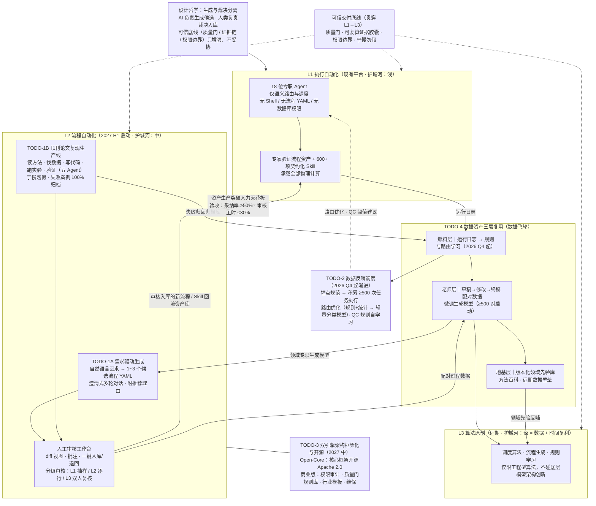

# 路线图 TODO 更新评审（L1→L2→L3 + 数据飞轮）

评审日期：2026-09-25
评审对象：TODO 更新规划图（mermaid）
评审方式：对仓库代码与文档逐条查证（只读调研）

## 一、规划图原文

## 二、总体判断

图整体合适：L1→L2→L3 分层与"生成与裁决分离"的叙事成立，L1 定位（护城河浅但地基实）准确。
最大的风险不在图本身，而在于 **L2 的两个 TODO（1A/1B）目前是 0 代码起点**，而 D2/D3 的数据积累又都依赖 L2 先跑起来——飞轮的冷启动问题图中没有体现。

## 三、图中各层 vs 仓库实况对照

| 图中声明 | 实况 | 证据 |
|---|---|---|
| 18 位专职 Agent、仅语义路由 | ✅ 属实 | `data/ai/*.yaml` 共 20 个 Agent 声明（减去 router/orchestrator 等即 18），`src/cygnusx/infrastructure/config/agent_loader.py:28`；路由在 `application/services/unified_intent_router.py` |
| 无 Shell / 无 YAML / 无 DB 权限 | 🟡 基本属实 | 三层白名单已落地：YAML `tool_packs` 声明式白名单（`agent_loader.py:269`）、builtin 网关注入身份防伪造、per-session Docker 沙箱。但**"无流程 YAML"没有显式 deny 机制**，靠受控工具提交流程实现 |
| 600+ 契约化 Skill | ✅ 属实 | `.agents/skills/` 实测 561 个 SKILL.md + 市场 601 个；契约校验在 `infrastructure/skills/skillmd.py`，五入口安装器在 `application/services/skill_import_service.py` |
| L1B"专家验证流程资产" | 🟡 只脚手架 | 只有 `tool_configs/evals/` 工具选择评估样本，无成体系的专家审核 workflow |
| 流程 YAML 资产 | 🟡 薄声明层 | `flow_registry.py` 有全套 pydantic 模型（FlowDefinition/GateDefinition/ReviewDefinition），但 `flows_design.md:246` 自承"参数类型为 any，不够精确"；真正 DAG 计算在 `pipelines/` 的 Snakemake |
| TODO-1A 需求→流程 YAML 生成 | ❌ 零代码 | 全库无相关实现 |
| TODO-1B 论文复现生产线 | ❌ 零代码 | 仅出现在比赛 BP 文案 |
| 人工审核工作台 | 🟡 工具级审批有，内容审核工作台无 | `ApprovalDrawer.vue`、`studio_approval_service.py`、Monaco diff 编辑器都在，但没有"流程草稿 diff→批注→入库/退回"的专门视图 |
| 运行日志 → D1 | ✅ 通道在 | OTel + `chat_message_events` 不可变事件表（sha256 可复算）+ `tasks` 表 |
| TODO-4 数据飞轮（配对数据/微调/规则学习） | ❌ 零痕迹 | grep 无任何匹配；`routing_observability.py` 只记录不学习 |
| TODO-3 Open-Core 开源 | 🟡 方向冲突需注意 | 现有 `LICENSE` 是 **Apache-2.0 + Commons Clause**（source-available，非 OSI 开源）；"商业版功能另收费"和 Commons Clause 矛盾，拆分前必须换 license |
| 质量门/证据链 | ✅ 最硬的部分 | `domain/mas/quality_gate.py`、`artifact_manifest.py` sha256 对账、审计链服务都已落地 |

## 四、图本身的修改建议

1. **S4 内 `D1 --> D2 --> D3` 画成单向链是错的**。燃料层→老师层→地基层不是数据流向依赖（日志不会"变成"配对数据再"变成"先验库），三者是并列的三个资产层，各自独立产出，共同反哺。建议去掉这条链，只保留指向 L3/T1A 的虚线。
2. **验收指标"采纳率 ≥50%、审核工时 ≤30%"是拍脑袋数字**，写成验收线会把不可证伪的目标变成承诺。建议标为"试点目标"或注明基线来源。
3. **哲学节点 P 只实线指向 S1**，但文字说"贯穿 L1→L3"。建议把 P 改成虚线连 S1/S2/S3（像 QM 那样），或去掉 P→S1 的实线避免歧义。
4. **T2 的虚线指回 L1A 形成唯一跨层回环**，视觉上 OK，但 T2 本质是 L1 的内部增强、不属于 L2，放在 S2 和 T3 之间位置有误导，建议挪到 S1 下方。
5. **T1B 的五 Agent 与 L1A 的 18 位 Agent 关系没交代**——复用还是新造？这是落地时第一个会被问的问题，值得在图上加注释。

## 五、落地建议（按依赖排序）

- **2026 Q4 先做 T2 的埋点强化**（成本最低、通道已有）：把 `chat_message_events` + `routing_observability` 的消费端补上——这是 D2 配对数据（≥500 对）和路由学习的前提，现在只采不用。
- **TODO-1A 可借力已有资产**：`flow_schema_compiler.py` 已把 FlowDefinition 编译成 LLM 可用 JSON Schema，需求→YAML 生成可直接拿它做约束解码/校验器，不用从零造。
- **审核工作台先做最小版**：ApprovalDrawer + Monaco diff 都在，缺的是"草稿对象 + 批注数据模型 + 入库动作"，一个 schema + 一个视图即可，不必等 L2 启动。
- **开源前必须先处理 license**：Commons Clause 与 Open-Core 战略直接冲突，建议 TODO-3 启动前（2026 Q4 末）定夺。
- **补飞轮冷启动路径**：D2 依赖 L2 产出配对数据，建议加"先人工造 100~200 对种子配对数据"的启动路径。
