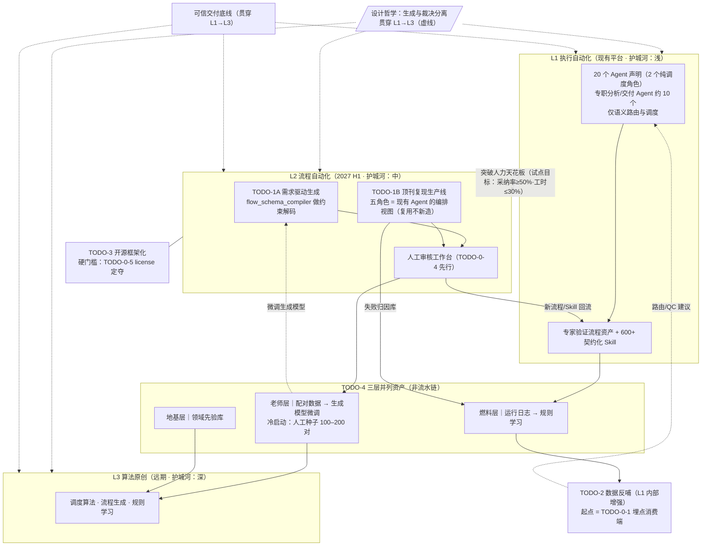

# 平台技术演进路线图 v3.0（更新计划）

> CygnusX BioOps / OmicHub · 从"分析替代"到"算法与框架"
> 作者：张建 · 修订：2026-09-25（基于《roadmap_todo_review_2026-09.md》代码实况评审；v3.0.1 二轮查证校正，见〇.6）
> 基线文档：《平台技术演进路线图 v2.1》《BP v2.2》《答辩 PPT v1》

---

## 〇、本次更新说明（v2.1 → v3.0 改了什么）

评审方式：对仓库代码与文档逐条查证（只读调研），结论分三级：✅ 属实 ／ 🟡 部分落地 ／ ❌ 零代码。

1. **新增 TODO-0（2026 Q4 前置强化包）**：评审发现 L2 全部零代码起点、飞轮无冷启动路径、license 与开源战略冲突——这三件事不解决，2027 H1 的 L2 启动就是空中楼阁。TODO-0 把评审的五条落地建议全部收编，按依赖排序。
2. **验收指标降级为"试点目标"**："采纳率 ≥50%、审核工时 ≤30%"原为拍脑袋数字，写成验收线等于把不可证伪的目标变成承诺。v3.0 统一标注为试点目标，并写明基线来源与校准方式。
3. **数据飞轮改画为并列三层**：燃料层→老师层→地基层不是数据流向依赖（日志不会"变成"配对数据再"变成"先验库），三者是三个独立的资产层，各自产出、共同反哺。
4. **补充代码锚点**：每个 TODO 标注可直接复用的已有模块（`flow_schema_compiler.py`、`ApprovalDrawer`、质量门等），让 2027 年的开发从"从零造"变为"在已有地基上搭"。
5. **明确 T1B 五 Agent 与现有 Agent 体系的关系**：复用，不新造（见 3.2）。

### 〇.6 v3.0.1 二轮查证校正（2026-09-25 第二轮代码核实）

对 v3.0 全文又做了一轮逐条代码查证，以下表述与实况不符，已就地修正：

1. **"18 位专职 Agent"数字成立、定性不准**：`data/ai/*.yaml` 实为 20 个声明，减去 router/orchestrator 两个纯调度角色算术上得 18，但 18 里混有 general/code/explorer/viz/mcp_builder/skill_builder/cloud_ops/shania 等通用与工程角色，真正专职组学分析/交付的约 9–10 个。全文改为"20 个 Agent 声明、2 个纯调度角色、专职分析/交付约 10 个"。
2. **"NCBI/EBI 拉取已在"言过其实**：平台仅有 EBI/ENA 下载集成（`pipelines/EBIDownload/` Rust 二进制，经 `tool_configs/download/` 调用），且 `features.ebi: false` 默认关闭；NCBI 无平台级实现，仅有编码助手技能。已改为如实表述。
3. **Skill 市集元数据无"输入契约"**：实测 frontmatter 字段为 name/description（承载触发条件）/skill_id/version/category 等，`skillmd.py` 只强制 name/description 必填，无机器可校验的输入参数 schema（参数契约在工具层 `tool_configs/tools_schema.yaml`）。已修正并列为 TODO-0-3 的延伸补强方向。
4. **"一键重跑"仅限局部**：环境快照已强制（`environment_snapshot` 登记 + 声明式环境还原），但重跑只有 Studio 卡片/任务级重试，流程级一键重跑无实现。已修正并列为待补项。
5. **文档间引用多处落空**：BP v2.3、答辩 PPT v2、"论文矩阵"在仓库均不存在（BP 只有 v2.2 docx，开源内容在 `06_开源与推进计划.md` 而非"BP 9.2"，合规内容在 BP 第 4/8 章而非"第 12 章"）。全部引用已改为仓库实有文档。

---

## 一、演进总纲

### 1.1 现状定位（经代码查证后的准确表述）

当前平台解决的是**"分析替代"（Analysis Automation）**：

- AI 的角色是**调度员**：只做语义路由与任务调度，不生成流程、不写底层 ✅（`unified_intent_router.py`；`data/ai/*.yaml` 共 20 个 Agent 声明，其中 router/orchestrator 为纯调度角色，专职组学分析/交付 Agent 约 10 个——rnaseq、atacseq、scrna×4、qc、data、delivery，其余为通用/工程角色）；
- 能力边界**基本**受控 🟡：YAML `tool_packs` 声明式白名单 + builtin 网关注入身份 + per-session Docker 沙箱三层已落地，但**"无流程 YAML 写权限"没有显式 deny 机制**，靠受控工具提交流程间接实现（→ TODO-0-2）；
- 计算发生在**专家审核、版本化管理的流程资产**内（561 个 `SKILL.md` + 市场 601 项，契约校验在 `skillmd.py`）；
- 交付物带**可复算证据链** ✅（`quality_gate.py`、`artifact_manifest.py` sha256 对账、审计链——**这是全仓最硬的部分，也是一切上层建设的地基**）。

这一层的价值：效率（1 天 → 30 分钟）+ 可信（机器可核验）+ 合规（数据不出域）。
这一层的局限：资产生产依赖**专家人力**——Skill 市集的扩张速度 = 专家的编码速度，存在人力天花板。

### 1.2 演进方向：三层升级（现状列经评审校正）

| 层级 | 名称 | 核心问题 | 产出形态 | 护城河深度 | 代码现状 |
|---|---|---|---|---|---|
| L1 | 执行自动化（现有平台） | 让执行更快、更可信 | 产品 | 浅（工程可复制） | ✅ 主体落地，权限 deny 与流程 YAML 精度待补 |
| L2 | 流程自动化（TODO-1） | 让资产生产突破人力天花板 | 框架 + 方法论文 | 中（机制难抄） | ❌ 零代码；审核工作台有工具级组件可复用 |
| L3 | 算法原创（TODO-2/4 反哺） | 让调度与生成本身智能化 | 算法 + 领域先验 | 深（数据+时间复利） | ❌ 零痕迹；运行日志通道已在（只采不用） |

### 1.3 核心设计哲学（贯穿全部 TODO，不变）

**生成与裁决分离**：AI 负责出草稿，人类负责签字画押。
- AI 的智力用于"生成候选"（广撒网），人类的判断用于"裁决入库"（严把关）；
- 裁决过程的每一次修改记录，都是下一轮生成模型的训练数据；
- 可信交付的底线（质量门、证据链、权限边界）在所有层级保持不变，只增强、不妥协。

---

## 二、TODO-0 前置强化包（2026 Q4，新增）

> 评审核心发现：L2 是零代码起点，而 D2/D3 的数据积累依赖 L2 先跑起来；另有 license 冲突与权限缺口。以下五项按依赖排序，全部在 2027 H1 之前完成。**本月主线仍是 V1 投稿，TODO-0 为轻量并行项，不挤占 V1 时间。**

### 2.1 TODO-0-1 埋点消费端建设（成本最低、优先级最高）

**现状**：`chat_message_events`（sha256 可复算不可变事件表）+ `tasks` 表 + OTel + `routing_observability.py`——**通道全部在，但只采不用**。
**任务**：
1. 定义统一运行日志消费 schema：路由路径、成败标记、失败归因分类（环境/数据/代码/资源）、各阶段耗时分布（即 TODO-2 埋点规范的正式版）；
2. 写一个最小消费端：定时聚合 → 落一张 `routing_stats` 汇总表 → 平台健康度仪表盘（月度对比：排队时长、资源利用率、首成率）；
3. **验收（可工程验证）**：消费端上线后，任意一次任务执行可在仪表盘查到完整路由与耗时记录。

### 2.2 TODO-0-2 权限显式 deny 机制

**现状**："Agent 无流程 YAML 写权限"只有正向白名单，没有显式拒绝。
**任务**：在 builtin 网关层增加 deny 规则（对 Shell、流程 YAML 写、数据库写三类显式拒绝并记录审计日志），并把 deny 事件接入 2.1 的日志规范。
**验收**：渗透测试用例——Agent 会话内所有渠道（直接调用、工具包装、提示词诱导）均无法触及 deny 清单。

### 2.3 TODO-0-3 流程 YAML 参数类型精确化

**现状**：`flow_registry.py` 的 pydantic 模型全套在（FlowDefinition/GateDefinition/ReviewDefinition），但 `flows_design.md:246` 自承"参数类型为 any，不够精确"。
**任务**：为核心流程（RNA-seq、ATAC-seq）的参数定义精确类型与取值域枚举——**这一步本身就是 TODO-1A 的"约束解码器"素材**，先精确化，生成时才有据可依。
**验收**：两个核心流程的全部参数具备类型 + 取值域 + 默认值 + 校验错误信息。

### 2.4 TODO-0-4 审核工作台最小版（复用现有组件）

**现状**：`ApprovalDrawer.vue`、`studio_approval_service.py`、Monaco diff 编辑器都在，但都是"工具级审批"，没有"流程草稿 diff → 批注 → 入库/退回"的内容审核视图。
**任务**：一个 schema（草稿对象 + 批注数据模型）+ 一个视图（复用 Monaco diff + ApprovalDrawer），支持 diff 对比既有相似流程、批注、一键入库/退回。
**验收**：端到端走通一次"YAML 草稿 → 审核 → 入库为候选流程"。**此工作台是 TODO-1A 的裁决端，先于 L2 启动就做好了。**

### 2.5 TODO-0-5 License 定夺（阻塞 TODO-3 的决策点）

**现状**：现有 LICENSE 为 **Apache-2.0 + Commons Clause**（source-available，非 OSI 开源），与 Open-Core 战略（"商业版功能另收费"）直接矛盾。
**任务**：2026 Q4 末前定夺三选一：① 移除 Commons Clause，纯 Apache-2.0 + 商标/服务收费；② 维持 Commons Clause，放弃"开源"叙事，改打"源码可得"牌；③ 双仓库拆分（框架库纯 Apache-2.0，产品仓库 Commons Clause）。
**验收**：书面决策 + LICENSE 文件更新 + 开源相关文档（`docs/competition/2026-agentteams-bioops/06_开源与推进计划.md`）措辞同步修订。**此决策不阻塞 TODO-0/1/2/4，但阻塞 TODO-3 的一切对外动作。**

### 2.6 TODO-0-6 飞轮种子数据（冷启动路径）

**任务**：在 TODO-1A 上线前，人工构造 100–200 对种子配对数据（需求描述 → 手写流程 YAML → 终稿），覆盖 2–3 类高频分析（RNA-seq 差异、功能富集、细胞注释）。
**意义**：D2（老师层）依赖 L2 产出配对数据——没有种子数据，飞轮的冷启动要等 L2 跑半年。**人工种子让"老师"在"学生"出生前就备好课。**

---

## 三、TODO-1 自动流程生成框架（2027 H1 启动）

**目标**：Skill/流程资产的生产从"专家手搭"双轨化为"AI 生成、专家审核"。
**前置依赖**：TODO-0 的 3/4/6 完成（参数类型化、审核工作台、种子数据）。
**试点目标**（原"验收标准"，基线为 TODO-0-6 种子数据 + 试点期实测校准）：AI 草稿入库采纳率 ≥50%；审核工时 ≤ 人工从零搭建的 30%。*注：数字为试点目标而非承诺，首个试点周期（约 3 个月）结束后按实测修订。*

### 3.1 子模块 A：需求驱动生成（借力 flow_schema_compiler，非零起点）

**输入**：用户自然语言需求（如"做一下免疫浸润分析"）
**输出**：候选流程 YAML（模块组合 + 参数建议 + QC 规则草案）

1. **需求解析协议**：意图分类（任务类型/物种/数据类型/分组设计）→ 缺失信息触发澄清式多轮对话（复用平台已有的提交预检机制）；
2. **候选生成器**：基于 Skill 市集元数据（description 承载触发条件、version/revision 版本管理）做语义检索 + 组合规划，生成 1–3 个候选方案（含推荐理由）。*注意：Skill 层无机器可校验的输入参数 schema（输入靠 Markdown 正文约定，参数契约在工具层 `tool_configs/tools_schema.yaml`）——Skill 输入契约化是 TODO-0-3 的延伸补强方向，补上前生成器的组合规划只能依赖自然语言描述匹配；*
3. **约束解码/校验器（关键复用点）**：`flow_schema_compiler.py` 已能把 FlowDefinition 编译成 LLM 可用的 JSON Schema——直接用作生成的结构化输出约束与事后校验器，**配合 TODO-0-3 的参数类型精确化**，从机制上压低幻觉空间；
4. **人工审核**：走 TODO-0-4 的工作台；
5. **分级审核规范**：L1 级（参数变更/模块替换）抽样审核；L2 级（新组合）逐行审核；L3 级（新算法/新质控规则）双人复核；
6. **试点**：选 2–3 类高频分析流程走通全链路，记录采纳率与修改率（这就是 TODO-0-6 种子数据覆盖的那几类）。

### 3.2 子模块 B：顶刊论文复现生产线

**核心思路**：多 Agent 分工复现顶刊论文方法 → 复现成果沉淀为平台资产。
**与现有 Agent 体系的关系（评审追问，先答死）：复用，不新造。** 五角色不是五个新 Agent，而是复现任务对现有 Agent 能力的**编排视图**——读方法/找数据/写代码/写报告复用现有分析域与通用域 Agent，跑实验复用 per-session Docker 沙箱与任务队列，验证复用质量门与证据胶囊机制。差异仅在提示词编排与过程归档，不动 Agent 本体。

**五角色分工（编排层定义）**：

| 角色 | 职责 | 复用的现有能力 |
|---|---|---|
| 读方法 | 解析论文方法部分 → 结构化方法卡（Method Card） | 意图解析 + 通用 Agent |
| 找数据 | 寻找公开数据/基准数据集；找不到 → 标记"数据缺口"转半复现（模拟数据验流程） | EBI/ENA 下载已集成（`pipelines/EBIDownload/` + `tool_configs/download/`，**默认关闭**需 `enable_ebi_download` 开启）；NCBI/SRA 暂无平台级实现（仅有编码助手技能，复现前需补建） |
| 写代码 | 生成实现代码/流程 YAML，优先用平台已有 Skill 组装，代码全文可查 | Skill 市集 + TODO-0-3 类型化 YAML |
| 跑实验 | 沙盒执行、记录环境与资源 | Docker 沙箱 + 任务队列 + 证据链（全在） |
| 验证 | 结果与原论文基准对比，出具一致性报告 | 质量门 + artifact_manifest 对账 |

**复现验证标准（铁律：宁慢勿假）**：
- 复现结果必须与原论文核心指标达到预定义一致性阈值（按领域惯例）；
- 全部通过平台质量门：结构化 QC + 环境快照（已有，`environment_snapshot` 强制登记 + 声明式环境还原）+ 重跑（**当前仅 Studio 卡片/任务级重试，流程级一键重跑无实现 → 复现生产线启动前需补建**）；
- **失败案例 100% 归档**：失败归因分类（数据缺失/参数歧义/实现差异/原文有误）——失败归因库是 TODO-2 规则学习的重要输入。

**首批复现对象**：从与团队当前研究主线相关的顶刊方法中选定 5–10 篇（具体清单单独维护，不进本路线图）。

### 3.3 与论文产出 / 商业计划的映射

> 注：论文矩阵文档尚未在仓库建档（现有投稿材料仅 `docs/competition/IBEC/submission/` 与初赛 BP/PPT），下表为规划性映射，论文矩阵建档后应与本表对齐。

| TODO | 论文产出 | 商业产出 |
|---|---|---|
| TODO-0 + 1A/B | V2 论文的方法学主体（多 Agent 协作建模框架）+ 复现基准库 | Skill 市集自生产能力 = 交付成本递减 |
| TODO-2 | 调度优化短文/技术报告 | "越用越聪明"的产品叙事 |
| TODO-3 | 框架白皮书 → 潜在系统论文（**前提：TODO-0-5 license 已定**） | 开源生态 = 获客漏斗 + 标准话语权 |
| TODO-4 | 领域先验库 → L3 算法论文的数据基础 | 数据壁垒 = 估值支撑 |

---

## 四、TODO-2 数据反哺的调度算法（2026 Q4 起渐进，起点是 TODO-0-1）

**目标**：让平台越跑越聪明——用运行数据持续优化 Agent 路由、资源调度与 QC 规则。
**现状**：通道在（chat_message_events + routing_observability），只采不用；v3.0 起点改为"消费端已上线"（TODO-0-1）。

1. **埋点规范正式版**（2026 Q4，= TODO-0-1 交付物）；
2. **数据积累期**（2026 Q4–2027 Q1）：≥500 次任务执行；
3. **路由优化**（2027 Q1–Q2）：第一版规则+统计（高频任务固定路由表、相似度 top-k）→ 第二版轻量分类模型（任务描述→Expert 选择）；离线 A/B 对比评估；
4. **QC 规则自学习**（2027 Q2 起）：误杀/漏放案例分析 → 阈值调优建议（人工确认生效）→ 试点"低风险规则自动更新 + 审计日志"；
5. **调度效率基线**：平台健康度仪表盘（TODO-0-1 交付物）输出月度对比报告。

**试点目标**：QC 误杀率较基线下降 ≥20%；路由首成率提升具统计显著性。*基线 = TODO-0-1 上线后第一个完整月的实测数据。*

---

## 五、TODO-3 双引擎架构框架化与开源（2027 中，硬门槛：TODO-0-5 已定夺）

1. **架构抽象**：生信特定部分（预检字段、Artifact 类型、QC 规则库）抽离为可配置业务层；框架核心（调度、权限、审计、证据链、Skill 契约）与业务无关；
2. **框架白皮书**：架构设计文档（学术版叙事，复用 BP"双引擎解耦"框架，补充形式化描述）——开源文档 + 潜在论文素材；
3. **Open-Core 边界落地**（对齐《06_开源与推进计划》，措辞随 TODO-0-5 决策修订）：开源版核心框架 + 基础流程模板；商业版权限与审计、质量门规则库、行业模板、维保；
4. **非生信场景迁移试点**（通用性验证）：材料计算 / 工程仿真 / 金融风控流水线选一个，搭最小可用实例；
5. **社区运营**：GitHub 建仓、README、快速开始、示例项目、贡献者指南；以试装→试用→商务转化漏斗衡量。

---

## 六、TODO-4 数据资产三层复用（三层并列，非单向链）

> 评审修正：燃料层/老师层/地基层不是"日志变成配对数据再变成先验库"的流水链，而是**三个并列的资产层，各自独立产出、共同反哺**。

| 层 | 数据 | 技术 | 产出 | 启动条件 / 试点目标 |
|---|---|---|---|---|
| 燃料层（2026 Q4 起） | 运行日志（路由、成败、耗时、失败归因） | 统计分析 → 规则挖掘 | 调度优化、QC 阈值建议（→ TODO-2） | 消费端上线即可启动；误杀率降 ≥20% 为试点目标 |
| 老师层（预计 2027） | "需求/论文 → AI 草稿 → 人工修改 → 终稿"配对过程数据 | 领域适配 LoRA 或全量微调 | 领域流程生成模型 | **冷启动：TODO-0-6 人工种子 100–200 对**；正式积累靠 TODO-1 上线后；≥500 对启动微调，微调后一次通过率较基线提升 ≥30% 为试点目标 |
| 地基层（远期，随客户数据规模） | 复现方法库 + 基准数据集 + 验证过的流程变体 | 版本化"领域方法百科" | L3 算法论文的数据基础 | 每方法含：论文出处、实现、基准结果、适用场景、已知局限 |

**合规红线（提前修墙，对齐 BP 第 4/8 章合规相关表述）**：

| 数据类型 | 使用权限 | 处理方式 |
|---|---|---|
| 论文复现数据（公开来源） | 可自由用于平台改进 | 记录出处与许可证 |
| 平台运行匿名化统计 | 可用于规则学习 | 去标识化 |
| 客户数据 | 须授权分级 | 训练用途单独授权条款 + 脱敏 + 审计 |

---

## 七、里程碑总表（v3.0）

| 时间 | 里程碑 |
|---|---|
| 2026 Q4 | **TODO-0 完成**：埋点消费端、显式 deny、参数类型化、审核工作台最小版、license 定夺、种子数据 100–200 对；V1 投稿 |
| 2027 Q1 | 运行数据 ≥500 次达标；V2 双 Agent 立项；TODO-1A 原型（基于 flow_schema_compiler 约束生成） |
| 2027 H1 | TODO-1A/B 正式启动：流程生成协议 + 复现生产线首篇跑通；试点目标首次校准（采纳率/审核工时实测） |
| 2027 中 | TODO-3 启动（**前提：license 已定夺**）：架构抽象 + 框架白皮书 |
| 2027 Q4 | V2 论文投出；复现完成 ≥5 篇；老师层微调数据量达标评估（≥500 对） |
| 2028 | 老师层微调启动；系统论文（V3）成稿；非生信场景试点 |

---

## 八、风险登记（v3.0，按评审增补）

| 风险 | 概率 | 应对 |
|---|---|---|
| **L2 零代码起点，2027 H1 启动延期**（评审新增） | 中 | TODO-0 把约束生成器、审核工作台、种子数据全部前置到 2026 Q4；TODO-1A 借力 flow_schema_compiler 而非从零造 |
| 飞轮冷启动：D2 无配对数据可吃（评审新增） | 高（若无种子数据） | TODO-0-6 人工种子 100–200 对；老师层启动条件写死 ≥500 对，不到不开工 |
| **License 冲突导致开源叙事翻车**（评审新增） | 中 | TODO-0-5 在一切对外动作前定夺；开源文档（《06_开源与推进计划》）措辞同步修订 |
| 论文复现失败率高（领域常识 70% 难复现） | 高 | 半复现模式；失败归因强制归档，失败也是资产 |
| 审核人力成为新瓶颈（AI 生成快、人审慢） | 中 | 分级审核 + 抽样审核；审核量喂养老师层微调，长期递减 |
| 数据量不足撑不起老师层微调 | 中 | 启动条件写死（≥500 对），先用规则学习顶着 |
| 开源后分叉/大厂跟进 | 中 | Open-Core 边界：价值重心在持续更新的规则库与模板生态（防分叉逻辑见《06_开源与推进计划》） |
| 客户数据合规风险 | 低（架构已预留） | 授权条款前置 + 脱敏 + 审计三件套，商务谈判时即写入 |

**边界红线（铁律，不变）**：
1. "算法"仅指调度算法、流程生成、规则学习（工程型算法，主场）；**不碰底层模型架构创新**；
2. 所有 TODO 不得挤占 V1 投稿时间——**本月主线只有 V1**；
3. 宁慢勿假：所有 AI 生成资产必须过质量门入库，生成速度永远让位于可信交付；
4.（新增）TODO-3 的一切对外动作（建仓、宣传、社区运营）以 TODO-0-5 license 定夺为前置门槛。

---

## 九、规划图 v2（按评审修正重绘）

---

> 本路线图与《CygnusX_BioOps_BP_v2.2》（docx）、《初赛路演 PPT v1》（`docs/competition/2026-agentteams-bioops/`）、《平台技术演进路线图 v2.1》并档保存。
> 下次评审：2026 年 10 月 8 日（国庆假期后），重点检查 TODO-0 六项的完成度。
