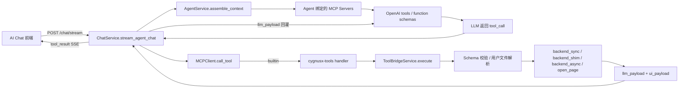
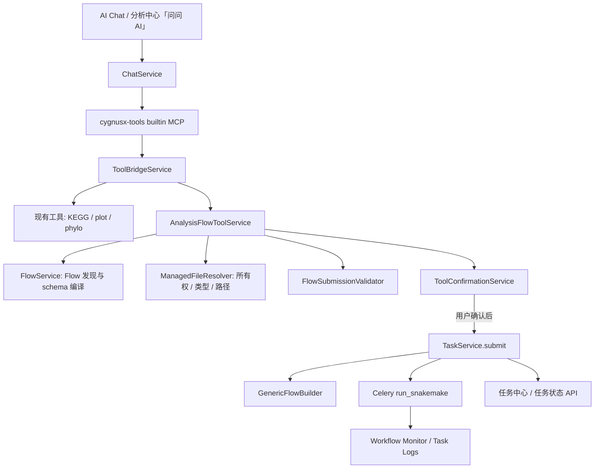

# CygnusX 分析中心与 AI 助手整合设计

> **目的**：梳理当前工具箱 MCP 的真实实现，明确分析中心（Flow / Task / Snakemake）接入 AI 助手时应复用的链路、需要补齐的能力与实施顺序。  
> **适用范围**：RNA-seq、ATAC-seq 及后续由 `flows/*.yaml` 声明的分析流程。  
> **设计原则**：AI 只能在受控工具契约内发现、预检和提交任务；实际流程执行必须继续复用分析中心的标准任务链路。

---

## 1. 结论摘要

当前项目已经具备让 AI 调用工具箱所需的主干能力：

1. `tools_schema.yaml` 以 JSON Schema 描述 AI 可调用工具；
2. `cygnusx-tools` 是一个动态的 builtin MCP，能把这些 Schema 暴露给 Agent；
3. `ToolBridgeService` 负责参数校验、用户文件解析、进程内分发和双通道结果打包；
4. `ChatService.stream_agent_chat()` 已能执行 MCP tool call，并通过 SSE 把结果回灌模型和前端；
5. 分析中心已有成熟的 `TaskService.submit()`：它会生成流程输入、创建标准任务、投递 Celery/Snakemake、写监控配置并处理任务计费。

因此，**分析中心不应另起一套“AI 执行器”或把 Flow 放进通用 ARQ 工具作业**。推荐方案是：

> 在现有 builtin MCP `cygnusx-tools` 中新增“分析中心工具族”，由一个 `AnalysisFlowToolService` 在用户确认后调用 `TaskService.submit()`；AI 只做流程发现、参数收集、预检和确认前说明，Celery/Snakemake 继续负责实际计算。

这能保证 AI 提交的任务与分析中心网页提交的任务在以下方面完全一致：任务表记录、用户隔离、工作目录、样本表生成、监控日志、结果页、计费、失败处理和队列调度。

---

## 2. 依据与现状范围

本设计基于以下当前仓库实现与文档：

| 范围 | 关键文件 | 当前职责 |
|---|---|---|
| 工具箱 AI 设计 | `tool_configs/tools_update.md` | 工具 Schema、ToolBridge、builtin MCP、双通道结果和异步策略的总体设计 |
| 工具箱页面规范 | `tool_configs/tools_design.md` | 工具注册、路由、参数表单、数据处理与结果展示规范 |
| 工具 Schema | `tool_configs/tools_schema.yaml` | 已登记 KEGG、火山图、系统发育树、曼哈顿图等 AI 工具契约 |
| Schema 加载器 | `src/cygnusx/tools/schema_loader.py` | YAML 热加载、工具名索引、OpenAI function schema 转换 |
| 工具执行桥 | `src/cygnusx/application/services/tool_bridge_service.py` | 参数校验、`upload://` 解析、执行分发、确认占位、`llm_payload` / `ui_payload` |
| builtin MCP | `src/cygnusx/infrastructure/mcp/presets.py` | `cygnusx-tools` 动态注册与 handler 路由 |
| MCP 客户端 | `src/cygnusx/infrastructure/mcp/client.py` | builtin / stdio / SSE 三种 MCP transport 的调用与 `user_id` 注入 |
| Agent 与聊天 | `src/cygnusx/application/services/agent_service.py`、`chat_service.py` | Agent MCP 装配、模型工具调用闭环、SSE 事件输出 |
| Flow 定义 | `flows/rna_seq.yaml`、`flows/atac_seq.yaml` | 分析中心流程元数据、参数、样本表和 Snakemake 映射 |
| Flow 服务 | `src/cygnusx/application/services/flow_service.py` | Flow 发现、详情、参数、YAML 热加载 |
| 标准任务提交 | `src/cygnusx/application/services/task_service.py` | 构建流程文件、创建任务、投递 Celery、监控与计费 |
| 任务 API | `src/cygnusx/api/v1/tasks.py` | 当前用户任务提交、查询、日志/进度访问 |

---

## 3. 当前工具箱 MCP 如何实现

### 3.1 总体调用链



### 3.2 MCP Server 层

MCP 领域模型和客户端支持三种 transport：

| Transport | 用途 | 实现特点 |
|---|---|---|
| `builtin` | CygnusX 进程内服务 | 不经网络；handler 直接调用应用服务或 shim；适合平台内部工具 |
| `stdio` | 外部本地 MCP 服务 | 通过 MCP SDK 拉起命令并建立 stdio session；有命令/参数安全校验 |
| `sse` | 远程 MCP 服务 | 通过 MCP SDK SSE client 连接；有 URL 校验和超时隔离 |

内置 preset 原有文献、基因组、代码、知识库四类。`cygnusx-tools` 是额外的动态 builtin preset：

1. `presets.py` 调用 `schema_loader.to_openai_tools()`；
2. 每个 YAML 工具的 `name`、`description`、`input_schema` 被转换为 MCP tool；
3. 所有工具统一绑定 `_cygnusx_tools_handler()`；
4. handler 将 MCP 客户端注入的 `user_id` 和 tool name 传给 `ToolBridgeService.execute()`。

`MCPClient` 对 builtin handler 做了签名检测：如果 handler 声明 `user_id` 或 `tool_name`，便自动透传。这使内部工具从一开始就能按当前用户实施文件归属校验和权限隔离。

### 3.3 工具 Schema Registry

`tool_configs/tools_schema.yaml` 与只用于工具卡片展示的 `tools_setting.yaml` 分离。前者面向 LLM 与执行层，单个工具包含：

```yaml
key: phylogenetic-tree
name: cygnusx_build_phylogenetic_tree
description: 提交系统发育树构建任务
category: sequence
invocation_mode: backend_async
service: cygnusx.tools.phylogenetic_tree.service.PhylogeneticTreeService
requires_confirm: true
annotations:
  readOnlyHint: false
  destructiveHint: false
  openWorld: false
  idempotent: false
input_schema: {}
llm_result_fields: [task_id, status, message, success, error]
ui_result_fields: [task_id, status, progress_url, result_url]
```

`ToolsSchemaLoader` 的实际能力：

- 使用 Pydantic 校验 YAML；
- 按文件 mtime 热重载；
- 按工具 `name` 建立唯一索引；
- 将 `input_schema` 转为 OpenAI `function.parameters`；
- 工具定义无效时安全降级为空列表，而不是阻断聊天服务。

### 3.4 ToolBridge：当前工具执行的统一入口

`ToolBridgeService` 当前承担以下职责：

| 能力 | 当前实现 |
|---|---|
| 工具发现 | 按 MCP tool name 从 `ToolsSchemaLoader` 取 schema |
| 参数约束 | 必填字段、字符串长度、文本行数、枚举值白名单 |
| 文件引用 | 仅解析 `upload://file_id`，并限制在当前用户的聊天上传目录内 |
| 同步服务 | `backend_sync` 通过 import + service method 进程内调用 |
| 轻量 shim | `backend_shim` 调用 Python `execute(user_id=..., **args)` |
| 异步工具 | `backend_async` 投递 ARQ，立即返回 `task_id` |
| 前端跳转 | `open_page` 返回 route 引导，不执行工具 |
| 结果分流 | 依据字段白名单封装 `llm_payload` 和 `ui_payload` |
| 大结果保护 | `llm_payload` 超过 3KB 时降级为摘要，避免模型上下文膨胀 |

双通道结果是现有架构最重要的约束：

```json
{
  "success": true,
  "is_error": false,
  "llm_payload": {
    "task_id": "...",
    "status": "QUEUED",
    "summary": "任务已提交"
  },
  "ui_payload": {
    "task_card": {
      "task_id": "...",
      "flow_id": "rna_seq",
      "task_url": "/tasks/..."
    }
  }
}
```

- `llm_payload`：只保留模型下一轮需要理解的摘要、标识符和错误；
- `ui_payload`：可保留任务卡、图、表、下载链接等完整前端数据；
- 聊天服务将前者回灌为 OpenAI `role=tool` 消息，将后者随 SSE `tool_result` 发给浏览器。

### 3.5 ChatService 的工具调用闭环

Agent 的 `mcp_ids` 决定当前聊天可见的 MCP server。`AgentService.assemble_context()` 收集绑定 server 的工具，并转换为模型可调用的 OpenAI tools。

`ChatService.stream_agent_chat()` 负责最多多轮的 LLM → tool → LLM 闭环：

1. 流式接收模型文本及 `tool_calls`；
2. 检查工具是否属于当前 Agent 已挂载的 MCP server；
3. 经 `MCPClient.call_tool(..., user_id=user_id)` 调用；
4. 发送 `tool_call`、`tool_result` SSE 事件；
5. 将 `llm_payload` 回灌模型，并继续生成解释性回复。

聊天服务对最终回灌字符串仍有约 4000 字符保护；因此分析流程、表格、图形绝不能把完整结果塞入 `llm_payload`。

---

## 4. 当前分析中心如何执行 Flow

### 4.1 Flow 是声明，不是任务

`FlowService` 管理 `flows/*.yaml`：列举、按 ID 读取、获取参数和热重载。当前 RNA-seq / ATAC-seq YAML 已声明：

- `meta`：`id`、名称、描述、分类；
- `parameters`：项目名、物种、参考版本、原始数据路径、分析开关、高级参数等；
- `sample_sheet`：样本行需要的列及约束；
- `comparisons`：差异比较的对照组与处理组；
- `execution`：Snakemake snakefile、默认资源、配置文件参数；
- `pipeline_mapping`：前端参数如何写入流程配置、样本表和比较表。

Flow YAML 本身**不会**执行任务。`GET /api/v1/flows/*` 主要服务于分析中心前端的流程展示和动态表单。

### 4.2 标准任务链路

网页与 API 的分析任务提交通过 `POST /api/v1/tasks`，请求模型为：

```json
{
  "flow_id": "rna_seq",
  "name": "可选任务名",
  "parameters": {},
  "sample_sheet": [],
  "comparisons": [],
  "execution_mode": "local"
}
```

核心入口是 `TaskService.submit(user_id, TaskSubmitRequest)`，它依次完成：

1. 用 `FlowService` 读取 Flow 定义；
2. 生成 task UUID 与按用户隔离的工作目录；
3. 锁定提交参数快照；
4. 用 `GenericFlowBuilder` 写入底层流程配置、样本表和比较表；
5. 写入 workflow monitor 配置；
6. 创建并持久化标准 Task 记录；
7. 投递 `run_snakemake.delay(...)` 到 Celery；
8. 将任务推进为 `QUEUED`；
9. 在启用时处理饼干预扣等提交侧逻辑。

后续 Snakemake 日志、任务状态、结果路径和监控均围绕这个 Task 记录流转。因此 AI 提交流程必须调用这一入口。

### 4.3 不应复用的路径

`ToolBridgeService` 当前 `backend_async` 分支会投递 ARQ 的 `run_tool_async`。它适合系统发育树这类独立工具作业，但并不创建分析中心标准 Task，也不自动调用 `GenericFlowBuilder`、Celery `run_snakemake` 或 workflow monitor。

因此下面的做法是错误的：

```text
Flow MCP tool -> ToolBridge backend_async -> ARQ run_tool_async -> 直接执行 Snakemake
```

这会形成两套任务 ID、两套监控与两套结果模型，导致任务中心、计费、日志和权限审计割裂。

仓库还保留了 `src/cygnusx/application/services/ai_tools.py` 中的 `AIToolExecutor`：它提供旧式 `submit_task`、`query_status`、`list_samples`，其中 `submit_task` 已直接调用 `TaskService.submit()`。该实现可作为权限与任务提交行为的参考，但不应继续扩展为第二套 Agent 工具协议；当前聊天主链已经使用 Agent + MCP + ToolBridge。建议在分析中心 MCP 工具落地后，将旧 executor 收敛为 `AnalysisFlowToolService` 的内部复用代码或标记为兼容层，避免同一业务出现两套 Schema、确认逻辑和审计记录。

---

## 5. 当前缺口与风险

| 缺口 | 现状 | 影响 | 设计要求 |
|---|---|---|---|
| Flow 未暴露为 MCP tool | `tools_schema.yaml` 无 Flow tool | LLM 无法发现分析中心能力 | 增加动态 Flow 工具编译层 |
| Bridge 无数据库上下文 | 现有 sync/shim service 默认无参构造 | 无法安全调用 `TaskService(db)` | 为 builtin 调用传递受控 `ToolInvocationContext` |
| ARQ 与标准 Task 不同 | `backend_async` 只产生 ARQ job | 不能用于 Flow | Flow 必须通过 `TaskService.submit()` + Celery |
| 二次确认只是占位 | `requires_confirm` 依据 `_confirmed` 参数判断 | LLM 可能直接构造 `_confirmed`，不能作为授权边界 | 服务端签发/消费 confirmation token；前端显式确认 |
| 聊天上传解析只读小文本 | `upload://` 会读取文本内容，且限 5MB | 不适用于 FASTQ、BAM、参考目录等大文件 | 建立受控文件引用解析器，返回文件元数据/内部路径而非正文 |
| Flow JSON schema 不够精确 | `FlowService.get_flow_json_schema()` 参数类型当前为 `any` | LLM 难以得到严谨参数 contract | 从 `Parameter`、sample sheet、comparisons 编译 MCP JSON Schema |
| 条件参数未被 AI 执行 | Flow 有 `condition` / group / section | 可能提交互相矛盾的参数 | 预检服务必须复用/扩展 Flow 条件与业务校验 |
| 状态查询分散 | 旧 `AIToolExecutor` 有直连 task status | 与 MCP 新主链可能双轨 | 统一为分析中心 MCP read-only 工具 |

---

## 6. 推荐目标架构

### 6.1 服务边界

推荐保留一个 builtin MCP：**`cygnusx-tools`**。分析中心工具作为其命名空间下的工具族，而不是额外创建一个与工具箱竞争的 MCP server。

原因：

- Agent 只需绑定一个内部平台工具 MCP；
- Schema、ToolBridge、SSE 结果卡和权限模式可复用；
- 未来 KEGG、绘图、建树和 Flow 可在同一会话内组合；
- 不会把内部数据库 session 暴露给 stdio/SSE 外部 MCP。



### 6.2 新增组件及职责

| 组件 | 建议位置 | 职责 |
|---|---|---|
| `FlowToolSchemaCompiler` | `src/cygnusx/tools/flow_schema_compiler.py` | 从 `FlowConfig` 生成 LLM 可用 JSON Schema、工具描述和参数说明 |
| `AnalysisFlowToolService` | `src/cygnusx/application/services/analysis_flow_tool_service.py` | 流程发现、预检、确认预览、调用 `TaskService.submit()`、查询任务摘要 |
| `FlowSubmissionValidator` | `src/cygnusx/domain/flow/submission_validator.py` | 验证参数、条件可见性、样本表、比较组、资源/执行模式策略 |
| `ManagedFileResolver` | `src/cygnusx/application/services/managed_file_resolver.py` | 将聊天/文件中心的受控 file ref 解析为元数据，校验用户归属与类型 |
| `ToolConfirmationService` | `src/cygnusx/application/services/tool_confirmation_service.py` | 创建一次性确认记录、校验用户/会话/参数哈希、消费确认 token、记录审计 |
| `ToolInvocationContext` | `src/cygnusx/application/schemas/tool_invocation.py` | 仅供 builtin 调用的 `user_id`、`agent_id`、`session_id`、`db`、request trace 信息 |
| `AnalysisTaskCard` | `src/cygnusx/application/schemas/analysis_tool.py` | 标准化 UI 任务卡 payload，避免前端猜字段 |

### 6.3 ToolBridge 的扩展方式

不要让 `AnalysisFlowToolService` 通过 HTTP 再调用 `/api/v1/tasks`。应在同一进程直接调用应用服务，并显式传入数据库会话：

```text
ChatService
  -> MCPClient.call_tool(..., invocation_context)
  -> builtin cygnusx-tools handler
  -> ToolBridgeService.execute(context, tool_name, arguments)
  -> AnalysisFlowToolService(context.db).submit_after_confirmation(...)
  -> TaskService(context.db).submit(context.user_id, request)
```

实现建议：

1. `ChatService` 创建 `ToolInvocationContext`；
2. `MCPClient` 只对 `builtin` handler 透传该 context，外部 stdio/SSE MCP 不可见；
3. `_cygnusx_tools_handler()` 将 context 传给 Bridge；
4. Bridge 新增 `invocation_mode: analysis_flow`，或为 Flow tool 使用专门 handler；
5. 该分支禁止无 session 调用，避免 service 自行偷偷创建不受控 session。

---

## 7. 分析中心 MCP 工具契约

### 7.1 建议的初始工具集

先实现“发现 → 预检 → 人工确认 → 提交 → 查询”闭环，而不是第一期就让模型直接执行所有高级参数。

| Tool | 副作用 | 是否需确认 | 主要用途 |
|---|---:|---:|---|
| `cygnusx_list_analysis_flows` | 否 | 否 | 列出对 AI 开放的 Flow、适用场景与输入要求 |
| `cygnusx_describe_analysis_flow` | 否 | 否 | 返回单个 Flow 的参数、样本表、比较组、说明与 AI 提示 |
| `cygnusx_list_available_input_files` | 否 | 否 | 列出当前用户可用于分析的受控文件/目录引用 |
| `cygnusx_prepare_rna_seq_submission` | 否 | 否 | 校验/规范化 RNA-seq 提交参数，生成确认预览 |
| `cygnusx_prepare_atac_seq_submission` | 否 | 否 | 校验/规范化 ATAC-seq 提交参数，生成确认预览 |
| `cygnusx_confirm_analysis_submission` | 是 | **前端显式确认** | 消费确认 token，并调用 `TaskService.submit()` |
| `cygnusx_get_analysis_task_status` | 否 | 否 | 查询当前用户自己的标准 Task 状态与进度 |
| `cygnusx_get_analysis_task_summary` | 否 | 否 | 任务完成后返回受控摘要、报告/下载链接，不回灌大日志 |

工具命名应保持 `cygnusx_` 前缀，避免与外部 MCP 或模型自带工具冲突。

### 7.2 为什么使用每个 Flow 一个 prepare tool

推荐第一期生成 `cygnusx_prepare_rna_seq_submission`、`cygnusx_prepare_atac_seq_submission`，而不是只提供一个嵌套很深的通用 `submit_flow`：

- 当前 Flow 的 parameters、group、section、condition 差异明显；
- 每个 tool 可以生成精确的 `input_schema`、枚举、默认值、字段说明；
- 模型更容易正确填充 `sample_sheet` 与 `comparisons`；
- 可逐个 Flow 开启、灰度和回滚；
- 后续新增 YAML Flow 时可自动生成同类型 prepare tool。

但真正写任务仍应收敛为一个通用服务：`AnalysisFlowToolService.prepare(flow_id, ...)` 与 `submit_confirmed(confirmation_id, ...)`。

### 7.3 Prepare tool 的输入与输出

以 RNA-seq 为例，MCP schema 应由 YAML 编译，但概念契约如下：

```json
{
  "name": "cygnusx_prepare_rna_seq_submission",
  "parameters": {
    "type": "object",
    "properties": {
      "name": {
        "type": "string",
        "description": "用户必须提供的、用于任务中心识别的任务名称",
        "minLength": 1,
        "maxLength": 128
      },
      "parameters": {"type": "object", "description": "由 RNA-seq Flow 参数 schema 约束"},
      "sample_sheet": {
        "type": "array",
        "description": "样本行；字段由 Flow sample_sheet.columns 定义"
      },
      "comparisons": {
        "type": "array",
        "description": "差异比较组；Control/Treat 必须存在于样本 group 中"
      }
    },
    "required": ["name", "parameters", "sample_sheet"]
  }
}
```

**任务名称为所有分析流程的必填提交字段。** Web 表单、`POST /api/v1/tasks`、MCP Prepare 工具和确认提交链路都必须要求用户提供去除首尾空白后非空、最长 128 个字符的 `name`；不得自动生成任务名称或以流程名称、项目名称替代。

Prepare 不创建 Task，不投递 Celery，不扣费。它的成功结果应包含：

```json
{
  "success": true,
  "llm_payload": {
    "flow_id": "rna_seq",
    "ready": true,
    "sample_count": 6,
    "comparison_count": 1,
    "enabled_modules": ["QC", "DEG", "report"],
    "confirmation_required": true,
    "summary": "RNA-seq 任务已通过预检，等待用户确认提交。"
  },
  "ui_payload": {
    "confirmation_card": {
      "confirmation_id": "opaque-token",
      "flow_id": "rna_seq",
      "flow_name": "RNA-seq 差异表达分析",
      "task_name": "...",
      "sample_count": 6,
      "comparison_count": 1,
      "resource_hint": {"cores": 8, "memory": "32G", "time": "4h"},
      "parameter_preview": {},
      "expires_at": "..."
    }
  }
}
```

### 7.4 Confirm / submit 的安全模型

当前 `ToolBridgeService` 中 `requires_confirm` 仅是一个交互占位：调用参数中带 `_confirmed` 即可继续。它不能作为真正的授权控制，因为模型或客户端可自行构造该字段。

分析流程必须使用**服务端一次性确认记录**：

1. Prepare 完成后，`ToolConfirmationService` 写入 Redis（短 TTL，例如 10 分钟）或数据库；
2. 记录至少包含：`confirmation_id`、`user_id`、`agent_id`、`session_id`、`flow_id`、规范化后的 `TaskSubmitRequest`、参数哈希、创建/过期时间、状态；
3. 前端显示确认卡，用户点击“确认提交”后调用专用 API；
4. API 从认证上下文取得 user ID，校验记录归属、未过期、未消费、参数哈希一致；
5. 服务端调用 `TaskService.submit()`，原子标记确认记录已消费；
6. 返回标准任务卡并记录审计日志；
7. LLM 不持有可绕过确认的 `_confirmed` 开关，也不能自行消费 token。

推荐 API：

```http
POST /api/v1/ai/tool-confirmations/{confirmation_id}/approve
POST /api/v1/ai/tool-confirmations/{confirmation_id}/reject
```

确认 API 的响应应是标准化 `AnalysisTaskCard`，前端将其作为聊天消息的 tool result 卡片展示。聊天 SSE 不应在等待确认期间保持连接或轮询任务。

### 7.5 Submit 后的 UI / LLM 结果

确认提交成功后的 Bridge/确认 API 返回：

```json
{
  "success": true,
  "llm_payload": {
    "task_id": "uuid",
    "flow_id": "rna_seq",
    "status": "QUEUED",
    "summary": "RNA-seq 分析已提交到分析中心。"
  },
  "ui_payload": {
    "task_card": {
      "task_id": "uuid",
      "status": "QUEUED",
      "progress": 0,
      "task_url": "/tasks/uuid",
      "logs_url": "/api/v1/tasks/uuid/logs"
    }
  }
}
```

完成后，AI 的任务摘要工具只应提供：状态、进度、时间、受控结果文件/报告链接、错误摘要、少量 QC/DEG 指标。不要向模型回灌 Snakemake 全量日志、样本原始内容、巨型表格或完整 HTML 报告。

---

## 8. Flow Schema 到 MCP JSON Schema 的编译规则

### 8.1 基础类型映射

`FlowToolSchemaCompiler` 应从 `FlowConfig.parameters` 递归生成 JSON Schema：

| Flow parameter type | MCP JSON Schema |
|---|---|
| `string` / `textarea` | `type: string`，保留 description、placeholder、max length |
| `number` | `type: number`，保留 min/max/default |
| `integer` | `type: integer` |
| `boolean` | `type: boolean` |
| `select` / radio | `type: string` + `enum` |
| `multi_select` | `type: array` + `items.enum` |
| `file` / `directory` | 受控 `file_ref` / `directory_ref` 字符串，而非宿主绝对路径 |
| `group` | `type: array`，`items` 为 group 子参数 object |
| `section` | 嵌套 object，或者在工具层展开为允许字段；应保留原始路径映射 |

### 8.2 必填、默认和条件

编译器必须区分：

- **硬必填**：Flow 中 `required: true` 且在当前条件下可见；
- **条件必填**：依赖某个 bool/select 条件；先允许模型填入，再由预检器判断是否需要；
- **默认值**：可以展示给模型，但不要把未显式确认的高级默认值伪装成用户选择；
- **隐藏参数**：当条件不满足时，预检器应丢弃或拒绝该字段，避免 `deg=false` 却提交 comparisons/DEG 参数的矛盾状态。

建议第一期的 tool schema 保持“宽输入 + 严预检”：JSON Schema 负责结构和枚举，复杂 condition/跨字段规则由 `FlowSubmissionValidator` 统一处理并输出可修正错误。

### 8.3 样本表和比较组

当前 Flow 已在 YAML 中定义 sample sheet 列和 comparison 映射。AI 提交时应：

1. 从 `sample_sheet.columns` 编译样本行 object；
2. 校验 required 列、类型、唯一性规则；
3. 对每个 `raw_data_path` / 文件字段用 `ManagedFileResolver` 校验用户归属；
4. 验证 comparisons 的 `Control` / `Treat` 均存在于 sample sheet group；
5. 在预检成功时返回样本数、组别、比较数和缺失字段摘要；
6. 不允许模型输入未经平台管理的宿主绝对路径、`..` 路径或 shell 片段。

---

## 9. 权限、安全、资源与审计

### 9.1 必须遵循的安全边界

| 领域 | 要求 |
|---|---|
| 用户隔离 | 所有 file ref、Task、确认记录、状态查询均以认证 user ID 过滤 |
| 流程白名单 | 只能调用 `flows/*.yaml` 中 `ai.enabled: true` 的 Flow；不可让模型传 snakefile 路径 |
| 参数白名单 | 仅接受 YAML 已声明参数；忽略/拒绝未知参数和执行器额外 CLI 参数 |
| 文件访问 | 文件中心/聊天附件统一解析；禁止绝对路径、任意目录浏览和把 FASTQ 正文塞给模型 |
| 重计算确认 | 创建 Task、扣费或占资源的操作必须通过服务端确认 token |
| 配额 | 限制每用户并发 Flow、每天提交数、每会话确认次数、预计资源上限 |
| 幂等性 | 确认记录单次消费；可选 idempotency key，防双击/网络重试重复提交 |
| 审计 | 记录 agent、session、tool、确认人、规范化参数摘要、task ID、拒绝/失败原因 |
| 日志脱敏 | MCP/聊天日志不保存完整 sample sheet、原始序列、密钥或受控文件绝对路径 |

### 9.2 Flow 的 AI 开放配置

建议为 Flow 引入显式 `ai` 配置，而不是默认将所有流程暴露给模型：

```yaml
meta:
  id: rna_seq
  name: RNA-seq 差异表达分析

ai:
  enabled: true
  tool_slug: rna_seq
  assistant_summary: 适用于有分组信息的 bulk RNA-seq 差异表达分析。
  requires_confirmation: true
  allowed_execution_modes: [local]
  allowed_parameters:
    - project_name
    - Genome_Version
    - species
    - raw_data_path
    - Library_Types
    - only_qc
    - deg
    - report
    - comparisons
  default_resource_hint:
    cores: 8
    memory: 32G
    time: 4h
```

实现时需在 `FlowConfig` Pydantic 模型中正式声明该字段；不要仅依赖 `extra=ignore` 静默吞掉配置错误。

### 9.3 Flow YAML 的 UI Schema 扩展（前端表单渲染）

> 详见 `docs/26.7.27/CygnusX分析中心前端优化方案-YAML驱动表单.md`

在现有 Flow YAML 基础上，增加**可选** `ui` 提示块与流程级 `groups` 定义，
使通用渲染器能够按分组、双列网格、模块卡等方式动态生成表单，**无需为每个流程硬编码页面**。

**流程级分组定义 `groups`**（与 `parameters` 同级，可选）：

```yaml
groups:
  - id: basic
    title: "基本信息"
    desc: "项目标识与执行方式"
  - id: data
    title: "参考与数据"
    desc: "参考基因组、物种与输入输出路径"
  - id: modules
    title: "分析模块"
    desc: "选择本次运行的分析内容"
    collapsible: false
  - id: advanced
    title: "高级参数"
    desc: "一般无需修改"
    collapsible: true
    collapsed: true
```

**参数级 `ui` 提示块**（每个参数可选，全部字段可缺省，向后兼容）：

| 字段 | 类型 | 说明 |
|---|---|---|
| `group` | string | 分组 id；缺省按默认规则（required→basic, boolean→modules, 其余→advanced） |
| `order` | int | 组内排序；缺省按声明顺序 |
| `span` | 1\|2 | 占列数；默认短字段 1、长字段 2 |
| `widget` | string | `input`\|`select`\|`switch`\|`path`\|`textarea`；缺省按 type 推断 |
| `placeholder` | string | 输入占位文本 |
| `subgroup` | string | 模块组内二级小标题（仅 modules 组） |
| `exclusive` | bool | 互斥开关（如"仅运行 QC"开启时其余模块置灰） |

**差异比较组联动 `ui`**（`type: group` 参数）：

```yaml
ui:
  show_when:
    field: "deg"
    value: true
  linked_group_column: "group"
```

**样本表 `ui` 提示**：

```yaml
sample_sheet:
  ui:
    import: [paste, csv, datacenter]
    group_column: group
```

**向后兼容保证**：所有 `ui` 字段均可缺省，旧 YAML 零改动可正常运行；`groups` 未定义时渲染器使用默认三组。

---

## 10. 前端交互设计

### 10.1 两个入口，共用同一后端

1. **AI 聊天页**：用户自然语言描述分析目标，AI 发现 Flow、收集缺失信息、发起预检、展示确认卡。
2. **分析中心 Flow 页面**：增加“让 AI 帮我配置”入口，带上当前 `flow_id`、已填写参数、已选文件/样本表，跳转或嵌入 Agent Workspace。

两者必须最终调用相同的 `AnalysisFlowToolService` 和 `TaskService.submit()`；AI 只是另一种表单编排界面，而非另一套执行后端。

### 10.2 聊天消息卡片

前端应在现有 `tool_result` 处理基础上扩展：

| Card | 触发 | 内容 | 操作 |
|---|---|---|---|
| Flow 信息卡 | list / describe | 流程简介、适用数据、必填输入 | “使用此流程” |
| 参数缺失卡 | prepare 校验失败 | 缺少字段、样本表错误、比较组错误 | “补充信息” / 跳转分析表单 |
| 确认卡 | prepare 成功 | 流程、样本数、比较、资源、预计扣费、参数摘要 | 确认提交 / 取消 |
| 任务卡 | confirm 成功 | task ID、队列状态、进度、开始时间 | 打开任务中心 / 查看日志 |
| 完成摘要卡 | get summary | 结果摘要、报告、下载链接 | 打开报告 / 下载 |

确认卡不能仅作为文字提醒，必须由受认证保护的 approve API 执行。

### 10.3 任务进度

Flow 已有 Task/Celery/Workflow Monitor 通道。AI 页面不应创建新的长轮询：

- 确认后立即返回 Task Card；
- 卡片复用已有任务状态 API / WebSocket / SSE；
- 用户可进入现有任务中心与 workflow monitor；
- AI 想了解进度时，通过 read-only `cygnusx_get_analysis_task_status` 查询摘要。

### 10.4 分析中心表单渲染器设计与实现（已落地）

> 对应优化方案：`docs/26.7.27/CygnusX分析中心前端优化方案-YAML驱动表单.md`

#### 10.4.1 设计原则

1. **Schema 驱动，不硬编码**：一切分组 / 布局 / 控件偏好通过 YAML 的 `ui` 提示表达；
   渲染器对缺失提示有合理默认（向后兼容，旧 YAML 零改动可运行）。
2. **三段式心智模型**：提交页 = 基础配置（必填主链）→ 样本表 → 吸底提交栏；
   功能开关收进"分析模块"分组。
3. **宽屏收敛**：表单内容区 `max-width: 1080px`；同组内短字段双列排布。
4. **提交前可见代价**：费用、必填校验状态、样本数统计在提交栏聚合并常驻可见。

#### 10.4.2 后端模型扩展

所有 Pydantic 模型使用 `extra="forbid"` 严格校验，因此新增的 YAML 字段必须同步注册到后端模型：

| 文件 | 新增模型 / 字段 |
|---|---|
| `src/cygnusx/domain/flow/value_objects.py` | `ParameterUIHint`、`FlowGroupDefinition`、`SampleSheetUIConfig` |
| `src/cygnusx/domain/flow/entities.py` | `Parameter.ui`、`FlowConfig.groups` |
| `src/cygnusx/application/schemas/flow.py` | `FlowDetailDTO.groups`、`sample_sheet` 序列化使用 `by_alias=True` |

**`ParameterUIHint`** 字段：`group`、`order`、`span`(1|2)、`widget`、`placeholder`、`subgroup`、`exclusive`、`show_when`、`linked_group_column`。

**`FlowGroupDefinition`** 字段：`id`、`title`、`desc`、`collapsible`、`collapsed`。

**`SampleSheetUIConfig`** 字段：`import`(alias，YAML 中写 `import`，序列化为 `import`)、`group_column`。

#### 10.4.3 前端类型定义

`frontend/src/types/schema.ts` 同步新增对应 TypeScript 接口：

```typescript
export interface ParameterUIHint {
  group?: string | null
  order?: number | null
  span?: 1 | 2 | null
  widget?: string | null
  placeholder?: string | null
  subgroup?: string | null
  exclusive?: boolean
  show_when?: Record<string, unknown> | null
  linked_group_column?: string | null
}

export interface FlowGroupDefinition {
  id: string
  title: string
  desc?: string
  collapsible?: boolean
  collapsed?: boolean
}

export interface SampleSheetUIConfig {
  import?: string[]
  group_column?: string | null
}
```

`Parameter` 接口增加 `ui?: ParameterUIHint | null`；`FlowConfig` 增加 `groups?: FlowGroupDefinition[] | null`。

#### 10.4.4 页面整体结构

```text
┌ PageHeader：流程名称 + 一句话说明 + 右侧按钮（GitHub / 文档）─────────────┐
├ 内容区（max-width 1080px，居中，padding 24px）────────────────────────────┤
│  任务名称* 输入框（必填，非空，最长 128 字符）                              │
│  ▎基本信息（分组标题 16px/600 + 4px 主题色竖条 + 12px 灰说明）             │
│    项目名称*        │ 客户/课题组*        （双列网格，gap 20px）            │
│    执行模式*        │ 集群队列（条件显示）                                  │
│  ▎参考与数据                                                               │
│    参考基因组版本*  │ 物种*                                                │
│    链特异性*        │ 比对工具*（仅 ATAC-seq）                              │
│    原始数据目录*（path 控件，整行 span=2）                                  │
│    结果交付目录（path 控件，整行 span=2）                                    │
│  ▎分析模块（模块卡网格，subgroup 分簇）                                     │
│    ┌ 质控 ────────────────────────────────────────────┐                    │
│    │ [仅运行QC]  [FastQ Screen]                       │                    │
│    ├ 差异与注释 ─────────────────────────────────────┤                    │
│    │ [DEG]  [HTML 报告]  [rMATS]                      │                    │
│    ├ 结构变异 ───────────────────────────────────────┤                    │
│    │ [变异]  [新转录本]  [基因融合]                    │                    │
│    └─────────────────────────────────────────────────┘                    │
│  ▸ 高级参数（折叠面板，默认收起，展开动画 200ms）                            │
│  ▎样本表（独立区域，行号 + 批量导入 + 行内校验 + 分组统计）                  │
│  ▎差异比较组（独立区域，与样本表 group 列联动）                              │
├ 吸底提交栏（毛玻璃 backdrop-filter blur 12px）───────────────────────────┤
│  [费用/余额/徽标]     [校验状态 + 样本统计]      [提交按钮 140px]          │
└───────────────────────────────────────────────────────────────────────────┘
```

#### 10.4.5 分组布局渲染（DynamicForm.vue）

`DynamicForm.vue` 接收 `parameters` + `groups` 两个 prop，根据 `groups` 是否存在自动选择渲染模式：

**分组模式（groups 非空）**：
1. 遍历 `groups` 定义，按 `id` 收集属于该组的参数（依据 `parameter.ui.group`）；
2. 组内参数按 `ui.order` 排序；
3. `modules` 组渲染为**模块卡网格**（2~3 列 `auto-fill minmax(240px, 1fr)`）；
4. `advanced` 组（`collapsible: true`）渲染为折叠面板（`NCollapse`）；
5. 其余组渲染为**双列网格**（`grid-template-columns: 1fr 1fr`，`span=2` 跨整行）；
6. `<768px` 退化为单列。

**平铺模式（groups 为空 / null）**：
1. 按 `parameter.order` 排序所有可见参数；
2. 逐行渲染 `label + control + help_text`；
3. 保持与旧版一致的布局，向后兼容。

**分组标题样式**：16px/600 + 左侧 4px×18px 主题色竖条（`var(--brand-primary)`）+ 同行右侧 12px 灰说明。

**参数缺省分组规则**（YAML 未声明 `ui.group` 时）：
- `required: true` → `basic`
- `type: boolean` → `modules`
- 其余 → `advanced`

#### 10.4.6 分析模块卡片（modules 组）

模块组不使用常规双列网格，而是渲染为**网格卡片**：

```text
┌─────────────────┐  ┌─────────────────┐
│ [SWITCH] DEG    │  │ [SWITCH] 报告   │
│ 使用 DESeq2...  │  │ 生成完整分析... │
└─────────────────┘  └─────────────────┘
```

- 卡片 `padding: 12px 16px`，`border: 1px`，`border-radius: 8px`；
- **开启态**：边框 `var(--brand-primary)` + 背景 `rgba(76,111,255,0.04)`；
- **互斥禁用**：当 `ui.exclusive: true` 的开关（如"仅运行 QC"）开启时，
  其余所有模块卡 `opacity: 0.45; pointer-events: none`；
- `subgroup` 分簇：同一 `subgroup` 值内的卡片归为一簇，簇上方显示 13px/500 二级小标题。

#### 10.4.7 path 控件（FormField.vue）

当 `ui.widget === 'path'` 或参数 name 包含 `dir|path` 时：
- `NInput` 使用等宽字体（`'SF Mono', 'Cascadia Code', 'Fira Code', 'Consolas', monospace`）；
- 右侧附加「选择目录」图标按钮（复用 `FilePickerModal`）；
- 选中后回填路径到 `formValues[name]`。

#### 10.4.8 样本表组件（FlowSubmitView.vue 内联）

**表头**：行号列（40px `<th>#</th>`）+ 各列名 + 红色 `*` 标记必填（弃用红底胶囊 NTag）+ 操作列。

**批量导入三入口**（按 `sample_sheet.ui.import` 声明渲染按钮组，置于区域标题右侧）：
1. **粘贴导入**：弹层（`NModal`）内粘贴 Excel/TSV 文本，按 Tab 或逗号分隔解析后写入；
2. **上传 CSV**：`<input type="file">` hidden + FileReader 解析，支持列名映射（表头比对 + 索引对齐）；
3. **从数据管理选择**：复用 `FilePickerModal`。

**行内校验**：
- `sample` 重复 → 单元格红框（`cell-error`）；
- 必填列为空 → 单元格黄框（`cell-warning`）；
- 校验函数 `isSampleRowValid(row)` 返回每列的状态。

**底部统计**：`共 N 样本 · M 个分组 (Tumor: 3, Control: 3)`，从 `sampleSheet` 动态计算。

**添加样本**：虚线描边全宽按钮 `<NButton dashed block>`。

**删除**：行尾图标按钮（`TrashOutline`），`hover` 变红，`<768px` 时仍可用（单行不可删）。

#### 10.4.9 差异比较组联动（FlowSubmitView.vue 内联）

- 从 `parameters` 中提取 `type: 'group'` 且有 `comparisons` name 的参数；
- **条件显示**：读取 `ui.show_when`（如 `{ field: 'deg', value: true }`），仅对应开关为 `true` 时渲染；
- **选项联动**：对照组 / 实验组 select 的选项 = 样本表 `group_column` 列的去重值（`groupValues` computed），样本表变更即时联动；
- **无分组引导**：当 `groupValues` 为空时显示引导文案：`请先在样本表填写 group 列`；
- **方向明示**：每组渲染为 `对照 [select] ──vs──→ 实验 [select]` 结构，避免 DEG 最常见错误（方向搞反）；
- **失效清理**：watch `groupValues`，当已选的 Control/Treat 不在新 groupValues 中时自动清空；
- **多组**：列表堆叠，可单独删除。

#### 10.4.10 吸底提交栏

固定在页面底部（`position: fixed; bottom: 0; z-index: 100`）：

| 区域 | 内容 |
|---|---|
| 左 | 预估费用 + 当前余额 + 余额状态 NTag（充足绿 / 不足红） |
| 中 | 必填校验提示（`还有 N 项必填未填写`，红色）+ 样本统计摘要 |
| 右 | 提交按钮（主按钮，高 40px，宽 140px），提交中 loading + 禁用 |

**视觉**：毛玻璃效果 `background: rgba(255,255,255,0.85); backdrop-filter: blur(12px)` + 顶部 1px 分割线；暗色模式自动切换为 `rgba(21,26,37,0.88)`。

**提交前校验**：
1. 点击提交时先检查 `requiredFields`（遍历 required 参数判断空值）；
2. 若有缺失 → 不提交，`message.warning` 提示首个缺失字段名；
3. 余额不足 → 禁用按钮，不提交；
4. 全部通过 → 发送 `POST /tasks`，成功后 toast + 跳转任务详情。

**内容区底部 padding** = 80px（确保提交栏不遮挡最后内容）。

#### 10.4.11 组件文件清单

| 文件 | 角色 | 行数 |
|---|---|---|
| `frontend/src/types/schema.ts` | 类型契约（后端 → 前端） | ~170 |
| `frontend/src/views/FlowSubmitView.vue` | 页面编排：分组表单 + 样本表 + 比较组 + 吸底栏 | ~580 |
| `frontend/src/components/dynamic-form/DynamicForm.vue` | 通用表单渲染器：分组 / 双列网格 / 模块卡 / 折叠 / 平铺 | ~300 |
| `frontend/src/components/dynamic-form/FormField.vue` | 单字段控件：input / select / switch / path / textarea / file | ~140 |
| `frontend/src/components/dynamic-form/RepeatableGroup.vue` | 可重复参数组（group 类型参数） | 104 |
| `frontend/src/components/dynamic-form/CollapsibleSection.vue` | 折叠区域（section 类型参数） | 45 |
| `frontend/src/composables/useConditionEvaluator.ts` | 条件渲染评估器（与后端 condition.py 对齐） | 78 |
| `frontend/src/components/FilePickerModal.vue` | 文件/目录选择弹层 | 244 |
| `frontend/src/stores/cookie.ts` | 饼干预估 Pinia store | 72 |

#### 10.4.12 向后兼容与验收

- **旧 YAML 零改动**：`groups` 和 `ui` 均为可选，后端 `model_validate` 和前端渲染器都有默认分支；
- **渲染器默认规则**：无 `ui.group` 时按 `required` / `type` 自动归类；无 `groups` 定义时走平铺模式；
- **API 序列化**：`FlowDetailDTO` 的 `groups` 字段缺省为 `null`（旧流程无 groups 时不返回）；
- **已完成的 YAML**：`flows/rna_seq.yaml` v2.3.0、`flows/atac_seq.yaml` v0.1.0 均已补充完整 UI 提示。

| 验收项 | 状态 |
|---|---|
| RNA-seq 页面呈现 基本信息/参考与数据/分析模块/高级参数 四分组 | done |
| 开关以网格卡呈现，仅运行 QC 的互斥禁用生效 | done |
| 样本表三种批量导入可用，行内校验与底部分组统计正确 | done |
| 差异比较组选项随样本表 group 列联动，方向明示 | done |
| 提交栏吸底，未填必填时提交被拦截并提示 | done |
| 不修改任何 YAML 时，旧流程按默认规则渲染无异常 | done |
| `vue-tsc --noEmit` + `vite build` 零错误 | done |
| 25 个 flow 相关单测全部通过 | done |

---

## 11. 实施计划

### Phase 0：契约与基础设施（先完成）

1. 为 `FlowConfig` 增加显式 `ai` 配置模型；先只开启 RNA-seq、ATAC-seq。
2. 新建 `ToolInvocationContext`，修改 builtin MCP 调用链以安全传递当前 db/session、agent/session 标识。
3. 新建 `ManagedFileResolver`，统一聊天上传与文件中心 file reference 的归属校验。
4. 新建 `FlowSubmissionValidator`；覆盖 Flow 存在性、AI 开放状态、参数白名单、condition、样本表和 comparisons。
5. 为 `ToolBridgeService` 的现有 `_confirmed` 占位增加弃用说明；新的重计算工具不得依赖它授权。

### Phase 1：RNA-seq 最小闭环

1. 实现 `FlowToolSchemaCompiler`，生成 `cygnusx_list_analysis_flows`、`cygnusx_describe_analysis_flow`、`cygnusx_prepare_rna_seq_submission`。
2. 实现 `AnalysisFlowToolService.prepare()`，输出规范化请求和 confirmation record。
3. 实现 `ToolConfirmationService` 和 approve/reject API。
4. approve API 内部调用 `TaskService.submit()`，返回 Task Card。
5. 聊天前端增加确认卡、任务卡及错误卡；不得自动提交。
6. 单测覆盖：用户 A 无法引用用户 B 文件、缺失样本列、无效比较组、token 过期/重复消费、提交后 Task/Celery 调用正确。

### Phase 2：ATAC-seq、任务查询与分析中心入口

1. 生成 `cygnusx_prepare_atac_seq_submission`。
2. 实现 status / summary read-only tools。
3. 在 RNA/ATAC 分析中心页增加“问问 AI”按钮，将当前 Flow/表单上下文传入聊天。
4. 利用现有任务中心与 Workflow Monitor 展示后续进度；不新增后台长轮询。
5. 加入每用户并发、确认频率、资源上限和计费预览。

### Phase 3：Flow 自动化接入与体验完善

1. 新增 Flow YAML 时由编译器自动生成 prepare tool；仅 `ai.enabled` 流程可见。
2. 增加 Flow 专属系统提示模板、示例对话、输出解释规则。
3. 对工具调用、确认、Task 创建建立可检索审计记录。
4. 支持任务完成后由用户主动请求 AI 解读结果；结果文件仍以受控链接/摘要提供。

---

## 12. 需要修改或新增的文件清单

| 类型 | 建议文件 | 改动 |
|---|---|---|
| Flow 模型 | `src/cygnusx/domain/flow/entities.py` | 增加 `FlowAIConfig` 与 `FlowConfig.ai` |
| Flow YAML | `flows/rna_seq.yaml`、`flows/atac_seq.yaml` | 明确 `ai.enabled`、允许参数、资源提示 |
| Schema 编译 | `src/cygnusx/tools/flow_schema_compiler.py` | Flow → MCP JSON Schema |
| Tool registry | `src/cygnusx/tools/schema_loader.py` | 合并静态工具 Schema 与动态 Flow tools，或添加组合 loader |
| MCP preset | `src/cygnusx/infrastructure/mcp/presets.py` | 把 Flow tools 加入 `cygnusx-tools` handlers |
| 调用上下文 | `src/cygnusx/infrastructure/mcp/client.py`、`chat_service.py` | 仅 builtin 调用传 `ToolInvocationContext` |
| Flow AI 服务 | `src/cygnusx/application/services/analysis_flow_tool_service.py` | discover / describe / prepare / confirm submit / task query |
| 确认服务 | `src/cygnusx/application/services/tool_confirmation_service.py` | Redis/DB token、一次性消费、审计 |
| 文件解析 | `src/cygnusx/application/services/managed_file_resolver.py` | 受控文件引用及用户所有权校验 |
| 领域校验 | `src/cygnusx/domain/flow/submission_validator.py` | 条件、样本、比较与执行策略校验 |
| 确认 API | `src/cygnusx/api/v1/ai.py` 或新路由 | approve / reject confirmation endpoints |
| 聊天前端 | `frontend/src/composables/useAgentChatStream.ts`、AI chat card 组件 | confirmation/task/flow cards、approve 请求、UI payload 路由 |
| 分析中心前端 | `frontend/src/views/FlowSubmitView.vue` | “问问 AI”入口与表单上下文传递 |
| 测试 | `tests/unit/tools/`、`tests/integration/` | Flow schema、权限、确认、标准 Task 提交、SSE payload |

---

## 13. 验收标准

### 13.1 功能验收

- Agent 绑定 `cygnusx-tools` 后能发现 AI-enabled Flow；
- AI 能说明 RNA-seq / ATAC-seq 输入要求，并调用对应 prepare tool；
- Prepare 能指出缺失文件、错误样本列、无效比较组和互斥参数；
- 用户点击确认前，数据库不存在新 Task，Celery 不收到 Snakemake 作业；
- 用户确认后，任务由 `TaskService.submit()` 创建，任务中心可见，状态为 `QUEUED`；
- 任务日志和 Workflow Monitor 与网页提交任务一致；
- AI 能查询自己提交任务的状态和受控结果摘要。

### 13.2 安全验收

- 用户 A 不能通过 file ref、task ID、confirmation ID 读取/提交/确认用户 B 的资源；
- 模型传入 `_confirmed: true` 不会绕过人工确认；
- 过期、已消费、篡改参数的 confirmation token 会被拒绝；
- 非 `ai.enabled` Flow、未知 flow ID、未知参数、宿主绝对路径、任意 Snakemake CLI 参数均被拒绝；
- 每次 Flow 提交有可关联到 user / agent / chat session / task 的审计记录。

### 13.3 回归验收

- 现有 KEGG、火山图、曼哈顿图、系统发育树 MCP 工具仍可调用；
- 外部 stdio/SSE MCP 不会收到内部数据库 session 或用户敏感上下文；
- 分析中心网页原有 `POST /api/v1/tasks` 提交流程不变；
- Celery Flow 任务与 ARQ 工具任务仍使用各自正确的队列和状态模型。

---

## 14. 最终推荐

1. **统一入口**：继续使用 builtin MCP `cygnusx-tools`，不要新建与工具箱并行的 AI Flow 服务器。
2. **统一执行**：Flow 的最终提交只能走 `TaskService.submit()`，禁止直接启动 Snakemake 或走通用 ARQ `backend_async`。
3. **两阶段动作**：AI 先 prepare / validate，用户在前端确认卡批准后再 submit。
4. **精确 schema**：由 Flow YAML 动态生成每个 Flow 的 prepare tool，避免让模型猜复杂参数。
5. **双通道结果**：LLM 只接收任务摘要；任务卡、进度、图表、文件和报告交给 `ui_payload` 与既有任务中心。
6. **先小后大**：优先 RNA-seq 闭环，再 ATAC-seq，最后让新 Flow 通过 `ai.enabled` 自动接入。

按此设计推进，AI 助手将成为分析中心的受控自然语言入口，而不是绕开现有任务、权限和监控体系的第二套计算系统。
