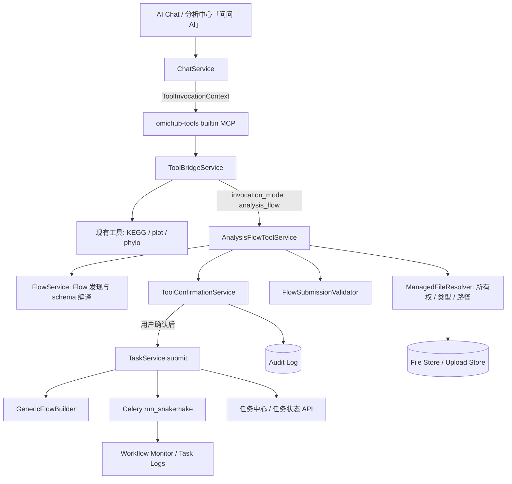

# OmicHub 分析中心与 AI 助手整合设计（细化版）

> **版本**：v1.1（细化可落地版）  
> **目的**：在 v1.0 架构基础上，补充各核心组件的详细设计、数据模型、接口契约、状态机与实施路线图，使其可直接进入开发排期。  
> **适用范围**：RNA-seq、ATAC-seq 及后续由 `flows/*.yaml` 声明的分析流程。  
> **设计原则**：AI 只能在受控工具契约内发现、预检和提交任务；实际流程执行必须继续复用分析中心的标准任务链路。

---

## 1. 结论摘要（无变化）

当前项目已经具备让 AI 调用工具箱所需的主干能力：

1. `tools_schema.yaml` 以 JSON Schema 描述 AI 可调用工具；
2. `omichub-tools` 是一个动态的 builtin MCP，能把这些 Schema 暴露给 Agent；
3. `ToolBridgeService` 负责参数校验、用户文件解析、进程内分发和双通道结果打包；
4. `ChatService.stream_agent_chat()` 已能执行 MCP tool call，并通过 SSE 把结果回灌模型和前端；
5. 分析中心已有成熟的 `TaskService.submit()`：它会生成流程输入、创建标准任务、投递 Celery/Snakemake、写监控配置并处理任务计费。

**推荐方案**：在现有 builtin MCP `omichub-tools` 中新增"分析中心工具族"，由一个 `AnalysisFlowToolService` 在用户确认后调用 `TaskService.submit()`；AI 只做流程发现、参数收集、预检和确认前说明，Celery/Snakemake 继续负责实际计算。

---

## 2. 依据与现状范围（无变化）

| 范围 | 关键文件 | 当前职责 |
|---|---|---|
| 工具箱 AI 设计 | `tool_configs/tools_update.md` | 工具 Schema、ToolBridge、builtin MCP、双通道结果和异步策略的总体设计 |
| 工具箱页面规范 | `tool_configs/tools_design.md` | 工具注册、路由、参数表单、数据处理与结果展示规范 |
| 工具 Schema | `tool_configs/tools_schema.yaml` | 已登记 KEGG、火山图、系统发育树、曼哈顿图等 AI 工具契约 |
| Schema 加载器 | `src/omichub/tools/schema_loader.py` | YAML 热加载、工具名索引、OpenAI function schema 转换 |
| 工具执行桥 | `src/omichub/application/services/tool_bridge_service.py` | 参数校验、`upload://` 解析、执行分发、确认占位、`llm_payload` / `ui_payload` |
| builtin MCP | `src/omichub/infrastructure/mcp/presets.py` | `omichub-tools` 动态注册与 handler 路由 |
| MCP 客户端 | `src/omichub/infrastructure/mcp/client.py` | builtin / stdio / SSE 三种 MCP transport 的调用与 `user_id` 注入 |
| Agent 与聊天 | `src/omichub/application/services/agent_service.py`、`chat_service.py` | Agent MCP 装配、模型工具调用闭环、SSE 事件输出 |
| Flow 定义 | `flows/rna_seq.yaml`、`flows/atac_seq.yaml` | 分析中心流程元数据、参数、样本表和 Snakemake 映射 |
| Flow 服务 | `src/omichub/application/services/flow_service.py` | Flow 发现、详情、参数、YAML 热加载 |
| 标准任务提交 | `src/omichub/application/services/task_service.py` | 构建流程文件、创建任务、投递 Celery、监控与计费 |
| 任务 API | `src/omichub/api/v1/tasks.py` | 当前用户任务提交、查询、日志/进度访问 |

---

## 3. 当前工具箱 MCP 如何实现（无变化，见原设计 §3）

> 为控制篇幅，本节保持原设计第 3 章内容不变。核心调用链：前端 → ChatService → AgentService → MCPClient → builtin handler → ToolBridgeService → 执行分支 → 双通道结果 → SSE 回传。

---

## 4. 当前分析中心如何执行 Flow（无变化，见原设计 §4）

> 关键结论：Flow YAML 本身不执行任务；网页/API 提交统一通过 `TaskService.submit()` 进入标准任务链路。AI 提交流程必须复用该入口，禁止走 `backend_async` → ARQ 旁路。

---

## 5. 当前缺口与风险（细化）

| 缺口 | 现状 | 影响 | 设计要求（细化后） |
|---|---|---|---|
| Flow 未暴露为 MCP tool | `tools_schema.yaml` 无 Flow tool | LLM 无法发现分析中心能力 | 增加 `FlowToolSchemaCompiler`，在运行时把 `ai.enabled=true` 的 Flow 编译为动态工具 |
| Bridge 无数据库上下文 | 现有 sync/shim service 默认无参构造 | 无法安全调用 `TaskService(db)` | 新增 `ToolInvocationContext`，仅在 builtin transport 透传；包含 `db`、`user_id`、`agent_id`、`session_id`、`request_id` |
| ARQ 与标准 Task 不同 | `backend_async` 只产生 ARQ job | 不能用于 Flow | 新增 `invocation_mode: analysis_flow`，强制调用 `TaskService.submit()` + Celery |
| 二次确认只是占位 | `requires_confirm` 依据 `_confirmed` 参数判断 | LLM 可能直接构造 `_confirmed`，不能作为授权边界 | 实现 `ToolConfirmationService`：服务端生成一次性 token → 前端显式确认 → 服务端校验归属/过期/参数哈希 → 原子消费 |
| 聊天上传解析只读小文本 | `upload://` 会读取文本内容，且限 5MB | 不适用于 FASTQ、BAM、参考目录等大文件 | `ManagedFileResolver` 区分内容引用（`upload://`）与元数据引用（`file://`）；对大文件返回元数据/内部路径而非正文 |
| Flow JSON schema 不够精确 | `FlowService.get_flow_json_schema()` 参数类型当前为 `any` | LLM 难以得到严谨参数 contract | 编译器从 `Parameter`、`sample_sheet`、`comparisons` 递归生成精确 JSON Schema，含枚举、范围、默认值、条件可见性提示 |
| 条件参数未被 AI 执行 | Flow 有 `condition` / group / section | 可能提交互相矛盾的参数 | 预检服务必须复用/扩展 Flow 条件校验；对隐藏参数执行"丢弃或拒绝"策略 |
| 状态查询分散 | 旧 `AIToolExecutor` 有直连 task status | 与 MCP 新主链可能双轨 | 统一为 `omichub_get_analysis_task_status` / `omichub_get_analysis_task_summary` 只读工具；旧入口标记 deprecated |
| 样本表体积问题 | 无 | 大样本集（>50 样本）作为 tool call 参数会超限或使模型出错 | 支持 `sample_sheet_ref` 模式：引用已保存的样本表，AI 只负责验证和比较组定义 |

---

## 6. 推荐目标架构（细化）

### 6.1 服务边界（细化）



### 6.2 新增组件及职责（细化）

| 组件 | 建议位置 | 职责 | 新增/修改 |
|---|---|---|---|
| `FlowToolSchemaCompiler` | `src/omichub/tools/flow_schema_compiler.py` | 从 `FlowConfig` 递归生成 LLM 可用 JSON Schema、枚举、条件提示、默认值；处理 `group`/`section` 嵌套；对大样本表生成 `sample_sheet_ref` 模式 | 新增 |
| `AnalysisFlowToolService` | `src/omichub/application/services/analysis_flow_tool_service.py` | 流程发现、详情、预检、确认预览、调用 `TaskService.submit()`、查询任务摘要与状态 | 新增 |
| `FlowSubmissionValidator` | `src/omichub/domain/flow/submission_validator.py` | 验证参数白名单、条件可见性、样本表必填/类型/唯一性、比较组有效性、资源/执行模式策略、互斥参数检查 | 新增 |
| `ManagedFileResolver` | `src/omichub/application/services/managed_file_resolver.py` | 解析 `upload://`/`file://`/`sample_sheet_ref://` 引用；校验用户归属；对大文件返回元数据（大小、类型、内部路径）而非正文；拒绝绝对路径和 `..` | 新增 |
| `ToolConfirmationService` | `src/omichub/application/services/tool_confirmation_service.py` | 创建/查询/消费一次性确认记录；校验归属、过期、参数哈希；幂等消费；记录审计日志 | 新增 |
| `ToolInvocationContext` | `src/omichub/application/schemas/tool_invocation.py` | 仅供 builtin 调用的上下文：user_id、agent_id、session_id、db session、request_id、timestamp；不可序列化 | 新增 |
| `AnalysisTaskCard` | `src/omichub/application/schemas/analysis_tool.py` | 标准化 UI 任务卡/确认卡 payload，避免前端猜字段 | 新增 |
| `FlowAIConfig` | `src/omichub/domain/flow/entities.py` | 新增 Pydantic 模型，声明 `ai.enabled`、`tool_slug`、`allowed_parameters`、`requires_confirmation` 等 | 修改 |

---

## 7. `ToolInvocationContext` 安全传递设计（新增）

### 7.1 数据结构

```python
class ToolInvocationContext(BaseModel):
    """
    仅供 builtin transport 使用的调用上下文。
    包含认证、追踪和数据库会话信息。
    必须确保该对象不会被序列化或传递给外部 MCP server。
    """
    model_config = ConfigDict(arbitrary_types_allowed=True)
    
    user_id: str
    agent_id: Optional[str] = None
    session_id: str
    request_id: str = Field(default_factory=lambda: str(uuid.uuid4()))
    db: AsyncSession  # SQLAlchemy session，不可序列化
    timestamp: datetime = Field(default_factory=datetime.utcnow)
    
    # 安全声明：禁止序列化
    _serializable = False
    
    def __serialize__(self):
        raise RuntimeError("ToolInvocationContext MUST NOT be serialized or passed to external MCP servers")
```

### 7.2 传递链路

```text
ChatService.stream_agent_chat()
  └─ 创建 ToolInvocationContext(user_id=..., session_id=..., db=db_session, request_id=...)
  └─ MCPClient.call_tool(tool_name, arguments, context=ToolInvocationContext)
     └─ transport == "builtin": 直接调用 _omichub_tools_handler(tool_name, arguments, **context.dict(exclude={'db'}), db=context.db)
     └─ transport == "stdio" | "sse": 忽略 context 参数；只传递 arguments
```

### 7.3 `MCPClient` 修改点

```python
async def call_tool(
    self, 
    server_name: str, 
    tool_name: str, 
    arguments: dict,
    context: Optional[ToolInvocationContext] = None
) -> ToolCallResult:
    transport = self._get_transport(server_name)
    
    if transport == "builtin":
        handler = self._builtin_handlers[server_name]
        # 检查 handler 签名是否接受 context
        if self._accepts_context(handler):
            return await handler(tool_name, arguments, context=context)
        else:
            return await handler(tool_name, arguments)
    else:
        # stdio / sse: 绝不传递 context
        if context is not None:
            logger.warning(f"ToolInvocationContext blocked for non-builtin transport: {server_name}")
        return await self._call_external_tool(transport, tool_name, arguments)
```

### 7.4 `_omichub_tools_handler` 修改点

```python
async def _omichub_tools_handler(
    tool_name: str, 
    arguments: dict,
    *,
    context: Optional[ToolInvocationContext] = None
) -> dict:
    """builtin handler 接收 context 并透传给 ToolBridgeService"""
    return await tool_bridge_service.execute(
        tool_name=tool_name,
        arguments=arguments,
        context=context  # 新增参数
    )
```

### 7.5 `ToolBridgeService.execute` 修改点

```python
async def execute(
    self,
    tool_name: str,
    arguments: dict,
    context: Optional[ToolInvocationContext] = None
) -> ToolResult:
    schema = self.schema_loader.get_schema(tool_name)
    
    if schema.invocation_mode == "analysis_flow":
        if context is None:
            raise PermissionError("analysis_flow tools require ToolInvocationContext")
        return await self._execute_analysis_flow(schema, arguments, context)
    
    # 现有模式保持不变，context 可选
    ...
```

---

## 8. `ToolConfirmationService` 详细设计（新增）

### 8.1 状态机

```
[PENDING] --(approve + 校验通过)--> [APPROVED] --(TaskService.submit 成功)--> [SUBMITTED]
   |
   |--(reject)--> [REJECTED]
   |
   |--(TTL 过期)--> [EXPIRED]
   |
   |--(参数哈希不一致 / 归属错误)--> [INVALID]（原子拒绝）
```

- `PENDING`：prepare 成功创建；
- `APPROVED`：用户点击确认，校验通过，但尚未调用 `TaskService.submit()`；
- `SUBMITTED`：`TaskService.submit()` 成功返回 task_id；
- `REJECTED`：用户点击取消；
- `EXPIRED`：TTL 到期（默认 30 分钟）；
- `INVALID`：校验失败（归属错误、参数哈希不一致、重复消费）。

### 8.2 数据模型（Redis + DB 双写）

**Redis（主存储，快速读写）**：

```
Key:    confirmation:{confirmation_id}
Type:   Hash
TTL:    1800 秒（30 分钟）
Fields:
  - user_id: str
  - agent_id: str
  - session_id: str
  - flow_id: str
  - flow_name: str
  - parameter_hash: str (SHA-256 of normalized JSON)
  - normalized_request: str (JSON string of TaskSubmitRequest)
  - status: PENDING
  - created_at: ISO timestamp
  - expires_at: ISO timestamp
  - consumed_at: null
  - task_id: null
```

**DB（持久化，审计）**：

```sql
CREATE TABLE tool_confirmation_records (
    id              UUID PRIMARY KEY DEFAULT gen_random_uuid(),
    confirmation_id UUID UNIQUE NOT NULL,  -- 即 Redis key
    user_id         UUID NOT NULL REFERENCES users(id),
    agent_id        UUID REFERENCES agents(id),
    session_id      UUID NOT NULL,
    flow_id         VARCHAR(64) NOT NULL,
    flow_name       VARCHAR(255),
    parameter_hash  VARCHAR(64) NOT NULL,
    normalized_request JSONB NOT NULL,
    status          VARCHAR(16) NOT NULL CHECK (status IN ('PENDING','APPROVED','REJECTED','EXPIRED','SUBMITTED','INVALID')),
    created_at      TIMESTAMPTZ NOT NULL DEFAULT now(),
    expires_at      TIMESTAMPTZ NOT NULL,
    consumed_at     TIMESTAMPTZ,
    task_id         UUID REFERENCES tasks(id),
    rejection_reason TEXT,
    -- 审计字段
    client_ip       INET,
    user_agent      TEXT
);

CREATE INDEX idx_tool_confirmation_user_status ON tool_confirmation_records(user_id, status, expires_at);
CREATE INDEX idx_tool_confirmation_session ON tool_confirmation_records(session_id);
```

### 8.3 核心方法

```python
class ToolConfirmationService:
    async def create(
        self,
        context: ToolInvocationContext,
        flow_id: str,
        normalized_request: TaskSubmitRequest,
        ttl_seconds: int = 1800
    ) -> ConfirmationRecord:
        """
        1. 生成 confirmation_id (UUID v4)
        2. 计算 parameter_hash (SHA-256 of sorted JSON)
        3. 写入 Redis (Hash + TTL)
        4. 写入 DB (status=PENDING)
        5. 返回 confirmation record
        """
        ...
    
    async def approve(
        self,
        context: ToolInvocationContext,
        confirmation_id: str
    ) -> ConfirmationResult:
        """
        1. 从 Redis 读取记录；若不存在，从 DB 读取（兜底）
        2. 校验：
           - user_id 匹配
           - status == PENDING
           - 未过期（Redis TTL 会自动淘汰，但 DB 层也需校验）
           - parameter_hash 一致（防篡改）
        3. 原子消费：Redis 中设置 status=APPROVED（Lua 脚本或 Redis 事务）
        4. 调用 TaskService.submit()
        5. 更新 Redis + DB：status=SUBMITTED, task_id=..., consumed_at=now()
        6. 返回 task_id 和 AnalysisTaskCard
        """
        ...
    
    async def reject(
        self,
        context: ToolInvocationContext,
        confirmation_id: str,
        reason: Optional[str] = None
    ) -> ConfirmationResult:
        """用户拒绝；更新 Redis + DB 状态为 REJECTED"""
        ...
    
    async def get_status(
        self,
        context: ToolInvocationContext,
        confirmation_id: str
    ) -> Optional[ConfirmationRecord]:
        """查询状态；只返回归属当前用户的记录"""
        ...
    
    async def cleanup_expired(self) -> int:
        """后台任务：扫描 DB 中 status=PENDING 且 expires_at < now() 的记录，更新为 EXPIRED"""
        ...
```

### 8.4 幂等消费保证

```lua
-- Redis Lua 脚本：原子消费
local key = KEYS[1]
local expected_status = ARGV[1]
local new_status = ARGV[2]
local consumed_at = ARGV[3]
local task_id = ARGV[4]

local current = redis.call('hget', key, 'status')
if current ~= expected_status then
    return {err="ALREADY_CONSUMED"}
end

redis.call('hset', key, 'status', new_status)
redis.call('hset', key, 'consumed_at', consumed_at)
redis.call('hset', key, 'task_id', task_id)
return {ok="SUCCESS"}
```

### 8.5 关键安全约束

| 约束 | 实现 |
|---|---|
| 用户隔离 | 所有查询/消费操作必须 `WHERE user_id = context.user_id` |
| 防篡改 | `parameter_hash` 在 create 时计算，approve 时重新计算并比对；任何字段修改都会导致 hash 不一致 |
| 防重放 | 一次性消费；Lua 脚本原子检查 status==PENDING |
| 模型不可绕过 | LLM 不持有 `confirmation_id` 的生成能力；`_confirmed` 参数对 `analysis_flow` 模式无效 |
| TTL 保护 | Redis TTL 自动淘汰；DB 兜底定时任务清理；前端确认卡显示倒计时 |

---

## 9. `ManagedFileResolver` 详细设计（新增）

### 9.1 引用格式规范

| 前缀 | 用途 | 解析行为 | 示例 |
|---|---|---|---|
| `upload://{file_id}` | 聊天上传文件 | 校验归属、读取内容（限 5MB） | `upload://abc123` |
| `file://{file_id}` | 文件中心已归档文件 | 校验归属、返回元数据（大小、类型、路径） | `file://def456` |
| `sample_sheet_ref://{ref_id}` | 预保存的样本表 | 校验归属、读取样本表内容/结构 | `sample_sheet_ref://exp001` |
| `directory://{dir_id}` | 受控目录引用 | 校验归属、返回目录元数据 | `directory://run2024q1` |

### 9.2 拒绝模式

```python
class FileResolutionError(Exception):
    """文件解析失败"""
    pass

class ManagedFileResolver:
    FORBIDDEN_PATTERNS = [
        r"\.\.",           # 父目录引用
        r"^/",              # 绝对路径
        r"^file://[^/]",    # 非受控 file:// 格式
        r"^/proc", r"^/sys", r"^/dev",  # 系统目录
    ]
    
    MAX_UPLOAD_CONTENT_SIZE = 5 * 1024 * 1024  # 5MB
    
    async def resolve(
        self, 
        context: ToolInvocationContext,
        ref: str,
        require_content: bool = False  # 是否必须读取内容
    ) -> FileMetadata:
        """
        1. 检查 ref 是否匹配 FORBIDDEN_PATTERNS
        2. 按前缀路由到不同解析器
        3. 所有解析器必须执行：
           - 查询文件记录
           - WHERE user_id = context.user_id
           - 检查文件类型/大小/权限
        4. 对 upload:// 且 require_content=True：读取内容（限 5MB）
        5. 对 file:// / directory://：返回元数据，不读取内容
        6. 返回 FileMetadata
        """
        ...
```

### 9.3 返回数据结构

```python
class FileMetadata(BaseModel):
    ref: str                          # 原始引用
    resolved_type: Literal["upload", "file", "sample_sheet_ref", "directory"]
    file_id: str
    file_name: str
    file_size: int
    mime_type: Optional[str]
    internal_path: str                # 平台内部存储路径，不暴露给 LLM
    content: Optional[str] = None     # 仅小文本文件（upload + require_content）
    metadata: dict = {}             # 额外元数据：测序平台、read 数、checksum 等
    is_valid_for_analysis: bool       # 是否通过格式校验
    validation_message: Optional[str] # 格式校验失败原因
```

### 9.4 与 `FlowSubmissionValidator` 的协作

```python
# 在 prepare 阶段
sample_sheet_refs = extract_refs_from_arguments(arguments, "sample_sheet")
resolved_samples = []
for ref in sample_sheet_refs:
    if ref.startswith("sample_sheet_ref://"):
        meta = await file_resolver.resolve(context, ref, require_content=True)
        resolved_samples.append(meta)
    elif ref.startswith("upload://"):
        # 用户直接上传了样本表文件
        meta = await file_resolver.resolve(context, ref, require_content=True)
        # 解析为 DataFrame 并校验
        resolved_samples.append(meta)
    elif ref.startswith("file://"):
        # 引用已归档的 FASTQ/BAM 等
        meta = await file_resolver.resolve(context, ref, require_content=False)
        resolved_samples.append(meta)
    else:
        raise FileResolutionError(f"Invalid file reference: {ref}")
```

---

## 10. `FlowToolSchemaCompiler` 实现细节（新增）

### 10.1 递归类型映射表

| Flow parameter type | MCP JSON Schema | 额外属性 |
|---|---|---|
| `string` / `textarea` | `type: string` | `description`, `placeholder`, `maxLength`, `minLength`, `pattern` |
| `number` | `type: number` | `minimum`, `maximum`, `default`, `multipleOf` |
| `integer` | `type: integer` | `minimum`, `maximum`, `default` |
| `boolean` | `type: boolean` | `default` |
| `select` / `radio` | `type: string` + `enum` | `enumDescriptions`（可选，描述每个枚举值含义） |
| `multi_select` | `type: array` + `items: {type: string, enum: [...]}` | `minItems`, `maxItems`, `uniqueItems: true` |
| `file` | `type: string` + `pattern: "^(upload|file)://"` | `file_type_hint`, `max_size` |
| `directory` | `type: string` + `pattern: "^directory://"` | `directory_type_hint` |
| `group` | `type: array` + `items: {type: object, properties: {...}}` | `minItems`, `maxItems` |
| `section` | 嵌套 `type: object` | `description`, `properties` 递归展开 |

### 10.2 条件可见性处理

```python
class FlowToolSchemaCompiler:
    def _compile_parameter(self, param: Parameter, parent_conditions: list = None) -> dict:
        schema = self._type_mapping(param.type)
        
        # 添加条件提示（不强制 schema 级别，而是放入 description）
        if param.condition:
            condition_desc = self._describe_condition(param.condition)
            schema["description"] = f"{param.description}\n\n[条件] 仅当 {condition_desc} 时有效"
        
        # 对 section 递归
        if param.type == "section" and param.children:
            schema["properties"] = {
                child.name: self._compile_parameter(child, parent_conditions + [param.condition])
                for child in param.children
            }
        
        return schema
    
    def _describe_condition(self, condition: Condition) -> str:
        """将条件转换为人类可读描述，帮助 LLM 理解"""
        if condition.operator == "equals":
            return f"{condition.field} == {condition.value}"
        elif condition.operator == "in":
            return f"{condition.field} in {condition.values}"
        elif condition.operator == "not_empty":
            return f"{condition.field} 已填写"
        ...
```

### 10.3 样本表与比较组编译

```python
def compile_sample_sheet_schema(self, flow_config: FlowConfig) -> dict:
    """编译样本表 schema，支持两种模式"""
    
    # 模式一：直接提供样本数组（适合小样本集）
    inline_schema = {
        "type": "array",
        "description": "样本列表，每行一个样本",
        "items": {
            "type": "object",
            "properties": {
                col.name: self._column_to_schema(col)
                for col in flow_config.sample_sheet.columns
            },
            "required": [col.name for col in flow_config.sample_sheet.columns if col.required]
        }
    }
    
    # 模式二：引用预保存样本表（推荐，适合大样本集）
    ref_schema = {
        "type": "string",
        "pattern": "^sample_sheet_ref://",
        "description": "引用已保存的样本表（推荐用于大量样本）"
    }
    
    return {
        "oneOf": [ref_schema, inline_schema]
    }

def compile_comparisons_schema(self, flow_config: FlowConfig) -> dict:
    """比较组 schema，带 Control/Treat 存在性提示"""
    return {
        "type": "array",
        "description": "差异比较组列表。Control 和 Treat 必须存在于样本表 group 列中",
        "items": {
            "type": "object",
            "properties": {
                "name": {"type": "string", "description": "比较组名称"},
                "control": {"type": "string", "description": "对照组名（必须存在于 sample_sheet group 列）"},
                "treat": {"type": "string", "description": "处理组名（必须存在于 sample_sheet group 列）"}
            },
            "required": ["name", "control", "treat"]
        }
    }
```

### 10.4 完整工具编译示例

以 `omichub_prepare_rna_seq_submission` 为例：

```json
{
  "name": "omichub_prepare_rna_seq_submission",
  "description": "预检并准备 RNA-seq 差异表达分析任务提交。验证参数、样本表、比较组，返回确认预览。不实际提交任务。",
  "parameters": {
    "type": "object",
    "properties": {
      "name": {
        "type": "string",
        "description": "用户可读的任务名称",
        "maxLength": 128
      },
      "parameters": {
        "type": "object",
        "description": "RNA-seq 分析参数",
        "properties": {
          "project_name": {
            "type": "string",
            "description": "项目名称",
            "maxLength": 64
          },
          "species": {
            "type": "string",
            "enum": ["human", "mouse", "rat"],
            "enumDescriptions": {
              "human": "人类 (Homo sapiens)",
              "mouse": "小鼠 (Mus musculus)",
              "rat": "大鼠 (Rattus norvegicus)"
            }
          },
          "genome_version": {
            "type": "string",
            "enum": ["hg38", "mm10", "rn6"],
            "description": "参考基因组版本"
          },
          "only_qc": {
            "type": "boolean",
            "default": false,
            "description": "仅执行 QC 分析"
          },
          "deg": {
            "type": "boolean",
            "default": true,
            "description": "是否执行差异表达分析"
          },
          "report": {
            "type": "boolean",
            "default": true,
            "description": "是否生成报告"
          }
        },
        "required": ["project_name", "species", "genome_version"]
      },
      "sample_sheet": {
        "oneOf": [
          {
            "type": "string",
            "pattern": "^sample_sheet_ref://",
            "description": "引用已保存的样本表（推荐）"
          },
          {
            "type": "array",
            "description": "样本列表（适合少量样本）",
            "items": {
              "type": "object",
              "properties": {
                "sample_id": {
                  "type": "string",
                  "description": "样本唯一标识",
                  "pattern": "^[a-zA-Z0-9_-]+$"
                },
                "group": {
                  "type": "string",
                  "description": "分组名称（用于差异比较）"
                },
                "raw_data_path": {
                  "type": "string",
                  "pattern": "^(file|upload|directory)://",
                  "description": "原始数据路径引用"
                }
              },
              "required": ["sample_id", "group", "raw_data_path"]
            }
          }
        ]
      },
      "comparisons": {
        "type": "array",
        "description": "差异比较组（仅当 parameters.deg=true 时有效）",
        "items": {
          "type": "object",
          "properties": {
            "name": {"type": "string"},
            "control": {"type": "string"},
            "treat": {"type": "string"}
          },
          "required": ["name", "control", "treat"]
        }
      }
    },
    "required": ["parameters", "sample_sheet"]
  }
}
```

---

## 11. `FlowSubmissionValidator` 详细设计（新增）

### 11.1 校验阶段

```python
class ValidationResult(BaseModel):
    valid: bool
    errors: list[ValidationError]
    warnings: list[ValidationWarning]
    normalized_request: Optional[TaskSubmitRequest] = None
    
class ValidationError(BaseModel):
    field: str              # 字段路径，如 "parameters.species"
    code: str               # 错误码，如 "INVALID_ENUM", "MISSING_REQUIRED"
    message: str            # 人类可读描述
    suggestion: Optional[str]  # 修正建议

class ValidationWarning(BaseModel):
    field: str
    code: str
    message: str
```

### 11.2 校验规则清单

| 阶段 | 规则 | 实现 |
|---|---|---|
| **阶段 1：白名单** | 参数名必须在 `FlowAIConfig.allowed_parameters` 中 | 拒绝未知参数，而非静默忽略 |
| **阶段 2：条件可见性** | 当 `deg=false` 时，`comparisons` 必须为空 | 检查互斥参数；当条件不满足时，丢弃或拒绝相关字段 |
| **阶段 3：类型与范围** | 枚举值、数值范围、字符串长度、正则模式 | 复用 JSON Schema 校验结果 |
| **阶段 4：样本表** | 必填列存在、类型正确、sample_id 唯一、group 非空、raw_data_path 有效 | 逐行校验；返回行级错误 |
| **阶段 5：文件归属** | 所有 `file://`/`upload://`/`directory://` 引用归属当前用户 | 调用 `ManagedFileResolver` |
| **阶段 6：比较组** | Control/Treat 均存在于 sample_sheet group 列 | 提取所有 group 值，检查存在性 |
| **阶段 7：资源策略** | 样本数、比较组数、数据量是否在允许范围内 | 根据规则计算预估资源，检查是否超限 |
| **阶段 8：规范化** | 将前端/LLM 输入转换为标准 `TaskSubmitRequest` | 填充默认值、去除无效字段、生成标准化请求 |

### 11.3 条件参数处理示例

```python
def _apply_conditions(self, raw_params: dict, flow_config: FlowConfig) -> dict:
    """处理条件参数：隐藏字段丢弃，互斥参数报错"""
    result = {}
    
    for param in flow_config.parameters:
        # 检查条件是否满足
        if param.condition and not self._evaluate_condition(param.condition, raw_params):
            # 条件不满足：如果用户提供了该字段，丢弃并报 warning
            if param.name in raw_params:
                self.warnings.append(ValidationWarning(
                    field=f"parameters.{param.name}",
                    code="CONDITION_NOT_MET",
                    message=f"参数 {param.name} 在当前条件下不适用，已自动忽略"
                ))
            continue
        
        # 条件满足：保留用户值或默认值
        result[param.name] = raw_params.get(param.name, param.default)
    
    return result
```

---

## 12. `AnalysisFlowToolService` 接口定义（新增）

```python
class AnalysisFlowToolService:
    def __init__(
        self,
        context: ToolInvocationContext,
        flow_service: FlowService,
        file_resolver: ManagedFileResolver,
        validator: FlowSubmissionValidator,
        confirmation_service: ToolConfirmationService,
        task_service: TaskService
    ):
        self.context = context
        ...
    
    # ===== 发现 =====
    async def discover(self) -> list[FlowDiscoveryItem]:
        """列出当前用户可见的 AI-enabled Flow"""
        flows = await self.flow_service.list_flows()
        return [
            FlowDiscoveryItem(
                flow_id=f.id,
                name=f.meta.name,
                description=f.ai.assistant_summary or f.meta.description,
                requires_confirmation=f.ai.requires_confirmation,
                allowed_execution_modes=f.ai.allowed_execution_modes
            )
            for f in flows
            if f.ai.enabled
        ]
    
    # ===== 详情 =====
    async def describe(self, flow_id: str) -> FlowDescription:
        """返回单个 Flow 的完整参数、样本表、比较组说明与 AI 提示"""
        flow = await self.flow_service.get_flow(flow_id)
        self._assert_ai_enabled(flow)
        
        return FlowDescription(
            flow_id=flow.id,
            name=flow.meta.name,
            description=flow.meta.description,
            assistant_summary=flow.ai.assistant_summary,
            parameter_schema=FlowToolSchemaCompiler().compile_parameters(flow),
            sample_sheet_schema=FlowToolSchemaCompiler().compile_sample_sheet_schema(flow),
            comparison_schema=FlowToolSchemaCompiler().compile_comparisons_schema(flow),
            example_dialogue=self._generate_example_dialogue(flow)
        )
    
    # ===== 预检 =====
    async def prepare(self, flow_id: str, arguments: dict) -> PrepareResult:
        """预检参数，生成确认预览"""
        flow = await self.flow_service.get_flow(flow_id)
        self._assert_ai_enabled(flow)
        
        # 1. 解析文件引用
        resolved_files = await self._resolve_all_files(arguments)
        
        # 2. 校验与规范化
        validation = await self.validator.validate(flow, arguments, resolved_files)
        if not validation.valid:
            return PrepareResult(
                valid=False,
                errors=validation.errors,
                warnings=validation.warnings
            )
        
        # 3. 计算资源预估
        resource_hint = self._estimate_resources(validation.normalized_request)
        
        # 4. 创建确认记录
        confirmation = await self.confirmation_service.create(
            context=self.context,
            flow_id=flow_id,
            normalized_request=validation.normalized_request
        )
        
        return PrepareResult(
            valid=True,
            confirmation_id=confirmation.confirmation_id,
            flow_id=flow_id,
            flow_name=flow.meta.name,
            sample_count=self._count_samples(arguments),
            comparison_count=self._count_comparisons(arguments),
            enabled_modules=self._extract_enabled_modules(arguments),
            resource_hint=resource_hint,
            parameter_preview=validation.normalized_request.parameters,
            expires_at=confirmation.expires_at
        )
    
    # ===== 确认提交 =====
    async def confirm_and_submit(self, confirmation_id: str) -> SubmitResult:
        """消费确认记录，提交任务"""
        result = await self.confirmation_service.approve(
            context=self.context,
            confirmation_id=confirmation_id
        )
        
        if result.status != "SUBMITTED":
            raise ConfirmationError(result.status, result.message)
        
        return SubmitResult(
            task_id=result.task_id,
            status="QUEUED",
            task_url=f"/tasks/{result.task_id}"
        )
    
    # ===== 查询 =====
    async def get_task_status(self, task_id: str) -> TaskStatus:
        """查询当前用户自己的任务状态"""
        task = await self.task_service.get_task(task_id)
        self._assert_task_ownership(task)
        
        return TaskStatus(
            task_id=task.id,
            status=task.status,
            progress=task.progress,
            started_at=task.started_at,
            finished_at=task.finished_at,
            error_summary=task.error_summary if task.status == "FAILED" else None
        )
    
    async def get_task_summary(self, task_id: str) -> TaskSummary:
        """任务完成后返回受控摘要"""
        task = await self.task_service.get_task(task_id)
        self._assert_task_ownership(task)
        self._assert_task_completed(task)
        
        # 读取结果摘要（不读取完整日志或大数据）
        summary = await self.task_service.get_result_summary(task_id)
        
        return TaskSummary(
            task_id=task.id,
            status=task.status,
            key_metrics=summary.metrics,  # 如 DEG 数、QC 通过率等
            report_url=summary.report_url,   # 受控链接
            download_links=summary.download_links,  # 受控下载链接
            qc_summary=summary.qc_summary   # 少量 QC 指标
        )
```

---

## 13. 前端交互协议与 SSE 事件（细化）

### 13.1 事件类型扩展

在现有 SSE 事件基础上，新增/扩展以下事件：

| Event Type | 触发时机 | 包含字段 | 前端行为 |
|---|---|---|---|
| `tool_call` | LLM 发起工具调用 | `tool_name`, `arguments`, `tool_call_id` | 显示"AI 正在调用..." |
| `tool_result` | 工具返回结果 | `tool_call_id`, `llm_payload`, `ui_payload` | 根据 `ui_payload.type` 路由到不同卡片 |
| `confirmation_pending` | prepare 成功 | `ui_payload.confirmation_card` | 渲染确认卡，显示倒计时，绑定 approve/reject 按钮 |
| `task_submitted` | confirm 成功 | `ui_payload.task_card` | 渲染任务卡，链接到任务中心 |
| `task_progress` | 任务状态更新（可选） | `task_id`, `status`, `progress` | 更新任务卡进度（复用现有任务中心组件） |
| `validation_error` | prepare 校验失败 | `errors[]`, `warnings[]` | 渲染错误卡，提供"补充信息"按钮 |
| `flow_info` | list/describe 返回 | `flows[]` / `flow_description` | 渲染流程信息卡，提供"使用此流程"按钮 |

### 13.2 确认卡数据结构（`ui_payload.confirmation_card`）

```json
{
  "type": "confirmation_card",
  "confirmation_id": "conf-uuid",
  "flow_id": "rna_seq",
  "flow_name": "RNA-seq 差异表达分析",
  "task_name": "用户输入的任务名",
  "sample_count": 6,
  "comparison_count": 1,
  "resource_hint": {
    "cores": 8,
    "memory": "32G",
    "estimated_time": "4h",
    "estimated_cost": "¥12.00"
  },
  "parameter_preview": {
    "project_name": "TBI_RNA_2024",
    "species": "mouse",
    "genome_version": "mm10",
    "deg": true
  },
  "sample_preview": [
    {"sample_id": "CTRL_1", "group": "Control"},
    {"sample_id": "TREAT_1", "group": "Treatment"}
  ],
  "expires_at": "2024-06-15T10:30:00Z",
  "time_remaining_seconds": 1780,
  "actions": {
    "approve": {
      "method": "POST",
      "url": "/api/v1/ai/tool-confirmations/{confirmation_id}/approve"
    },
    "reject": {
      "method": "POST",
      "url": "/api/v1/ai/tool-confirmations/{confirmation_id}/reject"
    }
  }
}
```

### 13.3 任务卡数据结构（`ui_payload.task_card`）

```json
{
  "type": "task_card",
  "task_id": "task-uuid",
  "flow_id": "rna_seq",
  "flow_name": "RNA-seq 差异表达分析",
  "status": "QUEUED",
  "progress": 0,
  "task_url": "/tasks/task-uuid",
  "logs_url": "/api/v1/tasks/task-uuid/logs",
  "monitor_url": "/monitor/tasks/task-uuid",
  "created_at": "2024-06-15T10:00:00Z",
  "estimated_start": "2024-06-15T10:05:00Z"
}
```

### 13.4 错误卡数据结构（`ui_payload.error_card`）

```json
{
  "type": "error_card",
  "errors": [
    {
      "field": "sample_sheet[2].raw_data_path",
      "code": "FILE_NOT_FOUND",
      "message": "样本 TREAT_3 的原始数据路径不存在",
      "suggestion": "请检查文件引用或重新上传"
    }
  ],
  "actions": {
    "retry": {
      "type": "continue_chat",
      "prompt": "请修正样本 TREAT_3 的原始数据路径"
    },
    "goto_form": {
      "type": "navigate",
      "url": "/flows/rna_seq/submit"
    }
  }
}
```

---

## 14. API 接口定义（细化）

### 14.1 确认相关 API

```http
### 批准确认（必须认证）
POST /api/v1/ai/tool-confirmations/{confirmation_id}/approve
Authorization: Bearer {token}
Content-Type: application/json

Response 200:
{
  "success": true,
  "task_id": "uuid",
  "status": "QUEUED",
  "task_card": { ... }
}

Response 400:
{
  "success": false,
  "error": "CONFIRMATION_EXPIRED",
  "message": "确认已过期，请重新预检"
}

Response 403:
{
  "success": false,
  "error": "ACCESS_DENIED",
  "message": "无权操作此确认记录"
}

Response 409:
{
  "success": false,
  "error": "ALREADY_CONSUMED",
  "message": "确认已被消费"
}

### 拒绝确认
POST /api/v1/ai/tool-confirmations/{confirmation_id}/reject
Authorization: Bearer {token}
Content-Type: application/json

Body (optional):
{
  "reason": "用户取消：样本分组有误"
}

Response 200:
{
  "success": true,
  "status": "REJECTED"
}
```

### 14.2 文件查询 API（供 AI 使用）

```http
### 列出当前用户可用的受控文件/目录
GET /api/v1/ai/files?type=fastq|bam|directory&search={keyword}
Authorization: Bearer {token}

Response 200:
{
  "files": [
    {
      "ref": "file://abc123",
      "name": "TBI_run_2024.fastq.gz",
      "size": 2147483648,
      "type": "fastq",
      "uploaded_at": "2024-06-10T08:00:00Z"
    }
  ]
}
```

---

## 15. Flow YAML 的 `ai` 配置规范（细化）

```yaml
meta:
  id: rna_seq
  name: RNA-seq 差异表达分析

ai:
  enabled: true                           # 是否对 AI 可见
  tool_slug: rna_seq                      # MCP tool 后缀
  assistant_summary: >                    # 给 LLM 的简短说明
    适用于有分组信息的 bulk RNA-seq 差异表达分析。
    输入为 FASTQ 或 BAM 文件，输出包含 QC 报告、差异表达基因列表和可视化报告。
  requires_confirmation: true             # 是否必须人工确认
  allowed_execution_modes: [local]        # 允许的执行模式
  allowed_parameters:                     # 白名单：AI 只能提交这些参数
    - project_name
    - species
    - genome_version
    - raw_data_path
    - library_type
    - only_qc
    - deg
    - report
    - comparisons
  default_resource_hint:                  # 默认资源提示（用于前端展示）
    cores: 8
    memory: 32G
    time: 4h
  max_samples: 100                        # 最大样本数（AI 提交时校验）
  max_comparisons: 10                     # 最大比较组数
  example_dialogue:                       # 可选：给模型的示例对话
    - user: "我想分析小鼠脑损伤的 RNA-seq 数据"
      assistant: "我可以帮您使用 RNA-seq 差异表达分析流程。请提供样本信息和分组..."

# 以下保持原有 Flow 定义不变
parameters:
  ...

sample_sheet:
  ...

comparisons:
  ...

execution:
  ...
```

---

## 15A. Flow YAML 的 UI Schema 扩展（前端表单渲染，细化）

> 详见 `docs/26.7.27/OmicHub分析中心前端优化方案-YAML驱动表单.md`

### 15A.1 设计目标

分析中心提交页由**解析各流程 YAML 动态生成**。核心不是改某个页面，
而是 ① 升级通用渲染器 + ② 扩展 YAML 的 UI 提示 schema——所有流程页一次性受益，
单个流程只需补 UI 提示字段，不硬编码。

### 15A.2 流程级分组定义 `groups`

在 `parameters` 同级新增 `groups` 列表（可选，缺省时渲染器使用默认三组）：

```yaml
groups:
  - id: basic
    title: "基本信息"
    desc: "项目标识与执行方式"
  - id: data
    title: "参考与数据"
    desc: "参考基因组、物种与输入输出路径"
  - id: modules
    title: "分析模块"
    desc: "选择本次运行的分析内容"
    collapsible: false
  - id: advanced
    title: "高级参数"
    desc: "一般无需修改"
    collapsible: true
    collapsed: true
```

| 字段 | 类型 | 说明 |
|---|---|---|
| `id` | string | 分组唯一标识，参数 `ui.group` 引用 |
| `title` | string | 分组标题（16px/600） |
| `desc` | string | 分组说明（12px 灰色，标题右侧） |
| `collapsible` | bool | 是否可折叠（默认 false） |
| `collapsed` | bool | 默认是否收起（需 collapsible=true） |

### 15A.3 参数级 `ui` 提示块

每个参数可选增加 `ui` 块，**全部字段可缺省**（向后兼容）：

```yaml
parameters:
  - name: project_name
    label: "项目名称"
    type: string
    required: true
    ui:
      group: basic
      order: 10
      span: 1
      widget: input
      placeholder: "PRJNA1224991"

  - name: raw_data_path
    label: "原始数据目录"
    type: string
    required: true
    ui:
      group: data
      widget: path
      span: 2

  - name: only_qc
    label: "仅运行 QC"
    type: boolean
    default: false
    ui:
      group: modules
      subgroup: "质控"
      exclusive: true
```

| 字段 | 类型 | 说明 |
|---|---|---|
| `group` | string | 分组 id；缺省按默认规则（required→basic, boolean→modules, 其余→advanced） |
| `order` | int | 组内排序；缺省按声明顺序 |
| `span` | 1\|2 | 占列数（组内 2 列网格）；默认短字段 1、长字段 2 |
| `widget` | string | `input`\|`select`\|`switch`\|`path`\|`textarea`；缺省按 type 推断 |
| `placeholder` | string | 输入占位文本 |
| `subgroup` | string | 模块组内二级小标题（仅 modules 组） |
| `exclusive` | bool | 互斥开关（开启时其余模块置灰 + tooltip） |

**渲染器默认规则（YAML 无 `ui` 提示时）**：

| 条件 | 默认行为 |
|---|---|
| 未声明 `group` | `required=true` → basic；`boolean` → modules；其余 → advanced |
| `string` 且 key 含 `dir`/`path` | `widget=path` |
| `boolean` | `widget=switch` |
| `select`/`enum` | `widget=select` |

### 15A.4 差异比较组联动 `ui`

`comparisons`（`type: group`）参数增加 `ui` 提示，实现与样本表联动：

```yaml
  - name: comparisons
    type: group
    ui:
      show_when:
        field: "deg"
        value: true
      linked_group_column: "group"
```

- `show_when`：仅当指定开关为 true 时显示比较组卡片；
- `linked_group_column`：对照组/实验组 select 选项取自样本表该列的去重值，样本表变更即联动。

### 15A.5 样本表 `ui` 提示

```yaml
sample_sheet:
  columns: [sample, sample_name, group]
  ui:
    import: [paste, csv, datacenter]
    group_column: group
```

- `import`：声明允许的批量导入方式（渲染器按此渲染导入按钮组）；
- `group_column`：标记分组列（供比较组联动）。

### 15A.6 页面结构规范（渲染器实现）

| 区域 | 规范 |
|---|---|
| 内容区 | `max-width: 1080px`，居中，左右 24px padding |
| 分组标题 | 16px/600 + 左侧 4px×18px 主题色竖条 + 右侧 12px 灰说明 |
| 双列网格 | `span=1` 两列排布（gap 16px），`span=2` 整行；<768px 单列 |
| 字段行 | label 上置（14px/500，必填红 *）+ 控件 + help（12px 灰，控件下 4px） |
| 分析模块 | 2~3 列网格卡（switch + 名称 + 说明），开启态主题色描边 + 浅底；`subgroup` 分簇 |
| 高级参数 | 折叠面板默认收起，展开动画 200ms |
| 样本表 | 行号列 40px；批量导入按钮组右上；行内校验（重复标红、空值标黄）；底部统计 |
| 比较组 | 独立卡片置于样本表后；`对照 ──vs──> 实验` 方向明示；多组堆叠可删除 |
| 吸底提交栏 | 毛玻璃固定栏：左（费用/余额/徽标）| 中（校验状态 + 样本统计）| 右（提交按钮 40px，loading 禁用） |

### 15A.7 向后兼容保证

- 所有 `ui` 字段**均可缺省**，旧 YAML 零改动可正常运行；
- `groups` 未定义时渲染器使用默认三组（basic / modules / advanced）；
- 现有 `order`、`condition`、`select_config`、`group_config`、`section_config` 保持不变；
- 验收时抽查一个未改 YAML 的旧流程，确认按默认规则渲染无异常。

### 15A.8 已完成的 YAML 配置

以下流程 YAML 已按本规范补充 `groups`、参数 `ui` 提示、`sample_sheet.ui` 和 `comparisons.ui`：

| 文件 | 版本 | 分组 | 模块 subgroup |
|---|---|---|---|
| `flows/rna_seq.yaml` | 2.3.0 | basic / data / modules / advanced | 质控 / 差异与注释 / 结构变异 |
| `flows/atac_seq.yaml` | 0.1.0 | basic / data / modules / advanced | 质控 / 报告 / 差异分析 |

---

## 16. 实施路线图（调整版）

### Phase 0：基础设施（2-3 周）

| 里程碑 | 任务 | 验收标准 |
|---|---|---|
| 0.1 | `FlowAIConfig` Pydantic 模型 + `flows/rna_seq.yaml`、`flows/atac_seq.yaml` 增加 `ai` 配置 | 模型校验通过，YAML 加载正常，错误配置抛出明确异常 |
| 0.2 | `ToolInvocationContext` 定义 + `MCPClient` 仅 builtin 透传 | 单元测试：stdio/SSE handler 收不到 context；builtin handler 正常接收 |
| 0.3 | `ManagedFileResolver` 实现 + 四种引用格式解析 | 单元测试：用户 A 无法解析用户 B 文件；绝对路径/`..` 被拒绝；大文件返回元数据而非内容 |
| 0.4 | `ToolConfirmationService` 实现（Redis + DB + Lua 脚本）| 单元测试：创建/批准/拒绝/过期全路径通过；重复消费返回 ALREADY_CONSUMED；参数哈希防篡改通过 |
| 0.5 | `ToolBridgeService` 增加 `analysis_flow` invocation_mode + 弃用 `_confirmed` 占位说明 | 现有工具回归测试通过；新 mode 拒绝无 context 调用 |

### Phase 1：RNA-seq 最小闭环（3-4 周）

| 里程碑 | 任务 | 验收标准 |
|---|---|---|
| 1.1 | `FlowToolSchemaCompiler` 实现：基础类型、枚举、条件、样本表两种模式 | RNA-seq schema 被 LLM 正确理解（人工测试 10 组对话，参数填充准确率 > 90%） |
| 1.2 | `FlowSubmissionValidator` 实现：白名单、条件、样本表、比较组、文件归属 | 单元测试覆盖：缺失列、无效比较组、文件归属错误、互斥参数 |
| 1.3 | `AnalysisFlowToolService` 实现：discover、describe、prepare、confirm_and_submit、查询 | 集成测试：完整 prepare → confirm → submit 链路通过；TaskService 正确调用；Celery 收到任务 |
| 1.4 | 前端卡片：确认卡、任务卡、错误卡、流程信息卡 | 端到端测试：用户可在聊天中完成"发现 → 配置 → 确认 → 查看任务"全链路 |
| 1.5 | API 实现：`approve/reject` 端点 + 认证中间件 | 安全测试：跨用户访问返回 403；过期 token 返回 400；重复消费返回 409 |
| 1.6 | 单测覆盖：权限、确认、标准 Task 提交、SSE payload | 覆盖率 > 80% |

### Phase 2：ATAC-seq、查询与分析中心入口（2-3 周）

| 里程碑 | 任务 | 验收标准 |
|---|---|---|
| 2.1 | 生成 `omichub_prepare_atac_seq_submission` | ATAC-seq 闭环测试通过 |
| 2.2 | `omichub_get_analysis_task_status` / `omichub_get_analysis_task_summary` 只读工具 | 查询只返回当前用户任务；返回数据不包含原始日志或大文件 |
| 2.3 | 分析中心页增加"问问 AI"按钮，传递 Flow/表单上下文到聊天 | 端到端：用户点击按钮后，聊天预加载当前 Flow 和已填参数 |
| 2.4 | 配额与限流：每用户并发 Flow、每日提交数、每会话确认次数、资源上限 | 压测：超限返回明确错误，不触发实际提交 |
| 2.5 | 计费预览：prepare 时返回预估费用 | 与现有计费系统一致性校验通过 |

### Phase 3：自动化接入与体验完善（2-3 周）

| 里程碑 | 任务 | 验收标准 |
|---|---|---|
| 3.1 | 新增 Flow YAML 时自动编译 prepare tool（仅 `ai.enabled` 可见） | 测试 Flow 自动注册，schema 正确，无需代码修改 |
| 3.2 | Flow 专属系统提示模板、示例对话、输出解释规则 | 人工评测：模型理解准确率提升 |
| 3.3 | 审计日志：工具调用、确认、Task 创建全链路可检索 | 审计表可查询任意 task 的完整创建链路（user → agent → session → confirmation → task） |
| 3.4 | 任务完成后 AI 解读结果：读取受控摘要、生成解释性回复 | 端到端：任务完成后，用户可问"结果怎么样"，AI 返回指标摘要和报告链接 |
| 3.5 | 旧 `AIToolExecutor` 标记 deprecated，迁移至 MCP 新主链 | 无生产环境调用旧入口 |

---

## 17. 验收标准（细化）

### 17.1 功能验收

- [ ] Agent 绑定 `omichub-tools` 后能发现 `ai.enabled=true` 的 Flow；
- [ ] AI 能说明 RNA-seq / ATAC-seq 输入要求，并调用对应 prepare tool；
- [ ] Prepare 能指出缺失文件、错误样本列、无效比较组和互斥参数（返回明确错误码和修正建议）；
- [ ] 用户点击确认前，数据库不存在新 Task，Celery 不收到 Snakemake 作业；
- [ ] 用户确认后，任务由 `TaskService.submit()` 创建，任务中心可见，状态为 `QUEUED`；
- [ ] 任务日志和 Workflow Monitor 与网页提交任务完全一致；
- [ ] AI 能查询自己提交任务的状态和受控结果摘要（不包含原始日志、完整 HTML 报告、大文件内容）。

### 17.2 安全验收

- [ ] 用户 A 不能通过 file ref、task ID、confirmation ID 读取/提交/确认用户 B 的资源（返回 403）；
- [ ] 模型传入 `_confirmed: true` 不会绕过 `analysis_flow` 的人工确认（该参数在此模式下无效）；
- [ ] 过期、已消费、篡改参数的 confirmation token 被拒绝（返回 400/409）；
- [ ] 非 `ai.enabled` Flow、未知 flow ID、未知参数、宿主绝对路径、任意 Snakemake CLI 参数均被拒绝；
- [ ] 每次 Flow 提交有可关联到 user / agent / chat session / task 的审计记录；
- [ ] `ToolInvocationContext` 不会出现在 stdio/SSE MCP 的调用参数中（日志审计）。

### 17.3 回归验收

- [ ] 现有 KEGG、火山图、曼哈顿图、系统发育树 MCP 工具仍可调用；
- [ ] 外部 stdio/SSE MCP 不会收到内部数据库 session 或用户敏感上下文；
- [ ] 分析中心网页原有 `POST /api/v1/tasks` 提交流程不变；
- [ ] Celery Flow 任务与 ARQ 工具任务仍使用各自正确的队列和状态模型；
- [ ] 性能：prepare 预检响应时间 < 2s（不含文件解析）；确认消费 + Task 创建 < 1s。

---

## 18. 最终推荐（无变化）

1. **统一入口**：继续使用 builtin MCP `omichub-tools`，不要新建与工具箱并行的 AI Flow 服务器。
2. **统一执行**：Flow 的最终提交只能走 `TaskService.submit()`，禁止直接启动 Snakemake 或走通用 ARQ `backend_async`。
3. **两阶段动作**：AI 先 prepare / validate，用户在前端确认卡批准后再 submit。
4. **精确 schema**：由 Flow YAML 动态生成每个 Flow 的 prepare tool，避免让模型猜复杂参数；支持 `sample_sheet_ref` 处理大样本集。
5. **双通道结果**：LLM 只接收任务摘要；任务卡、进度、图表、文件和报告交给 `ui_payload` 与既有任务中心。
6. **先小后大**：优先 RNA-seq 闭环，再 ATAC-seq，最后让新 Flow 通过 `ai.enabled` 自动接入。

按此设计推进，AI 助手将成为分析中心的受控自然语言入口，而不是绕开现有任务、权限和监控体系的第二套计算系统。
