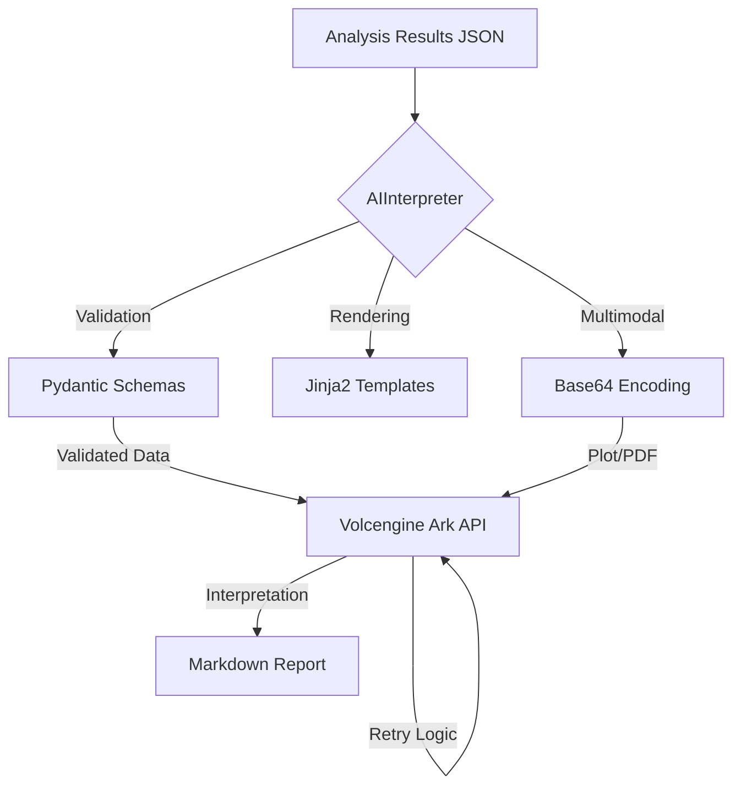

# AI Interpretation Module (AI 解读模块)

该模块已升级为 **生产级 (Production-Ready)** 架构，作为 BioReport 系统的核心组件。它不仅支持文本与多模态数据的联合分析，还引入了严格的数据校验和自动错误恢复机制。

## 🏗 架构设计 (Architecture)



### 核心改进 (Key Features)

1.  **数据契约层 (Data Contract)**: 使用 `pydantic` 定义 `RNASeqResult` 模型。所有输入 JSON 在处理前必须通过校验，彻底解决字段缺失或类型错误导致的运行时崩溃。
2.  **弹性调用 (Resilience)**: 集成 `tenacity` 库，针对网络抖动或 API 限流实现指数退避重试（Exponential Backoff），提高在生产环境中的成功率。
3.  **模块化封装**: 核心逻辑从散装脚本迁移至 `bioreport.ai` 包中，提供标准接口 `AIInterpreter`，易于集成到任何工作流中。
4.  **多模态增强**: 自动识别并编码图片 (PNG/JPG) 和文档 (PDF)，利用 `doubao-seed-1-8` 等大模型进行图文混合推理。

## 📂 模块结构 (Module Structure)

```text
bioreport/
├── ai/
│   ├── schemas.py          # [NEW] Pydantic 数据模型 (输入校验)
│   ├── engine.py           # [NEW] 核心引擎 (API 调用, 重试逻辑, 模板渲染)
│   └── __init__.py
├── templates/
│   └── common/ai/          # [NEW] 统一管理 Prompt 模板
│       └── standard_rna.j2
└── ai_demo/
    └── generate_interpretation.py  # 生产级调用示例 (轻量化 CLI)
```

## 🚀 使用指南 (Usage)

### 1. 环境准备

安装新增的生产级依赖：

```bash
pip install -r requirements.txt
export ARK_API_KEY="your_api_key_here"
```

### 2. 运行示例脚本

`ai_demo/generate_interpretation.py` 现已成为核心引擎的轻量封装，支持原有的命令行参数：

```bash
# 场景 A: 基础文本解读
python ai_demo/generate_interpretation.py --project-id "PROJ_001"

# 场景 B: 结合图片的多模态解读
python ai_demo/generate_interpretation.py \
  --project-id "PROJ_MULTI" \
  --data-file ./ai_demo/rna_seq_results.json \
  -a ./volcano_plot.png
```

## 🛠 开发与扩展

### 如何在其他模块中调用？

```python
from bioreport.ai.engine import AIInterpreter

# 1. 初始化引擎
engine = AIInterpreter(model="doubao-seed-1-8-251215")

# 2. 生成报告 (内置校验和重试)
report = engine.generate_report(
    data_json=raw_data_dict,
    template_path="data/prompts/report/rnaseq_standard.md.j2",
    attachments=["plot.png"],
    output_path="result.md"
)
```

### 如何修改 AI 的逻辑？
- **改指令**: 编辑 `data/prompts/report/rnaseq_standard.md.j2`。
- **改校验**: 修改 `bioreport/ai/schemas.py`。
- **改重试策略**: 调整 `bioreport/ai/engine.py` 中的 `@retry` 参数。

---
*注：本项目 AI 功能基于火山引擎方舟平台 (Volcengine Ark)。*


